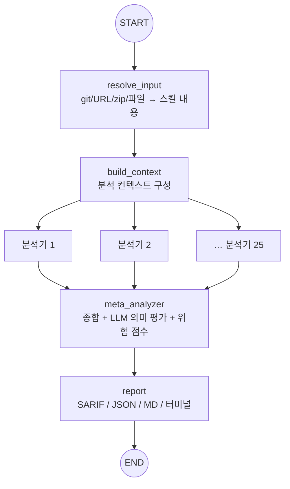

> 분석 일자: 2026-07-03
> 대상 패키지: `skillspector` (NVIDIA, Python 3.12+, Apache-2.0)
> 대상 커밋: `5df93c5` (`main` 브랜치, 2026-06-30)
> 저장소: https://github.com/NVIDIA/skillspector
> 로컬 분석 경로: `~/workspace/opensources/SkillSpector`

---

_This article is partially written by Claude Code_

## 목차

1. [왜 SkillSpector인가요?](#1-왜-skillspector인가요)
2. [기존 글들과 어디에 놓이나요?](#2-기존-글들과-어디에-놓이나요)
3. [프로젝트를 한 문장으로 이해하기](#3-프로젝트를-한-문장으로-이해하기)
4. [기술 스택과 규모](#4-기술-스택과-규모)
5. [전체 그림: LangGraph map-reduce](#5-전체-그림-langgraph-map-reduce)
6. [코드베이스 지도](#6-코드베이스-지도)
7. [25개 분석기: 다섯 갈래로 스킬을 훑습니다](#7-25개-분석기-다섯-갈래로-스킬을-훑습니다)
8. [2단계: 빠른 정적 분석 + 선택적 LLM 의미 평가](#8-2단계-빠른-정적-분석--선택적-llm-의미-평가)
9. [meta_analyzer: 종합과 위험 점수](#9-meta_analyzer-종합과-위험-점수)
10. [결과: SARIF, baseline, OSV.dev](#10-결과-sarif-baseline-osvdev)
11. [에이전트로 에이전트를 감사합니다](#11-에이전트로-에이전트를-감사합니다)
12. [인상적인 설계 포인트](#12-인상적인-설계-포인트)
13. [주의해서 볼 지점](#13-주의해서-볼-지점)
14. [결론](#14-결론)

---

## 1. 왜 SkillSpector인가요?

SkillSpector는 README에서 자신을 한 줄로 설명합니다. **"Security scanner for AI agent skills."** AI 에이전트 스킬을 설치하기 전에 검사해 취약점과 악성 패턴을 찾아 주는 도구입니다.

이 도구가 필요한 이유는 스킬의 위험 구조에 있습니다. Claude Code·Codex·Gemini CLI가 쓰는 에이전트 스킬은 **암묵적 신뢰로, 거의 검증 없이 실행**됩니다. 남이 만든 `SKILL.md`를 설치하면, 그 안의 지시가 곧바로 에이전트의 행동이 됩니다. SkillSpector가 인용하는 조사에 따르면 **야생의 스킬 중 26.1%에 취약점이, 5.2%에 악성 의도가** 있습니다.

SkillSpector가 답하려는 질문은 하나입니다. **"이 스킬, 설치해도 안전한가요?"**

겉으로는 또 하나의 보안 스캐너로 보입니다. 하지만 저장소를 열면 SkillSpector를 특별하게 만드는 두 가지가 보입니다.

첫째, SkillSpector는 **LangGraph 그래프로 만들어졌습니다.** 즉 AI 에이전트 프레임워크로, AI 에이전트 스킬을 감사합니다. 입력을 해석하고, 25개의 전문 분석기에 병렬로 나눠 던진 뒤, 결과를 하나로 합치는 map-reduce 파이프라인입니다.

둘째, SkillSpector는 **규칙과 LLM을 함께 씁니다.** 빠른 정적 분석(패턴·AST·taint·YARA)이 먼저 훑고, 그 위에 LLM이 의미를 평가합니다. 규칙만으로는 놓치는 "의도"를, LLM만으로는 비싸고 불안정한 부분을 서로 메웁니다.

그래서 SkillSpector를 "스킬 린터"라고만 보면 절반만 본 셈입니다. 더 정확하게는 **여러 전문 분석기를 에이전트 그래프로 엮어, 스킬을 설치 전에 감사하는 보안 파이프라인**입니다.

## 2. 기존 글들과 어디에 놓이나요?

이 블로그는 최근 "스킬 생태계"를 여러 각도로 다뤘습니다. SkillSpector는 그 생태계의 **방어 쪽**에 섭니다.

| 글                                                                                                | 중심 문제                        | SkillSpector와의 관계                                                                                   |
| ------------------------------------------------------------------------------------------------- | -------------------------------- | ------------------------------------------------------------------------------------------------------- |
| [ponytail](/kb/2026-06-30-ponytail-architecture)                                                  | 스킬 하나를 16개 에이전트에 배포 | ponytail이 스킬을 **주입**한다면, SkillSpector는 스킬을 설치 전에 **검사**합니다. 같은 대상, 반대 방향. |
| [Superpowers](/kb/2026-04-18-superpowers-architecture)                                            | 에이전트에게 절차·스킬을 주입    | Superpowers가 신뢰를 전제로 스킬을 로딩한다면, SkillSpector는 그 신뢰를 검증합니다.                     |
| [CodeGraph](/kb/2026-06-04-codegraph-architecture) · [Semble](/kb/2026-06-04-semble-architecture) | 코드 지능(그래프·검색)           | 둘이 코드를 이해해 **능력**을 키운다면, SkillSpector는 코드를 이해해 **위험**을 찾습니다.               |

핵심은 SkillSpector가 "스킬 린터"로 설명되지 않는다는 점입니다. 스킬 생태계 글에서 경계는 늘 "어떻게 스킬을 잘 쓰게 할까"였습니다. SkillSpector에서 그 자리를 채우는 것은 **LangGraph 감사 그래프, 25개 분석기, 0~100 위험 점수**입니다.

## 3. 프로젝트를 한 문장으로 이해하기

**SkillSpector**는 Python으로 만든 AI 에이전트 스킬 보안 스캐너로, git 저장소·URL·zip·디렉터리·파일을 입력받아 LangGraph 그래프에서 25개 분석기(정적 패턴·행위·시그니처·MCP·LLM 의미)를 병렬로 돌리고, LLM meta-analyzer가 결과를 종합해 **0~100 위험 점수와 권고를 내는** 보안 파이프라인입니다.

질문으로 바꾸면 이렇습니다.

| 질문                          | SkillSpector의 답                                                                          |
| ----------------------------- | ------------------------------------------------------------------------------------------ |
| 무엇을 검사하나요?            | git 저장소·URL·zip·디렉터리·단일 파일 형태의 에이전트 스킬을 검사합니다.                   |
| 무엇을 찾나요?                | 17개 카테고리 68개 패턴 — 프롬프트 인젝션, 데이터 유출, 권한 상승, 공급망, 메모리 오염 등. |
| 어떻게 검사하나요?            | LangGraph 그래프가 25개 분석기에 병렬로 나눠 던지고, meta-analyzer가 합칩니다.             |
| 규칙인가요, LLM인가요?        | 둘 다. 빠른 정적 분석 뒤에 선택적 LLM 의미 평가가 붙습니다(`--no-llm`으로 끌 수 있음).     |
| 결과는 어떻게 나오나요?       | 터미널·JSON·Markdown·SARIF와 0~100 점수, 심각도 라벨, 권고입니다.                          |
| 에이전트 안에서 쓸 수 있나요? | `skillspector mcp`로 MCP 서버가 되어, 에이전트가 세션 안에서 스킬을 검사할 수 있습니다.    |

## 4. 기술 스택과 규모

| 영역           | 기술                                                                                |
| -------------- | ----------------------------------------------------------------------------------- |
| 언어           | **Python 3.12+**, Pydantic 모델, Typer CLI, Rich 출력                               |
| 오케스트레이션 | **LangGraph** (`StateGraph`) — 분석 파이프라인을 그래프로                           |
| LLM            | LangChain(anthropic·aws·core) + OpenAI SDK, 모델별 토큰 예산(`model_registry.yaml`) |
| 정적 분석      | 정규식 패턴, **AST**, **taint tracking**, **YARA** 시그니처, semgrep                |
| 취약점 조회    | **OSV.dev** 실시간 CVE 조회(오프라인 폴백)                                          |
| 출력           | 터미널·JSON·Markdown·**SARIF**, baseline 억제                                       |
| 배포           | `uv tool install`, MCP 서버(`skillspector mcp`), Pi 확장                            |

로컬 체크아웃 기준 규모는 이렇습니다.

| 항목             |  수치 |
| ---------------- | ----: |
| Git 추적 파일 수 | 208개 |
| Python 파일 수   | 143개 |
| 분석기(analyzer) |  25개 |
| YARA 룰 파일     |   5개 |
| 취약점 카테고리  |  17개 |

## 5. 전체 그림: LangGraph map-reduce

SkillSpector의 뼈대는 `src/skillspector/graph.py`에 있는 하나의 LangGraph `StateGraph`입니다. 흐름은 map-reduce 그대로입니다.

코드로 보면 그대로입니다. `build_context`에서 각 분석기로 엣지가 갈라지고(`add_edge("build_context", analyzer_id)`), 모든 분석기가 다시 `meta_analyzer`로 모입니다(`add_edge(analyzer_id, "meta_analyzer")`). 즉 **컨텍스트를 한 번 만들고, 25갈래로 흩뿌린 뒤, 한 곳에서 거둔다**가 이 도구의 구조입니다.

## 6. 코드베이스 지도

핵심은 `src/skillspector/`입니다.

| 위치                       | 역할                                                               |
| -------------------------- | ------------------------------------------------------------------ |
| `graph.py`                 | **LangGraph 그래프 조립**(노드·엣지·compile)                       |
| `nodes/resolve_input.py`   | 입력(git/URL/zip/dir/file)을 스킬 내용으로 해석                    |
| `nodes/build_context.py`   | 분석기들이 공유할 컨텍스트 구성                                    |
| `nodes/analyzers/`         | **25개 분석기** — 정적 패턴·행위·YARA·MCP·LLM 의미                 |
| `nodes/meta_analyzer.py`   | 발견을 종합하고 LLM으로 의미 평가, 위험 점수 산출                  |
| `nodes/deduplicate.py`     | 중복 발견 제거                                                     |
| `nodes/report.py`          | 리포트 생성(SARIF·JSON·MD·터미널)                                  |
| `llm_analyzer_base.py`     | LLM 분석기의 공통 베이스(프롬프트·호출·파싱)                       |
| `providers/`               | LLM provider 추상화                                                |
| `yara_rules/`              | `agent_skills`·`malware`·`webshells`·`cryptominers`·`hacktools` 룰 |
| `cli.py` · `mcp_server.py` | Typer CLI와 MCP 서버 진입점                                        |

가장 먼저 볼 곳은 `graph.py`입니다. 열 몇 줄 안에 파이프라인 전체가 보입니다.

## 7. 25개 분석기: 다섯 갈래로 스킬을 훑습니다

`nodes/analyzers/`의 25개 분석기는 성격에 따라 다섯 갈래로 묶입니다.

| 갈래          | 분석기 예시                                                                                                                                                                                                                                                                                 | 무엇을 보나                              |
| ------------- | ------------------------------------------------------------------------------------------------------------------------------------------------------------------------------------------------------------------------------------------------------------------------------------------- | ---------------------------------------- |
| **정적 패턴** | `static_patterns_prompt_injection`, `_data_exfiltration`, `_privilege_escalation`, `_memory_poisoning`, `_supply_chain`, `_ssrf`, `_tool_misuse`, `_rogue_agent`, `_system_prompt_leakage`, `_anti_refusal`, `_excessive_agency`, `_output_handling`, `_agent_snooping`, `_harmful_content` | 위협 카테고리별 정규식·규칙 매칭         |
| **행위 분석** | `behavioral_ast`, `behavioral_taint_tracking`                                                                                                                                                                                                                                               | AST로 위험 코드, taint로 데이터 흐름     |
| **시그니처**  | `static_yara`, `static_runner`, `osv_client`                                                                                                                                                                                                                                                | YARA 악성 시그니처, semgrep, OSV.dev CVE |
| **MCP 전용**  | `mcp_least_privilege`, `mcp_tool_poisoning`, `mcp_rug_pull`                                                                                                                                                                                                                                 | MCP 서버의 과권한·도구 오염·rug-pull     |
| **LLM 의미**  | `semantic_developer_intent`, `semantic_quality_policy`, `semantic_security_discovery`                                                                                                                                                                                                       | 규칙이 못 잡는 "의도"를 LLM이 판단       |

이 분류가 SkillSpector의 관점을 보여 줍니다. 스킬의 위험은 한 종류가 아닙니다. 어떤 것은 문자열 패턴으로 잡히고(프롬프트 인젝션 문구), 어떤 것은 코드 구조로만 보이며(AST·taint), 어떤 것은 알려진 악성 시그니처이고(YARA), 어떤 것은 MCP 특유의 함정이며, 어떤 것은 사람이 읽어야 겨우 드러나는 "의도"(LLM)입니다. SkillSpector는 한 가지 기법에 걸지 않고, 다섯 갈래를 한 그래프 안에서 동시에 돌립니다.

## 8. 2단계: 빠른 정적 분석 + 선택적 LLM 의미 평가

25개 분석기는 비용이 크게 다릅니다. SkillSpector는 이를 2단계로 나눕니다.

- **1단계 — 정적 분석(빠르고 저렴).** 패턴·AST·taint·YARA는 LLM 없이 로컬에서 돕니다. 대부분의 명백한 위험은 여기서 잡힙니다.
- **2단계 — LLM 의미 평가(선택).** `semantic_*` 분석기와 meta-analyzer는 LLM으로 "이 스킬의 개발자 의도가 수상한가", "정책을 어기는가"를 판단합니다. `--no-llm`을 켜면 이 단계를 끄고 휴리스틱 폴백으로 돌립니다.

이 설계가 중요한 이유는 비용과 정확도의 균형입니다. 규칙만으로는 교묘하게 숨긴 악성 의도를 놓치고, LLM만으로는 매 스캔이 비싸고 결과가 흔들립니다. 빠른 규칙으로 걸러 낸 뒤 LLM에 판단을 맡기면, 둘의 약점이 서로를 가립니다.

## 9. meta_analyzer: 종합과 위험 점수

25갈래로 흩뿌린 발견은 그대로 두면 쓸모가 적습니다. 중복되고, 심각도가 제각각이며, 오탐도 섞입니다. `meta_analyzer`가 이를 정리합니다.

- 먼저 `deduplicate`로 중복 발견을 합칩니다.
- meta-analyzer는 `LLMAnalyzerBase`를 상속해 남은 발견을 LLM에 넣어 **의미를 재평가하고 심각도를 조정**합니다. 응답은 `MetaAnalyzerResponse`로 검증됩니다.
- 최종적으로 **0~100 위험 점수**를 냅니다. 일부 모델이 0~1로 답하면 클램프해서 스케일을 맞춥니다.
- `--no-llm` 모드에서는 LLM 대신 휴리스틱 필터로 같은 자리를 채웁니다.

즉 meta-analyzer는 여러 분석기의 목소리를 모아 하나의 판단으로 합치는 "reduce" 단계입니다. 사용자가 최종적으로 보는 것은 25개의 산발적 경고가 아니라, 한 줄의 점수와 권고입니다.

## 10. 결과: SARIF, baseline, OSV.dev

SkillSpector는 결과를 실무에 붙이기 좋게 냅니다.

- **출력 형식** — 터미널(Rich), JSON, Markdown, **SARIF**. SARIF는 GitHub code scanning 등 표준 보안 도구가 읽는 형식이라, CI에 그대로 물릴 수 있습니다.
- **baseline 억제** — glob 규칙이나 지문(fingerprint)으로 알려진 발견을 받아들여 다시 스캔할 때 _새로운_ 문제만 드러나게 합니다. 오탐에 파묻히지 않게 하는 장치입니다.
- **OSV.dev 실시간 조회** — 공급망 분석기(SC4)는 [OSV.dev](https://osv.dev)에 실시간으로 CVE를 물어봅니다. 네트워크가 없으면 자동으로 오프라인 폴백으로 내려갑니다.

## 11. 에이전트로 에이전트를 감사합니다

SkillSpector에서 가장 흥미로운 지점은 도구의 정체성입니다. **AI 에이전트 프레임워크(LangGraph)로, AI 에이전트가 쓰는 스킬을 감사합니다.**

게다가 SkillSpector 자신이 `skillspector mcp`로 **MCP 서버**가 됩니다. 그러면 코딩 에이전트가 세션 안에서 "이 스킬 안전한지 검사해 줘"라고 SkillSpector를 도구로 부를 수 있습니다. 스킬을 설치하려는 에이전트가, 설치 직전에 다른 에이전트(SkillSpector)에게 검문을 맡기는 셈입니다.

이 구도는 스킬 생태계가 성숙하고 있다는 신호입니다. [ponytail](/kb/2026-06-30-ponytail-architecture)이 스킬을 매끄럽게 퍼뜨리는 쪽이라면, SkillSpector는 그 유통망에 검문소를 세우는 쪽입니다. 능력이 빠르게 퍼질수록, 그 능력을 검증하는 계층도 함께 자랍니다.

## 12. 인상적인 설계 포인트

### 1. 보안 파이프라인을 에이전트 그래프로 만듭니다.

SkillSpector는 절차적 스크립트가 아니라 LangGraph `StateGraph`입니다. 새 위협 카테고리가 생기면 분석기 노드를 하나 더 추가해 fan-out에 끼우면 됩니다. 파이프라인이 데이터가 아니라 그래프라, 확장이 노드 추가로 끝납니다.

### 2. 규칙과 LLM을 역할로 나눕니다.

빠른 정적 분석이 명백한 것을 잡고, LLM이 "의도"처럼 규칙이 못 보는 것을 판단합니다. 그리고 `--no-llm`으로 LLM을 완전히 끌 수 있어, 오프라인·저비용 환경에서도 핵심 검사가 돌아갑니다.

### 3. 25갈래를 하나의 점수로 합칩니다.

여러 분석기의 산발적 경고를 dedup하고 LLM으로 재평가해 0~100 점수로 줄입니다. 사용자는 "무엇이 걸렸나"를 넘어 "설치해도 되나"라는 결정을 바로 받습니다.

### 4. MCP를 1급 위협 대상으로 봅니다.

`mcp_least_privilege`·`mcp_tool_poisoning`·`mcp_rug_pull`처럼 MCP 서버 특유의 공격(과권한, 도구 설명 오염, 나중에 악성으로 바뀌는 rug-pull)을 별도 분석기로 둡니다. 스킬뿐 아니라 MCP까지 검문 대상입니다.

### 5. 표준 형식으로 실무에 붙습니다.

SARIF 출력과 baseline 억제 덕분에 일회성 스캐너가 아니라 CI에 상주하는 게이트로 쓸 수 있습니다.

## 13. 주의해서 볼 지점

### 1. LLM 의미 평가는 비용·비결정성을 안습니다.

`semantic_*`와 meta-analyzer는 LLM에 의존하므로, 스캔마다 비용이 들고 결과가 흔들릴 수 있습니다. `--no-llm` 휴리스틱은 이를 피하지만, 대신 "의도" 판단력이 약해집니다. 무엇을 켤지는 상황에 맞춰야 합니다.

### 2. 패턴·시그니처는 우회될 수 있습니다.

정적 패턴과 YARA는 알려진 형태를 잡습니다. 새로운 우회나 난독화는 놓칠 수 있고, 반대로 정상 코드를 오탐할 수도 있습니다. baseline 억제가 오탐을 다스리는 이유입니다.

### 3. "안전 점수"를 맹신하면 안 됩니다.

0~100 점수는 결정을 돕는 요약이지 보증이 아닙니다. 26.1%·5.2% 같은 수치가 말하듯, 스킬 보안은 확률의 문제입니다. 점수는 검문의 시작이지 끝이 아닙니다.

### 4. 스캐너 자신도 LLM을 씁니다.

SkillSpector는 프롬프트 인젝션을 찾는 도구인데, 그 판단을 LLM에 맡깁니다. 즉 스캐너의 LLM 호출 자체가 검사 대상 스킬의 내용에 노출됩니다. 이 재귀적 신뢰 경계는 이런 도구가 공통으로 안는 숙제입니다.

## 14. 결론

SkillSpector는 "스킬 린터"보다 큰 프로젝트입니다. 실제 구조는 **여러 전문 분석기를 LangGraph 그래프로 엮어, 스킬을 설치 전에 감사하는 보안 파이프라인**입니다.

[Superpowers](/kb/2026-04-18-superpowers-architecture)와 [ponytail](/kb/2026-06-30-ponytail-architecture)이 스킬을 에이전트에 주입하는 쪽이라면, SkillSpector는 그 스킬이 안전한지 되묻는 쪽입니다. 스킬이 암묵적 신뢰로 실행된다는 위험을, NVIDIA는 규칙과 LLM을 함께 쓰는 map-reduce 감사 그래프로 막으려 합니다.

SkillSpector를 볼 때 가장 중요한 질문은 "어떤 규칙을 쓰나요?"가 아닙니다. 더 중요한 질문은 이것입니다.

> 스킬이 암묵적 신뢰로 실행되는 세계에서, 서로 다른 종류의 위험을 어떻게 한 그래프 안에서 동시에 검사하고, 하나의 결정으로 합칠 것인가요?

SkillSpector의 답은 `graph.py`의 map-reduce 그래프, 다섯 갈래 25개 분석기, 그리고 meta-analyzer의 위험 점수입니다. 이 경계들을 이해하면, SkillSpector가 단순한 스캐너가 아니라 **빠르게 자라는 스킬 생태계에 세운 검문소**라는 것이 보입니다.
