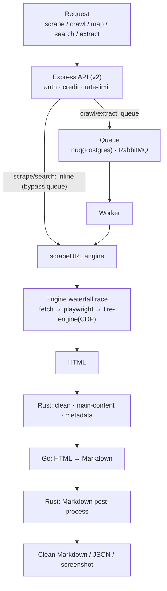

> Analysis date: 2026-07-06
> Target: `firecrawl` (API v2, core AGPL-3.0 · SDKs MIT) — no single product version; SDKs are `firecrawl-py` 4.31.0 / `@mendable/firecrawl-js` 4.29.1
> Target commit: `f4464e1` (`main` branch, 2026-07-01)
> Repository: https://github.com/firecrawl/firecrawl
> Local analysis path: `~/workspace/opensources/firecrawl`

---

_This article is partially written by Claude Code_

{/* Thumbnail slot: capture a URL → clean-Markdown before/after into public/static/post-images/ and give me the filename; I'll wire it into frontmatter images and the body. */}

## Table of Contents

1. [Why Firecrawl?](#1-why-firecrawl)
2. [Where Does It Sit Among the Previous Articles?](#2-where-does-it-sit-among-the-previous-articles)
3. [Understanding the Project in One Sentence](#3-understanding-the-project-in-one-sentence)
4. [Tech Stack and Scale](#4-tech-stack-and-scale)
5. [The Big Picture](#5-the-big-picture)
6. [Five Endpoints: scrape · crawl · map · search · extract](#6-five-endpoints-scrape--crawl--map--search--extract)
7. [The Scraper Engine: How a URL Becomes Clean Markdown](#7-the-scraper-engine-how-a-url-becomes-clean-markdown)
8. [Three Languages Split One Scrape](#8-three-languages-split-one-scrape)
9. [Crawl Orchestration and a Hand-Built Queue, nuq](#9-crawl-orchestration-and-a-hand-built-queue-nuq)
10. [How You Use It: The Flow](#10-how-you-use-it-the-flow)
11. [9 SDKs and Agent Integration](#11-9-sdks-and-agent-integration)
12. [Self-Host vs Cloud: The Fire-Engine Boundary](#12-self-host-vs-cloud-the-fire-engine-boundary)
13. [Comparison With Browser Use: Two Ways to Feed the Web to LLMs](#13-comparison-with-browser-use-two-ways-to-feed-the-web-to-llms)
14. [Notable Design Decisions](#14-notable-design-decisions)
15. [Things to Watch Out For](#15-things-to-watch-out-for)
16. [Conclusion](#16-conclusion)

---

## 1. Why Firecrawl?

Firecrawl introduces itself like this in the README: **"The API to search, scrape, and interact with the web at scale."** It's a data API that turns any website into **clean Markdown or structured JSON** an LLM can use directly.

The reason it's needed is that the web is messy. Real pages render with JavaScript, are buried under ads, navigation, and cookie banners, and block bots. Throw that raw HTML at an LLM and you burn tokens while the actual content drowns. Firecrawl swallows the mess for you and emits token-efficient text with only the main content left. The README claims it "covers 96% of the web, including JS-heavy pages" with "P95 latency of 3.4s across millions of pages," and that "we handle the hard stuff: rotating proxies, orchestration, rate limits, JS-blocked content."

On the surface it looks like yet another scraping library. But open the repository and two things set Firecrawl apart.

First, Firecrawl **uses three languages in a single scrape.** TypeScript does orchestration, Rust does HTML cleaning/extraction, and Go does the HTML→Markdown conversion. You'd guess Rust makes the Markdown, but the actual converter is Go.

Second, Firecrawl **races several scrape engines.** If one approach (a plain fetch) fails, try Playwright; if that's blocked, a cloud rendering engine — the candidates are launched in a waterfall by a time budget, so if a backup succeeds first while a slow engine is still running, it wins.

So if you see Firecrawl only as "a tool that scrapes pages," you've seen half of it. More precisely, it is **an ingestion pipeline that swallows the messy web for you and converts it, at scale, into data an LLM can eat.**

## 2. Where Does It Sit Among the Previous Articles?

This blog has covered tools that bridge the web and LLMs. Firecrawl stands on the **ingestion** side.

| Article                                                                                   | Central problem                       | Relationship to Firecrawl                                                                                          |
| ----------------------------------------------------------------------------------------- | ------------------------------------- | ------------------------------------------------------------------------------------------------------------------ |
| [Browser Use](/kb/2026-06-30-browser-use-architecture)                                    | An LLM that drives a browser directly | Where Browser Use **acts** on the web, Firecrawl turns the web into **data**. Two ways to feed the web to LLMs.    |
| [Playwright](/kb/2026-04-17-playwright-architecture)                                      | E2E browser automation                | Firecrawl also uses a Playwright service for JS pages, but wraps cleaning/conversion/queueing into an API on top.  |
| [Dify](/kb/2026-05-17-dify-architecture) · [WeKnora](/kb/2026-05-30-weknora-architecture) | LLM app / RAG platforms               | Where Dify/WeKnora search and use documents, Firecrawl sits upstream, turning the web into documents to feed them. |

The key is that Firecrawl is not explained as a "scraping library." In the Browser Use article, the difficulty was "what should the LLM click?" In Firecrawl the difficulty is different: **scraping without getting blocked, at scale, cleanly** — that's the problem this project takes on.

## 3. Understanding the Project in One Sentence

**Firecrawl** is a data API that, on a TypeScript API server (Express), cleans HTML with a Rust native module, makes Markdown with a Go engine, races several scrape engines in a waterfall, and drives crawls with a hand-built Postgres queue — **turning the web into LLM-ready Markdown/JSON.**

As questions:

| Question                        | Firecrawl's answer                                                                                    |
| ------------------------------- | ----------------------------------------------------------------------------------------------------- |
| What do you input?              | One URL (scrape), a whole site (crawl), a query (search), or a schema + URL (extract).                |
| What comes out?                 | Clean **Markdown**, or schema-shaped **structured JSON**, plus screenshots and metadata.              |
| What about JS pages?            | If a plain fetch fails, it climbs to Playwright and the cloud Fire-Engine (CDP render).               |
| Who makes the Markdown?         | **Go** (a cgo shared library or an HTTP service). Rust handles cleaning, extraction, post-processing. |
| How does it survive big crawls? | A hand-built Postgres queue, **nuq** (`FOR UPDATE SKIP LOCKED`), plus Redis dedup, fans out.          |
| Can agents use it?              | Via 9 language SDKs, a `firecrawl` CLI, `SKILL.md` onboarding, and a keyless MCP proxy.               |

## 4. Tech Stack and Scale

| Area              | Technology                                                                                                                      |
| ----------------- | ------------------------------------------------------------------------------------------------------------------------------- |
| API server        | **Node/TypeScript, Express 5** (`apps/api`). Zod schemas, Sentry/OpenTelemetry/Prometheus                                       |
| Native (cleaning) | **Rust** (`apps/api/native`, napi v3) — HTML cleaning, metadata/link extraction, Markdown post-processing, PDF/document parsing |
| Markdown convert  | **Go** — a fork of html-to-markdown. A cgo shared library (koffi) or an HTTP service, with a JS (Turndown) fallback             |
| JS rendering      | **Playwright service** (separate TS microservice, Chromium, SSRF hardening)                                                     |
| Queue             | **nuq** (a bespoke Postgres queue, migrating to FoundationDB) + RabbitMQ (extract/webhooks) + residual BullMQ                   |
| State/cache       | Redis (rate limits, crawl dedup, concurrency), ClickHouse (analytics), GCS/Supabase (bodies/metadata)                           |
| SDKs              | Python, JS, Go, Rust, Java, Ruby, PHP, .NET, Elixir — **nine**                                                                  |
| License           | Core **AGPL-3.0**, SDKs **MIT**                                                                                                 |

The scale of the local checkout:

| Item              | Count |
| ----------------- | ----: |
| Git-tracked files | 1,582 |
| TypeScript files  |   690 |
| Python files      |   167 |
| Rust files        |    35 |
| Go files          |    16 |

## 5. The Big Picture

Here's the path a single URL takes to become Markdown in Firecrawl.



Two branches are the heart. **scrape and search bypass the queue and run inline** (`skipNuq: true`), calling the worker code on the spot and blocking until a result is ready. **crawl and extract enqueue** and are polled later. It splits "fast interactive" from "big async" while reusing the same worker code for both.

## 6. Five Endpoints: scrape · crawl · map · search · extract

The router is `apps/api/src/routes/v2.ts`, controllers under `controllers/v2/`. Every request passes an `auth → country check → credits → blocklist → (idempotency) → controller` middleware chain.

- **scrape** — one URL into clean Markdown. **Synchronous, inline** (doesn't touch the queue). It takes a team concurrency slot and calls the worker's `processJobInternal` on the spot, blocking until a `Document` is ready.
- **crawl** — a whole site. **Enqueues.** It can turn a natural-language `prompt` into include/exclude rules (LLM), reads robots.txt, pins a queue backend, then enqueues one `kickoff` job. Status is polled or streamed over WebSocket.
- **map** — **discovers URLs fast** (no full scrape). It combs Fire-Engine's `site:` search, Firecrawl's own URL index, and `sitemap.xml` concurrently, merges them, and re-ranks by cosine similarity if a query is given.
- **search** — web search + scrape. Providers are a **fallback chain** (not parallel): Fire Engine → SearXNG → the always-on keyless DuckDuckGo. Give it `formats` and it scrapes each result inline.
- **extract** — pulls **structured JSON** to a schema. **Fully async** (RabbitMQ). It gathers URLs, prepares a JSON schema, re-ranks links with an LLM, scrapes, then fills the object via the Vercel AI SDK's `generateObject` and merges. (Both SDKs mark extract "maintenance mode" — the successor is moving to the `agent`/Spark path.)

## 7. The Scraper Engine: How a URL Becomes Clean Markdown

Firecrawl's heart is `apps/api/src/scraper/scrapeURL/`. The flow:

1. **Derive feature flags** — from the requested formats (actions, screenshot, pdf, stealth, mobile, waitFor…), work out the needed feature flags.
2. **Select engines** — each candidate engine gets a `supportScore` = the sum of the priorities of the flags it supports; only engines above a threshold qualify. Final sort is `supportScore`, then `quality`.
3. **Waterfall race** — the candidates race with `Promise.race`. When one engine exceeds a "reasonable time," the next candidate is launched, but the first to succeed wins. A backup runs while a slow engine is still going.

The engine list (with quality scores):

| Engine                    | Role                                                     |
| ------------------------- | -------------------------------------------------------- |
| `fetch`                   | Plain HTTP. No JS                                        |
| `playwright`              | Renders via the Playwright microservice                  |
| `fire-engine;chrome-cdp`  | Cloud Chrome (CDP) render — actions, screenshots, mobile |
| `fire-engine;tlsclient`   | TLS-fingerprinted HTTP client (no browser)               |
| `pdf` · `document`        | Rust turns PDFs/documents (docx, xlsx…) into HTML        |
| `index` · `data-layer`    | Served straight from Firecrawl's cache/index             |
| `wikipedia` · `x-twitter` | Site-specific APIs                                       |

**Fire-Engine** matters here. It's Firecrawl's **cloud-only, closed-source rendering backend** — it handles IP rotation, anti-bot, stealth, and CDP rendering. The repo has only the HTTP client that calls this engine; the engine itself is absent. It's missing from self-host (more on this later).

The winning engine's HTML passes a transformer stack. Rust cleans it (including OMCE, which keeps only the main content), Go converts it to Markdown, and Rust tidies it in post-processing. Metadata/link/image extraction, base64-image removal, LLM extraction, PII redaction, and change tracking (diff) also attach at this stage.

## 8. Three Languages Split One Scrape

Firecrawl's most interesting decision is here. Three languages collaborate to scrape a single page.

- **TypeScript** — orchestration. It conducts engine selection, the waterfall race, the transformer stack, the queue, and the API.
- **Rust** (`apps/api/native`, napi) — **cleaning and extraction.** `transform_html` strips unneeded elements (header, footer, nav, ads, cookie banners — 42 tags), runs OMCE to keep only the main content, extracts metadata/links/images, post-processes Markdown, and parses PDFs and documents. **It does not do the HTML→Markdown conversion.**
- **Go** — **the actual Markdown converter.** A fork of html-to-markdown turns HTML into GitHub-flavored Markdown. It runs as an in-process cgo shared library (loaded via koffi) or a separate HTTP service, and falls back to JS (Turndown) if neither is available.

Why split it this way? Markdown conversion is already done well by a mature Go library; HTML cleaning and PDF parsing are fast and safe in Rust; and the overall flow and API are comfortable in the TS ecosystem. Each language sits where it's strongest. There's a cost, of course — three runtimes tangle inside one scrape, making the build and debugging that much more complex.

## 9. Crawl Orchestration and a Hand-Built Queue, nuq

A crawl has to comb a whole site, so it needs a queue. Firecrawl **dropped BullMQ/Redis and built its own Postgres queue.**

- **nuq** (`services/worker/nuq.ts`, `apps/nuq-postgres/nuq.sql`) — one queue is one Postgres table. Dequeue locks rows with `FOR UPDATE SKIP LOCKED`. **There are no app-level retries**; instead a `pg_cron` reaper every 15 seconds revives jobs whose lease expired (if stalls < 9) or marks them failed. A worker is a serial single-job loop, so horizontal concurrency equals pod count.
- **Team concurrency lives in Redis, outside Postgres** (`concurrency-limit.ts`, semaphores). It deliberately separates the queue from the policy.
- Crawl fan-out is two layers. `kickoff` gathers seed URLs from sitemaps and the URL index; for each page, Rust extracts links, filters them by rules (depth, include/exclude, robots, same-domain), then `lockURL` (Redis `SADD visited`) dedups and enqueues the next job.

What's notable is that nuq is **already migrating to FoundationDB.** A router picks `pg` or `fdb` per team, with a PG fallback. So looking at the queue alone, this codebase tangles four datastores — Postgres, FoundationDB, RabbitMQ, Redis — mid-migration. That's why a self-orchestrating harness (`harness.ts`) brings up all these pieces at once.

## 10. How You Use It: The Flow

{/* Working-screenshot slot: capture a real scrape result (URL in → Markdown out), or a dashboard/playground screen, into public/static/post-images/ and give me the filename + a one-line caption; I'll place it here. */}

Per the docs and SDKs, the most common use is turning one URL into Markdown.

```python
from firecrawl import Firecrawl

fc = Firecrawl(api_key="fc-...")
doc = fc.scrape("https://example.com", formats=["markdown"])
print(doc.markdown)   # main content only, ads and nav stripped
```

A whole site goes through `crawl` — start it, then poll for status. Schema-shaped structured data comes from `extract`.

```python
crawl = fc.crawl("https://docs.example.com", limit=100)   # async, poll by id
data  = fc.extract(urls=["https://example.com/pricing"],
                   schema={"type": "object", "properties": {"price": {"type": "number"}}})
```

In practice the tool's value isn't "it scrapes" but "**it scrapes cleanly without getting blocked**." Making JS-rendered pages, bot-blocking sites, and tangled markup something the user needn't think about — behind that sit the engine waterfall from §7 and the three-language cleaning pipeline from §8.

> If there's a hands-on impression to add, it'll go here — a real scrape-result screenshot plus a 2–3 sentence take.

## 11. 9 SDKs and Agent Integration

Firecrawl ships **nine language SDKs**: Python, JS, Go, Rust, Java, Ruby, PHP, .NET, and Elixir. All target the v2 API, with a shared surface of `scrape`, `parse`, `search`, `map`, the `crawl` family, `batch_scrape`, `extract` (deprecated), `agent` (Spark models), browser sessions, `monitor` (scheduled change tracking), and usage queries. Python ships full async duplicates; Go uses `ctx` and `...WithPolling` variants.

Agent integration lives outside the repo. The `firecrawl-skills`, `firecrawl-cli-skills`, `firecrawl-workflows`, and `firecrawl-cli` directories are just short READMEs pointing to external repos. The format is a **Claude-agent-style `SKILL.md`**, onboarded via `npx firecrawl-cli init`, stating it "works with Claude Code, Antigravity, OpenCode."

MCP is interesting too. There's no MCP server code in-repo, but the API supports a **keyless trusted proxy.** Official MCP/CLI/SDK clients can call scrape/search/interact with no API key (`handleKeylessAuth`), and the SDKs stamp `origin: "mcp"`. In other words, it opens a path for an agent to call Firecrawl as a tool without a separate key.

## 12. Self-Host vs Cloud: The Fire-Engine Boundary

Firecrawl is both open source and a hosted service. Where the boundary lies matters. `docker-compose.yaml` brings up 7 services (api, playwright, redis, rabbitmq, nuq-postgres, foundationdb) at once. But part of the core's essence is cloud-only.

- **Fire-Engine is a closed beta and absent from self-host.** `SELF_HOST.md` says so plainly: "self-hosted instances do not have access to Fire-engine, which includes advanced features for handling IP blocks, robot detection, and more." Without `FIRE_ENGINE_BETA_URL`, six scrape engines vanish and `search` degrades to SearXNG/DuckDuckGo.
- **The auth/credits/blocklist layer effectively can't be enabled self-hosted.** `SELF_HOST.md` notes "it's not currently possible to configure Supabase in self-hosted instances," and the code runs a mock that bypasses authentication.
- **Managed proxies, Spark agents, and billing** are cloud-only. Self-host has to attach proxies itself.

In short, the open-source repo gives you the full scrape/crawl/map/search/extract engine on `fetch` + Playwright + a Postgres queue + local LLM keys. But the **anti-bot rendering brain (Fire-Engine), managed proxies, hosted search, auth/billing, and Spark agents** are the hosted product's domain.

## 13. Comparison With Browser Use: Two Ways to Feed the Web to LLMs

Since this article started from "a contrast with [Browser Use](/kb/2026-06-30-browser-use-architecture)," let me lay it out. Both bridge the web and LLMs, but from opposite ends.

| Axis               | Browser Use (interactive agent)                               | Firecrawl (ingestion API)                                                         |
| ------------------ | ------------------------------------------------------------- | --------------------------------------------------------------------------------- |
| Primitive          | An **agent loop** driving one browser via CDP                 | A stateless **HTTP API** (scrape/crawl/map/search/extract)                        |
| Direction          | Web → **action** (click/type). The LLM decides the next click | Web → **content.** URLs go in, Markdown/JSON comes out                            |
| Where the LLM sits | In the loop, in the driver's seat every step                  | Downstream. It feeds RAG/agents (only extract is internal LLM)                    |
| What's hard        | What to click (perception, action grounding)                  | Acquiring cleanly at scale without getting blocked (anti-bot, proxies, rendering) |
| Output             | Task completed (form filled, flow finished)                   | An indexable corpus (Markdown/JSON/screenshots)                                   |

Firecrawl does have a Browser-Use-shaped surface — `interact`/browser sessions and `agent`/Spark let you click and act before extracting. But that's a feature bolted onto an ingestion platform; for Browser Use, interactive agency _is_ the product. Put simply: **Browser Use is a hand on the mouse; Firecrawl is a firehose into the vector store.** Use Browser Use when the goal is _doing something_ on a site; use Firecrawl when the goal is _turning many sites into data._

## 14. Notable Design Decisions

### 1. Putting each language where it's strongest.

TS (orchestration), Rust (cleaning, extraction, PDF), and Go (Markdown conversion) collaborate inside a single scrape. You'd think Rust is the converter, but Go actually converts, with a JS fallback if neither works.

### 2. Racing instead of choosing.

The engine waterfall doesn't pick one fetcher; it launches the next candidate by a time budget and takes the first to succeed. Hedged requests cut tail latency.

### 3. Building its own queue.

Instead of BullMQ/Redis, a Postgres queue (nuq) with `FOR UPDATE SKIP LOCKED` and a `pg_cron` reaper. And it's already migrating to FoundationDB, so two queue generations coexist in the code.

### 4. Splitting the fast path from the big path.

scrape/search bypass the queue and run inline; crawl/extract go through the queue — separating interactive from bulk while reusing the same worker code.

### 5. map is fast because it doesn't crawl.

To discover URLs it doesn't scrape the whole site; it merges search, its own index, and sitemaps, then cosine-re-ranks.

## 15. Things to Watch Out For

### 1. The open-source "brain" is in the cloud.

Fire-Engine, which handles anti-bot rendering, is absent from self-host. Spin up just the repo and pages that work with `fetch` + Playwright work — but strongly bot-blocked sites or hosted-grade search won't match expectations.

### 2. Lots of moving parts.

Postgres, FoundationDB, RabbitMQ, Redis, GCS, Supabase, and ClickHouse — the queues and stores alone are many. Powerful, but a heavy operational load. The self-orchestrating harness tries to hide it, but running it all self-hosted takes resolve.

### 3. The three-language build is a barrier.

TS, Rust (napi), and Go (cgo) tangle inside one scrape, so there are three places a build can fail. To read the flow, first grasp the three runtime boundaries.

### 4. `extract` is in transition.

The SDKs mark extract "maintenance mode," and the successor moves to `agent`/Spark. Check the roadmap before depending deeply on extract today.

### 5. The docs (OpenAPI) drift from the code.

`openapi.json` is labeled v1 (1.0.0), but the live API is v2. Treat the router/SDKs, not the spec, as the source of truth.

## 16. Conclusion

Firecrawl is a larger project than "a library that scrapes pages." Its actual structure is **an ingestion pipeline that swallows the messy web for you and converts it, at scale, into data an LLM can eat.**

Where [Browser Use](/kb/2026-06-30-browser-use-architecture) drives a browser to _act_ on the web, Firecrawl turns the web into _data_ to feed downstream LLMs. Behind it are a three-language cleaning pipeline, an engine waterfall, a hand-built queue, and an anti-bot brain that lives only in the cloud.

When looking at Firecrawl, the most important question is not "how does it scrape?" The more important question is this:

> How do you turn the real web — JavaScript-rendered and bot-blocking — into a form an LLM can use directly, at scale, without getting blocked?

Firecrawl's answer is the engine waterfall in `scrapeURL`, the three-language cleaning of Rust/Go/TS, the nuq queue, and the cloud Fire-Engine. Understand these boundaries and you can see that Firecrawl is not merely a scraper but **a factory that refines the web into fuel for LLMs.**
