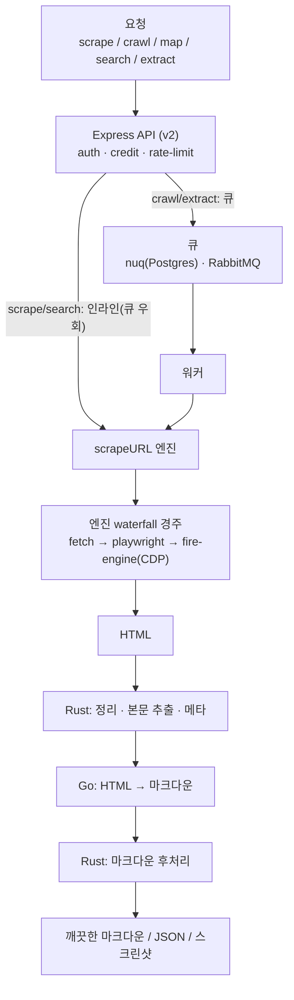

> 분석 일자: 2026-07-06
> 대상: `firecrawl` (API v2, 코어 AGPL-3.0 · SDK MIT) — 단일 제품 버전 없음, SDK는 `firecrawl-py` 4.31.0 / `@mendable/firecrawl-js` 4.29.1
> 대상 커밋: `f4464e1` (`main` 브랜치, 2026-07-01)
> 저장소: https://github.com/firecrawl/firecrawl
> 로컬 분석 경로: `~/workspace/opensources/firecrawl`

---

_This article is partially written by Claude Code_

{/* 섬네일 슬롯: URL → 깨끗한 마크다운 before/after 캡처를 public/static/post-images/에 넣고 파일명을 주시면 frontmatter images 와 본문에 연결하겠습니다. */}

## 목차

1. [왜 Firecrawl인가요?](#1-왜-firecrawl인가요)
2. [기존 글들과 어디에 놓이나요?](#2-기존-글들과-어디에-놓이나요)
3. [프로젝트를 한 문장으로 이해하기](#3-프로젝트를-한-문장으로-이해하기)
4. [기술 스택과 규모](#4-기술-스택과-규모)
5. [전체 그림](#5-전체-그림)
6. [다섯 엔드포인트: scrape · crawl · map · search · extract](#6-다섯-엔드포인트-scrape--crawl--map--search--extract)
7. [스크레이퍼 엔진: URL이 깨끗한 마크다운이 되기까지](#7-스크레이퍼-엔진-url이-깨끗한-마크다운이-되기까지)
8. [세 언어가 한 번의 스크레이프를 나눠 맡습니다](#8-세-언어가-한-번의-스크레이프를-나눠-맡습니다)
9. [크롤 오케스트레이션과 직접 만든 큐 nuq](#9-크롤-오케스트레이션과-직접-만든-큐-nuq)
10. [이렇게 씁니다: 사용 흐름](#10-이렇게-씁니다-사용-흐름)
11. [9개 SDK와 에이전트 연동](#11-9개-sdk와-에이전트-연동)
12. [셀프호스트 vs 클라우드: Fire-Engine 경계](#12-셀프호스트-vs-클라우드-fire-engine-경계)
13. [Browser Use와 비교: 웹을 LLM에 먹이는 두 방식](#13-browser-use와-비교-웹을-llm에-먹이는-두-방식)
14. [인상적인 설계 포인트](#14-인상적인-설계-포인트)
15. [주의해서 볼 지점](#15-주의해서-볼-지점)
16. [결론](#16-결론)

---

## 1. 왜 Firecrawl인가요?

Firecrawl은 README에서 자신을 이렇게 소개합니다. **"The API to search, scrape, and interact with the web at scale."** 아무 웹사이트든 LLM이 바로 쓸 수 있는 **깨끗한 마크다운이나 구조화 JSON**으로 바꿔 주는 데이터 API입니다.

이 도구가 필요한 이유는 웹이 지저분하기 때문입니다. 실제 웹페이지는 자바스크립트로 렌더되고, 광고·내비게이션·쿠키 배너로 뒤덮여 있으며, 봇을 막습니다. LLM에게 이 날 HTML을 그대로 던지면 토큰만 태우고 정작 본문은 파묻힙니다. Firecrawl은 이 지저분함을 대신 삼키고, 본문만 남긴 토큰 효율적인 텍스트를 내놓습니다. README는 "JS 무거운 페이지 포함 웹의 96%를 다루고, 수백만 페이지에서 P95 지연 3.4초"라고 주장하며, "회전 프록시·오케스트레이션·레이트 리밋·봇 차단은 우리가 처리한다"고 말합니다.

겉으로는 또 하나의 스크래핑 라이브러리로 보입니다. 하지만 저장소를 열면 Firecrawl을 특별하게 만드는 두 가지가 보입니다.

첫째, Firecrawl은 **한 번의 스크레이프에 세 언어를 씁니다.** TypeScript가 오케스트레이션을, Rust가 HTML 정리·추출을, Go가 HTML→마크다운 변환을 맡습니다. 언뜻 Rust가 마크다운을 만들 것 같지만 실제 변환기는 Go입니다.

둘째, Firecrawl은 **여러 스크레이프 엔진을 경주시킵니다.** 한 가지 방식(단순 fetch)으로 안 되면 Playwright로, 그래도 막히면 클라우드 렌더링 엔진으로 — 후보들을 시간 예산에 따라 waterfall로 띄워, 느린 엔진이 도는 동안 백업이 먼저 성공하면 그걸 택합니다.

그래서 Firecrawl을 "웹페이지 긁는 도구"라고만 보면 절반만 본 셈입니다. 더 정확하게는 **지저분한 웹을 대신 삼켜, LLM이 먹기 좋은 데이터로 대량 변환하는 수집 파이프라인**입니다.

## 2. 기존 글들과 어디에 놓이나요?

이 블로그는 앞서 웹과 LLM을 잇는 도구들을 다뤘습니다. Firecrawl은 그중 **수집(ingestion)** 쪽에 섭니다.

| 글                                                                                        | 중심 문제                           | Firecrawl과의 관계                                                                                      |
| ----------------------------------------------------------------------------------------- | ----------------------------------- | ------------------------------------------------------------------------------------------------------- |
| [Browser Use](/kb/2026-06-30-browser-use-architecture)                                    | LLM이 브라우저를 직접 모는 에이전트 | Browser Use가 웹에서 **행동**한다면, Firecrawl은 웹을 **데이터로** 바꿉니다. 웹을 LLM에 먹이는 두 방식. |
| [Playwright](/kb/2026-04-17-playwright-architecture)                                      | E2E 브라우저 자동화                 | Firecrawl도 JS 페이지엔 Playwright 서비스를 쓰지만, 그 위에 정리·변환·큐를 얹어 API로 감쌉니다.         |
| [Dify](/kb/2026-05-17-dify-architecture) · [WeKnora](/kb/2026-05-30-weknora-architecture) | LLM 앱·RAG 플랫폼                   | Dify·WeKnora가 문서를 검색·활용한다면, Firecrawl은 그 앞단에서 웹을 문서로 만들어 공급합니다.           |

핵심은 Firecrawl이 "스크래핑 라이브러리"로 설명되지 않는다는 점입니다. Browser Use 글에서 어려움은 "LLM이 무엇을 클릭할지"였습니다. Firecrawl에서 어려움은 다릅니다. **막히지 않고, 대량으로, 깨끗하게 긁어 오는 것** — 그게 이 프로젝트가 붙잡은 문제입니다.

## 3. 프로젝트를 한 문장으로 이해하기

**Firecrawl**은 TypeScript API 서버(Express) 위에서, Rust 네이티브 모듈로 HTML을 정리하고 Go 엔진으로 마크다운을 만들며, 여러 스크레이프 엔진을 waterfall로 경주시키고, 직접 만든 Postgres 큐로 크롤을 굴려, **웹을 LLM용 마크다운·JSON으로 바꾸는 데이터 API**입니다.

질문으로 바꾸면 이렇습니다.

| 질문                         | Firecrawl의 답                                                                                   |
| ---------------------------- | ------------------------------------------------------------------------------------------------ |
| 무엇을 입력하나요?           | URL 하나(scrape), 사이트 전체(crawl), 검색어(search), 또는 스키마+URL(extract)입니다.            |
| 무엇이 나오나요?             | 깨끗한 **마크다운**, 또는 스키마에 맞춘 **구조화 JSON**, 스크린샷·메타데이터입니다.              |
| JS 페이지는 어떻게 하나요?   | 단순 fetch로 안 되면 Playwright, 클라우드 Fire-Engine(CDP 렌더)으로 엔진을 올려 가며 시도합니다. |
| 마크다운은 누가 만드나요?    | **Go** 변환기(cgo 공유 라이브러리 또는 HTTP 서비스). Rust는 정리·추출·후처리를 맡습니다.         |
| 대량 크롤은 어떻게 견디나요? | 직접 만든 Postgres 큐 **nuq**(`FOR UPDATE SKIP LOCKED`)와 Redis 중복 제거로 팬아웃합니다.        |
| 에이전트가 쓸 수 있나요?     | 9개 언어 SDK, `firecrawl` CLI, `SKILL.md` 온보딩, 키 없는 MCP 프록시로 붙습니다.                 |

## 4. 기술 스택과 규모

| 영역           | 기술                                                                                              |
| -------------- | ------------------------------------------------------------------------------------------------- |
| API 서버       | **Node/TypeScript, Express 5** (`apps/api`). Zod 스키마, Sentry·OpenTelemetry·Prometheus          |
| 네이티브(정리) | **Rust** (`apps/api/native`, napi v3) — HTML 정리, 메타·링크 추출, 마크다운 후처리, PDF·문서 파싱 |
| 마크다운 변환  | **Go** — html-to-markdown 포크. cgo 공유 라이브러리(koffi) 또는 HTTP 서비스, JS(Turndown) 폴백    |
| JS 렌더        | **Playwright 서비스**(별도 TS 마이크로서비스, Chromium, SSRF 방어)                                |
| 큐             | **nuq**(자체 Postgres 큐, FoundationDB로 이행 중) + RabbitMQ(extract·webhook) + 잔여 BullMQ       |
| 상태/캐시      | Redis(레이트 리밋·크롤 중복·동시성), ClickHouse(분석), GCS·Supabase(본문·메타)                    |
| SDK            | Python·JS·Go·Rust·Java·Ruby·PHP·.NET·Elixir — **9종**                                             |
| 라이선스       | 코어 **AGPL-3.0**, SDK **MIT**                                                                    |

로컬 체크아웃 기준 규모는 이렇습니다.

| 항목             |    수치 |
| ---------------- | ------: |
| Git 추적 파일 수 | 1,582개 |
| TypeScript 파일  |   690개 |
| Python 파일      |   167개 |
| Rust 파일        |    35개 |
| Go 파일          |    16개 |

## 5. 전체 그림

Firecrawl에서 URL 하나가 마크다운이 되는 길은 이렇습니다.



두 갈래가 핵심입니다. **scrape와 search는 큐를 우회해 인라인으로**(`skipNuq: true`) 워커 코드를 그 자리에서 호출하고 결과가 나올 때까지 기다립니다. 반면 **crawl과 extract는 큐에 넣고** 나중에 폴링합니다. "빠른 대화형"과 "큰 비동기"를 나누되, 둘 다 같은 워커 코드를 재사용합니다.

## 6. 다섯 엔드포인트: scrape · crawl · map · search · extract

라우터는 `apps/api/src/routes/v2.ts`, 컨트롤러는 `controllers/v2/`에 있습니다. 모든 요청은 `auth → 국가 확인 → 크레딧 → 블록리스트 → (idempotency) → 컨트롤러` 미들웨어를 지납니다.

- **scrape** — URL 하나를 깨끗한 마크다운으로. **동기·인라인**(큐를 건드리지 않음). 팀 동시성 슬롯을 잡고 워커의 `processJobInternal`을 그 자리에서 호출해 `Document`가 나올 때까지 막습니다.
- **crawl** — 사이트 전체를. **큐에 넣습니다.** 자연어 `prompt`를 include/exclude 규칙으로 바꾸고(LLM), robots.txt를 읽고, 큐 백엔드를 정한 뒤 `kickoff` 잡 하나를 넣습니다. 상태는 폴링·WebSocket으로 봅니다.
- **map** — URL을 **빠르게 발견**합니다(전체 스크레이프 없음). Fire-Engine의 `site:` 검색, Firecrawl 자체 URL 인덱스, `sitemap.xml` 세 곳을 동시에 훑어 합치고, 검색어가 있으면 코사인 유사도로 재정렬합니다.
- **search** — 웹 검색 + 스크레이프. provider는 **폴백 체인**(병렬 아님): Fire Engine → SearXNG → 항상 켜진 키리스 DuckDuckGo. `formats`를 주면 각 결과를 동기·인라인으로 스크레이프합니다.
- **extract** — 스키마에 맞춰 **구조화 JSON**을 뽑습니다. **완전 비동기**(RabbitMQ). URL을 모으고, JSON 스키마를 준비하고, 링크를 LLM으로 재정렬한 뒤, 스크레이프해서 Vercel AI SDK `generateObject`로 채우고 병합합니다. (SDK에서 extract는 "유지보수 모드"로 표시돼, 후속은 `agent`/Spark 쪽으로 넘어가는 중입니다.)

## 7. 스크레이퍼 엔진: URL이 깨끗한 마크다운이 되기까지

Firecrawl의 심장은 `apps/api/src/scraper/scrapeURL/`입니다. 흐름은 이렇습니다.

1. **feature flag 도출** — 요청한 format(actions·screenshot·pdf·stealth·mobile·waitFor…)에서 필요한 기능 플래그를 뽑습니다.
2. **엔진 선택** — 각 후보 엔진은 지원하는 기능 플래그의 우선순위 합으로 `supportScore`를 받고, 문턱을 넘은 엔진만 후보가 됩니다. 최종 정렬은 `supportScore` 다음 `quality`입니다.
3. **waterfall 경주** — 후보들이 `Promise.race`로 경주합니다. 한 엔진이 "적당한 시간"을 넘기면 다음 후보를 띄우되, 먼저 성공한 쪽을 택합니다. 느린 엔진이 도는 동안 백업이 달립니다.

엔진 목록(quality 점수)은 다음과 같습니다.

| 엔진                      | 역할                                                |
| ------------------------- | --------------------------------------------------- |
| `fetch`                   | 단순 HTTP. JS 실행 없음                             |
| `playwright`              | Playwright 마이크로서비스로 렌더                    |
| `fire-engine;chrome-cdp`  | 클라우드 Chrome(CDP) 렌더 — actions·스크린샷·모바일 |
| `fire-engine;tlsclient`   | TLS 지문 위장 HTTP 클라이언트(브라우저 없음)        |
| `pdf` · `document`        | Rust로 PDF·문서(docx·xlsx…)→HTML                    |
| `index` · `data-layer`    | Firecrawl 캐시·인덱스에서 바로 제공                 |
| `wikipedia` · `x-twitter` | 사이트 전용 API                                     |

여기서 **Fire-Engine**이 중요합니다. Firecrawl의 **클라우드 전용·비공개 렌더링 백엔드**로, IP 회전·안티봇·스텔스·CDP 렌더를 담당합니다. 저장소에는 이 엔진을 호출하는 HTTP 클라이언트만 있고, 엔진 자체는 없습니다. 셀프호스트에는 빠져 있습니다(뒤에서 다시 봅니다).

이긴 엔진의 HTML은 변환 스택을 지납니다. Rust가 정리하고(본문만 남기는 OMCE 포함), Go가 마크다운으로 바꾸고, Rust가 후처리로 다듬습니다. 그 밖에 메타데이터·링크·이미지 추출, base64 이미지 제거, LLM 추출, PII 마스킹, 변경 추적(diff)도 이 단계에 붙습니다.

## 8. 세 언어가 한 번의 스크레이프를 나눠 맡습니다

Firecrawl에서 가장 흥미로운 결정이 여기 있습니다. 한 페이지를 긁는 데 세 언어가 협업합니다.

- **TypeScript** — 오케스트레이션. 엔진 선택, waterfall 경주, 변환 스택, 큐, API를 지휘합니다.
- **Rust** (`apps/api/native`, napi) — **정리와 추출**. `transform_html`로 불필요한 요소를 걷어 내고(header·footer·nav·광고·쿠키 배너 등 42개 태그), 본문만 남기는 OMCE를 돌리고, 메타데이터·링크·이미지를 뽑고, 마크다운을 후처리하고, PDF·문서를 파싱합니다. **HTML→마크다운 변환은 하지 않습니다.**
- **Go** — **실제 마크다운 변환기**. html-to-markdown 포크로 HTML을 GitHub 마크다운으로 바꿉니다. 인프로세스 cgo 공유 라이브러리(koffi로 로딩)나 별도 HTTP 서비스 두 형태로 쓰고, 둘 다 안 되면 JS(Turndown)로 폴백합니다.

왜 이렇게 나눴을까요. 마크다운 변환은 성숙한 Go 라이브러리가 이미 잘하고, HTML 정리·PDF 파싱은 Rust가 빠르고 안전하며, 전체 흐름과 API는 TS 생태계가 편합니다. 각 언어를 그것이 잘하는 자리에 놓은 결과입니다. 물론 대가도 있습니다 — 한 스크레이프에 세 런타임이 얽혀, 빌드와 디버깅이 그만큼 복잡합니다.

## 9. 크롤 오케스트레이션과 직접 만든 큐 nuq

crawl은 사이트 전체를 훑어야 하므로 큐가 필요합니다. Firecrawl은 **BullMQ/Redis를 버리고 직접 Postgres 큐를 만들었습니다.**

- **nuq** (`services/worker/nuq.ts`, `apps/nuq-postgres/nuq.sql`) — 큐 하나가 Postgres 테이블 하나입니다. 꺼낼 때 `FOR UPDATE SKIP LOCKED`로 잠급니다. **앱 레벨 재시도가 없고**, 대신 `pg_cron` 리퍼가 15초마다 리스가 만료된 잡을 되살리거나(stall 9회 미만) 실패 처리합니다. 워커는 잡 하나씩 처리하는 직렬 루프라, 수평 동시성은 곧 파드 수입니다.
- **팀 동시성은 Postgres 밖 Redis에** 둡니다(`concurrency-limit.ts`, 세마포어). 큐와 정책을 분리한 선택입니다.
- 크롤 팬아웃은 두 겹입니다. `kickoff`가 sitemap·URL 인덱스로 씨앗 URL을 모으고, 페이지마다 Rust가 링크를 뽑아 규칙(깊이·include/exclude·robots·같은 도메인)으로 거른 뒤, `lockURL`(Redis `SADD visited`)로 중복을 막고 다음 잡을 넣습니다.

여기서 눈여겨볼 점은, nuq가 **이미 FoundationDB로 이행 중**이라는 것입니다. 팀별로 `pg`냐 `fdb`냐를 라우터가 정하고, PG 폴백을 둡니다. 즉 이 코드베이스는 큐만 놓고 봐도 Postgres·FoundationDB·RabbitMQ·Redis 네 개의 데이터 저장소가 이행기 상태로 얽혀 있습니다. 자체 오케스트레이션 하네스(`harness.ts`)가 이 조각들을 한꺼번에 띄우는 이유입니다.

## 10. 이렇게 씁니다: 사용 흐름

{/* 작동 스크린샷 슬롯: 실제 scrape 결과(URL 입력 → 마크다운 출력) 또는 대시보드/플레이그라운드 화면을 캡처해 public/static/post-images/에 넣고 파일명 + 한 줄 설명을 주시면 여기에 배치하겠습니다. */}

문서와 SDK 기준으로, 가장 흔한 사용은 URL 하나를 마크다운으로 바꾸는 것입니다.

```python
from firecrawl import Firecrawl

fc = Firecrawl(api_key="fc-...")
doc = fc.scrape("https://example.com", formats=["markdown"])
print(doc.markdown)   # 광고·내비 없이 본문만 남은 마크다운
```

사이트 전체는 `crawl`로, 시작한 뒤 상태를 폴링합니다. 스키마에 맞춘 구조화 데이터는 `extract`로 뽑습니다.

```python
crawl = fc.crawl("https://docs.example.com", limit=100)   # 비동기, id로 폴링
data  = fc.extract(urls=["https://example.com/pricing"],
                   schema={"type": "object", "properties": {"price": {"type": "number"}}})
```

체감상 이 도구의 값은 "긁는다"가 아니라 "**막히지 않고 깨끗하게 긁힌다**"에 있습니다. JS로 렌더되는 페이지, 봇을 막는 사이트, 뒤죽박죽인 마크업을 사용자가 신경 쓰지 않아도 되게 만드는 것 — 그 뒤에 7절의 엔진 waterfall과 8절의 3언어 정리 파이프라인이 있습니다.

> 직접 써 보신 후기가 있다면 이 자리에 짧게 덧붙일 예정입니다. (실제 scrape 결과 스크린샷 + 2~3문장 소감)

## 11. 9개 SDK와 에이전트 연동

Firecrawl은 Python·JS·Go·Rust·Java·Ruby·PHP·.NET·Elixir **9개 언어 SDK**를 냅니다. 모두 v2 API를 향하고, 공통 기능은 `scrape`·`parse`·`search`·`map`·`crawl` 계열·`batch_scrape`·`extract`(deprecated)·`agent`(Spark 모델)·브라우저 세션·`monitor`(예약 변경 추적)·사용량 조회입니다. Python은 async 판을 따로 두고, Go는 `ctx`와 `...WithPolling` 변형을 씁니다.

에이전트 연동은 저장소 밖에 있습니다. `firecrawl-skills`·`firecrawl-cli-skills`·`firecrawl-workflows`·`firecrawl-cli` 디렉터리는 외부 저장소를 가리키는 짧은 안내문 뿐입니다. 형식은 **Claude 에이전트식 `SKILL.md`**이고, `npx firecrawl-cli init`으로 온보딩하며 "Claude Code·Antigravity·OpenCode와 함께 쓴다"고 밝힙니다.

MCP도 흥미롭습니다. 저장소에 MCP 서버 코드는 없지만, API가 **키 없는 신뢰 프록시**를 지원합니다. 공식 MCP·CLI·SDK 클라이언트는 API 키 없이 scrape·search·interact를 호출할 수 있고(`handleKeylessAuth`), SDK는 요청에 `origin: "mcp"`를 찍습니다. 즉 에이전트가 별도 키 없이 Firecrawl을 도구로 부를 수 있는 길을 열어 둔 것입니다.

## 12. 셀프호스트 vs 클라우드: Fire-Engine 경계

Firecrawl은 오픈소스이면서 호스티드 서비스입니다. 그 경계가 어디인지가 중요합니다. `docker-compose.yaml`는 7개 서비스(api·playwright·redis·rabbitmq·nuq-postgres·foundationdb)를 한 번에 띄웁니다. 하지만 코어의 핵심 일부는 클라우드에만 있습니다.

- **Fire-Engine은 클로즈드 베타이고 셀프호스트에 없습니다.** `SELF_HOST.md`가 명시합니다 — "셀프호스트 인스턴스는 Fire-engine에 접근할 수 없다(IP 차단·봇 탐지 우회 등 고급 기능 포함)." `FIRE_ENGINE_BETA_URL`을 넣지 않으면 여섯 개 스크레이프 엔진이 사라지고, `search`는 SearXNG·DuckDuckGo로 격하됩니다.
- **인증·크레딧·블록리스트 계층은 셀프호스트에서 사실상 켤 수 없습니다.** `SELF_HOST.md`는 "지금은 셀프호스트에서 Supabase를 구성할 수 없다"고 하고, 관련 코드는 인증을 우회하는 목(mock)을 돌립니다.
- **관리형 프록시·Spark 에이전트·결제**는 클라우드 전용입니다. 셀프호스트는 프록시를 직접 붙여야 합니다.

정리하면, 오픈소스 저장소는 `fetch`+Playwright+Postgres 큐+로컬 LLM 키 위에서 scrape/crawl/map/search/extract 엔진 전체를 줍니다. 다만 **안티봇 렌더링의 두뇌(Fire-Engine), 관리형 프록시, 호스티드 검색, 인증·과금, Spark 에이전트**는 호스티드 제품의 몫입니다.

## 13. Browser Use와 비교: 웹을 LLM에 먹이는 두 방식

이 글의 출발점이 "[Browser Use](/kb/2026-06-30-browser-use-architecture)와의 대조"였으니 정리해 두겠습니다. 둘 다 웹과 LLM을 잇지만, 반대편에서 접근합니다.

| 축          | Browser Use (대화형 에이전트)                    | Firecrawl (수집 API)                                    |
| ----------- | ------------------------------------------------ | ------------------------------------------------------- |
| 기본 단위   | 브라우저 하나를 CDP로 모는 **에이전트 루프**     | 상태 없는 **HTTP API**(scrape/crawl/map/search/extract) |
| 방향        | 웹 → **행동**(클릭·입력). LLM이 다음 클릭을 결정 | 웹 → **콘텐츠**. URL이 들어가고 마크다운·JSON이 나옴    |
| LLM의 자리  | 루프 안, 매 스텝 운전석                          | 하류. RAG·에이전트에 데이터를 공급(extract만 내부 LLM)  |
| 어려운 지점 | 무엇을 클릭할지(지각·행동 그라운딩)              | 막히지 않고 대량으로 깨끗하게 수집(안티봇·프록시·렌더)  |
| 결과        | 과제 완료(폼 제출, 흐름 종료)                    | 색인 가능한 말뭉치(마크다운·JSON·스크린샷)              |

Firecrawl에도 Browser Use를 닮은 기능도 있습니다 — `interact`/브라우저 세션, `agent`/Spark로 클릭·조작 후 추출할 수 있습니다. 하지만 그것은 수집 플랫폼에 덧댄 기능이고, Browser Use에겐 대화형 행위 자체가 제품입니다. 한마디로 **Browser Use는 마우스를 쥔 손이고, Firecrawl은 벡터 스토어로 향하는 소방 호스**입니다. 사이트에서 _무언가를 하는_ 게 목적이면 Browser Use를, _여러 사이트를 데이터로 바꾸는_ 게 목적이면 Firecrawl을 씁니다.

## 14. 인상적인 설계 포인트

### 1. 언어를 잘하는 자리에 놓습니다.

TS(오케스트레이션)·Rust(정리·추출·PDF)·Go(마크다운 변환)를 한 스크레이프 안에서 협업시킵니다. Rust가 변환기일 것 같지만 실제 변환은 Go가 하고, 둘 다 안 되면 JS로 폴백합니다.

### 2. 하나를 고르지 않고 경주시킵니다.

엔진 waterfall은 한 fetcher를 고르는 대신, 시간 예산에 따라 다음 후보를 띄우며 먼저 성공한 쪽을 택합니다. 헤지된 요청으로 꼬리 지연을 줄입니다.

### 3. 큐를 직접 만들었습니다.

BullMQ/Redis 대신 Postgres 큐(nuq)를 만들고, `FOR UPDATE SKIP LOCKED`와 `pg_cron` 리퍼로 굴립니다. 그리고 벌써 FoundationDB로 이행 중이라, 코드에 큐 두 세대가 공존합니다.

### 4. 빠른 길과 큰 길을 나눕니다.

scrape·search는 큐를 우회해 인라인으로, crawl·extract는 큐로 — 대화형과 대량을 나누되 같은 워커 코드를 재사용합니다.

### 5. map은 크롤하지 않아 빠릅니다.

URL 발견을 위해 사이트를 다 긁지 않고, 검색·자체 인덱스·sitemap 세 소스를 합쳐 코사인 재정렬합니다.

## 15. 주의해서 볼 지점

### 1. 오픈소스의 "두뇌"는 클라우드에 있습니다.

안티봇 렌더링을 담당하는 Fire-Engine이 셀프호스트에 없습니다. 저장소만 띄우면 `fetch`+Playwright로 되는 페이지는 되지만, 봇을 강하게 막는 사이트나 호스티드급 검색은 기대와 다릅니다.

### 2. 움직이는 부품이 많습니다.

Postgres·FoundationDB·RabbitMQ·Redis·GCS·Supabase·ClickHouse까지, 큐와 저장소만 여럿입니다. 강력하지만 운영 부담이 큽니다. 자체 하네스가 이를 감추려 하지만, 셀프호스트로 전부 굴리려면 각오가 필요합니다.

### 3. 세 언어의 빌드가 진입 장벽입니다.

TS·Rust(napi)·Go(cgo)가 한 스크레이프에 얽혀 있어, 빌드 실패 지점도 세 곳입니다. 흐름을 읽으려면 세 런타임 경계를 먼저 잡아야 합니다.

### 4. `extract`는 이행 중입니다.

SDK가 extract를 "유지보수 모드"로 표시하고, 후속은 `agent`/Spark로 넘어갑니다. 지금 extract에 깊이 의존하기 전에 로드맵을 확인하는 편이 안전합니다.

### 5. 문서(OpenAPI)가 코드와 어긋납니다.

`openapi.json`은 v1(1.0.0)로 표기돼 있지만 실제 API는 v2입니다. 스펙이 아니라 라우터·SDK를 진실의 원천으로 봐야 합니다.

## 16. 결론

Firecrawl은 "웹페이지 긁는 라이브러리"보다 큰 프로젝트입니다. 실제 구조는 **지저분한 웹을 대신 삼켜, LLM이 먹기 좋은 데이터로 대량 변환하는 수집 파이프라인**입니다.

[Browser Use](/kb/2026-06-30-browser-use-architecture)가 브라우저를 직접 몰아 웹에서 *행동*한다면, Firecrawl은 웹을 *데이터*로 바꿔 하류의 LLM에 공급합니다. 그 뒤에는 세 언어의 정리 파이프라인, 엔진 waterfall, 직접 만든 큐, 클라우드에만 있는 안티봇 두뇌가 있습니다.

Firecrawl을 볼 때 가장 중요한 질문은 "어떻게 긁나요?"가 아닙니다. 더 중요한 질문은 이것입니다.

> 자바스크립트로 렌더되고 봇을 막는 실제 웹을, 막히지 않고 대량으로, LLM이 바로 쓸 형태로 어떻게 바꿀 것인가요?

Firecrawl의 답은 `scrapeURL`의 엔진 waterfall, Rust·Go·TS의 3언어 정리, nuq 큐, 클라우드 Fire-Engine입니다. 이 경계들을 이해하면, Firecrawl이 단순한 스크래퍼가 아니라 **웹을 LLM의 연료로 정제하는 공장**이라는 것이 보입니다.
