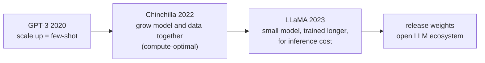
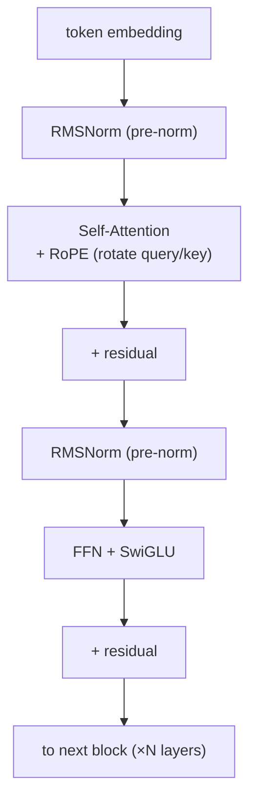
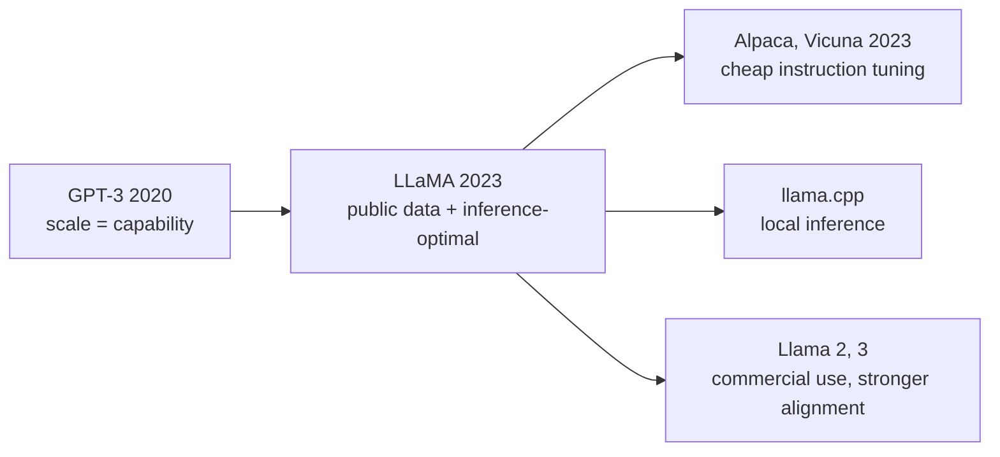

## Paper Info

- Title: LLaMA: Open and Efficient Foundation Language Models
- Authors: Hugo Touvron, Thibaut Lavril, Gautier Izacard, Xavier Martinet, and others (Meta AI)
- Year: 2023 (arXiv February 2023)
- arXiv: https://arxiv.org/abs/2302.13971
- PDF: https://arxiv.org/pdf/2302.13971

## One-Line Summary

LLaMA shows that a foundation model as capable as [GPT-3](/kb/2026-06-21-gpt-3-paper-note) can be built
**using only publicly available data, and at a far smaller size.**
The headline result: **a 13B LLaMA beats 175B GPT-3 — more than 10× larger — on most benchmarks, and the 65B is on par with Chinchilla-70B and PaLM-540B.**
The trick isn't scaling up. It's **training a smaller model for longer (on far more tokens), optimized for inference cost** rather than training compute.
And by releasing the model weights to the research community, it lit the fuse on today's open-source LLM ecosystem.

## Background Knowledge for Reading LLaMA

LLaMA is a **decoder-only Transformer foundation model**, just like [GPT-3](/kb/2026-06-21-gpt-3-paper-note).
So if you've read the GPT-3 and [Attention](/kb/2026-04-17-attention-is-all-you-need-paper-note) notes, the only new things are three architecture changes and the "inference-optimal" lens.

| Background               | Why LLaMA needs it                                                         | Note to read first                                                                               |
| ------------------------ | -------------------------------------------------------------------------- | ------------------------------------------------------------------------------------------------ |
| GPT-3 scaling            | LLaMA flips GPT-3's "scale = capability" story, which starts in that note. | [GPT-3 paper notes](/kb/2026-06-21-gpt-3-paper-note)                                             |
| Self-attention and QKV   | RoPE injects position into the query and key of attention.                 | [QKV intuition](/kb/2026-04-17-transformer-basics-qkv-intuition)                                 |
| Residual, LayerNorm, FFN | RMSNorm and SwiGLU replace LayerNorm and the FFN.                          | [Residual, LayerNorm, FFN](/kb/2026-04-17-transformer-basics-residual-layernorm-ffn)             |
| Decoder-only structure   | LLaMA is a pure decoder-only language model.                               | [Encoder-only vs Decoder-only](/kb/2026-04-18-llm-architecture-basics-encoder-only-decoder-only) |
| Pre-training             | LLaMA is a pure pre-trained base model, before any alignment.              | [Pre-training and Fine-tuning](/kb/2026-04-18-llm-learning-basics-pretraining-finetuning)        |

"Inference-optimal" and Chinchilla's "compute-optimal" are new to this series, so this note explains them as needed.
If you only want the minimum path:

1. "Core Idea" and "Limitations" in the [GPT-3 paper notes](/kb/2026-06-21-gpt-3-paper-note)
2. This note's "Core Idea: A Smaller Model, Trained Longer" section
3. This note's "Architecture: Three Changes" section

## A Quick Walkthrough for First-Time Readers

[GPT-3](/kb/2026-06-21-gpt-3-paper-note)'s lesson was "scale the model and capability grows."
DeepMind's Chinchilla then added a condition: to maximize performance within a fixed **training compute budget**, you shouldn't just grow the model — you must **grow model size and training tokens together, in balance**. That's "compute-optimal."

LLaMA twists the question one more time.
**The cost we actually care about isn't one round of "training" — it's the billions of rounds of "inference," isn't it?**
You train a model once, but after deployment it serves countless users forever. So the goal shouldn't be "best performance for a fixed training budget" — it should be **"the model that reaches a target performance most cheaply at inference."**

From that angle the answer is clear: **train a smaller model on far more tokens than even Chinchilla would recommend.**
A small model takes longer to train, but once built it's cheap to run forever. So LLaMA trains even its 7B model on 1 trillion (1T) tokens — an "excessive" amount for that size. Remarkably, the 7B kept improving all the way to 1T tokens.

**The key insight: training happens once, inference happens endlessly. So it's worth spending more on training to get a small, cheap model.**

## Recommended Reading Order for This Page

1. Background check
2. Problem definition (public data + inference-optimal)
3. Core idea: a smaller model, trained longer
4. Training data: all public
5. Architecture: three changes (RMSNorm · SwiGLU · RoPE)
6. Efficient implementation and training scale
7. Results (13B beats 175B)
8. Limitations
9. Compared with GPT-3, what to read next

## Easy Places to Get Stuck

First, the difference between `compute-optimal` and `inference-optimal`.
Chinchilla's compute-optimal uses **training cost** as the axis: "the best model for this budget."
LLaMA's inference-optimal uses **serving cost** as the axis: "the cheapest model to reach this performance."
The former favors bigger models; the latter leans toward training a small model for a long time. That the two objectives differ is this paper's starting point.

Second, the names of the three architecture changes. None are brand-new — each is a proven idea borrowed from another model.

| Term              | What it means                                                                                               |
| ----------------- | ----------------------------------------------------------------------------------------------------------- |
| Pre-normalization | Normalize the **input** of each sub-layer, not its output. Stabilizes training of deep models (from GPT-3). |
| RMSNorm           | Drops LayerNorm's mean subtraction and normalizes **by root-mean-square only** — lighter and faster.        |
| SwiGLU            | Replaces the FFN's ReLU with **SwiGLU**, raising expressiveness at the same compute (from PaLM).            |
| RoPE              | Removes absolute position embeddings and **rotates query/key** to encode relative position (from GPTNeo).   |

Third, what "public data only" means.
GPT-3, PaLM, and Chinchilla mixed in substantial private data, but LLaMA reached the same tier **using only data anyone can access**. Reproducibility is one of this paper's central claims.

## Problem Definition

LLaMA takes on a two-layered problem.

First, **reproducibility.** The best models of the time (GPT-3, PaLM, Chinchilla) were trained on private data, making them hard to verify or build on from the outside.
LLaMA asks: "**Can you reach the top tier using only public data?**"

Second, **efficiency.** The goal isn't "best performance for a fixed training budget" — it's **"the model that best delivers a target performance within a given inference budget."**
So instead of adding parameters, it trains a smaller model for longer, on more tokens.

In one sentence:

**"Without private data or enormous scale — using only public data and longer training — can you build a GPT-3-class foundation model?"**

## Core Idea: A Smaller Model, Trained Longer

LLaMA comes in four sizes. Each gets very long training for its size.

| Model     | Parameters (exact) | Training tokens |
| --------- | ------------------ | --------------- |
| LLaMA-7B  | 6.7B               | 1.0T            |
| LLaMA-13B | 13.0B              | 1.0T            |
| LLaMA-33B | 32.5B              | 1.4T            |
| LLaMA-65B | 65.2B              | 1.4T            |

Compare the numbers with GPT-3 and the point becomes clear. GPT-3 (175B) trained on about 300B tokens.
LLaMA trains **much smaller models on 3–5× more tokens.**
By Chinchilla's rule of thumb (about 20 tokens per parameter), roughly 140B tokens would be "compute-optimal" for a 7B — but LLaMA pushes all the way to **1T tokens**, because the training curve hadn't flattened yet.

**The point: for the same performance, a smaller model trained longer is far cheaper to deploy.**

## Training Data: All Public

LLaMA's 1.4T tokens all come from public sources. The mix (sampling proportions):

| Source                    | Share | Character                                   |
| ------------------------- | ----- | ------------------------------------------- |
| CommonCrawl               | 67%   | Web crawl (filtered and deduped via CCNet)  |
| C4                        | 15%   | A different cleaned version of CommonCrawl  |
| GitHub                    | 4.5%  | Public repo code (permissive licenses only) |
| Wikipedia                 | 4.5%  | 20 languages                                |
| Books (Gutenberg, Books3) | 4.5%  | Public books                                |
| ArXiv                     | 2.5%  | Scientific papers (LaTeX)                   |
| StackExchange             | 2%    | Questions and answers                       |

Most sources are seen once (1 epoch); only Wikipedia and Books are seen for about 2 epochs.
The tokenizer is a SentencePiece BPE with **byte-fallback**, so unknown characters are handled byte-by-byte (vocab ~32k).
Note that **books and papers are a small share (7% combined)** — the MMLU weakness later comes from exactly this.

## Architecture: Three Changes

LLaMA's skeleton is the original Transformer decoder, with three proven improvements layered on.

1. **Pre-normalization + RMSNorm** — normalize the input of each sub-layer (pre-norm), and use **RMSNorm** instead of LayerNorm. RMSNorm rescales by root-mean-square without subtracting the mean, so it's lighter and stabilizes training of deep models.
2. **SwiGLU activation** — swap the FFN's ReLU for PaLM's **SwiGLU**. As a gated activation it's more expressive per parameter. To keep total compute steady, the hidden dimension is set to about `⅔·4d` rather than `4d`.
3. **RoPE (rotary positional embeddings)** — drop absolute position embeddings and instead **rotate** the query/key vectors by position at each layer, injecting relative position. This helps with long context and extrapolation.

That all three changes are **careful combinations of proven pieces** rather than new inventions captures the character of LLaMA's architecture well. The training objective (next-token prediction) and context length (2048) are unchanged.

## Efficient Implementation and Training Scale

Training a small model for a long time means training itself has to be fast. LLaMA invests here.

- **Memory-efficient attention** — using `xformers`' causal multi-head attention, it skips computing scores that masking would discard and doesn't store attention weights.
- **Activation checkpointing** — it saves only the activations that are expensive to recompute (linear-layer outputs, etc.) and recomputes the rest, trading memory for compute.
- **Parallelism** — model and sequence parallelism overlap cross-GPU communication with computation.

The result: the 65B runs at about 380 tokens/sec/GPU on **2048 A100 80GB** GPUs, training 1.4T tokens in about **21 days**.
The paper transparently reports GPU-hours and even carbon emissions — which is why "efficient" is in the title.

## Results: A 13B Model Beats 175B

The strongest result is performance per size.

- **LLaMA-13B beats 175B GPT-3 on most benchmarks** — despite being more than 10× smaller. That a 13B that runs on a single GPU can do this matters a lot in practice.
- **LLaMA-65B is on par with the best models, Chinchilla-70B and PaLM-540B** — competitive with a PaLM-540B more than 8× its size.

Breaking it down:

| Axis                  | Observation                                                                                |
| --------------------- | ------------------------------------------------------------------------------------------ |
| Commonsense & reading | Strong for its size on PIQA, HellaSwag, WinoGrande, and others.                            |
| Closed-book QA        | On NaturalQuestions and TriviaQA, the 65B competes with the top tier.                      |
| MMLU (multi-domain)   | The 65B is **slightly behind** Chinchilla, PaLM, and GPT-3.5 — too little book/paper data. |
| Math & code           | Not trained specifically for math/code, so it trails specialists like Minerva and PaLM.    |
| Instruction (LLaMA-I) | Even brief instruction fine-tuning lifts MMLU to 68.9, hinting at alignment headroom.      |

The core message is clear:
**not a bigger model, but a small model trained well on public data is more useful in practice.**

## Limitations and Things to Read Carefully

First, **weakness on knowledge-heavy tasks like MMLU.**
With little book/paper data, it falls a bit short of the top models on benchmarks that probe broad expert knowledge — a direct consequence of the data mix.

Second, **bias, toxicity, and truthfulness remain open problems.**
The paper honestly reports RealToxicityPrompts, CrowS-Pairs, WinoGender, and TruthfulQA numbers. Trained on the public web, it carries gender, religion, and race biases.

Third, **it's a base model, before alignment.**
LLaMA hasn't been through [InstructGPT](/kb/2026-06-29-instructgpt-paper-note)-style RLHF, so as-is it doesn't follow instructions well. The LLaMA-I experiment only hints at that headroom.

Fourth, **the license.**
The weights were released under a research-only (non-commercial) condition. It isn't a fully open-source license, but this release is what triggered the ecosystem explosion that followed.

## Reading LLaMA Next to GPT-3

| Axis            | GPT-3 (2020)                            | LLaMA (2023)                                       |
| --------------- | --------------------------------------- | -------------------------------------------------- |
| Core question   | "Does scaling make a few-shot learner?" | "Can public data + small scale reach GPT-3 level?" |
| Optimize for    | Scale (parameters)                      | Inference efficiency (small model, longer)         |
| Training data   | Private mix                             | All public data                                    |
| Headline result | 175B few-shot performance               | 13B beats 175B; 65B on par with PaLM-540B          |
| Availability    | API only                                | Weights released (research use)                    |
| Architecture    | Original Transformer decoder            | Adds RMSNorm, SwiGLU, RoPE                         |

## Why It Still Matters

First, **it's the starting point of the open LLM ecosystem.**
The moment the weights were out, cheap instruction tuning (Alpaca, Vicuna), local inference (`llama.cpp`), and countless derivative models exploded. Today's lineage of "open models you run locally" begins here.

Second, **it made "inference-optimal" standard thinking.**
The view that you "train a small model longer to lower deployment cost" runs through most open-model design since. Llama 2/3 and the Mistral family all sit on this line.

Third, **the architecture is a de facto standard.**
The RMSNorm + SwiGLU + RoPE combination became the default recipe for open LLMs. Open a new model's architecture diagram today and you'll see these three almost unchanged.

## Notes to Keep

- LLaMA's core isn't a new algorithm — it's a **choice of data and training strategy**: public data only, small models trained longer.
- If Chinchilla is optimal by "training compute," LLaMA is optimal by "**inference cost**." The objective function differs.
- A 13B beating 175B GPT-3 shows that data and training length can substitute for scale.
- The three architecture changes (RMSNorm, SwiGLU, RoPE) are all combinations of proven pieces — and they became the open-LLM standard.
- The MMLU weakness is a direct result of a data mix light on books and papers.
- Releasing the weights (for research) was the trigger for the open-source LLM explosion.

## What to Read Next

- [InstructGPT (2022): alignment via human feedback](/kb/2026-06-29-instructgpt-paper-note) — the next step (RLHF) that makes a base model like LLaMA "follow instructions"
- Llama 2 (2023): Open Foundation and Fine-Tuned Chat Models — the follow-up adding commercial use and RLHF alignment
- Chinchilla (2022): Training Compute-Optimal Large Language Models — the "compute-optimal" original that LLaMA twists
