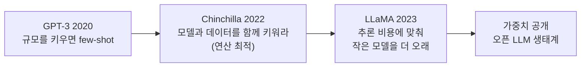
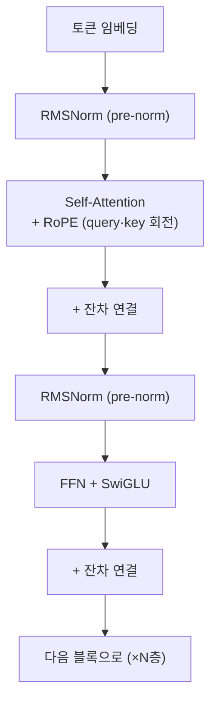
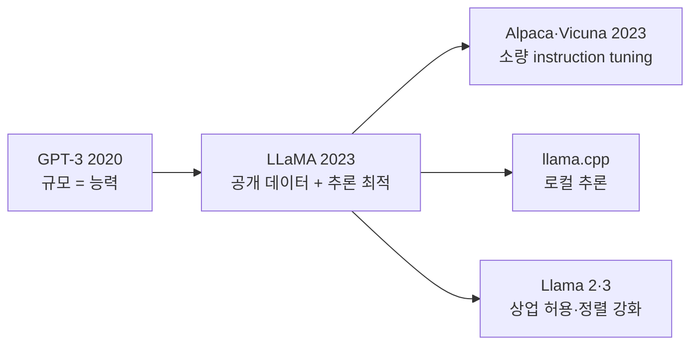

## Paper Info

- Title: LLaMA: Open and Efficient Foundation Language Models
- Authors: Hugo Touvron, Thibaut Lavril, Gautier Izacard, Xavier Martinet 외 (Meta AI)
- Year: 2023 (arXiv 2023년 2월)
- arXiv: https://arxiv.org/abs/2302.13971
- PDF: https://arxiv.org/pdf/2302.13971

## 한 줄 요약

LLaMA는 [GPT-3](/kb/2026-06-21-gpt-3-paper-note)만큼 강력한 기반 모델을,
**오직 공개된 데이터만으로, 그리고 훨씬 작은 크기로** 만들 수 있음을 보인 논문입니다.
핵심 결과는 이렇습니다. **13B LLaMA가 10배 이상 큰 175B GPT-3를 대부분의 벤치마크에서 앞서고, 65B는 Chinchilla-70B·PaLM-540B와 대등합니다.**
비결은 규모를 더 키우는 것이 아니라, **추론 비용에 맞춰 더 작은 모델을 더 오래(더 많은 토큰으로) 학습**하는 전략입니다.
여기에 더해, 모델 가중치를 연구 커뮤니티에 공개하면서 오늘날의 오픈소스 LLM 생태계에 불을 붙였습니다.

## LLaMA를 이해하기 위한 기반 지식

LLaMA는 [GPT-3](/kb/2026-06-21-gpt-3-paper-note)와 같은 **decoder-only Transformer 기반 모델**입니다.
그래서 GPT-3와 [Attention](/kb/2026-04-17-attention-is-all-you-need-paper-note) 노트를 읽었다면, 새로 잡아야 할 것은 아키텍처 변경 세 가지와 "추론 최적" 관점뿐입니다.

| 기반 지식              | LLaMA에서 필요한 이유                                                 | 먼저 볼 노트                                                                                    |
| ---------------------- | --------------------------------------------------------------------- | ----------------------------------------------------------------------------------------------- |
| GPT-3의 scaling        | LLaMA가 "규모 대신 데이터"로 뒤집는 대상이 GPT-3 노트에서 이어집니다. | [GPT-3 논문 노트](/kb/2026-06-21-gpt-3-paper-note)                                              |
| Self-attention과 QKV   | RoPE는 attention의 query·key에 위치 정보를 넣는 방식입니다.           | [QKV 직관](/kb/2026-04-17-transformer-basics-qkv-intuition)                                     |
| Residual·LayerNorm·FFN | RMSNorm과 SwiGLU가 각각 LayerNorm·FFN을 대체합니다.                   | [Residual·LayerNorm·FFN](/kb/2026-04-17-transformer-basics-residual-layernorm-ffn)              |
| Decoder-only 구조      | LLaMA는 순수 decoder-only 언어 모델입니다.                            | [Encoder-only와 Decoder-only](/kb/2026-04-18-llm-architecture-basics-encoder-only-decoder-only) |
| Pre-training           | LLaMA는 정렬 이전의 순수 사전학습 기반 모델입니다.                    | [Pre-training과 Fine-tuning](/kb/2026-04-18-llm-learning-basics-pretraining-finetuning)         |

"추론 최적(inference-optimal)"과 Chinchilla의 "연산 최적(compute-optimal)"은 이 시리즈에서 아직 다루지 않은 새 개념이라, 이 노트 안에서 필요한 만큼 풀어 설명합니다.
최소 경로만 고르면 다음 순서가 좋습니다.

1. [GPT-3 논문 노트](/kb/2026-06-21-gpt-3-paper-note)의 "핵심 아이디어"와 "한계"
2. 이 노트의 "핵심 아이디어: 작은 모델을 더 오래" 섹션
3. 이 노트의 "아키텍처: 세 가지 변경" 섹션

## 처음 읽는 사람을 위한 빠른 해설

[GPT-3](/kb/2026-06-21-gpt-3-paper-note)의 교훈은 "모델을 키우면 능력이 는다"였습니다.
그 뒤 DeepMind의 Chinchilla는 여기에 조건을 달았습니다. 정해진 **학습 연산 예산** 안에서 성능을 최대화하려면, 모델만 키우지 말고 **모델 크기와 학습 토큰 수를 함께 균형 있게 키워야 한다**는 것입니다. 이것이 "연산 최적(compute-optimal)"입니다.

LLaMA는 여기서 질문을 한 번 더 비틉니다.
**우리가 실제로 신경 쓰는 비용은 "학습" 한 번이 아니라 "추론" 수십억 번 아닌가요?**
모델은 한 번 학습하지만, 배포된 뒤에는 수많은 사용자에게 끝없이 서빙됩니다. 그렇다면 목표는 "정해진 학습 예산에서 최고 성능"이 아니라, **"목표 성능을 가장 싸게 추론할 수 있는 모델"** 이어야 합니다.

이 관점에서 답은 분명합니다. **더 작은 모델을, Chinchilla가 권한 것보다도 훨씬 더 많은 토큰으로 오래 학습**하는 것입니다.
작은 모델은 학습에 시간이 더 들지만, 한 번 만들어 두면 추론이 영원히 쌉니다. 그래서 LLaMA는 7B 모델조차 1조(1T) 토큰이라는, 그 크기에는 "과할 만큼" 많은 데이터로 학습합니다. 놀랍게도 7B는 1조 토큰에 도달할 때까지도 성능이 계속 좋아졌습니다.

**핵심 통찰: 학습은 한 번이고, 추론은 무한히 많습니다. 그러니 학습을 더 들여서라도 작고 싼 모델을 만드는 편이 낫습니다.**

## 이 페이지를 읽는 추천 순서

1. 기반 지식 체크
2. 문제 정의 (공개 데이터 + 추론 최적)
3. 핵심 아이디어: 작은 모델을 더 오래
4. 학습 데이터: 전부 공개 데이터
5. 아키텍처: 세 가지 변경 (RMSNorm · SwiGLU · RoPE)
6. 효율적 구현과 학습 규모
7. 실험 결과 (13B가 175B를 이김)
8. 한계
9. GPT-3와 비교, 다음 논문

## 읽다가 막히기 쉬운 지점

첫 번째는 `compute-optimal`과 `inference-optimal`의 차이입니다.
Chinchilla의 연산 최적은 **학습 비용**을 기준으로 "이 예산에서 가장 좋은 모델"을 찾습니다.
LLaMA의 추론 최적은 **서빙 비용**을 기준으로 "이 성능을 가장 싸게 낼 모델"을 찾습니다.
전자는 큰 모델을 선호하고, 후자는 작은 모델을 오래 학습하는 쪽으로 기웁니다. 두 목표가 다르다는 점이 이 논문의 출발점입니다.

두 번째는 아키텍처 변경 세 가지의 이름입니다. 셋 다 완전히 새로운 것이 아니라, 다른 모델에서 검증된 것을 골라 조합했습니다.

| 용어              | 정확한 의미                                                                                         |
| ----------------- | --------------------------------------------------------------------------------------------------- |
| Pre-normalization | 각 서브층의 **출력이 아니라 입력**을 정규화합니다. 깊은 모델의 학습을 안정시킵니다(GPT-3에서 차용). |
| RMSNorm           | LayerNorm의 평균 빼기를 생략하고 **제곱평균(RMS)으로만** 정규화합니다. 더 가볍고 빠릅니다.          |
| SwiGLU            | FFN의 ReLU 활성화를 **SwiGLU**로 교체합니다. 같은 연산량에서 표현력을 높입니다(PaLM에서 차용).      |
| RoPE              | 절대 위치 임베딩을 없애고, **query·key를 회전**시켜 상대 위치를 넣습니다(GPTNeo에서 차용).          |

세 번째는 "공개 데이터만 썼다"의 의미입니다.
GPT-3·PaLM·Chinchilla는 비공개 데이터를 상당히 섞었지만, LLaMA는 **누구나 접근 가능한 공개 데이터만으로** 같은 급의 성능을 냈습니다. "재현 가능성"이 이 논문의 중요한 주장 중 하나입니다.

## 문제 정의

LLaMA가 붙잡은 문제는 두 겹입니다.

첫째, **재현 가능성**입니다. 당시 최고 성능 모델(GPT-3·PaLM·Chinchilla)은 비공개 데이터로 학습돼, 외부에서 검증하거나 이어 연구하기 어려웠습니다.
LLaMA는 "**공개 데이터만으로도 최고 수준에 닿을 수 있는가**"를 묻습니다.

둘째, **효율**입니다. 논문의 목표는 "정해진 학습 예산에서 최고 성능"이 아니라, **"목표 성능을 주어진 추론 예산에서 가장 잘 내는 모델"** 입니다.
그래서 파라미터를 늘리는 대신, 더 작은 모델을 더 많은 토큰으로 오래 학습하는 쪽을 택합니다.

한 문장으로 줄이면 이렇습니다.

**"비공개 데이터도, 거대한 규모도 없이 — 공개 데이터와 더 긴 학습만으로 GPT-3급 기반 모델을 만들 수 있는가?"**

## 핵심 아이디어: 작은 모델을 더 오래

LLaMA는 네 가지 크기로 나옵니다. 각 크기는 그 크기치고 매우 긴 학습을 받습니다.

| 모델      | 파라미터(정확히) | 학습 토큰 |
| --------- | ---------------- | --------- |
| LLaMA-7B  | 6.7B             | 1.0T      |
| LLaMA-13B | 13.0B            | 1.0T      |
| LLaMA-33B | 32.5B            | 1.4T      |
| LLaMA-65B | 65.2B            | 1.4T      |

숫자의 의미를 GPT-3와 대보면 분명해집니다. GPT-3(175B)는 약 3천억(300B) 토큰으로 학습했습니다.
LLaMA는 그보다 **훨씬 작은 모델을, 3~5배 많은 토큰으로** 학습합니다.
Chinchilla의 경험칙(파라미터 1개당 약 20 토큰)으로 보면 7B에는 약 1,400억 토큰이면 "연산 최적"이지만, LLaMA는 여기에 그치지 않고 **1조 토큰까지** 밀어붙입니다. 학습 곡선이 아직 꺾이지 않았기 때문입니다.

**요점: 같은 성능이라면, 더 작지만 더 오래 학습한 모델이 배포 후 훨씬 쌉니다.**

## 학습 데이터: 전부 공개 데이터

LLaMA의 1.4조 토큰은 모두 공개 소스에서 왔습니다. 비율(샘플링 가중치)은 다음과 같습니다.

| 소스                     | 비율 | 성격                                         |
| ------------------------ | ---- | -------------------------------------------- |
| CommonCrawl              | 67%  | 웹 크롤(CCNet 파이프라인으로 필터·중복 제거) |
| C4                       | 15%  | 정제된 CommonCrawl의 다른 버전               |
| GitHub                   | 4.5% | 공개 저장소 코드(허용 라이선스만)            |
| Wikipedia                | 4.5% | 20개 언어                                    |
| Books (Gutenberg·Books3) | 4.5% | 공개 도서                                    |
| ArXiv                    | 2.5% | 과학 논문(LaTeX)                             |
| StackExchange            | 2%   | 질문·답변                                    |

대부분은 한 번(1 epoch)만 보고, Wikipedia와 Books만 약 2 epoch을 봅니다.
토크나이저는 SentencePiece BPE에 **byte-fallback**을 붙여, 모르는 문자도 바이트 단위로 처리합니다(어휘 약 32k).
눈여겨볼 점은 **책·논문 비중이 작다(합쳐 7%)** 는 것입니다. 뒤의 MMLU 약점이 여기서 옵니다.

## 아키텍처: 세 가지 변경

LLaMA의 골격은 원조 Transformer decoder이지만, 이후 검증된 개선 세 가지를 골라 얹었습니다.

1. **Pre-normalization + RMSNorm** — 각 서브층의 입력을 정규화하고(pre-norm), 정규화 방식은 LayerNorm 대신 **RMSNorm**을 씁니다. RMSNorm은 평균 빼기 없이 제곱평균으로만 스케일을 맞춰, 더 가벼우면서 깊은 모델의 학습을 안정시킵니다.
2. **SwiGLU 활성화** — FFN의 ReLU를 PaLM의 **SwiGLU**로 바꿉니다. 게이팅이 붙은 활성화라 같은 파라미터에서 표현력이 좋습니다. 대신 은닉 차원을 `4d`가 아니라 약 `⅔·4d`로 조정해 전체 연산량을 맞춥니다.
3. **RoPE(회전 위치 임베딩)** — 절대 위치 임베딩을 없애고, 각 층의 attention에서 query·key 벡터를 위치에 따라 **회전**시켜 상대 위치 정보를 넣습니다. 긴 문맥과 외삽에 유리합니다.

세 변경 모두 "새 발명"이 아니라 **검증된 조각의 신중한 조합**이라는 점이 LLaMA 아키텍처의 성격을 잘 보여줍니다. 학습 목표(다음 토큰 예측)와 문맥 길이(2048)는 그대로입니다.

## 효율적 구현과 학습 규모

작은 모델을 오래 학습하려면, 학습 자체가 빨라야 합니다. LLaMA는 여기에 공을 들입니다.

- **메모리 효율 attention** — `xformers`의 causal multi-head attention을 써서, 마스킹으로 버려질 점수는 계산하지 않고 attention 가중치도 저장하지 않습니다.
- **활성화 체크포인팅** — 역전파에서 다시 계산하기 비싼 활성화(선형층 출력 등)만 저장하고 나머지는 재계산해, 메모리와 연산을 맞바꿉니다.
- **병렬화** — 모델·시퀀스 병렬화로 GPU 사이 통신과 계산을 겹칩니다.

그 결과 65B는 **2048개의 A100 80GB** 위에서 GPU당 초당 약 380토큰을 처리하며, 1.4조 토큰을 약 **21일**에 학습합니다.
논문은 학습에 든 GPU 시간과 탄소 배출량까지 투명하게 보고합니다. "효율"이 제목에 들어간 이유입니다.

## 실험 결과: 13B가 175B를 이깁니다

가장 강한 결과는 크기 대비 성능입니다.

- **LLaMA-13B가 대부분의 벤치마크에서 175B GPT-3를 앞섭니다.** 10배 이상 작은데도 그렇습니다. 그래서 GPU 한 장에서도 돌릴 수 있는 13B가 실용적으로 큰 의미를 가집니다.
- **LLaMA-65B는 최고 모델인 Chinchilla-70B·PaLM-540B와 대등**합니다. 8배 이상 작은 PaLM-540B와 견줍니다.

세부 축은 이렇습니다.

| 축                   | 관찰                                                                               |
| -------------------- | ---------------------------------------------------------------------------------- |
| 상식 추론·독해       | PIQA·HellaSwag·WinoGrande 등에서 크기 대비 강력합니다.                             |
| Closed-book QA       | NaturalQuestions·TriviaQA에서 65B가 최상위권과 경쟁합니다.                         |
| MMLU(다분야 지식)    | 65B가 Chinchilla·PaLM·GPT-3.5에 **약간 뒤집니다**. 책·논문 데이터가 적은 탓입니다. |
| 수학·코드            | 수학·코드 전용으로 학습하지 않아, Minerva·PaLM 같은 특화 모델에는 못 미칩니다.     |
| 지시 따르기(LLaMA-I) | 잠깐만 instruction fine-tuning해도 MMLU가 68.9로 올라, 정렬 여지를 보여줍니다.     |

핵심 메시지는 명확합니다.
**더 큰 모델이 아니라, 공개 데이터로 잘 학습한 작은 모델이 실용적으로 더 쓸모 있습니다.**

## 한계와 조심해서 읽을 지점

첫 번째, **MMLU 같은 지식 집약 태스크에서의 약점**입니다.
책·논문 비중이 작아, 전문 지식을 폭넓게 묻는 벤치마크에서는 최상위 모델에 조금 못 미칩니다. 데이터 구성의 직접적인 결과입니다.

두 번째, **편향·유해성·진실성은 여전히 과제**입니다.
논문은 RealToxicityPrompts·CrowS-Pairs·WinoGender·TruthfulQA 수치를 정직하게 싣습니다. 공개 웹으로 학습한 만큼 성별·종교·인종 편향이 남아 있습니다.

세 번째, **정렬 이전의 기반 모델**입니다.
LLaMA는 [InstructGPT](/kb/2026-06-29-instructgpt-paper-note)식 RLHF를 거치지 않은 순수 사전학습 모델이라, 그대로는 지시를 잘 따르지 않습니다. LLaMA-I 실험이 그 여지를 살짝 보여줄 뿐입니다.

네 번째, **라이선스**입니다.
가중치는 연구 목적(비상업) 조건으로 공개됐습니다. 완전한 오픈소스 라이선스는 아니지만, 이 공개가 이후 생태계 폭발의 방아쇠가 됩니다.

## GPT-3와 비교해서 읽기

| 축          | GPT-3 (2020)                          | LLaMA (2023)                                |
| ----------- | ------------------------------------- | ------------------------------------------- |
| 핵심 질문   | "규모를 키우면 few-shot learner인가?" | "공개 데이터·작은 규모로 GPT-3급이 되는가?" |
| 최적화 기준 | 규모(파라미터)                        | 추론 효율(작은 모델을 더 오래)              |
| 학습 데이터 | 비공개 혼합                           | 전부 공개 데이터                            |
| 대표 결과   | 175B few-shot 성능                    | 13B가 175B를 이김, 65B가 PaLM-540B와 대등   |
| 공개 여부   | API만 제공                            | 가중치 공개(연구용)                         |
| 아키텍처    | 원조 Transformer decoder              | RMSNorm·SwiGLU·RoPE 추가                    |

## 왜 지금도 중요한가

첫 번째, **오픈 LLM 생태계의 출발점**입니다.
가중치가 공개되자마자 Alpaca·Vicuna 같은 저비용 instruction tuning, `llama.cpp` 같은 로컬 추론, 수많은 파생 모델이 폭발했습니다. 오늘날 "로컬에서 돌리는 오픈 모델"의 계보가 여기서 시작됩니다.

두 번째, **"추론 최적"을 표준 사고로 만들었습니다.**
"작은 모델을 더 오래 학습해 배포 비용을 낮춘다"는 관점은 이후 대부분의 오픈 모델 설계에 스며듭니다. Llama 2·3, Mistral 계열이 모두 이 노선 위에 있습니다.

세 번째, **아키텍처의 사실상 표준**입니다.
RMSNorm·SwiGLU·RoPE 조합은 이후 오픈 LLM의 기본 레시피가 됐습니다. 지금 새 모델의 구조도를 열면 이 세 가지가 거의 그대로 보입니다.

## 읽고 남길 메모

- LLaMA의 핵심은 새 알고리즘이 아니라 **데이터·학습 전략의 선택**입니다. 공개 데이터만으로, 작은 모델을 더 오래.
- Chinchilla가 "학습 연산" 기준 최적이라면, LLaMA는 "**추론 비용**" 기준 최적입니다. 목표 함수가 다릅니다.
- 13B가 175B GPT-3를 이긴다는 결과는, 데이터와 학습 길이가 규모를 대신할 수 있음을 보여줍니다.
- 아키텍처 변경 세 가지(RMSNorm·SwiGLU·RoPE)는 모두 검증된 조각의 조합이고, 이후 오픈 LLM의 표준이 됩니다.
- MMLU 약점은 책·논문 비중이 작은 데이터 구성의 직접적 결과입니다.
- 가중치 공개(연구용)가 오픈소스 LLM 생태계 폭발의 방아쇠였습니다.

## 다음에 읽을 논문

- [InstructGPT (2022): 사람 피드백으로 정렬](/kb/2026-06-29-instructgpt-paper-note) — LLaMA 같은 기반 모델을 "지시를 따르게" 만드는 다음 단계(RLHF)
- Llama 2 (2023): Open Foundation and Fine-Tuned Chat Models — 상업 허용과 RLHF 정렬을 더한 후속
- Chinchilla (2022): Training Compute-Optimal Large Language Models — LLaMA가 비튼 "연산 최적" 원본
