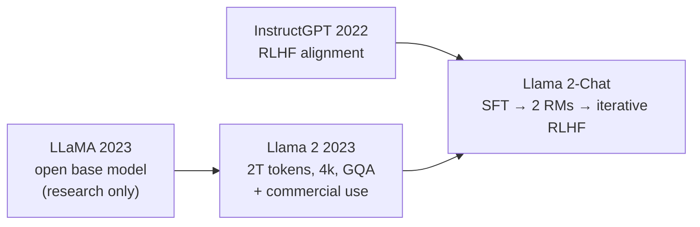
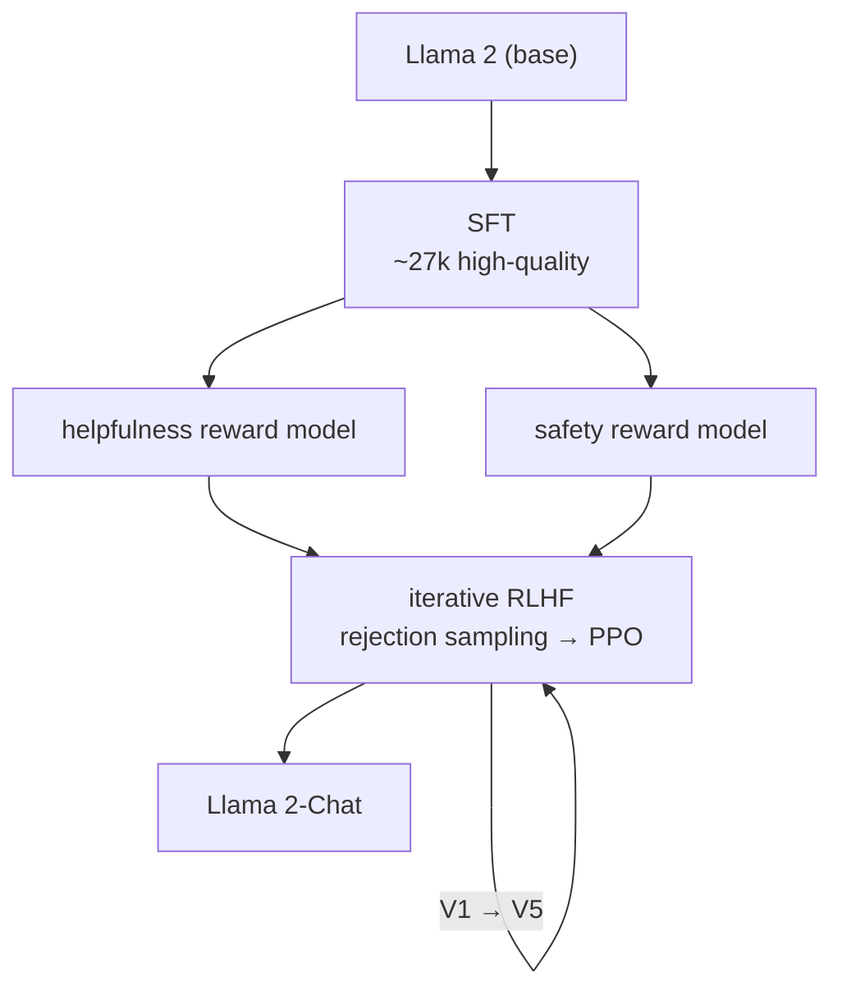
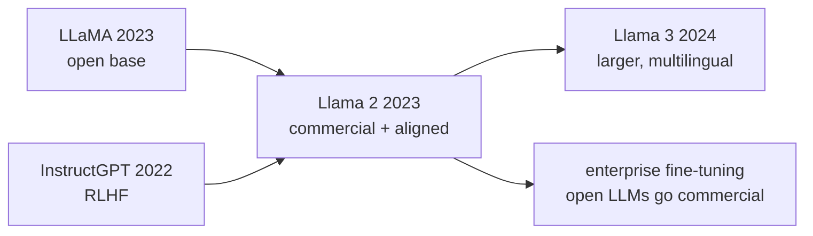

## Paper Info

- Title: Llama 2: Open Foundation and Fine-Tuned Chat Models
- Authors: Hugo Touvron, Louis Martin, Kevin Stone, and others (Meta GenAI)
- Year: 2023 (arXiv July 2023)
- arXiv: https://arxiv.org/abs/2307.09288
- PDF: https://arxiv.org/pdf/2307.09288

## One-Line Summary

Llama 2 fuses [LLaMA](/kb/2026-07-10-llama-paper-note)'s base-model lineage with [InstructGPT](/kb/2026-06-29-instructgpt-paper-note)'s RLHF alignment
into **a single, production-grade open model you're allowed to use commercially.**
The base model is scaled to 2T tokens and 4k context, and the chat model, **Llama 2-Chat**, is aligned on top of SFT with **two separate reward models — one for helpfulness, one for safety** — and iterative RLHF.
The headline result: **Llama 2-Chat 70B matches ChatGPT (GPT-3.5) on helpfulness in human evals while being safer**, with weights released under a license that even permits commercial use.

## Background Knowledge for Reading Llama 2

Llama 2 directly continues the previous two notes. Take the base model and architecture from [LLaMA](/kb/2026-07-10-llama-paper-note) and the RLHF skeleton from [InstructGPT](/kb/2026-06-29-instructgpt-paper-note), and there's only a little left that's new.

| Background                      | Why Llama 2 needs it                                               | Note to read first                                               |
| ------------------------------- | ------------------------------------------------------------------ | ---------------------------------------------------------------- |
| LLaMA's architecture/strategy   | Llama 2's base is LLaMA (RMSNorm, SwiGLU, RoPE) scaled up.         | [LLaMA paper notes](/kb/2026-07-10-llama-paper-note)             |
| RLHF three steps (SFT, RM, PPO) | Llama 2-Chat's pipeline extends InstructGPT's RLHF.                | [InstructGPT paper notes](/kb/2026-06-29-instructgpt-paper-note) |
| GPT-3 scaling                   | The "data and alignment over scale" thread of this line continues. | [GPT-3 paper notes](/kb/2026-06-21-gpt-3-paper-note)             |
| Self-attention and QKV          | Understanding GQA needs the key/value-cache idea.                  | [QKV intuition](/kb/2026-04-17-transformer-basics-qkv-intuition) |

The genuinely new concepts here are **GQA**, **two reward models (helpfulness and safety)**, **combining rejection sampling with PPO**, and **GAtt (Ghost Attention)** — each explained where it's needed.
For the minimum path:

1. "Architecture" and "Core Idea" in the [LLaMA paper notes](/kb/2026-07-10-llama-paper-note)
2. "Core Idea: The Three Steps of RLHF" in the [InstructGPT paper notes](/kb/2026-06-29-instructgpt-paper-note)
3. This note's "Llama 2-Chat: The Alignment Pipeline" section

## A Quick Walkthrough for First-Time Readers

[LLaMA](/kb/2026-07-10-llama-paper-note) built a strong **base model** from public data, but with two gaps: a research-only license (no commercial use), and no alignment (RLHF), so as-is it didn't follow instructions well.

Llama 2 fills both head-on.
First, it **permits commercial use.** That one line of license change pulls the open-LLM ecosystem out of the lab.
Second, it **pushes alignment all the way to production quality.** Llama 2-Chat is the RLHF recipe from [InstructGPT](/kb/2026-06-29-instructgpt-paper-note), refined enough to ship in a real service.

Along the way it diverges from InstructGPT in one choice.
InstructGPT used a single reward model to capture "the answer people prefer," but Llama 2 **splits the reward model in two:** one for "how helpful is it (helpfulness)," another for "how safe is it (safety)." Because helpfulness and safety often conflict, it trains them separately and reconciles them rather than forcing them into one score.

**The key: Llama 2 fuses an "open base model (LLaMA)" and an "alignment recipe (InstructGPT)" into a single, commercially usable product.**

## Recommended Reading Order for This Page

1. Background check
2. Problem definition (open + aligned + commercial)
3. What changed in the base model (2T tokens · 4k · GQA)
4. Llama 2-Chat: the alignment pipeline
5. Two reward models
6. Iterative RLHF: rejection sampling + PPO
7. GAtt and safety
8. Results (on par with ChatGPT)
9. Limitations, comparison, what to read next

## Easy Places to Get Stuck

First, the distinction between the `base model` and the `Chat model`.
**Llama 2** (base) is a pre-trained model that only learned next-token prediction; **Llama 2-Chat** adds SFT and RLHF on top for dialogue. Most of the paper's weight sits on the Chat-side alignment.

Second, the new terms.

| Term                             | What it means                                                                                                     |
| -------------------------------- | ----------------------------------------------------------------------------------------------------------------- |
| GQA (Grouped-Query Attention)    | Multiple query heads **share** grouped key/value heads. Shrinks the KV cache, making big-model inference cheaper. |
| Helpfulness/safety reward models | Two separate reward models, each trained on "how helpful" and "how safe" **respectively**.                        |
| Rejection sampling               | Sample K answers to a prompt and **re-run SFT on the best one** picked by the reward model.                       |
| GAtt (Ghost Attention)           | A training trick that helps a multi-turn chat **remember an initial system instruction** many turns later.        |
| Margin loss                      | A term added to the reward model so a larger preference gap widens the score gap.                                 |

Third, "why use both rejection sampling and PPO?"
They aren't mutually exclusive. Early on, rejection sampling (pick the best of several answers and retrain) lifts things broadly; later, PPO refines finely. RLHF runs not once but **iteratively, from V1 through V5**.

## Problem Definition

Llama 2 takes on a three-layered problem.

First, **openness.** The best-aligned chat models of the time (ChatGPT, etc.) were closed. Llama 2 asks: "**Can open weights reach a production-grade chat model?**"

Second, **commercial usability.** It loosens [LLaMA](/kb/2026-07-10-llama-paper-note)'s research-only license so companies can put it into real products.

Third, **reconciling helpfulness and safety.** Align too hard and a model gets so cautious it becomes useless. Llama 2 looks for a way to raise both together.

In one sentence:

**"Can you build a chat model that's open-weight, commercially usable, and both helpful and safe?"**

## What Changed in the Base Model

The Llama 2 base inherits [LLaMA](/kb/2026-07-10-llama-paper-note)'s architecture (RMSNorm pre-norm, SwiGLU, RoPE) but adjusts scale and structure.

| Axis            | LLaMA (2023)   | Llama 2 (2023)                         |
| --------------- | -------------- | -------------------------------------- |
| Training tokens | 1.0T–1.4T      | **2.0T** (public data, cleaner)        |
| Context         | 2048           | **4096** (2×)                          |
| Attention       | MHA            | **GQA** on 34B and 70B                 |
| Released sizes  | 7B·13B·33B·65B | 7B·13B·70B (34B trained, not released) |
| License         | Research only  | **Commercial use permitted**           |

**GQA** matters in particular. When several query heads share grouped key/value heads, the KV cache you must hold at inference shrinks, so big models serve more cheaply. LLaMA's "inference cost" philosophy continues, now at the structural level.

## Llama 2-Chat: The Alignment Pipeline

Llama 2-Chat aligns the base model in the following order. The overall shape matches [InstructGPT](/kb/2026-06-29-instructgpt-paper-note)'s RLHF, but each step is more refined.

1. **SFT** — supervised fine-tuning on human-written, high-quality demonstrations. Here Llama 2 stresses **quality over quantity**: a curated set of about **27k** high-quality examples beat millions of public instruction samples.
2. **Reward models** — trained on human preference comparisons (about **1.4M**). But not one model — **two**, for helpfulness and safety.
3. **Iterative RLHF** — with the reward models as judges, the policy is improved via rejection sampling and PPO. Fresh preference data is gathered from the new policy's outputs and the loop repeats from V1 through V5.

## Two Reward Models: Helpfulness and Safety

This is Llama 2's signature choice. Helpfulness and safety often collide (refusing "how to build a bomb" is right, but that stance can make a model over-refuse harmless questions too). Blend them into one score and that tension gets flattened. So Llama 2 **splits the reward model in two.**

- **Helpfulness RM** — scores how useful an answer is.
- **Safety RM** — scores how safe an answer is.

Two things worth noting.
First, the reward models are **initialized from the chat model checkpoint.** A judge should know what the model knows, so it's less likely to be fooled by plausible nonsense into mis-scoring (reward hacking).
Second, the loss includes a **margin term.** Pairs a human marked as "clearly better" are trained to widen the score gap further, so the strength of the preference is reflected too.

## Iterative RLHF: Rejection Sampling + PPO

The reinforcement stage uses two algorithms together.

- **Rejection sampling** — generate K answers to a prompt and let the reward model pick the best. Collect these "best answers" and re-run SFT. Samples are mostly drawn from the largest **70B**, whose quality is then distilled down to smaller models.
- **PPO** — as in [InstructGPT](/kb/2026-06-29-instructgpt-paper-note), maximize a reward minus a KL penalty against the original model, refining finely.

One key observation: the moment a well-trained **reward model picks good answers more consistently than individual human annotators**, the model starts to exceed the skill of any single annotator. It shows RLHF isn't mere "human mimicry" but a device that amplifies the signal in human preferences.

## GAtt and Safety

**GAtt (Ghost Attention)** tackles a chronic multi-turn problem: a system instruction like "reply formally from now on" gets forgotten after a few turns. GAtt adjusts the training data so the initial instruction persists across every turn, keeping it alive even in long conversations.

**Safety** is where this paper invests the most. Beyond safety-specific SFT and safety RLHF, it uses **context distillation** — training the model to produce the safe answer it would give with a safety preamble, but without the preamble — plus large-scale red-teaming. The result raises safety without losing much helpfulness.

## Results: On Par With ChatGPT

The strongest result is human evaluation.

- **Llama 2-Chat 70B matches ChatGPT (GPT-3.5) on helpfulness human evals** and is **better on safety.** It clearly beats open chat models (MPT, Falcon, Vicuna, and others).
- The base Llama 2 also beats first-generation [LLaMA](/kb/2026-07-10-llama-paper-note) and other open base models on academic benchmarks.

That said, human evals need caution: results shift with the eval prompt set and annotator pool, and "safety" easily tangles with "refusal." The paper notes these limits too.

## Limitations and Things to Read Carefully

First, **the license isn't fully open source.**
Commercial use is allowed, but services with over 700M monthly active users need a separate license, and an Acceptable Use Policy applies.

Second, **it's still English-centric.**
Pretraining and alignment data lean heavily English, so performance and safety in other languages are uneven.

Third, **the helpfulness/safety trade-off remains an open problem.**
The harder you push safety, the more it may over-refuse harmless requests. The two reward models manage this tension rather than eliminate it.

Fourth, **hallucination and knowledge-cutoff limits remain.** Alignment fixes behavior; it doesn't supply facts the model lacks.

## Reading Llama 2 Next to LLaMA and InstructGPT

| Axis          | LLaMA (2023)    | InstructGPT (2022)       | Llama 2 (2023)                               |
| ------------- | --------------- | ------------------------ | -------------------------------------------- |
| Focus         | Open base model | RLHF alignment recipe    | Both fused into a production open chat model |
| Alignment     | None (base)     | SFT → 1 RM → PPO         | SFT → **2 RMs** → rejection + PPO, iterated  |
| Reward models | —               | One                      | **Two: helpfulness, safety**                 |
| License       | Research only   | Closed (API)             | **Commercial use permitted**                 |
| Headline      | 13B beats 175B  | 1.3B preferred over 175B | 70B-Chat on par with ChatGPT                 |

## Why It Still Matters

First, **the baseline for commercially usable open LLMs.**
After Llama 2, countless companies shipped models fine-tuned on their own data. The pattern of "take open weights and align them into my service" went mainstream here.

Second, **a public textbook for the alignment pipeline.**
Two reward models, rejection sampling plus PPO, GAtt, safety context distillation — much of the alignment recipe later open models reference is laid out in this paper.

Third, **the skeleton that leads to Llama 3.**
The shape of 2T tokens, 4k context, GQA, and a two-stage alignment becomes the starting point for the later Llama family.

## Notes to Keep

- Llama 2 = [LLaMA](/kb/2026-07-10-llama-paper-note)'s open base + [InstructGPT](/kb/2026-06-29-instructgpt-paper-note)'s RLHF + a commercial license.
- The core base changes are 2T tokens, 4k context, and GQA, which makes big-model inference cheap.
- Splitting the reward model **into two** (helpfulness and safety) is where it diverges from InstructGPT.
- Reinforcement iterates rejection sampling (broadly) and PPO (finely) from V1 through V5.
- When the reward model surpasses individual annotators, the model begins to exceed the limits of human annotation.
- Permitting commercial use was the decisive change that pulled open LLMs out of the lab and into products.

## What to Read Next

- [Llama 3 (2024): The Llama 3 Herd of Models](/kb/2026-07-24-llama-3-paper-note) — the successor scaling up size, multilinguality, and context
- DPO (2023): Direct Preference Optimization — an alternative that optimizes preferences directly, without a reward model or PPO
- [InstructGPT (2022)](/kb/2026-06-29-instructgpt-paper-note) · [LLaMA (2023)](/kb/2026-07-10-llama-paper-note) — revisit the two pillars this note stands on
