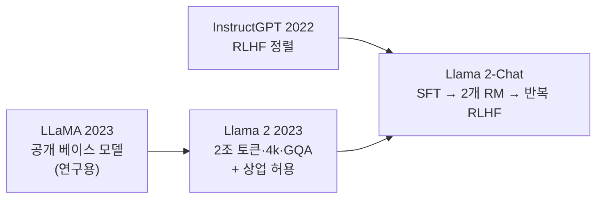
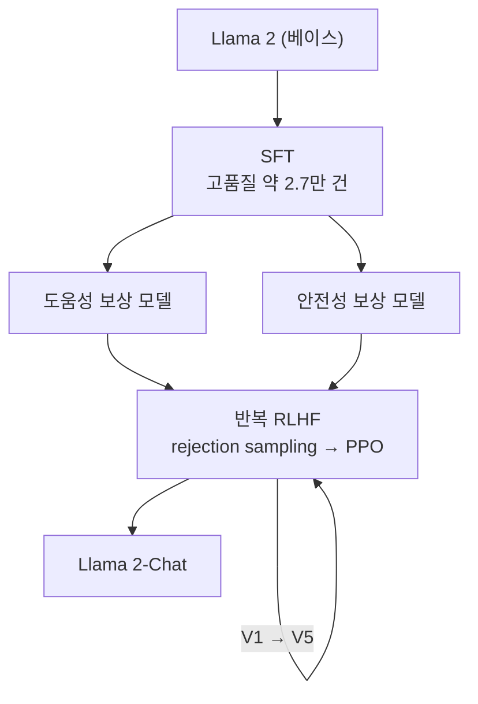
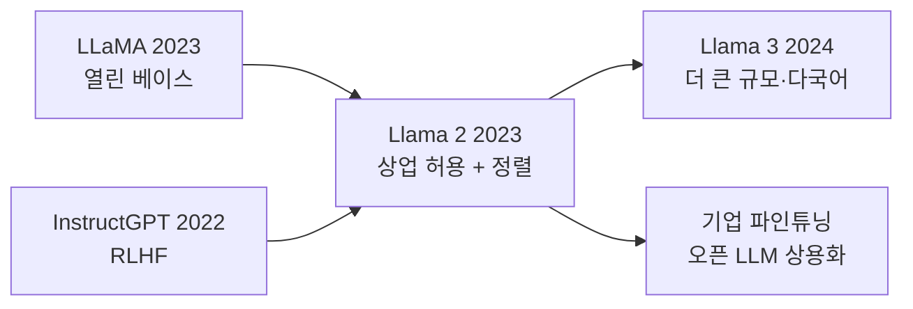

## Paper Info

- Title: Llama 2: Open Foundation and Fine-Tuned Chat Models
- Authors: Hugo Touvron, Louis Martin, Kevin Stone 외 (Meta GenAI)
- Year: 2023 (arXiv 2023년 7월)
- arXiv: https://arxiv.org/abs/2307.09288
- PDF: https://arxiv.org/pdf/2307.09288

## 한 줄 요약

Llama 2는 [LLaMA](/kb/2026-07-10-llama-paper-note)의 베이스 모델 계보와 [InstructGPT](/kb/2026-06-29-instructgpt-paper-note)의 RLHF 정렬을,
**상업적으로 써도 되는 하나의 제품급 오픈 모델**로 합친 논문입니다.
베이스 모델은 2조 토큰·4k 컨텍스트로 키우고, 대화 모델 **Llama 2-Chat**은 SFT 위에 **도움성(helpful)과 안전성(safety)을 나눈 두 개의 보상 모델**과 반복 RLHF로 정렬합니다.
핵심 결과는 이렇습니다. **Llama 2-Chat 70B가 사람 평가에서 ChatGPT(GPT-3.5)와 대등한 도움성을 보이면서 안전성은 더 낫고**, 가중치가 상업 이용까지 허용되며 공개됩니다.

## Llama 2를 이해하기 위한 기반 지식

Llama 2는 앞선 두 노트를 직접 잇습니다. [LLaMA](/kb/2026-07-10-llama-paper-note)에서 베이스 모델과 아키텍처를, [InstructGPT](/kb/2026-06-29-instructgpt-paper-note)에서 RLHF의 뼈대를 가져오면, 새로 잡을 것은 몇 가지뿐입니다.

| 기반 지식              | Llama 2에서 필요한 이유                                               | 먼저 볼 노트                                                   |
| ---------------------- | --------------------------------------------------------------------- | -------------------------------------------------------------- |
| LLaMA의 아키텍처·전략  | Llama 2의 베이스는 LLaMA(RMSNorm·SwiGLU·RoPE)를 그대로 키운 것입니다. | [LLaMA 논문 노트](/kb/2026-07-10-llama-paper-note)             |
| RLHF 3단계(SFT·RM·PPO) | Llama 2-Chat 파이프라인이 InstructGPT의 RLHF를 확장합니다.            | [InstructGPT 논문 노트](/kb/2026-06-29-instructgpt-paper-note) |
| GPT-3의 scaling        | "규모 대신 데이터·정렬"이라는 이 계열의 문제의식이 이어집니다.        | [GPT-3 논문 노트](/kb/2026-06-21-gpt-3-paper-note)             |
| Self-attention과 QKV   | GQA(그룹 쿼리 어텐션)를 이해하려면 key·value 캐시 개념이 필요합니다.  | [QKV 직관](/kb/2026-04-17-transformer-basics-qkv-intuition)    |

이 노트에서 새로 다루는 개념은 **GQA**, **두 개의 보상 모델(도움성·안전성)**, **rejection sampling과 PPO의 조합**, **GAtt(고스트 어텐션)** 입니다. 각각 필요한 자리에서 풀어 설명합니다.
최소 경로만 고르면 다음 순서가 좋습니다.

1. [LLaMA 논문 노트](/kb/2026-07-10-llama-paper-note)의 "아키텍처"와 "핵심 아이디어"
2. [InstructGPT 논문 노트](/kb/2026-06-29-instructgpt-paper-note)의 "핵심 아이디어: RLHF 3단계"
3. 이 노트의 "Llama 2-Chat: 정렬 파이프라인" 섹션

## 처음 읽는 사람을 위한 빠른 해설

[LLaMA](/kb/2026-07-10-llama-paper-note)는 공개 데이터로 강력한 **베이스 모델**을 만들었지만, 두 가지 아쉬움이 있었습니다. 연구용 라이선스라 상업적으로 쓸 수 없었고, 정렬(RLHF)을 거치지 않아 그대로는 지시를 잘 따르지 못했습니다.

Llama 2는 이 둘을 정면으로 채웁니다.
첫째, **상업 이용을 허용**합니다. 이 한 줄의 라이선스 변화가 오픈 LLM 생태계를 연구실 밖으로 끌어냅니다.
둘째, **정렬을 제품 수준으로 끝까지 밀어붙입니다.** [InstructGPT](/kb/2026-06-29-instructgpt-paper-note)가 세운 RLHF 레시피를, 실제 서비스에 낼 수 있을 만큼 정교하게 다듬은 것이 Llama 2-Chat입니다.

그 과정에서 InstructGPT와 갈라지는 선택이 나옵니다.
InstructGPT는 하나의 보상 모델로 "사람이 더 좋아하는 답"을 잡았지만, Llama 2는 보상 모델을 **둘로 나눕니다.** 하나는 "얼마나 도움이 되는가(helpfulness)", 다른 하나는 "얼마나 안전한가(safety)". 도움성과 안전성이 종종 충돌하기 때문에, 이를 한 점수에 억지로 섞지 않고 따로 학습해 조율합니다.

**핵심: Llama 2는 "열린 베이스 모델(LLaMA)"과 "정렬 레시피(InstructGPT)"를 상업 가능한 하나의 제품으로 합친 논문입니다.**

## 이 페이지를 읽는 추천 순서

1. 기반 지식 체크
2. 문제 정의 (열림 + 정렬 + 상업)
3. 베이스 모델의 변화 (2조 토큰 · 4k · GQA)
4. Llama 2-Chat: 정렬 파이프라인
5. 두 개의 보상 모델
6. 반복 RLHF: rejection sampling + PPO
7. GAtt와 안전성
8. 실험 결과 (ChatGPT와 대등)
9. 한계, 비교, 다음 논문

## 읽다가 막히기 쉬운 지점

첫 번째는 `베이스 모델`과 `Chat 모델`의 구분입니다.
**Llama 2**(베이스)는 다음 토큰 예측만 학습한 사전학습 모델이고, **Llama 2-Chat**은 그 위에 SFT와 RLHF를 얹어 대화용으로 정렬한 모델입니다. 논문의 무게는 대부분 Chat 쪽 정렬 과정에 실려 있습니다.

두 번째는 새 용어들입니다.

| 용어                         | 정확한 의미                                                                                            |
| ---------------------------- | ------------------------------------------------------------------------------------------------------ |
| GQA(Grouped-Query Attention) | 여러 query 헤드가 key·value 헤드를 **묶어 공유**합니다. KV 캐시를 줄여 큰 모델의 추론을 싸게 만듭니다. |
| 도움성/안전성 보상 모델      | "얼마나 돕는가"와 "얼마나 안전한가"를 **각각** 학습한 별도의 보상 모델 두 개입니다.                    |
| Rejection sampling           | 한 프롬프트에 답을 K개 뽑아, 보상 모델이 고른 **최고 답으로 다시 SFT**하는 방식입니다.                 |
| GAtt(Ghost Attention)        | 멀티턴 대화에서 초기 시스템 지시("항상 존댓말로")를 **여러 턴 뒤까지 기억**하게 돕는 학습 기법입니다.  |
| 마진(margin) 손실            | 두 답의 선호 차이가 클수록 점수 차도 크게 벌리도록 보상 모델에 넣는 항입니다.                          |

세 번째는 "왜 rejection sampling과 PPO를 둘 다 쓰나"입니다.
둘은 배타적이지 않습니다. 초반에는 여러 답 중 최고를 골라 다시 학습하는 rejection sampling으로 넓게 끌어올리고, 후반에는 PPO로 촘촘히 다듬습니다. RLHF는 한 번이 아니라 **V1~V5까지 반복**됩니다.

## 문제 정의

Llama 2가 붙잡은 문제는 세 겹입니다.

첫째, **개방성**입니다. 당시 가장 잘 정렬된 대화 모델(ChatGPT 등)은 비공개였습니다. Llama 2는 "**공개 가중치로도 제품급 대화 모델에 닿을 수 있는가**"를 묻습니다.

둘째, **상업적 사용 가능성**입니다. [LLaMA](/kb/2026-07-10-llama-paper-note)의 연구 전용 라이선스를 풀어, 기업이 실제 제품에 올릴 수 있게 합니다.

셋째, **도움성과 안전성의 양립**입니다. 정렬을 세게 걸면 모델이 지나치게 몸을 사려 쓸모가 줄기 쉽습니다. Llama 2는 이 둘을 함께 끌어올리는 방법을 찾습니다.

한 문장으로 줄이면 이렇습니다.

**"공개 가중치로, 상업적으로 쓸 수 있으면서, 도움성과 안전성을 함께 갖춘 대화 모델을 만들 수 있는가?"**

## 베이스 모델의 변화

Llama 2 베이스는 [LLaMA](/kb/2026-07-10-llama-paper-note)의 아키텍처(RMSNorm 프리노름·SwiGLU·RoPE)를 그대로 물려받되, 규모와 구조를 손봅니다.

| 축        | LLaMA (2023)   | Llama 2 (2023)                       |
| --------- | -------------- | ------------------------------------ |
| 학습 토큰 | 1.0T~1.4T      | **2.0T** (공개 데이터, 더 정제)      |
| 컨텍스트  | 2048           | **4096** (2배)                       |
| 어텐션    | MHA            | 34B·70B에 **GQA** 적용               |
| 공개 크기 | 7B·13B·33B·65B | 7B·13B·70B (34B는 학습했으나 미공개) |
| 라이선스  | 연구 전용      | **상업 이용 허용**                   |

특히 **GQA**가 중요합니다. query 헤드마다 따로 두던 key·value를 여러 헤드가 묶어 공유하면, 추론 때 들고 있어야 할 KV 캐시가 줄어 큰 모델을 더 싸게 서빙할 수 있습니다. "추론 비용"을 중시한 LLaMA의 철학이 구조 수준에서 이어진 셈입니다.

## Llama 2-Chat: 정렬 파이프라인

Llama 2-Chat은 베이스 모델을 다음 순서로 정렬합니다. 큰 틀은 [InstructGPT](/kb/2026-06-29-instructgpt-paper-note)의 RLHF와 같지만, 각 단계가 더 정교합니다.

1. **SFT** — 사람이 쓴 고품질 시연으로 지도학습합니다. 여기서 Llama 2는 "**양보다 질**"을 강조합니다. 수백만 건의 공개 지시 데이터보다, 엄선한 약 **2.7만 건**의 고품질 예시가 더 나았다고 보고합니다.
2. **보상 모델** — 사람의 선호 비교(약 **140만 건**)로 보상 모델을 학습합니다. 단, 하나가 아니라 **도움성·안전성 두 개**입니다.
3. **반복 RLHF** — 보상 모델을 채점자로 삼아 rejection sampling과 PPO로 정책을 개선합니다. 새 정책이 만든 답으로 다시 선호 데이터를 모아 V1부터 V5까지 반복합니다.

## 두 개의 보상 모델: 도움성과 안전성

Llama 2의 특징적인 선택입니다. 도움성과 안전성은 자주 부딪힙니다("폭탄 만드는 법"에는 안전하게 거절하는 게 맞지만, 그 태도가 무해한 질문까지 지나치게 회피하게 만들 수 있습니다). 하나의 점수로 섞으면 이 긴장이 뭉개집니다. 그래서 Llama 2는 보상 모델을 **둘로 나눕니다.**

- **도움성 RM** — 답이 얼마나 유용한지를 점수화합니다.
- **안전성 RM** — 답이 얼마나 안전한지를 점수화합니다.

두 가지 눈여겨볼 점이 있습니다.
첫째, 보상 모델을 **채팅 모델 체크포인트에서 초기화**합니다. 채점자가 모델이 아는 것을 똑같이 알아야, 그럴듯한 헛소리에 속아 점수를 잘못 주는 일(reward hacking)이 줄기 때문입니다.
둘째, 손실에 **마진(margin) 항**을 넣습니다. 사람이 "확실히 더 낫다"고 표시한 쌍은 점수 차를 더 크게 벌리도록 학습해, 선호의 강도까지 반영합니다.

## 반복 RLHF: rejection sampling + PPO

강화학습 단계는 두 알고리즘을 함께 씁니다.

- **Rejection sampling(거절 표집)** — 한 프롬프트에 답을 K개 생성하고, 보상 모델이 그중 최고를 고릅니다. 이 "최고 답"들을 모아 다시 SFT합니다. 주로 가장 큰 **70B**에서 표본을 뽑고, 그 품질을 작은 모델로 내려 보냅니다(distillation).
- **PPO** — [InstructGPT](/kb/2026-06-29-instructgpt-paper-note)와 같은 방식으로, 보상에서 원래 모델과의 KL 페널티를 뺀 목표를 최대화하며 촘촘히 다듬습니다.

핵심 관찰이 하나 있습니다. 잘 학습된 **보상 모델이 개별 사람 주석자보다 더 일관되게 좋은 답을 가려내는** 순간, 모델은 주석자 개개인의 실력을 넘어서기 시작합니다. RLHF가 단순한 "사람 흉내"가 아니라, 사람 선호의 신호를 증폭하는 장치임을 보여주는 대목입니다.

## GAtt와 안전성

**GAtt(Ghost Attention)** 는 멀티턴 대화의 고질적 문제를 다룹니다. "앞으로 계속 존댓말로 답해 줘" 같은 시스템 지시가 몇 턴만 지나면 잊히는 현상입니다. GAtt는 학습 데이터에서 초기 지시를 모든 턴에 걸쳐 유지하도록 손을 봐, 대화가 길어져도 지시가 살아 있게 만듭니다.

**안전성**은 이 논문이 특히 공을 들인 부분입니다. 안전 전용 SFT, 안전 RLHF, **컨텍스트 증류(context distillation)** — 안전 프리앰블을 붙여 만든 안전한 답을 프리앰블 없이도 내도록 학습하는 기법 — 에 더해, 대규모 레드팀을 돌립니다. 그 결과 도움성을 크게 잃지 않으면서 안전성을 끌어올립니다.

## 실험 결과: ChatGPT와 대등

가장 강한 결과는 사람 평가입니다.

- **Llama 2-Chat 70B는 도움성 사람 평가에서 ChatGPT(GPT-3.5)와 대등**하고, **안전성 평가에서는 더 낫습니다.** 공개 대화 모델(MPT·Falcon·Vicuna 등)은 뚜렷이 앞섭니다.
- 베이스 Llama 2도 학술 벤치마크에서 [LLaMA](/kb/2026-07-10-llama-paper-note) 1세대와 다른 오픈 베이스 모델을 앞섭니다.

다만 사람 평가에는 주의가 필요합니다. 평가 프롬프트 집합·주석자 구성에 결과가 흔들리고, 안전성 평가의 "안전"은 곧 "거절"과 얽히기 쉽습니다. 논문도 이 한계를 함께 적습니다.

## 한계와 조심해서 볼 지점

첫 번째, **라이선스는 완전한 오픈소스가 아닙니다.**
상업 이용은 허용되지만, 월 활성 사용자 7억 명이 넘는 서비스는 별도 라이선스가 필요하고, 허용 사용 정책(AUP)의 제약이 붙습니다.

두 번째, **여전히 영어 중심**입니다.
사전학습·정렬 데이터가 영어에 크게 치우쳐, 다른 언어의 성능·안전성은 고르지 않습니다.

세 번째, **안전성과 도움성의 절충은 계속 과제**입니다.
안전을 세게 걸수록 무해한 요청까지 회피하는 과잉 거절이 늘 수 있습니다. 두 보상 모델은 이 긴장을 관리할 뿐, 없애지는 못합니다.

네 번째, **hallucination과 지식 시점의 한계**가 남습니다. 정렬은 태도를 고칠 뿐, 없는 사실을 채워 주지는 않습니다.

## LLaMA·InstructGPT와 비교해서 읽기

| 축        | LLaMA (2023)      | InstructGPT (2022)     | Llama 2 (2023)                          |
| --------- | ----------------- | ---------------------- | --------------------------------------- |
| 초점      | 열린 베이스 모델  | RLHF 정렬 레시피       | 둘을 합친 제품급 오픈 대화 모델         |
| 정렬      | 없음(베이스)      | SFT → 1개 RM → PPO     | SFT → **2개 RM** → rejection + PPO 반복 |
| 보상 모델 | —                 | 하나                   | **도움성·안전성 둘**                    |
| 라이선스  | 연구 전용         | 비공개(API)            | **상업 이용 허용**                      |
| 대표 결과 | 13B가 175B를 이김 | 1.3B가 175B보다 선호됨 | 70B-Chat이 ChatGPT와 대등               |

## 왜 지금도 중요한가

첫 번째, **상업 가능한 오픈 LLM의 기준선**입니다.
Llama 2 이후 수많은 기업이 자체 데이터로 파인튜닝한 모델을 제품에 올렸습니다. "오픈 가중치를 받아 내 서비스에 정렬한다"는 흐름이 여기서 대중화됩니다.

두 번째, **정렬 파이프라인의 공개 교과서**입니다.
두 개의 보상 모델, rejection sampling과 PPO의 조합, GAtt, 안전 컨텍스트 증류까지 — 이후 오픈 모델들이 참고하는 정렬 레시피의 상당 부분이 이 논문에서 정리됩니다.

세 번째, **Llama 3로 이어지는 뼈대**입니다.
2조 토큰·4k·GQA·2단계 정렬이라는 골격은 이후 Llama 계열의 출발점이 됩니다.

## 읽고 남길 메모

- Llama 2 = [LLaMA](/kb/2026-07-10-llama-paper-note)의 열린 베이스 + [InstructGPT](/kb/2026-06-29-instructgpt-paper-note)의 RLHF + 상업 라이선스.
- 베이스 변화의 핵심은 2조 토큰·4k 컨텍스트, 그리고 큰 모델의 추론을 싸게 하는 GQA입니다.
- 보상 모델을 도움성·안전성 **둘로 나눈** 것이 InstructGPT와 갈라지는 지점입니다.
- 강화학습은 rejection sampling(넓게)과 PPO(촘촘히)를 V1~V5까지 반복합니다.
- 보상 모델이 개별 주석자를 넘어설 때, 모델은 사람 주석의 한계를 넘어서기 시작합니다.
- 상업 이용 허용이 오픈 LLM을 연구실 밖 제품으로 끌어낸 결정적 변화였습니다.

## 다음에 읽을 논문

- Llama 3 (2024): The Llama 3 Herd of Models — 규모·다국어·컨텍스트를 크게 키운 후속
- DPO (2023): Direct Preference Optimization — 보상 모델·PPO 없이 선호를 직접 최적화하는 대안
- [InstructGPT (2022)](/kb/2026-06-29-instructgpt-paper-note) · [LLaMA (2023)](/kb/2026-07-10-llama-paper-note) — 이 노트가 딛고 선 두 축을 다시 보기
