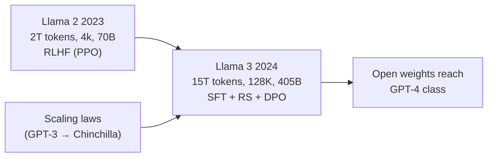
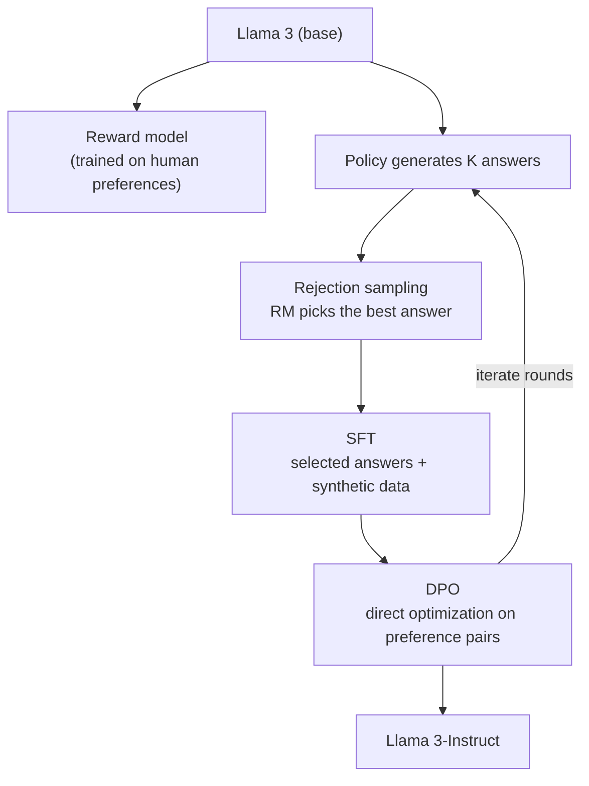
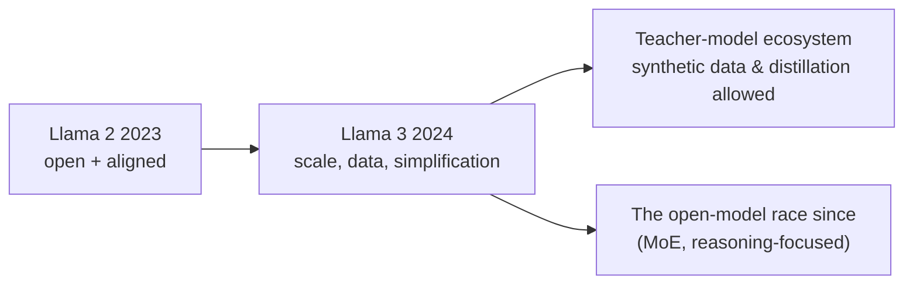

## Paper Info

- Title: The Llama 3 Herd of Models
- Authors: Llama Team, AI @ Meta (Aaron Grattafiori, Abhimanyu Dubey, and others)
- Year: 2024 (arXiv July 2024)
- arXiv: https://arxiv.org/abs/2407.21783
- PDF: https://arxiv.org/pdf/2407.21783

## One-Line Summary

Llama 3 takes the skeleton [Llama 2](/kb/2026-07-13-llama-2-paper-note) established and **pushes it all the way on scale and data.**
Pretraining tokens go from about 2T to **15T**, context from 4k to **128K**, the flagship from 70B to **405B** — and yet the architecture and alignment get **simpler**, not fancier: a dense Transformer instead of MoE, and iterative **SFT → rejection sampling → DPO** instead of PPO.
The headline result: **Llama 3.1 405B is on par with GPT-4-class models across many benchmarks and human evals**, with the weights released. It's the moment an open-weight model first reaches the frontier.

## Background Knowledge for Reading Llama 3

Llama 3 is the direct successor to the previous notes. Take the base model and alignment pipeline from [Llama 2](/kb/2026-07-13-llama-2-paper-note), and what's genuinely new is the methodology for handling scale.

| Background                            | Why Llama 3 needs it                                                               | Note to read first                                               |
| ------------------------------------- | ---------------------------------------------------------------------------------- | ---------------------------------------------------------------- |
| Llama 2's base and alignment pipeline | Llama 3 extends Llama 2's skeleton (GQA, SFT, reward model, rejection sampling).   | [Llama 2 paper notes](/kb/2026-07-13-llama-2-paper-note)         |
| LLaMA's architecture                  | The dense Transformer built on RMSNorm, SwiGLU, and RoPE carries straight through. | [LLaMA paper notes](/kb/2026-07-10-llama-paper-note)             |
| The RLHF skeleton (SFT, RM, PPO)      | To see why Llama 3 **drops** PPO for DPO, you need the original recipe.            | [InstructGPT paper notes](/kb/2026-06-29-instructgpt-paper-note) |
| GPT-3 scaling                         | Using scaling laws to size a flagship model starts here.                           | [GPT-3 paper notes](/kb/2026-06-21-gpt-3-paper-note)             |

The genuinely new concepts in this note are **DPO**, **sizing models with scaling laws**, **staged long-context extension**, **annealing**, and **synthetic-data-centric post-training** — each explained where it's needed.
For the minimum path:

1. The "Alignment Pipeline" section of the [Llama 2 paper notes](/kb/2026-07-13-llama-2-paper-note)
2. This note's "Design Philosophy: Managing Complexity" section
3. This note's "Alignment Pipeline: SFT → Rejection Sampling → DPO" section

## A Quick Walkthrough for First-Time Readers

[Llama 2](/kb/2026-07-13-llama-2-paper-note) delivered a commercially usable open chat model, but the gap to the frontier remained. Against GPT-4-class models it was short on scale, data, and context all at once.

Llama 3 closes that gap **head-on.**
First, it grows the data to **15T tokens** — and not just in volume: deduplication, quality filtering, and the domain mix (much more math and code) are all redesigned as a pipeline.
Second, it grows the compute budget roughly **50×** (3.8×10²⁵ FLOPs) and places the 405B flagship where the scaling laws point.

The interesting part: as everything scales up, **the structure and algorithms get deliberately simpler.** The paper names its own principle — "**managing complexity.**" Even with MoE in fashion, it keeps a training-stable dense model; even with PPO as the standard, it picks the simpler, more stable DPO. On a run that occupies sixteen thousand GPUs for the better part of two months, **not failing** is worth more than a marginal performance ceiling.

**The point: Llama 3 doesn't win with new ideas — it completes a proven skeleton through scale, data, and engineering, and puts an open model on the frontier.**

## Suggested Reading Order for This Page

1. Background knowledge check
2. Problem definition (taking open models to the frontier)
3. Design philosophy: managing complexity
4. What changed in the base model (15T tokens, 405B, 128K)
5. The data pipeline and scaling laws
6. Alignment pipeline: SFT → rejection sampling → DPO
7. Results (on par with GPT-4)
8. Limitations, comparisons, what to read next

## Where First-Time Readers Get Stuck

The first is the distinction between `Llama 3` and `Llama 3.1`.
The 8B and 70B shipped first in April 2024 (with 8k context); the July paper accompanies **Llama 3.1, which adds the 405B and 128K context.** The paper effectively covers the whole 3.1-generation "herd."

The second is the new vocabulary.

| Term                                 | What it actually means                                                                                                                                                |
| ------------------------------------ | --------------------------------------------------------------------------------------------------------------------------------------------------------------------- |
| DPO (Direct Preference Optimization) | Instead of chasing a reward-model score with reinforcement learning, it fine-tunes the policy **directly on preference pairs** (good answer vs. bad).                 |
| compute-optimal / overtraining       | Compute-optimal is the model/data split that minimizes loss for a given budget. Training a small model **far past** that point (overtraining) buys cheaper inference. |
| Annealing                            | The final stretch of pretraining where the learning rate decays to zero while **the share of high-quality data is raised.**                                           |
| Staged long-context extension        | Rather than jumping from 8K to 128K at once, context grows **in six stages**, letting the model adapt at each step.                                                   |
| Llama Guard                          | A **separate safety classifier** that inspects inputs and outputs from outside the model — system-level safety, independent of alignment.                             |

The third is "why drop PPO?"
Not for lack of performance. At this scale, PPO's complicated training loop — running policy, reward model, and value function together — comes back as **instability and debugging cost.** Llama 3 keeps the reward model only as the judge for rejection sampling and simplifies preference learning to DPO. It's the "managing complexity" principle applied all the way down to algorithm choice.

## Problem Definition

Llama 3 takes on a single problem — a heavy one.

**"Can an open-weight model reach parity with GPT-4-class frontier models?"**

Open models through [Llama 2](/kb/2026-07-13-llama-2-paper-note) were "best at their size," but the absolute gap to the frontier was undeniable. Llama 3 aims to erase the gap itself, scaling three axes at once: **data quantity and quality** (15T tokens, a curation pipeline), **scale** (405B, 3.8×10²⁵ FLOPs), and **context** (128K).

## Design Philosophy: Managing Complexity

This is the design principle the paper states outright: choose not the highest-performing candidate technique, but **the technique that runs reliably at scale.**

- **A dense Transformer instead of MoE** — a mixture-of-experts might buy more performance per FLOP, but training stability and infrastructure complexity keep the standard dense architecture in place.
- **SFT + rejection sampling + DPO instead of PPO** — removing the RL loop simplifies alignment.
- As a result, the novelty concentrates not in architecture but in **data, scale, and engineering.**

The 405B run occupied an H100 cluster on the order of sixteen thousand GPUs for close to two months, and the paper even **publishes its failure analysis** (most unexpected interruptions traced to hardware). At this scale, a pipeline that doesn't die mid-run _is_ performance.

## What Changed in the Base Model

The Llama 3 base keeps the dense architecture inherited from [LLaMA](/kb/2026-07-10-llama-paper-note) (RMSNorm pre-norm, SwiGLU, RoPE) and grows every axis of scale.

| Axis      | Llama 2 (2023)              | Llama 3 / 3.1 (2024)                         |
| --------- | --------------------------- | -------------------------------------------- |
| Tokens    | ~2T                         | **~15T** (more multilingual, math, and code) |
| Context   | 4096                        | **128K** (staged extension)                  |
| Sizes     | 7B, 13B, 70B                | 8B, 70B, **405B**                            |
| Attention | GQA on 34B/70B              | **GQA at every size** (8 KV heads)           |
| Tokenizer | 32K SentencePiece           | **128K** vocabulary (tiktoken-based)         |
| RoPE      | default θ                   | **θ=500,000** (for long context)             |
| Alignment | SFT → 2 RMs → iterative PPO | SFT → rejection sampling → **DPO**, iterated |

Pretraining runs in three phases: standard pretraining (8K context) → **six-stage long-context extension** (up to 128K, verifying short-context performance holds at each step) → **annealing** (raising the share of high-quality data as the learning rate decays, with checkpoint averaging).

Scaling laws drive the size decisions too. The 405B sits roughly at the compute-optimal point for the budget, while **the 8B and 70B are deliberately trained far past it (overtrained).** Paying more in training to make small models better at cheap inference — the "inference cost first" philosophy running straight from [LLaMA](/kb/2026-07-10-llama-paper-note).

## Data: 15T Tokens and the Quality Pipeline

Llama 3's biggest investment is data.

- **Curation** — deduplication at the URL, document, and line level, heuristic filters, and **model-based quality classifiers** that pick out documents worth learning from.
- **The mix** — roughly half general knowledge, with **the shares of math/reasoning and code raised substantially**, and multilingual data managed as its own track. The mix ratios themselves are chosen through scaling experiments.
- **Using annealing** — the final phase doubles as a measurement tool: a small amount of high-quality data measurably lifts benchmarks.

## Alignment Pipeline: SFT → Rejection Sampling → DPO

Llama 3-Instruct is built by repeating the following loop over **multiple rounds.**

1. **Reward model** — trained on human preference comparisons, but unlike [Llama 2](/kb/2026-07-13-llama-2-paper-note) it is no longer the judge for reinforcement learning; it serves as **the selector that picks good answers during rejection sampling.**
2. **SFT** — supervised fine-tuning on the selected answers plus **large volumes of synthetic data** (code, math, multilingual, long-context, tool use). Where earlier generations centered on human demonstrations, here much of the data is generated by models and filtered by models.
3. **DPO** — fine-tunes the policy directly on preference pairs. The paper reports that at this scale it is effective enough without PPO, and far more stable.

Capability-specific tracks plug into this loop: code data filtered with execution feedback, tool use (search, a code interpreter, and more), and dedicated long-context data. Safety is handled in two layers — safety data inside alignment, and the **Llama Guard** classifier outside the model.

## Results: On Par with GPT-4

- **Llama 3.1 405B lands in the same class as GPT-4, GPT-4o, and Claude 3.5 Sonnet** across a broad set of benchmarks (knowledge, math, code, reasoning) — winning some, losing some. Parity in the literal sense.
- **The 8B and 70B clearly lead open models of their size** — the payoff of the overtraining strategy.
- In human evals, 405B-Instruct trades wins roughly evenly with the frontier models.
- The license opens one step further too: **using Llama 3's outputs to improve other models (synthetic data, distillation) is now permitted**, which quickly turns the 405B into the open ecosystem's teacher model.

The paper also describes **compositional multimodal experiments** — image, video, and speech attached via adapters — but at this point they are reported as under development, not released.

## Limitations and Things to Watch

First, **the 405B is open but heavy.**
Open weights and servable weights are different things. Even with FP8 inference, it takes multiple top-end GPUs, so practical use centers on the 8B and 70B (and distillations of the 405B).

Second, **"parity" moves with the evaluation frame.**
Benchmark contamination, eval-set selection, and human-eval prompt composition can each flip the ordering. The paper includes its own contamination analysis.

Third, **multilinguality expanded but remains English-centric.**
The multilingual share grew, but at around 8% of the mix, quality still varies across languages.

Fourth, **the cost of insisting on dense.**
MoE models of the same period start matching similar performance with less active compute. "Managing complexity" buys training stability — it is not the optimum for inference efficiency.

## Reading It Against Llama 2

| Axis          | Llama 2 (2023)                           | Llama 3 / 3.1 (2024)                         |
| ------------- | ---------------------------------------- | -------------------------------------------- |
| Goal          | A commercially usable open chat model    | **Taking an open model to the frontier**     |
| Tokens        | ~2T                                      | ~15T                                         |
| Flagship      | 70B                                      | **405B**                                     |
| Context       | 4k                                       | **128K**                                     |
| Alignment     | SFT → 2 RMs → rejection + PPO, iterated  | SFT → rejection sampling → **DPO**, iterated |
| Data's center | Human annotation (1.4M preference pairs) | **Synthetic data + model-based filtering**   |
| Headline      | 70B-Chat on par with ChatGPT (3.5)       | **405B on par with GPT-4 class**             |

## Why It Still Matters

First, it's **the first time open weights reached the frontier.**
The assumption that "open models run a generation behind" breaks here, and the baseline for the open-model race moves up to GPT-4 class.

Second, it's **the methodology textbook for the era of scale.**
Size the model with scaling laws, invest in the data pipeline, keep the algorithms simple — "**a proven skeleton × scale, over new ideas**" gets its most complete public write-up in this paper.

Third, it marks **alignment's shift in center of gravity.**
From PPO-centric RLHF to rejection sampling + DPO and synthetic-data-driven post-training — a recipe many open models have followed since.

## Notes to Take Away

- Llama 3 = [Llama 2](/kb/2026-07-13-llama-2-paper-note)'s skeleton × (15T tokens · 405B · 128K), with **simpler alignment.**
- The design principle is "managing complexity" — dense over MoE, DPO over PPO. At this scale, stability is performance.
- Overtraining the 8B and 70B trades training cost for inference cost — the philosophy running since LLaMA.
- The reward model's role shifts from "RL judge" to "rejection-sampling selector."
- Data's center of gravity moves from human annotation to **synthetic generation + model-based filtering.**
- The output-use license turns the 405B into the open ecosystem's teacher model.

## What to Read Next

- DPO (2023): Direct Preference Optimization — the original paper behind Llama 3's core alignment tool
- Chinchilla (2022): Training Compute-Optimal Large Language Models — the reference point for splitting budget between size and data
- [Llama 2 (2023)](/kb/2026-07-13-llama-2-paper-note) · [LLaMA (2023)](/kb/2026-07-10-llama-paper-note) — revisit the lineage this note stands on
