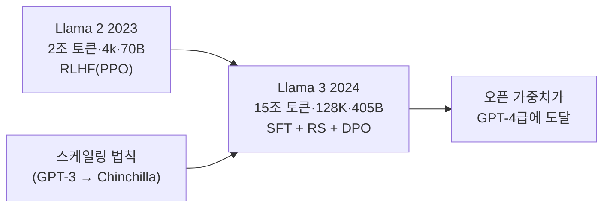
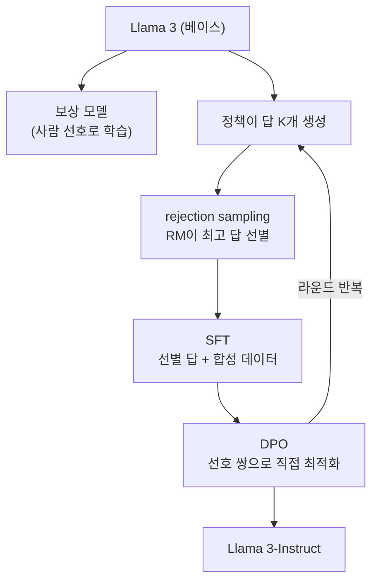
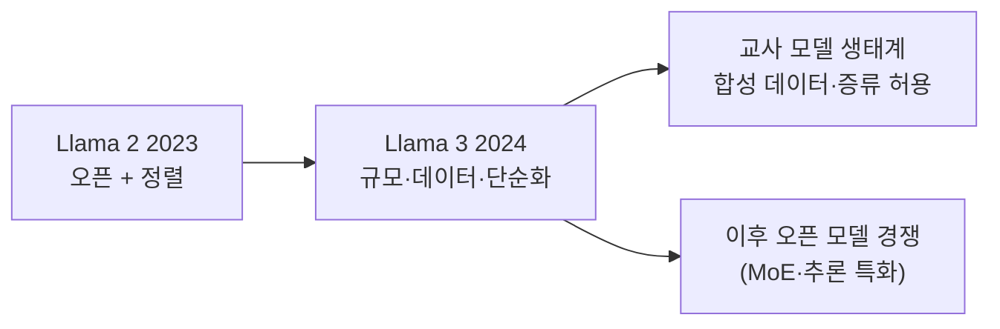

## Paper Info

- Title: The Llama 3 Herd of Models
- Authors: Llama Team, AI @ Meta (Aaron Grattafiori, Abhimanyu Dubey 외)
- Year: 2024 (arXiv 2024년 7월)
- arXiv: https://arxiv.org/abs/2407.21783
- PDF: https://arxiv.org/pdf/2407.21783

## 한 줄 요약

Llama 3는 [Llama 2](/kb/2026-07-13-llama-2-paper-note)가 세운 골격을 **규모와 데이터로 끝까지 밀어붙인** 논문입니다.
사전학습 토큰을 약 2조에서 **15조**로, 컨텍스트를 4k에서 **128K**로, 플래그십을 70B에서 **405B**로 키우면서도,
아키텍처와 정렬은 오히려 **단순한 쪽**을 고릅니다. MoE 대신 밀집(dense) Transformer, PPO 대신 **SFT → rejection sampling → DPO** 반복입니다.
핵심 결과는 이렇습니다. **Llama 3.1 405B가 여러 벤치마크와 사람 평가에서 GPT-4급 모델들과 대등**하며, 그 가중치가 공개됩니다. 오픈 가중치 모델이 최전선(frontier)에 처음 닿은 순간입니다.

## Llama 3를 이해하기 위한 기반 지식

Llama 3는 앞선 노트들의 직계 후속입니다. [Llama 2](/kb/2026-07-13-llama-2-paper-note)에서 베이스와 정렬 파이프라인의 큰 틀을 가져오면, 새로 잡을 것은 규모를 다루는 방법론입니다.

| 기반 지식                        | Llama 3에서 필요한 이유                                                      | 먼저 볼 노트                                                   |
| -------------------------------- | ---------------------------------------------------------------------------- | -------------------------------------------------------------- |
| Llama 2의 베이스·정렬 파이프라인 | Llama 3는 Llama 2의 골격(GQA·SFT·보상 모델·rejection sampling)의 확장입니다. | [Llama 2 논문 노트](/kb/2026-07-13-llama-2-paper-note)         |
| LLaMA의 아키텍처                 | RMSNorm·SwiGLU·RoPE 기반 밀집 Transformer가 그대로 이어집니다.               | [LLaMA 논문 노트](/kb/2026-07-10-llama-paper-note)             |
| RLHF의 뼈대(SFT·RM·PPO)          | Llama 3가 PPO를 **버리고** DPO를 고른 이유를 이해하려면 원형이 필요합니다.   | [InstructGPT 논문 노트](/kb/2026-06-29-instructgpt-paper-note) |
| GPT-3의 scaling                  | 스케일링 법칙으로 플래그십 크기를 정하는 방법론이 여기서 출발합니다.         | [GPT-3 논문 노트](/kb/2026-06-21-gpt-3-paper-note)             |

이 노트에서 새로 다루는 개념은 **DPO**, **스케일링 법칙으로 모델 크기 정하기**, **단계적 long-context 확장**, **어닐링(annealing)**, **합성 데이터 중심의 후처리** 입니다. 각각 필요한 자리에서 풀어 설명합니다.
최소 경로만 고르면 다음 순서가 좋습니다.

1. [Llama 2 논문 노트](/kb/2026-07-13-llama-2-paper-note)의 "정렬 파이프라인" 섹션
2. 이 노트의 "설계 철학: 관리 가능한 복잡도" 섹션
3. 이 노트의 "정렬 파이프라인: SFT → rejection sampling → DPO" 섹션

## 처음 읽는 사람을 위한 빠른 해설

[Llama 2](/kb/2026-07-13-llama-2-paper-note)는 상업 가능한 오픈 대화 모델을 만들었지만, 최전선과의 격차는 남아 있었습니다. GPT-4급 모델들과 견주기엔 규모·데이터·컨텍스트가 모두 부족했습니다.

Llama 3는 이 격차를 **정공법으로** 메웁니다.
첫째, **데이터를 15조 토큰으로** 늘리되, 양만 늘리는 게 아니라 중복 제거·품질 필터링·도메인 배합(수학·코드 비중 확대)까지 파이프라인 전체를 다시 설계합니다.
둘째, **연산 예산을 Llama 2의 약 50배**(3.8×10²⁵ FLOPs)로 키워, 스케일링 법칙이 가리키는 지점에 405B 플래그십을 놓습니다.

흥미로운 것은, 규모를 키우면서 **구조와 알고리즘은 단순한 쪽을 고른다**는 점입니다. 논문이 스스로 밝힌 원칙이 "**관리 가능한 복잡도(managing complexity)**"입니다. MoE가 유행이어도 학습이 안정적인 밀집 모델을, PPO가 표준이어도 더 단순하고 안정적인 DPO를 선택합니다. GPU 1만 6천 장으로 두 달 가까이 이어지는 학습에서는, 성능을 조금 더 끌어올리는 것보다 **중간에 실패하지 않는 것**이 훨씬 중요하기 때문입니다.

**핵심: Llama 3는 새 아이디어로 이긴 논문이 아니라, 검증된 골격을 규모·데이터·엔지니어링으로 완성해 오픈 모델을 최전선에 올린 논문입니다.**

## 이 페이지를 읽는 추천 순서

1. 기반 지식 체크
2. 문제 정의 (오픈 모델로 최전선에)
3. 설계 철학: 관리 가능한 복잡도
4. 베이스 모델의 변화 (15조 토큰 · 405B · 128K)
5. 데이터 파이프라인과 스케일링 법칙
6. 정렬 파이프라인: SFT → rejection sampling → DPO
7. 실험 결과 (GPT-4와 대등)
8. 한계, 비교, 다음 논문

## 읽다가 막히기 쉬운 지점

첫 번째는 `Llama 3`와 `Llama 3.1`의 구분입니다.
2024년 4월에 8B·70B가 먼저 나오고(8k 컨텍스트), 7월 논문과 함께 **405B와 128K 컨텍스트를 갖춘 Llama 3.1**이 공개됩니다. 이 논문이 다루는 것은 사실상 Llama 3.1 세대 전체("herd")입니다.

두 번째는 새 용어들입니다.

| 용어                                | 정확한 의미                                                                                                                                               |
| ----------------------------------- | --------------------------------------------------------------------------------------------------------------------------------------------------------- |
| DPO(Direct Preference Optimization) | 보상 모델 점수를 강화학습으로 좇는 대신, **선호 쌍(좋은 답 vs 나쁜 답)으로 직접** 정책을 미세조정하는 방법입니다.                                         |
| compute-optimal / 과학습            | 주어진 연산 예산에서 손실이 최소가 되는 모델·데이터 크기 조합이 compute-optimal입니다. 작은 모델을 그보다 **훨씬 오래** 학습하면(과학습) 추론이 싸집니다. |
| 어닐링(annealing)                   | 사전학습 마지막에 학습률을 0까지 줄이며 **고품질 데이터의 비중을 높여** 마무리하는 단계입니다.                                                            |
| 단계적 long-context 확장            | 8K에서 128K로 한 번에 늘리지 않고, **여섯 단계**에 걸쳐 컨텍스트를 점진적으로 키우며 적응시키는 학습입니다.                                               |
| Llama Guard                         | 모델 밖에서 입출력을 검사하는 **별도의 안전 분류기**입니다. 정렬과 별개로 시스템 수준 안전을 맡습니다.                                                    |

세 번째는 "왜 PPO를 버렸나"입니다.
성능이 부족해서가 아닙니다. 이 규모에서는 PPO의 복잡한 학습 루프(정책·보상 모델·가치 함수의 동시 운용)가 **불안정성과 디버깅 비용**으로 돌아옵니다. Llama 3는 보상 모델을 rejection sampling의 채점자로만 쓰고, 선호 학습은 DPO로 단순화합니다. "관리 가능한 복잡도" 원칙이 알고리즘 선택에까지 적용된 사례입니다.

## 문제 정의

Llama 3가 붙잡은 문제는 하나입니다. 다만 무겁습니다.

**"오픈 가중치 모델이 GPT-4급 최전선 모델과 대등해질 수 있는가?"**

[Llama 2](/kb/2026-07-13-llama-2-paper-note)까지의 오픈 모델은 "같은 크기에서는 최고"였지만, 최전선과의 절대 격차는 인정해야 했습니다. Llama 3는 그 격차 자체를 없애는 것을 목표로 삼고, 이를 위해 세 축을 동시에 키웁니다. **데이터의 양과 질**(15조 토큰·정제 파이프라인), **규모**(405B·3.8×10²⁵ FLOPs), **컨텍스트**(128K)입니다.

## 설계 철학: 관리 가능한 복잡도

논문이 명시한 설계 원칙입니다. 성능이 가장 좋아 보이는 기법이 아니라, **이 규모에서도 안정적으로 굴러가는 기법**을 고릅니다.

- **MoE 대신 밀집 Transformer** — 전문가 혼합(MoE)이 같은 연산으로 더 높은 성능을 줄 수 있지만, 학습 안정성과 인프라 복잡도를 이유로 표준적인 밀집 구조를 유지합니다.
- **PPO 대신 SFT + rejection sampling + DPO** — 강화학습 루프를 없애 정렬 단계를 단순화합니다.
- 그 결과 새로운 시도는 구조가 아니라 **데이터·규모·엔지니어링**에 집중됩니다.

405B 학습은 1만 6천 장 규모의 H100 클러스터에서 두 달 가까이 이어졌고, 논문은 그 기간의 **장애 분석까지 공개**합니다(예기치 못한 중단의 대부분이 하드웨어 문제였습니다). 이 규모에서는 "중간에 멈추지 않는 파이프라인"이 곧 성능이라는 것을 보여주는 대목입니다.

## 베이스 모델의 변화

Llama 3 베이스는 [LLaMA](/kb/2026-07-10-llama-paper-note)에서 이어진 밀집 구조(RMSNorm 프리노름·SwiGLU·RoPE)를 유지하되, 규모의 축을 전부 키웁니다.

| 축         | Llama 2 (2023)        | Llama 3 / 3.1 (2024)                     |
| ---------- | --------------------- | ---------------------------------------- |
| 학습 토큰  | 약 2조                | **약 15조** (다국어·수학·코드 비중 확대) |
| 컨텍스트   | 4096                  | **128K** (단계적 확장)                   |
| 공개 크기  | 7B·13B·70B            | 8B·70B·**405B**                          |
| 어텐션     | 34B·70B에 GQA         | **전 크기 GQA** (8 KV 헤드)              |
| 토크나이저 | 32K SentencePiece     | **128K** 어휘 (tiktoken 기반)            |
| RoPE       | 기본 θ                | **θ=500,000** (긴 컨텍스트 대응)         |
| 정렬       | SFT → 2 RM → PPO 반복 | SFT → rejection sampling → **DPO** 반복  |

사전학습은 세 단계로 진행됩니다. 표준 사전학습(8K 컨텍스트) → **여섯 단계의 long-context 확장**(짧은 컨텍스트 성능이 떨어지지 않는지 확인하며 128K까지 점진적으로 확장) → **어닐링**(고품질 데이터 비중을 높이고 학습률을 줄이며 마무리, 체크포인트 평균).

크기 배분에도 스케일링 법칙이 쓰입니다. 405B는 예산에서 대략 compute-optimal한 지점이고, **8B·70B는 일부러 그보다 훨씬 오래(과학습)** 학습합니다. 학습 비용을 더 내더라도 추론이 싼 작은 모델의 품질을 끌어올리는, [LLaMA](/kb/2026-07-10-llama-paper-note)부터 이어진 "추론 비용 우선" 철학입니다.

## 데이터: 15조 토큰과 품질 파이프라인

Llama 3의 가장 큰 투자는 데이터입니다.

- **정제** — URL·문서·행 수준의 중복 제거, 휴리스틱 필터에 더해, **모델 기반 품질 분류기**로 학습 가치가 높은 문서를 고릅니다.
- **배합** — 일반 지식 약 절반에, **수학·추론과 코드의 비중을 크게 높이고**, 다국어 데이터를 별도 트랙으로 관리합니다. 배합 비율 자체를 스케일링 실험으로 고릅니다.
- **어닐링 활용** — 마무리 단계에서 고품질 데이터의 효과를 측정해, 소량의 좋은 데이터가 벤치마크를 유의미하게 끌어올린다는 것을 확인합니다.

## 정렬 파이프라인: SFT → rejection sampling → DPO

Llama 3-Instruct는 다음 루프를 **여러 라운드** 반복해 만듭니다.

1. **보상 모델** — 사람의 선호 비교로 학습합니다. 단, [Llama 2](/kb/2026-07-13-llama-2-paper-note)처럼 강화학습의 채점자가 아니라, **rejection sampling에서 좋은 답을 고르는 선별자**로 씁니다.
2. **SFT** — 선별된 답과 **대량의 합성 데이터**(코드·수학·다국어·긴 컨텍스트·도구 사용)로 지도학습합니다. 사람 시연 중심이던 이전 세대와 달리, 데이터의 큰 몫을 모델이 만들고 모델이 거릅니다.
3. **DPO** — 선호 쌍으로 정책을 직접 미세조정합니다. PPO 없이도 이 규모에서는 충분히 효과적이고 훨씬 안정적이라고 보고합니다.

이 루프에 **능력별 트랙**이 더해집니다. 코드 실행 피드백으로 코드 데이터를 거르고, 도구 사용(검색·코드 인터프리터 등)을 학습하고, 긴 컨텍스트용 데이터를 따로 만듭니다. 안전은 정렬 안의 안전 데이터와, 모델 밖의 **Llama Guard** 분류기 두 겹으로 다룹니다.

## 실험 결과: GPT-4와 대등

- **Llama 3.1 405B는 광범위한 벤치마크(지식·수학·코드·추론)에서 GPT-4, GPT-4o, Claude 3.5 Sonnet과 대등한 급**으로 평가됩니다. 항목별로 이기고 지는 것이 섞이는, 문자 그대로의 "동급"입니다.
- **8B·70B는 같은 크기의 오픈 모델을 뚜렷이 앞섭니다.** 과학습 전략이 작은 모델의 체급을 올린 결과입니다.
- 사람 평가에서도 405B-Instruct는 최전선 모델들과 승률이 비슷하게 나옵니다.
- 라이선스도 한 걸음 더 열립니다. **Llama 3의 출력으로 다른 모델을 개선하는 것(합성 데이터·증류)이 허용**되어, 405B는 곧 오픈 생태계의 "교사 모델"이 됩니다.

논문은 이미지·영상·음성을 어댑터로 붙이는 **조합형 멀티모달 실험**도 소개하지만, 이 시점에는 공개하지 않고 개발 중이라고만 밝힙니다.

## 한계와 조심해서 볼 지점

첫 번째, **405B는 공개되어도 무겁습니다.**
가중치가 열려 있다는 것과 서빙할 수 있다는 것은 다릅니다. FP8 추론 등으로 낮춰도 최상급 GPU가 여러 장 필요해, 실사용의 중심은 8B·70B, 그리고 405B를 증류한 모델들입니다.

두 번째, **"대등"은 평가 프레임에 따라 흔들립니다.**
벤치마크 오염 가능성, 평가 세트 선택, 사람 평가의 프롬프트 구성에 따라 우열이 뒤집힐 수 있습니다. 논문도 벤치마크 오염 분석을 따로 싣습니다.

세 번째, **다국어는 확장되었지만 여전히 영어 중심**입니다.
다국어 토큰 비중은 커졌지만 전체 배합의 8% 수준이라, 언어 간 품질 편차가 남습니다.

네 번째, **밀집 구조를 고집한 비용**입니다.
같은 시기 MoE 모델들은 더 적은 활성 연산으로 비슷한 성능을 내기 시작합니다. "관리 가능한 복잡도"는 학습 안정성의 이득이지, 추론 효율의 최적해는 아닙니다.

## Llama 2와 비교해서 읽기

| 축          | Llama 2 (2023)                    | Llama 3 / 3.1 (2024)                    |
| ----------- | --------------------------------- | --------------------------------------- |
| 목표        | 상업 가능한 오픈 대화 모델        | **오픈 모델로 최전선 도달**             |
| 학습 토큰   | 약 2조                            | 약 15조                                 |
| 플래그십    | 70B                               | **405B**                                |
| 컨텍스트    | 4k                                | **128K**                                |
| 정렬        | SFT → 2 RM → rejection + PPO 반복 | SFT → rejection sampling → **DPO** 반복 |
| 데이터의 축 | 사람 주석(선호 140만 건)          | **합성 데이터 + 모델 기반 필터링**      |
| 대표 결과   | 70B-Chat이 ChatGPT(3.5)와 대등    | **405B가 GPT-4급과 대등**               |

## 왜 지금도 중요한가

첫 번째, **오픈 가중치가 최전선에 닿은 첫 사례**입니다.
"오픈 모델은 한 세대 뒤진다"는 통념이 여기서 깨집니다. 이후 오픈 모델 경쟁의 기준선이 GPT-4급으로 올라갑니다.

두 번째, **규모 시대의 방법론 교과서**입니다.
스케일링 법칙으로 크기를 정하고, 데이터 파이프라인에 투자하고, 알고리즘은 단순하게 유지하는 — "**새 아이디어보다 검증된 골격 × 규모**"라는 접근이 이 논문에서 가장 잘 정리된 형태로 공개됩니다.

세 번째, **정렬의 무게중심 이동**입니다.
PPO 중심의 RLHF에서 rejection sampling + DPO, 그리고 합성 데이터 중심의 후처리로 — 이후 많은 오픈 모델이 이 레시피를 따릅니다.

## 읽고 남길 메모

- Llama 3 = [Llama 2](/kb/2026-07-13-llama-2-paper-note)의 골격 × (15조 토큰 · 405B · 128K), 그리고 **더 단순해진 정렬**.
- 설계 원칙은 "관리 가능한 복잡도" — MoE 대신 밀집, PPO 대신 DPO. 이 규모에서는 안정성이 성능입니다.
- 8B·70B의 과학습은 학습 비용으로 추론 비용을 사는 선택입니다. LLaMA부터 이어진 철학입니다.
- 보상 모델의 역할이 "강화학습 채점자"에서 "rejection sampling 선별자"로 바뀝니다.
- 데이터의 무게중심이 사람 주석에서 **합성 + 모델 기반 필터링**으로 이동합니다.
- 출력 사용을 허용한 라이선스 덕에 405B는 오픈 생태계의 교사 모델이 됩니다.

## 다음에 읽을 논문

- DPO (2023): Direct Preference Optimization — Llama 3 정렬의 핵심 도구가 된 방법의 원 논문
- Chinchilla (2022): Training Compute-Optimal Large Language Models — 크기·데이터 배분을 정하는 스케일링 법칙의 기준점
- [Llama 2 (2023)](/kb/2026-07-13-llama-2-paper-note) · [LLaMA (2023)](/kb/2026-07-10-llama-paper-note) — 이 노트가 딛고 선 계보를 다시 보기
