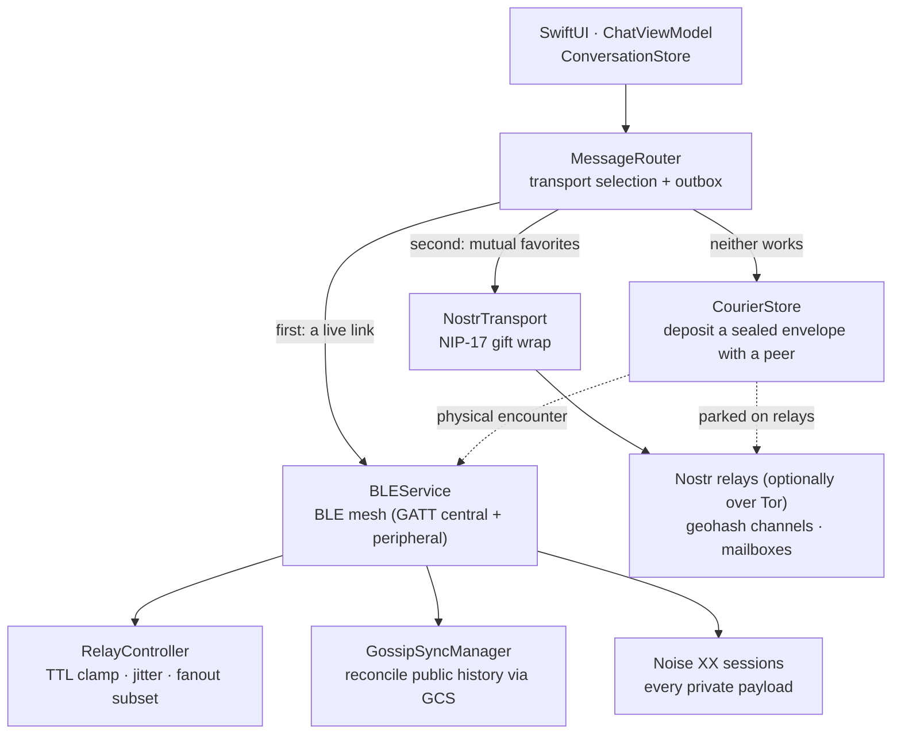

> Analysis date: 2026-07-25
> Target version: `bitchat` `1.7.1` (Unlicense — public domain, permissionless.tech)
> Target commit: `733098b` (`main` branch, 2026-07-10)
> Repository: https://github.com/permissionlesstech/bitchat
> Local analysis path: `~/workspace/opensources/bitchat`

---

_This article is mostly written by Claude Code_

## Table of Contents

1. [Why bitchat?](#1-why-bitchat)
2. [Where does it sit among earlier posts?](#2-where-does-it-sit-among-earlier-posts)
3. [The whole thing in one sentence](#3-the-whole-thing-in-one-sentence)
4. [Stack and scale](#4-stack-and-scale)
5. [The big picture: two transports, one router](#5-the-big-picture-two-transports-one-router)
6. [The BLE mesh: how do you tame a flood?](#6-the-ble-mesh-how-do-you-tame-a-flood)
7. [Four layers of delivery: the store-and-forward stack](#7-four-layers-of-delivery-the-store-and-forward-stack)
8. [Three branches of encryption](#8-three-branches-of-encryption)
9. [Gateways and bridges: stitching mesh islands](#9-gateways-and-bridges-stitching-mesh-islands)
10. [Architectural style: a 5,785-line coordinator and 44 policy units](#10-architectural-style-a-5785-line-coordinator-and-44-policy-units)
11. [A suggested reading order](#11-a-suggested-reading-order)
12. [Design points worth admiring](#12-design-points-worth-admiring)
13. [Things to watch out for](#13-things-to-watch-out-for)
14. [Conclusion](#14-conclusion)

## 1. Why bitchat?

Every messenger assumes the internet exists. The moment that assumption breaks — a cell tower saturated at a protest, a network down after a disaster, or simply being somewhere signal never reached — almost every app we use dies quietly.

bitchat deletes the assumption. Nearby devices form an ad-hoc mesh over Bluetooth LE; when internet is available, messages travel through Nostr relays to the other side of the planet. No accounts, no phone numbers, no central servers. One year after its first commit in July 2025, it's on the App Store at v1.7.1.

What made this repository interesting to me wasn't "chat over Bluetooth" as a feature, though. When I cloned it, read the whitepaper, and opened the code, what stood out was that **the project stacks four different mechanisms on a single problem: "the recipient is not here right now."** One of those mechanisms is a human being physically walking over and handing off an envelope — and that envelope's only address is a single HMAC tag.

Let's follow the code that puts what distributed-systems literature calls a delay-tolerant network (DTN) inside a real App Store app.

## 2. Where does it sit among earlier posts?

Nearly every architecture analysis on this blog has been an AI agent or LLM infrastructure project. bitchat is the first target that leaves that lineage entirely. Not a single LLM appears; instead there are radio protocols, cryptography, and distributed delivery policy.

| Target                                                                                             | Central problem                          | Relation to bitchat                                                                                                                                            |
| -------------------------------------------------------------------------------------------------- | ---------------------------------------- | -------------------------------------------------------------------------------------------------------------------------------------------------------------- |
| [Bloom filters: membership checks at scale](/kb/2026-04-18-bloom-filter-membership-check-at-scale) | Probabilistic set membership             | §7.3's GCS filter is the same lineage. Where a Bloom filter compresses "is it in there?", GCS ships the set itself to a peer in 400 bytes.                     |
| [AgentMemory](/kb/2026-05-13-agentmemory-architecture)                                             | Giving memory to a stateless runtime     | Both externalize cross-session state onto the filesystem. bitchat spends that memory on ciphertext awaiting delivery.                                          |
| [Firecrawl](/kb/2026-07-06-firecrawl-architecture)                                                 | A fallback ladder of paths that can fail | Firecrawl's engine waterfall and bitchat's transport selection are shaped alike. The difference: bitchat treats failure as the **default**, not the exception. |

Where earlier posts asked "how do we orchestrate agents well," bitchat asks something else — **how do you deliver anything on a network where nothing is trustworthy and nothing is always on?** And its answer is: you don't guarantee it, you attempt it along several axes at once.

## 3. The whole thing in one sentence

**bitchat** binds nearby devices into a BLE mesh, reaches distant peers over Nostr, and — when neither path can deliver right now — seals the message into ciphertext and puts it in someone else's pocket. It is an **accountless P2P messenger**.

Rephrased as questions:

| Question                          | bitchat's answer                                                                                          |
| --------------------------------- | --------------------------------------------------------------------------------------------------------- |
| Do I need an account?             | No. Identity is two key pairs in the Keychain (Curve25519 + Ed25519); their fingerprint _is_ who you are. |
| Does it work without internet?    | Yes. The BLE mesh floods up to 7 hops under controlled relay policy.                                      |
| And with internet?                | Nostr relays open up: geohash-scoped location channels, plus NIP-17 DMs between mutual favorites.         |
| What if the recipient is offline? | Four store-and-forward layers catch it — outbox → courier → gossip sync → Nostr mailbox.                  |
| Does plaintext hit the disk?      | Never. What persists is either sealed ciphertext or already-public broadcast traffic.                     |
| What crypto?                      | A hand-rolled Noise implementation (XX/X) on the mesh; NIP-17 gift wrapping on the internet path.         |
| License?                          | The Unlicense — public domain.                                                                            |

One more sentence: bitchat is a project that **redefines delivery from a "transport" into a "layer."** It's not the problem of choosing which radio to use; it's the problem of treating time, space, and people all as delivery paths.

## 4. Stack and scale

| Component                                   | Scale                           | Role                                                                       |
| ------------------------------------------- | ------------------------------- | -------------------------------------------------------------------------- |
| App + local package sources                 | 268 Swift files / ~66,000 lines | Universal app for iOS 16+ and macOS 13+                                    |
| `bitchat/Services/BLE/`                     | 45 files / 10,604 lines         | BLE mesh transport. `BLEService.swift` alone is 5,785 lines                |
| `bitchat/ViewModels/`                       | 30 files / 11,279 lines         | SwiftUI bridge. `ChatViewModel` at 1,807 lines plus coordinators           |
| `bitchat/Nostr/`                            | 11 files / 3,795 lines          | Relay manager (1,687 lines) · NIP-17 · geo-relay directory                 |
| `bitchat/Services/Gateway/`                 | 5 files / 2,111 lines           | Internet sharing (gateway) and mesh-island stitching (bridge)              |
| `bitchat/Noise/` + `NoiseEncryptionService` | 11 files / ~2,700 lines         | Own Noise implementation and session orchestration                         |
| `bitchat/Sync/`                             | 7 files / 1,420 lines           | GCS filters and gossip sync                                                |
| Tests                                       | 182 files / 52,937 lines        | 1,758 Swift Testing `@Test` cases + 187 XCTest methods                     |
| External dependencies                       | **one** (`swift-secp256k1`)     | Nostr Schnorr signatures only; the rest is 3 local packages + vendored Tor |

Two things jump out of those numbers.

First, **tests are 80% of the size of production code** (52,937 / 66,032 lines). For an app that needs radios and relays to do anything, that ratio is unusual. As we'll see later, it isn't luck — it's the consequence of a habit of extracting policy into pure functions.

Second, **there are essentially no external dependencies**. Rather than pulling in a Noise library, the project implements the protocol itself in 1,040 lines of `NoiseProtocol.swift` and validates it against the official test vectors (`NoiseTestVectors.json`). Tor is Rust Arti, vendored as an xcframework — and to keep that binary from changing arbitrarily, there's a dedicated CI workflow (`arti-provenance.yml`) that checks its hashes against a manifest written into a doc. The risk of committing a binary is repaid with documentation and a gate.

## 5. The big picture: two transports, one router

The skeleton is simple. A `Transport` protocol, two implementations (`BLEService`, `NostrTransport`), and a `MessageRouter` choosing between them.



The most striking thing in `bitchat/Services/Transport.swift` isn't the method list — it's that **"can I reach this peer" is split into four distinct signals**.

| Signal               | Meaning                                                                          |
| -------------------- | -------------------------------------------------------------------------------- |
| `isPeerConnected`    | A link is live                                                                   |
| `isPeerReachable`    | Seen recently (a freshness heuristic, e.g. the 60-second retention window)       |
| `canDeliverPromptly` | A send would actually leave the device (Nostr with no relays only joins a queue) |
| `canDeliverSecurely` | An end-to-end encrypted delivery can complete _now_ (a Noise session stands)     |

The comment on that last one explains exactly why the distinction exists:

> A "connected" link binding alone is forgeable — link bindings heal on signature-verified "direct" announces, but directness rides on the unsigned TTL, so a replayed announce can wear an absent peer's ID on the replayer's link. Routers must not trust a connected link outright without this.

That's a concrete attack scenario encoded into an interface. It declares that "connected" and "will actually be delivered securely" are not the same thing — and nearly every decision from here on rests on that split.

## 6. The BLE mesh: how do you tame a flood?

The classic mesh problem is the broadcast storm: if every node re-emits what it receives, traffic explodes exponentially. bitchat's answer is interesting in that **the entire policy lives in one 98-line file, in one function** — `decide()` in `bitchat/Services/RelayController.swift`.

It looks only at the packet type and the local connection degree, and returns `(should relay?, new TTL, delay in ms)`. It branches five ways.

| Packet class                           | Relay?                 | TTL handling                                                                                        | Jitter                                          |
| -------------------------------------- | ---------------------- | --------------------------------------------------------------------------------------------------- | ----------------------------------------------- |
| `requestSync`                          | **never** (link-local) | —                                                                                                   | —                                               |
| Handshake                              | always                 | `-1`, no cap                                                                                        | 10–35 ms                                        |
| Directed ciphertext (DM/envelope/ping) | always                 | `-1`, no cap                                                                                        | 20–60 ms                                        |
| Fragment · live voice                  | conditional            | Clamped to 5 when dense (degree ≥ 6), 7 when sparse                                                 | 8–25 ms                                         |
| Public broadcast                       | conditional            | degree ≥ 6 → 5; degree ≤ 2 → full incoming depth; in between → 6 (7 for announces and urgent posts) | by degree: 10–40 / 60–150 / 80–180 / 100–220 ms |

The part worth reading is **why the asymmetry**.

`requestSync` is never relayed for a reason stated in the comment: someone could craft one with TTL headroom and turn every reachable node into a responder. An amplification vector, closed at the protocol level.

The reason jitter _widens_ in denser graphs is also explicit — **to give duplicate suppression time to win.** A relay is only _scheduled_, not sent immediately, and if the same packet arrives first via another path, the scheduled work is cancelled (`BLEReceivePipeline.shouldCancelScheduledRelayForDuplicate`, when connected peers exceed two). The more people around, the longer you wait, and the higher the odds someone else emits it for you. Conversely, thin chains (degree ≤ 2) relay fast to avoid cancellation races.

The dedup key is careful, too:

```
messageID = "{senderID}-{timestamp}-{type}-{first 4 bytes of payload SHA-256}"
```

The comment says why the payload digest is in there: the post-handshake flush sends queued messages, delivery acks, and read receipts back to back **inside a single millisecond**, and without the digest every packet after the first would be silently dropped as a duplicate. Managed as an LRU of 1,000 entries over a 5-minute window.

### 6.1 Fanout subsetting: not every link gets a copy

Re-sending a broadcast down **all** links doubles airtime for nothing on dual-role pairs (where you hold both a central and a peripheral link to the same peer). `BLEFanoutSelector` shrinks that in three steps.

1. **Split horizon** — the ingress link is always excluded.
2. **Collapsing duplicate links** — when a peer has several links, keep one. The peripheral (write) side is preferred, for a nice reason: writes have per-link flow control via `canSendWriteWithoutResponse`, while notifications share the peripheral manager's update queue across all centrals.
3. **Deterministic subsetting** — of what remains, pick roughly `log₂(degree)` links. Selection sorts by `SHA-256(messageID + "::" + linkID)`, i.e. a **deterministic draw seeded by the message ID**. Not random, so re-processing the same packet picks the same links; different per message, so load spreads evenly.

Announces, fragments, and requestSync are exempt from subsetting. An announce is the packet that **binds** a link to its peer, so collapsing announces starves duplicate links of the announce they need — they then look "pre-announce" forever and every broadcast sprays down all of them. That exemption is the trace of an optimization that was found to undermine itself, then pinned as an exception.

### 6.2 The remaining details

- **Padding**: packets are padded toward 256 / 512 / 1024 / 2048-byte blocks to obscure length.
- **Fragmentation**: anything above the MTU splits into 469-byte pieces (≈512 MTU minus overhead). 128 concurrent assemblies, 30-second timeout, 1 MiB cap.
- **Signature scope**: the Ed25519 signature **excludes the TTL byte**, so relays can decrement TTL without invalidating it. That same choice is also the root of the "directness isn't signed" weakness above — a good example of one protocol decision producing both a convenience and a vulnerability.
- **Source routing**: v2 packets may carry an explicit route. Announces carry up to 10 direct neighbors, so each node holds a shallow topology map with 60-second freshness; when a bidirectionally-confirmed path exists, packets take it, and any failure falls back to flooding.

## 7. Four layers of delivery: the store-and-forward stack

This is the heart of the project. Four mechanisms stacked on the single problem of "the recipient is not here right now."

### 7.1 The sender outbox

The innermost layer is the retry queue `MessageRouter` holds: 100 messages per peer, 24-hour TTL, 8-attempt cap. Delivery or read acks clear it; hitting the cap surfaces as a **visible failure** rather than sitting on "sending" forever.

`MessageOutboxStore` persists it to disk sealed under ChaChaPoly with the key held only in the Keychain. Queued mail survives an app kill without plaintext ever touching disk.

The staircase in `sendPrivate()` compresses this project's whole way of thinking:

```
1. connected + canDeliverSecurely  → just send. A strong signal; trust it outright.
2. connected, no secure session    → send, retain in the outbox, AND deposit with couriers.
3. reachable                       → send and retain in the outbox.
                                     (add couriers if prompt delivery isn't possible)
4. nothing at all                  → outbox + couriers.
```

Case 2 exists because of the forgeable link binding from §5. If a replayed announce has draped someone else's ID over the replayer's link, the real peer isn't there and the handshake never completes. So: send, but keep a copy.

And here the code leaves a remarkably honest note:

> Deliberate metadata tradeoff: every pre-handshake first DM to a connected peer hands nearby verified peers a sealed copy, so they learn a DM to this recipient exists (never its content — the envelope is opaque). Accepted for delivery robustness; the deposit is cleared on ack. Don't "optimize" the courier call away.

A privacy loss written down instead of hidden, with a warning to its future self attached. The whole repository is written at this density.

### 7.2 Couriers: putting the envelope in a person

When no transport can deliver right now, the message is sealed into a **courier envelope** and handed to up to 3 connected peers. If one of them walks somewhere and physically meets the recipient, it gets delivered. This is sneakernet, implemented inside an app.

The design's core is that **the courier learns nothing**. The only routing information written on the envelope is a 16-byte tag:

```
recipientTag = HMAC-SHA256(
    key:     recipient's Noise static public key,
    message: "bitchat-courier-tag-v1" || UTC day (big-endian UInt32)
)[0..<16]
```

Only parties who **already know the recipient's public key** can compute that tag. So the courier learns neither sender, recipient, nor content. And because the UTC day is mixed in, **envelopes to the same person on different days don't correlate**. To absorb envelopes sealed near midnight and modest clock skew, matching tests three candidate tags: yesterday, today, tomorrow.

Quotas keep a device from degenerating into a public mailbag.

| Limit                  | Value                                                       |
| ---------------------- | ----------------------------------------------------------- |
| Total envelope slots   | 40                                                          |
| Of which verified tier | 20 — strangers' mail can never crowd out favorites' mail    |
| Per depositor          | 5 for mutual favorites / 2 for signature-verified strangers |
| Envelope size          | 16 KiB (text only; media is out of scope for couriers)      |
| Lifetime               | 24 hours (aligned with the outbox retention policy)         |
| Couriers per message   | 3                                                           |

The reason for two tiers is clear. Favorites-only means mail can't move at all in a crowd without favorites; anyone-goes means the mailbag gets eaten by stranger traffic. So strangers get a small quota, with a separate ceiling that makes the favorites' share untouchable.

**Spray and wait** sits on top. Envelopes carry a copy budget, starting at 4 and capped at 8. When a courier meets another eligible courier, it **hands over half its remaining budget**. Instead of one message riding in one person's pocket, mail diffuses through a moving crowd. Because the budget is capped, a malicious envelope can't turn the courier network into an amplifier. Budgets, spray history, and carried mail all persist across app restarts.

Handover logic distinguishes kinds of announce:

- **Verified direct announce** with a Noise session standing on that same ingress link → deliver immediately and remove the envelope. A peer-level Noise session isn't enough on its own, because it can outlive its physical link while a replay rebinds an attacker's link to the victim's ID.
- **Relayed announce** → push a speculative copy as a directed packet while the carried original stays put, throttled to once per envelope per 10 minutes.

Receivers dedup by message ID, so redundant copies arriving alongside the retained outbox original are harmless. Couriered mail from blocked senders is dropped at decryption time.

### 7.3 Public history: reconciling with GCS filters

Public broadcasts pose a different problem: someone who joins the room late should be able to see what was said. bitchat caches the last 1,000 packets per device and **reconciles that set with neighbors every ~15 seconds.**

Enter GCS (Golomb-Coded Set). Each side advertises what it holds as a compact filter, and the other returns only what's missing. Target false-positive rate 1%, filter budget 400 bytes. Same lineage as the probabilistic membership in the [Bloom filter post](/kb/2026-04-18-bloom-filter-membership-check-at-scale) — but where a Bloom filter is a tool for asking "is this in the set," GCS is an **encoding that ships the set itself to a peer**. The mechanics:

1. Hash the 16-byte packet ID with SHA-256, take the first 8 bytes as a 64-bit integer.
2. Map into `[1, M)`, sort ascending, and keep only the **deltas**.
3. Encode deltas as Golomb-Rice: quotient in unary, remainder in P bits, where `P = ceil(log₂(1/FPR))`.

Deltas between sorted hashes cluster around small values, which is exactly where unary coding pays off. Size and false-positive rate are tied together through the single parameter P.

My favorite detail in this file is what happens when the budget overflows: it trims **from the input tail**. Callers pass IDs newest-first, so trimming always drops the oldest — meaning the surviving set is always a contiguous **newest prefix**. If an arbitrary hash-ordered subset were dropped instead, the since-cursor meaning "everything after this point" would become inaccurate. The trimming direction is fixed to preserve that. An upper-layer consistency requirement, expressed inside compression code.

Retention windows differ by kind:

| Kind              | Sync interval | Retention                           |
| ----------------- | ------------- | ----------------------------------- |
| Public messages   | 15 s          | **6 hours**                         |
| Fragments · files | 30 / 60 s     | 15 minutes                          |
| Board posts       | 60 s          | Each post's own expiry (max 7 days) |
| Prekey bundles    | 60 s          | 24 hours                            |

The six hours for public messages is the key. Because the cache persists to disk, a device that walks between two partitions — or relaunches later — serves the room's recent history to whoever missed it. The app renders those copies as dimmed "heard here earlier" echo rows in the timeline (prefixed `echo-`).

Amplification defense is two-ply: `requestSync` is never relayed (§6), and responses are rate-limited to 8 per 30 seconds.

### 7.4 Nostr mailboxes

The outermost layer is the internet. DMs between mutual favorites rest on relays as NIP-17/59 gift wraps, and clients re-subscribe with a **24-hour lookback** on reconnect. That covers the both-sides-offline case as soon as either side touches the internet.

The relay list lives in `relays/online_relays_gps.csv` — 415 relays with latitude and longitude — refreshed by a weekly cron workflow (`fetch_georelays.yml`). Geohash channels use those coordinates to pick **deterministically nearby** relays.

Lined up side by side, each layer crosses a different axis:

| Layer         | What it crosses             | The price                                        |
| ------------- | --------------------------- | ------------------------------------------------ |
| Outbox        | **Time** (until reconnect)  | Storage on the sender's device                   |
| Courier       | **Space** (human movement)  | No forward secrecy + the existence of mail leaks |
| Gossip sync   | **Partitions** (split mesh) | Public traffic only                              |
| Nostr mailbox | **Distance** (planetary)    | Requires internet + relays see metadata          |

## 8. Three branches of encryption

Three different crypto paths coexist in one app, each with a clear reason.

**Noise XX (live sessions).** Connected peers establish sessions with the `XX` pattern: Curve25519 / ChaCha20-Poly1305 / SHA-256. Mutual authentication, forward secrecy, and every private payload — messages, delivery acks, read receipts, group invites, voice frames, verification challenges — rides inside.

One privacy design choice sits on top: all of it leaves the device as **a single wire type, `noiseEncrypted` (0x11)**. The actual type is the first byte of the decrypted payload (`NoisePayloadType`). Intermediate relays cannot tell whether what passed by was a DM or a read receipt.

**Noise X (offline seals).** Courier envelopes are sealed to the recipient's **static** key with the one-way `X` pattern; the sender's identity is authenticated inside the ciphertext. The whitepaper states the limit bluntly — **there is no forward secrecy.** Compromising the recipient's static key exposes sealed-but-undelivered mail.

But the code has already moved past that. `MessageType 0x24` **gossips one-time prekey bundles**, and when an envelope carries a `prekeyID` TLV it's a v2 sealed to that prekey rather than the static key. What the whitepaper lists as "future work" is present in the code.

The comment in `LocalPrekeyStore` names the new tradeoff this creates precisely:

> Redelivery grace: spray-and-wait means the same prekey-sealed ciphertext can arrive via several couriers days apart. A consumed prekey's private key is therefore retained for `consumedGraceSeconds` after first use and only then deleted. Tradeoff: during the grace window a compromise of the device still exposes mail sealed to that prekey — the forward-secrecy clock starts at deletion, not at first open.

It goes on to note that "refusing new ciphertexts while accepting redeliveries is not possible (the recipient cannot distinguish them)." Forward secrecy introduced, with an explanation of why it isn't complete, in the same comment.

**NIP-17 (the internet path).** DMs to mutual favorites are triple-wrapped — rumor (kind 14) → seal (kind 13) → gift wrap (kind 1059) — under a fresh throwaway key each time. Relays learn neither sender nor content.

## 9. Gateways and bridges: stitching mesh islands

`bitchat/Services/Gateway/` holds 2,111 lines, and this layer **does not appear in whitepaper v2.0 (July 6)**. Here, the code is ahead of the docs.

The **gateway** is a "share my internet with the mesh" toggle. Turned on, the device advertises the `.gateway` capability bit, publishes signed geohash events deposited by internet-less peers to relays (uplink), and rebroadcasts inbound relay events onto the mesh (downlink). The threat model is spelled out in the header comment:

- **Keys never leave the originating device.** Mesh-only senders sign events locally with their per-geohash ephemeral identity; the gateway carries only the finished, signed event.
- **The gateway cannot forge or alter events.** Every carried event is Schnorr-verified there before publishing, and again independently by relays and receivers.
- What's carried is public geohash chat that is already plaintext on Nostr, so mesh carriage adds no confidentiality loss.

The **bridge** solves a different problem: when several BLE mesh "islands" share a place without reaching each other, it stitches them together. Public messages are additionally signed as rendezvous events under a derived, unlinkable per-cell Nostr identity and published to that cell's deterministic geo relays.

The consent model is especially clear:

> Nothing crosses a bridge unless its author signed it for the bridge: gateways carry only finished, Schnorr-signed rendezvous events, so a neighbor's gateway cannot exfiltrate radio-only traffic. (…) Receiving over radio is always on — it is passive and leaks nothing. Subscribing over the internet (which reveals the coarse cell to relays) and publishing both require the toggle.

There's also a per-message "nearby only" flag. This is privacy handled as a feature toggle — but with **each direction judged separately for what it leaks**.

Both services use three loop-prevention rules, pinned by unit tests. An event learned from the mesh is never republished; an event this device published is never downlink-rebroadcast (otherwise our own relay subscription redelivering it would double BLE airtime — the comment calls this "the device-confirmed self-echo bug"); a subscription event is rebroadcast at most once. Quotas layer on: 20 queued uplinks (5 per depositor), 30 downlinks per minute, 512 tracked event IDs.

`BridgeCourierService` (565 lines) fuses these with the courier system. It **parks** sealed envelopes on relays, so delivery no longer strictly requires a physical encounter. `MessageRouter` attempts it **in parallel** with the mesh courier deposit, and receivers filter duplicates by message ID.

## 10. Architectural style: a 5,785-line coordinator and 44 policy units

`BLEService.swift` is 5,785 lines. Normally that number belongs in this article's "things to watch out for" — but look at the same directory and the story changes. The other 44 files under `Services/BLE/` are mostly 100–300 line units.

`BLEFanoutSelector` (fanout subsetting), `BLEIngressLinkRegistry` (duplicate/last-hop tracking and link binding), `BLEOutboundWriteBuffer` (write backpressure), `BLEConnectionScheduler`, `BLERouteForwardingPolicy`, `BLEPacketFreshnessPolicy`… nearly everything named `Policy` or `Selector` is a **pure decision function with no side effects**.

`docs/ARCHITECTURE_V2.md` manages this direction explicitly:

> `BLEService` still coordinates CoreBluetooth callbacks, but these hot-path decisions are now pure, covered units instead of inline dictionary logic.

And the same document assesses the character of its own refactor — the new `ChatViewModel` coordinators are "**intentionally transitional**," shrinking files and isolating responsibilities without forcing a risky rewrite of the transport/BLE core in the same pass. That treats refactoring not as done/not-done but as **documented progress**. I'd argue that's both why a 5,785-line file still exists and why I read this code as maintained rather than neglected.

The tuning surface is gathered in one place too: `TransportConfig.swift` holds **193 constants** — TTL defaults, degree thresholds, jitter ranges, fragment size, dedup windows, sync intervals, the courier's initial copy budget, Nostr backoff ratios. Many carry the reason for the value beside it, e.g. "Aggressive pacing causes packet loss; needs 25-30ms between fragments for reliable delivery."

There are four CI workflows:

| Workflow              | What it does                                                                                                           |
| --------------------- | ---------------------------------------------------------------------------------------------------------------------- |
| `swift-tests.yml`     | Three-way matrix (app · BitLogger · BitFoundation). 5-minute test watchdog, 25-minute backstop, performance floor gate |
| `periphery.yml`       | Dead-code scan. macOS scheme only; iOS-only false positives live in a baseline file                                    |
| `arti-provenance.yml` | Checks the vendored Tor xcframework's hashes against the manifest in the doc                                           |
| `fetch_georelays.yml` | Weekly cron refreshing the geo relay list                                                                              |

The performance gate is especially impressive. `bitchatTests/Performance/perf-floors.json` holds per-benchmark throughput floors, and a `_philosophy` array at the top of the file explains the criterion in prose — floors are **~50% of the slowest observed CI run**, chosen to catch algorithmic regressions (O(n) → O(n²), accidental sync I/O) rather than tuning noise, and every floor sits 10–200× above known regression values so the gate never flakes on a slow runner. Concretely: the pre-optimization duplicate path measured 2,200/sec against a 250,000 floor.

Finally, the impression that lasted longest reading this repository was **the density of comments explaining "why" rather than "what"** — and how those whys carry evidence markers: `(field-found)`, `(device-confirmed self-echo bug)`, `(observed: intermittent app-suite hangs starving the queue)`. Traces of things learned in real crowds on real devices and fed back into the code.

## 11. A suggested reading order

For a repository past 100,000 lines, order matters.

1. **`WHITEPAPER.md`** — 141 lines that summarize the entire protocol accurately. Read it before opening any code.
2. **`bitchat/Services/Transport.swift`** — the transport interface. The `canDeliverPromptly` / `canDeliverSecurely` comments summarize the project's trust model.
3. **`bitchat/Services/RelayController.swift`** — 98 lines holding all of the flood policy. If you read only one file, read this one.
4. **`sendPrivate()` in `bitchat/Services/MessageRouter.swift`** — the four-step staircase and the tradeoff comments wedged between the steps.
5. **`localPackages/BitFoundation/…/CourierEnvelope.swift`** — 195 lines: the rotating recipient tag and the spray budget's wire format.
6. **`bitchat/Sync/GCSFilter.swift`** → **`Config` in `GossipSyncManager.swift`** — probabilistic reconciliation and per-kind retention windows.
7. **The header comment of `bitchat/Services/Gateway/GatewayService.swift`** — the threat model and three loop-prevention rules. Here the comment reads before the code.
8. **`bitchat/Services/TransportConfig.swift`** — skimming the 193 constants gives you a map of where this system's tuning surface lives.
9. **`bitchat/Services/BLE/BLEService.swift`** — last. Only after all of the above does 5,785 lines become readable.

## 12. Design points worth admiring

**1. Delivery redefined from a transport into layers.** Most apps pick "which network." bitchat places time (outbox), space (courier), partitions (gossip sync), and distance (Nostr) on separate layers and runs all four at once. A single receiver-side dedup by message ID makes all that redundancy harmless.

**2. Routing information reduced to one HMAC tag.** The lesson in courier addressing isn't how much is hidden, but how much **less** is written down. Only the minimum needed to identify a recipient remains — and even that rotates daily.

**3. All flood policy is one pure function.** `RelayController.decide()` maps `(packet class, degree)` to `(relay, TTL, delay)` with no state and no side effects. Every branch is testable, and there's exactly one place to look when the policy changes.

**4. "Connected" is not trusted.** Splitting the delivery signal into connected / reachable / promptly / securely is a distinction derived backwards from a concrete replay attack. The interface carries the threat model.

**5. Big files managed by extracting policy units.** Rather than smashing a 5,785-line coordinator at once, hot-path decisions get pulled out one at a time as pure units with tests, with `ARCHITECTURE_V2.md` tracking the progress.

**6. Tradeoffs are not hidden.** The courier path's missing forward secrecy, the metadata leak of a pre-handshake DM, the exposure inside the prekey grace window, the known limitation of central-link collapsing — all written into comments and the whitepaper. In a security project, that's a maturity signal.

## 13. Things to watch out for

**1. Forward secrecy on the courier path.** The v1 static seal has none, and v2 prekey seals aren't a complete fix: consumed prekeys survive the grace window, and a peer on an older client falls back to v1. The whitepaper is right to call this "the main cryptographic trade-off of the offline path."

**2. Leaking existence.** Envelope contents are opaque, but nearby verified peers learn that _something_ went to this recipient. In an environment with a narrow social graph — a small protest, say — that metadata alone can be meaningful.

**3. BLE proximity is inherently observable.** Ephemeral IDs and daily-rotating tags limit **long-term** correlation only; the fact that this device is here right now isn't hidden. The whitepaper says so explicitly.

**4. Combinatorial explosion across 193 tuning constants.** Degree thresholds, TTL caps, jitter windows, quotas, and retention windows are entangled, and emergent behavior in a real crowd is hard to predict statically. The `(field-found)` markers in the comments are the evidence — several behaviors only surfaced in real deployment.

**5. Documentation drift.** Whitepaper v2.0 (July 6) has no gateway, bridge, private groups, board, or push-to-talk. Prekeys are listed as future work but already exist. That gap is inevitable when 141 lines of doc chase 100,000 lines of code — but read this repository treating **the whitepaper as the floor of what the code does**.

**6. Self-graded privacy claims.** That couriers can't read content is guaranteed by cryptography. That "quotas prevent abuse" or "three loop-prevention rules suffice" are **design claims** pinned by unit tests. Verification in an adversarial environment is a separate matter.

**7. Contribution concentration.** 745 of `main`'s 981 commits come from one person (jack). 51 people have contributed, but the bus factor is low — and it means most protocol decisions live in one head.

**8. Platform scope.** This repository is iOS 16+ / macOS 13+ only. A mesh network's value scales with the density of participating devices, and a mesh confined to the Apple ecosystem has a ceiling on that density.

## 14. Conclusion

Before cloning bitchat, I expected to read the code of "an app that chats over Bluetooth." What I found was **a delay-tolerant network that decomposes the delivery problem along four axes**.

What makes this repository interesting is less that it implements a BLE mesh and more that it shows **what a system looks like when failure is the default rather than the exception.** The peer may be absent, the internet may be gone, a link binding may be forged, a courier may drop the mail. So every layer is designed around the question "what remains when this doesn't work." The courier envelope is the summit of that — human footsteps treated as a transport layer, with the resulting loss of forward secrecy written into the docs.

There's plenty to take from the software-engineering side too: how a repository containing a 5,785-line file stays manageable — by extracting policy into pure functions, gathering tuning values in one place, treating refactoring as documented progress, and writing tradeoffs honestly into comments. And turning performance floors into a CI gate while writing the philosophy behind those floors as prose inside the JSON file is the most practical form of performance documentation I've seen.

In an era where messages still need to travel after the infrastructure disappears, bitchat is a good textbook on how to translate that need into code.
