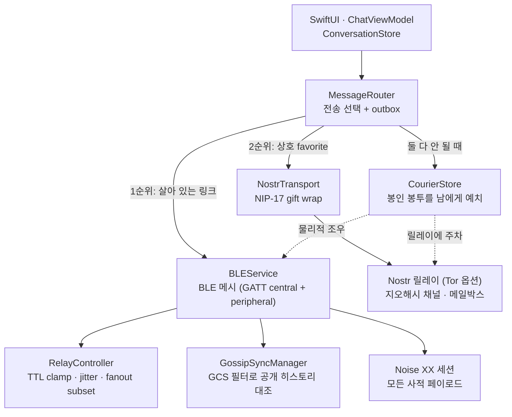

> 분석 일자: 2026-07-25
> 대상 버전: `bitchat` `1.7.1` (Unlicense — 퍼블릭 도메인, permissionless.tech)
> 대상 커밋: `733098b` (`main` 브랜치, 2026-07-10)
> 저장소: https://github.com/permissionlesstech/bitchat
> 로컬 분석 경로: `~/workspace/opensources/bitchat`

---

_This article is mostly written by Claude Code_

## 목차

1. [왜 bitchat인가요?](#1-왜-bitchat인가요)
2. [기존 글들과 어디에 놓이나요?](#2-기존-글들과-어디에-놓이나요)
3. [한 문장으로 이해하기](#3-한-문장으로-이해하기)
4. [기술 스택과 규모](#4-기술-스택과-규모)
5. [전체 그림: 두 개의 전송과 하나의 라우터](#5-전체-그림-두-개의-전송과-하나의-라우터)
6. [BLE 메시: 플러딩을 어떻게 길들이나요?](#6-ble-메시-플러딩을-어떻게-길들이나요)
7. [배달의 4계층: store-and-forward 스택](#7-배달의-4계층-store-and-forward-스택)
8. [암호화의 세 갈래](#8-암호화의-세-갈래)
9. [게이트웨이와 브리지: 메시 섬을 잇기](#9-게이트웨이와-브리지-메시-섬을-잇기)
10. [아키텍처 스타일: 5,785줄 코디네이터와 44개 정책 단위](#10-아키텍처-스타일-5785줄-코디네이터와-44개-정책-단위)
11. [코드 읽는 추천 순서](#11-코드-읽는-추천-순서)
12. [인상적인 설계 포인트](#12-인상적인-설계-포인트)
13. [주의해서 볼 지점](#13-주의해서-볼-지점)
14. [결론](#14-결론)

## 1. 왜 bitchat인가요?

메신저의 기본 가정은 "인터넷이 있다"입니다. 그 가정이 깨지는 순간 — 시위 현장에서 기지국이 포화되거나, 재난으로 망이 끊기거나, 애초에 셀 신호가 닿지 않는 곳에 있을 때 — 우리가 쓰는 거의 모든 앱은 조용히 죽습니다.

bitchat은 그 가정을 지웁니다. 근처 기기들끼리 Bluetooth LE로 애드혹 메시를 만들고, 인터넷이 있으면 Nostr 릴레이를 타고 지구 반대편까지 갑니다. 계정도, 전화번호도, 중앙 서버도 없습니다. 2025년 7월에 첫 커밋이 올라온 지 1년 만에 App Store에 올라 v1.7.1에 이르렀습니다.

그런데 저에게 이 저장소가 흥미로웠던 이유는 "블루투스로 채팅한다"는 기능 자체가 아니었습니다. 클론해서 화이트페이퍼를 읽고 코드를 열었을 때 눈에 들어온 것은, 이 프로젝트가 **"받는 사람이 지금 여기 없다"는 문제 하나에 네 개의 서로 다른 메커니즘을 쌓아 올렸다**는 사실이었습니다. 그중 하나는 사람이 물리적으로 걸어가서 봉투를 전달하는 방식이고, 그 봉투의 주소는 HMAC 태그 하나뿐입니다.

분산 시스템 교과서에서 "지연 허용 네트워크(DTN)"라고 부르는 개념이 실제 App Store 앱 안에서 어떻게 구현되는지, 그 코드를 따라가 보겠습니다.

## 2. 기존 글들과 어디에 놓이나요?

이 블로그의 아키텍처 분석은 그동안 거의 전부가 AI 에이전트·LLM 인프라였습니다. bitchat은 그 계열에서 완전히 벗어난 첫 대상입니다. LLM이 한 줄도 등장하지 않고, 대신 무선 프로토콜과 암호학, 그리고 분산 배달 정책이 있습니다.

| 대상                                                                                   | 중심 문제                           | bitchat과의 관계                                                                                                                                   |
| -------------------------------------------------------------------------------------- | ----------------------------------- | -------------------------------------------------------------------------------------------------------------------------------------------------- |
| [블룸 필터: 대규모 멤버십 체크](/kb/2026-04-18-bloom-filter-membership-check-at-scale) | 확률적 집합 소속 판정               | 7.3절의 GCS 필터가 같은 계보입니다. 블룸 필터가 "이게 있는가?"라는 질문을 압축한다면, GCS는 집합 자체를 400바이트에 실어 상대와 교환합니다.        |
| [AgentMemory](/kb/2026-05-13-agentmemory-architecture)                                 | 상태 없는 런타임에 기억을 붙이기    | 둘 다 "세션을 넘는 상태를 파일시스템에 외장"합니다. bitchat은 그 기억의 자리에 배달을 기다리는 암호문을 둡니다.                                    |
| [Firecrawl](/kb/2026-07-06-firecrawl-architecture)                                     | 실패할 수 있는 경로들의 폴백 사다리 | Firecrawl의 엔진 waterfall과 bitchat의 전송 선택은 같은 형태의 문제입니다. 차이는 bitchat이 "실패"를 예외가 아니라 **기본값**으로 둔다는 점입니다. |

기존 글들이 던진 질문이 "에이전트를 어떻게 잘 조율할까"였다면, bitchat이 던지는 질문은 다릅니다 — **신뢰할 수 있는 것도, 항상 켜져 있는 것도 없는 네트워크에서 배달을 어떻게 보장할까**. 그리고 이 프로젝트의 답은 "보장하지 않는다, 대신 여러 갈래로 시도한다"입니다.

## 3. 한 문장으로 이해하기

**bitchat**은 근처 기기를 BLE 메시로 묶고 먼 상대를 Nostr로 이으며, 어느 쪽으로도 지금 닿을 수 없을 때는 봉인된 암호문을 다른 사람의 주머니에 실어 보내는, **계정 없는 P2P 메신저**입니다.

질문으로 바꾸면 이렇습니다.

| 질문                    | bitchat의 답                                                                                              |
| ----------------------- | --------------------------------------------------------------------------------------------------------- |
| 계정이 필요한가요?      | 아닙니다. 신원은 Keychain에 든 키 쌍 두 개(Curve25519 + Ed25519)이고, 그 지문이 곧 정체성입니다.          |
| 인터넷 없이 되나요?     | 됩니다. BLE 메시가 최대 7홉까지 통제된 플러딩으로 퍼뜨립니다.                                             |
| 인터넷이 있으면요?      | Nostr 릴레이가 열립니다. 지오해시로 구획된 지역 채널과 상호 favorite 간 NIP-17 DM이 그 위에서 돌아갑니다. |
| 상대가 꺼져 있으면요?   | 4계층 store-and-forward가 받습니다 — outbox → courier → gossip sync → Nostr 메일박스.                     |
| 평문이 디스크에 남나요? | 남지 않습니다. 저장되는 건 봉인된 암호문이거나, 이미 공개된 브로드캐스트뿐입니다.                         |
| 어떤 암호를 쓰나요?     | 메시에는 직접 구현한 Noise(XX/X)를, 인터넷 경로에는 NIP-17 gift wrap을 씁니다.                            |
| 라이선스는요?           | Unlicense — 퍼블릭 도메인입니다.                                                                          |

한 문장을 더 붙이면, bitchat은 **배달을 "전송(transport)"이 아니라 "계층(layer)"으로 재정의한** 물건입니다. 어떤 무선을 쓸지 고르는 문제가 아니라, 시간과 공간과 사람을 모두 배달 경로로 취급하는 문제로 바꿔 놓았습니다.

## 4. 기술 스택과 규모

| 구성 요소                                   | 규모                           | 역할                                                             |
| ------------------------------------------- | ------------------------------ | ---------------------------------------------------------------- |
| 앱 + 로컬 패키지 소스                       | 268개 Swift 파일 / 약 66,000줄 | iOS 16+ · macOS 13+ 유니버설 앱                                  |
| `bitchat/Services/BLE/`                     | 45개 파일 / 10,604줄           | BLE 메시 전송. `BLEService.swift` 하나가 5,785줄                 |
| `bitchat/ViewModels/`                       | 30개 파일 / 11,279줄           | SwiftUI 브리지. `ChatViewModel` 1,807줄 + 코디네이터 다수        |
| `bitchat/Nostr/`                            | 11개 파일 / 3,795줄            | 릴레이 매니저(1,687줄) · NIP-17 · 지오릴레이 디렉터리            |
| `bitchat/Services/Gateway/`                 | 5개 파일 / 2,111줄             | 인터넷 공유(gateway)와 메시 섬 봉합(bridge)                      |
| `bitchat/Noise/` + `NoiseEncryptionService` | 11개 파일 / 약 2,700줄         | Noise 프로토콜 자체 구현과 세션 오케스트레이션                   |
| `bitchat/Sync/`                             | 7개 파일 / 1,420줄             | GCS 필터와 gossip 동기화                                         |
| 테스트                                      | 182개 파일 / 52,937줄          | Swift Testing `@Test` 1,758개 + XCTest 187개                     |
| 외부 의존성                                 | **1개** (`swift-secp256k1`)    | Nostr Schnorr 서명 전용. 나머지는 로컬 패키지 3개와 벤더링된 Tor |

숫자에서 두 가지가 먼저 읽힙니다.

첫째, **테스트가 프로덕션 코드의 80%에 달합니다**(52,937 / 66,032줄). 무선 장비와 릴레이가 있어야 돌아가는 앱치고는 이례적인 비율입니다. 뒤에서 보겠지만 이건 우연이 아니라, 정책을 순수 함수로 뽑아내는 설계 습관의 결과입니다.

둘째, **외부 의존성이 사실상 없습니다**. Noise 프로토콜을 라이브러리로 가져오지 않고 `NoiseProtocol.swift` 1,040줄에 직접 구현했고, 공식 테스트 벡터(`NoiseTestVectors.json`)로 검증합니다. Tor는 Rust Arti를 xcframework로 벤더링했는데, 그 바이너리가 임의로 바뀌지 않도록 **해시 매니페스트를 문서에 적고 CI가 검증하는 전용 워크플로**(`arti-provenance.yml`)까지 붙였습니다. 바이너리를 저장소에 넣는 결정이 지닌 위험을 문서와 게이트로 상쇄하는 방식입니다.

## 5. 전체 그림: 두 개의 전송과 하나의 라우터

구조의 뼈대는 단순합니다. `Transport` 프로토콜이 있고, 두 구현체(`BLEService`, `NostrTransport`)가 있고, `MessageRouter`가 그 사이에서 고릅니다.



`Transport` 프로토콜(`bitchat/Services/Transport.swift`)에서 가장 인상적인 부분은 메서드 목록이 아니라, **"닿을 수 있음"을 네 단계로 쪼개 놓은 것**입니다.

| 신호                 | 의미                                                                  |
| -------------------- | --------------------------------------------------------------------- |
| `isPeerConnected`    | 링크가 살아 있음                                                      |
| `isPeerReachable`    | 최근에 봤음 (60초 보존 창 같은 신선도 휴리스틱)                       |
| `canDeliverPromptly` | 보내면 실제로 기기를 떠날 것 같음 (Nostr는 릴레이 없이 큐에만 들어감) |
| `canDeliverSecurely` | 지금 E2E 암호화 배달을 완료할 수 있음 (Noise 세션이 서 있음)          |

마지막 항목에 달린 주석이 이 구분의 이유를 정확히 설명합니다.

> "연결됨"이라는 링크 바인딩만으로는 위조가 가능합니다 — 링크 바인딩은 서명 검증된 "직접" announce를 받으면 복구되지만, 직접인지 여부는 서명되지 않은 TTL에 실려 옵니다. 그래서 리플레이된(replay) announce가 자리에 없는 피어의 ID를 리플레이한 쪽의 링크에 씌울 수 있습니다. 라우터는 이 검사 없이 연결된 링크를 그대로 신뢰해서는 안 됩니다.

이건 실제 공격 시나리오를 인터페이스 설계에 반영한 것입니다. "연결"과 "신뢰할 수 있는 배달"을 같은 것으로 취급하지 않겠다는 선언이고, 다음 절부터 나오는 거의 모든 결정이 이 구분 위에 서 있습니다.

## 6. BLE 메시: 플러딩을 어떻게 길들이나요?

메시 네트워크의 고전적 문제는 브로드캐스트 스톰입니다. 모든 노드가 받은 걸 다시 뿌리면 트래픽이 지수적으로 폭발합니다. bitchat의 답은 흥미롭게도 **정책 전체가 98줄짜리 한 파일, 한 함수에 모여 있다**는 것입니다. `bitchat/Services/RelayController.swift`의 `decide()`입니다.

이 함수는 패킷 종류와 로컬 연결 차수(degree)만 보고 `(릴레이할까?, 새 TTL, 지연 ms)`를 돌려줍니다. 다섯 갈래로 갈립니다.

| 패킷 종류                      | 릴레이 여부                | TTL 처리                                                                          | jitter                                      |
| ------------------------------ | -------------------------- | --------------------------------------------------------------------------------- | ------------------------------------------- |
| `requestSync`                  | **절대 안 함** (링크 로컬) | —                                                                                 | —                                           |
| 핸드셰이크                     | 무조건                     | `-1`, 상한 없음                                                                   | 10–35 ms                                    |
| directed 암호문 (DM·봉투·ping) | 무조건                     | `-1`, 상한 없음                                                                   | 20–60 ms                                    |
| fragment · 실시간 음성         | 조건부                     | 촘촘할 때(차수 ≥ 6) 5로, 희소할 때 7로 제한                                       | 8–25 ms                                     |
| 공개 브로드캐스트              | 조건부                     | 차수 ≥ 6 → 5, 차수 ≤ 2 → 들어온 깊이 그대로, 그 사이 → 6 (announce·긴급 공지는 7) | 차수별 10–40 / 60–150 / 80–180 / 100–220 ms |

읽어야 할 지점은 **왜 이렇게 비대칭인가**입니다.

`requestSync`를 절대 릴레이하지 않는 이유는 주석에 있습니다 — 누군가 TTL 여유를 넣어 만들면 도달 가능한 모든 노드가 응답자로 변하기 때문입니다. 증폭 공격의 입구를 프로토콜 수준에서 닫아 둔 것입니다.

jitter가 촘촘한 그래프에서 더 넓어지는 이유도 명시적입니다 — **중복 억제가 이길 시간을 벌기 위해서**입니다. 릴레이는 예약될 뿐 즉시 나가지 않고, 그 사이 같은 패킷이 다른 경로로 먼저 도착하면 예약이 취소됩니다(`BLEReceivePipeline.shouldCancelScheduledRelayForDuplicate`, 연결 피어가 2개를 넘을 때). 사람이 많을수록 기다리는 시간이 길어지고, 그만큼 남이 대신 뿌려 줄 확률이 올라갑니다. 반대로 사슬처럼 얇게 이어진 그래프(차수 ≤ 2)에서는 취소 경합을 피하려고 빨리 내보냅니다.

중복 판정 키도 세심합니다.

```
messageID = "{senderID}-{timestamp}-{type}-{payload SHA-256 앞 4바이트}"
```

페이로드 다이제스트가 왜 들어갔는지가 주석에 적혀 있습니다 — 핸드셰이크 직후 flush가 큐에 쌓인 메시지·배달 확인·읽음 확인을 **같은 밀리초 안에** 연달아 보내는데, 다이제스트가 없으면 첫 패킷 이후 전부가 중복으로 조용히 버려집니다. LRU 1,000개 / 5분 창으로 관리합니다.

### 6.1 fanout subsetting: 모든 링크로 보내지 않습니다

브로드캐스트를 **모든** 링크에 다시 내보내면 dual-role 연결(같은 상대와 central·peripheral 양쪽으로 붙은 경우)에서 airtime이 그냥 두 배가 됩니다. `BLEFanoutSelector`가 이걸 세 단계로 줄입니다.

1. **split horizon** — 들어온 링크는 항상 제외합니다.
2. **중복 링크 collapse** — 한 피어에 여러 링크가 있으면 하나만 남깁니다. peripheral(write) 쪽을 선호하는데, 이유가 재밌습니다. write는 `canSendWriteWithoutResponse`로 링크별 흐름 제어가 되지만, notification은 peripheral 매니저의 업데이트 큐를 모든 central이 공유하기 때문입니다.
3. **결정론적 부분집합** — 남은 링크 중 약 `log₂(차수)`개만 고릅니다. 선택은 `SHA-256(messageID + "::" + linkID)` 정렬로, 즉 **메시지 ID를 시드로 한 결정론적 추출**입니다. 무작위가 아니라서 같은 패킷을 여러 번 처리해도 같은 링크가 뽑히고, 메시지마다 시드가 달라 부하는 고르게 퍼집니다.

announce · fragment · requestSync는 이 부분집합에서 면제됩니다. announce는 링크를 피어에 **바인딩하는** 패킷이라, 이걸 collapse하면 중복 링크가 영원히 "announce 이전" 상태로 남아 이후 모든 브로드캐스트가 그 링크들로 다 나가게 됩니다. 최적화가 스스로를 무너뜨리는 경로를 발견하고 예외로 박아 둔 흔적입니다.

### 6.2 나머지 잔가지

- **패딩**: 패킷을 256 / 512 / 1024 / 2048바이트 블록으로 맞춰 길이 정보를 가립니다.
- **단편화**: MTU를 넘으면 469바이트(≈512 MTU − 오버헤드) 조각으로 쪼갭니다. 동시 재조립 128개, 30초 타임아웃, 1 MiB 상한.
- **서명 범위**: Ed25519 서명이 **TTL 바이트를 제외**합니다. 그래서 릴레이가 TTL을 깎아도 서명이 깨지지 않습니다. 동시에 이게 앞서 본 "직접 여부는 서명되지 않는다"는 취약점의 원인이기도 합니다. 프로토콜 설계에서 하나의 결정이 편의와 약점을 함께 만드는 좋은 예입니다.
- **소스 라우팅**: v2 패킷은 명시적 경로를 실을 수 있습니다. announce가 직접 이웃 최대 10개를 실어 나르므로 각 노드는 60초 신선도의 얕은 토폴로지 지도를 갖고, 양방향 확인된 경로가 있으면 그 길로 보내고 실패하면 플러딩으로 되돌아갑니다.

## 7. 배달의 4계층: store-and-forward 스택

여기가 이 프로젝트의 심장입니다. "받는 사람이 지금 여기 없다"는 하나의 문제에 네 개의 메커니즘이 쌓여 있습니다.

### 7.1 발신자 outbox

가장 안쪽 계층은 `MessageRouter`가 들고 있는 재전송 큐입니다. 피어당 100개, 24시간 TTL, 재시도 8회 상한. 배달/읽음 확인이 오면 지워지고, 상한에 걸리면 **사용자에게 보이는 실패로 드러납니다**(조용히 "전송 중"에 머물지 않습니다).

`MessageOutboxStore`가 이걸 디스크에 남기는데, ChaChaPoly로 봉인하고 그 키는 Keychain에만 둡니다. 앱이 죽어도 대기 중인 메일이 살아남지만, 평문이 디스크에 닿는 일은 없습니다.

`sendPrivate()`의 계단이 이 프로젝트의 사고방식을 압축해서 보여 줍니다.

```
1. 연결됨 + canDeliverSecurely   → 그냥 보냅니다. 강한 신호이므로 그대로 신뢰합니다.
2. 연결됨 + 보안 세션 없음        → 보내고, outbox에 보관하고, courier에게도 예치합니다.
3. reachable                     → 보내고, outbox에 보관합니다.
                                   (prompt 배달이 안 되면 courier도 추가)
4. 아무것도 없음                  → outbox + courier.
```

2번이 필요한 이유는 5절에서 본 링크 바인딩 위조입니다. 리플레이된 announce가 남의 ID를 자기 링크에 씌운 경우, 진짜 상대는 그 자리에 없으므로 핸드셰이크가 영원히 끝나지 않습니다. 그래서 보내되 사본을 남깁니다.

그리고 여기서 코드가 아주 정직한 문장을 남깁니다.

> 의도된 메타데이터 트레이드오프: 연결된 피어에게 보내는 핸드셰이크 이전 첫 DM은 근처의 검증된 피어들에게 봉인된 사본을 넘깁니다. 그래서 그들은 이 수신자에게 DM이 존재한다는 사실을 알게 됩니다(내용은 절대 아닙니다 — 봉투는 불투명합니다). 배달 견고성을 위해 받아들인 트레이드오프이고, 확인이 오면 예치는 정리됩니다. 이 courier 호출을 "최적화"해서 없애지 마세요.

프라이버시 손실을 숨기지 않고 적고, 미래의 자신에게 경고까지 남긴 주석입니다. 이 저장소 전체가 이런 밀도로 쓰여 있습니다.

### 7.2 Courier: 봉투를 사람에게 실어 보냅니다

어느 전송으로도 지금 닿을 수 없으면, 메시지는 **courier 봉투**로 봉인되어 최대 3명의 연결된 피어에게 맡겨집니다. 그 사람이 걸어가서 수신자와 물리적으로 마주치면 배달됩니다. 이게 DTN 문헌의 "sneakernet"을 앱 안에 구현한 것입니다.

설계의 핵심은 **courier가 아무것도 알지 못한다**는 점입니다. 봉투에 적힌 유일한 라우팅 정보는 16바이트 태그 하나입니다.

```
recipientTag = HMAC-SHA256(
    key:     수신자의 Noise static 공개키,
    message: "bitchat-courier-tag-v1" || UTC 일자(big-endian UInt32)
)[0..<16]
```

이 태그는 **수신자의 공개키를 이미 아는 사람만** 계산할 수 있습니다. 그러니 courier는 발신자도, 수신자도, 내용도 알아낼 수 없습니다. 게다가 UTC 날짜가 섞여 있어서 **같은 사람에게 보낸 봉투도 날짜가 다르면 서로 상관되지 않습니다**. 자정 무렵에 봉인된 봉투와 시계 오차를 감당하려고, 검사할 때는 전날·오늘·다음날 세 후보 태그를 모두 시도합니다.

기기가 공용 우편함으로 전락하지 않도록 쿼터가 촘촘합니다.

| 제한                    | 값                                                         |
| ----------------------- | ---------------------------------------------------------- |
| 총 봉투 슬롯            | 40개                                                       |
| 그중 verified 등급 상한 | 20개 — 낯선 사람 메일이 favorite 메일을 밀어낼 수 없습니다 |
| 예치자당 한도           | 상호 favorite 5개 / 서명 검증된 낯선 사람 2개              |
| 봉투 크기               | 16 KiB (텍스트 전용, 미디어는 courier 대상이 아닙니다)     |
| 수명                    | 24시간 (outbox 보존 정책과 정렬)                           |
| 메시지당 courier 수     | 3명                                                        |

두 등급으로 나눈 이유가 명확합니다. favorite만 허용하면 favorite이 없는 군중에서는 메일이 아예 못 움직이고, 아무나 허용하면 우편함이 낯선 사람 트래픽에 잠식됩니다. 그래서 낯선 사람에게 작은 쿼터를 주면서, favorite 몫은 절대 침범할 수 없게 상한을 따로 걸었습니다.

**spray-and-wait**가 여기에 얹힙니다. 봉투는 복사 예산(copies)을 들고 다니는데 4로 시작하고 최대 8입니다. courier가 다른 적격 courier를 만나면 **남은 예산의 절반을 넘깁니다**. 메일 한 통이 한 사람의 주머니에 묶여 있는 대신 움직이는 군중 속으로 확산됩니다. 예산에 상한이 있으니 악의적 봉투가 courier 망을 증폭기로 만들 수도 없습니다. 예산과 살포 이력, 실어 나르는 메일 전부가 앱 재시작을 넘어 유지됩니다.

인계 로직은 announce의 종류를 구분합니다.

- **검증된 직접 announce** + 그 ingress 링크에 Noise 세션이 서 있음 → 즉시 배달하고 봉투를 지웁니다. 피어 수준의 Noise 세션만으로는 부족한데, 그 세션이 물리 링크보다 오래 살아 있는 동안 리플레이 공격이 공격자의 링크를 피해자 ID에 바인딩할 수 있기 때문입니다.
- **릴레이된 announce** → 예비 사본을 directed 패킷으로 밀어 보내고, 실어 나르던 원본은 그대로 둡니다. 봉투당 10분에 한 번으로 제한합니다.

수신자는 메시지 ID로 중복을 제거하므로, 여러 경로의 사본과 outbox 원본이 함께 도착해도 무해합니다. 차단한 발신자의 메일은 복호화 시점에 버립니다.

### 7.3 공개 히스토리: GCS 필터로 목록 맞추기

공개 브로드캐스트에는 또 다른 문제가 있습니다. 방에 늦게 들어온 사람이 아까 오간 대화를 볼 수 있어야 합니다. bitchat은 각 기기가 최근 패킷 1,000개를 캐시하고, **15초마다 이웃과 서로의 집합을 맞춰 봅니다(reconcile).**

여기서 GCS(Golomb-Coded Set)가 등장합니다. 양쪽이 "내가 가진 것"을 압축 필터로 광고하고, 상대는 그 필터에 없는 것만 돌려줍니다. 목표 오탐률 1%, 필터 예산 400바이트. [블룸 필터 글](/kb/2026-04-18-bloom-filter-membership-check-at-scale)에서 본 확률적 멤버십과 같은 계보인데, 블룸 필터가 "이게 집합에 있는가"를 묻는 도구라면 GCS는 **집합 자체를 상대에게 실어 보내는** 인코딩입니다. 원리는 이렇습니다.

1. 16바이트 패킷 ID를 SHA-256으로 해싱해 앞 8바이트를 64비트 정수로 씁니다.
2. `[1, M)` 범위로 매핑하고 정렬한 뒤 **차분(delta)**만 남깁니다.
3. 차분을 Golomb-Rice 부호로 씁니다 — 몫은 단항(unary) 부호로, 나머지는 P비트로. `P = ceil(log₂(1/오탐률))`.

정렬된 해시들의 차분은 작은 수에 몰리므로 단항 부호가 잘 먹습니다. 오탐률과 크기가 P 하나로 이어져 있는 구조입니다.

이 파일에서 제가 가장 좋아한 디테일은 예산 초과 처리입니다. 400바이트에 다 안 들어가면 **입력 tail부터 잘라냅니다**. 호출자가 ID를 최신순으로 넘기니까 잘리는 건 항상 가장 오래된 것이고, 그래서 살아남은 집합은 언제나 **연속된 "최신 prefix"**가 됩니다. 해시 순서대로 임의의 부분집합이 잘려 나가면 "이 시점 이후"를 뜻하는 since-cursor가 부정확해지는데, 그 정확성을 유지하기 위해 트리밍 방향을 고정한 것입니다. 압축 코드 안에 상위 계층의 정합성 요구가 반영되어 있습니다.

보존 창은 종류별로 다릅니다.

| 종류            | 동기화 주기 | 보존 창                       |
| --------------- | ----------- | ----------------------------- |
| 공개 메시지     | 15초        | **6시간**                     |
| fragment · 파일 | 30 / 60초   | 15분                          |
| 게시판 글       | 60초        | 글마다 지정한 만료 (최대 7일) |
| prekey 번들     | 60초        | 24시간                        |

공개 메시지의 6시간이 핵심입니다. 캐시가 디스크에 남으므로, 서로 분리된 두 메시 구획 사이를 걸어서 오간 기기 — 또는 나중에 다시 켠 기기 — 가 그 방의 최근 히스토리를 놓친 사람들에게 대신 공급합니다. 앱은 이 사본들을 "여기서 아까 들었던 것"이라는 흐릿한 에코 행으로 타임라인에 렌더링합니다(`echo-` 접두사).

증폭 방어도 두 겹입니다. `requestSync`는 릴레이되지 않고(6절), 응답은 30초에 8개로 제한됩니다.

### 7.4 Nostr 메일박스

가장 바깥 계층은 인터넷입니다. 상호 favorite 간 DM은 NIP-17/59 gift wrap으로 릴레이에 얹혀 있고, 클라이언트는 재접속할 때 **24시간을 되돌아보며** 재구독합니다. 양쪽이 동시에 오프라인이었던 경우를, 어느 한쪽이 인터넷에 닿는 순간 메워 줍니다.

릴레이 목록은 `relays/online_relays_gps.csv`에 415개가 위경도와 함께 들어 있고, 주간 크론 워크플로(`fetch_georelays.yml`)가 갱신합니다. 지오해시 채널은 이 좌표로 **자기 지역에 가까운 릴레이를 결정론적으로** 고릅니다.

네 계층을 나란히 놓으면 각자의 축이 다릅니다.

| 계층           | 무엇을 넘나요          | 대가                                   |
| -------------- | ---------------------- | -------------------------------------- |
| outbox         | **시간** (재접속까지)  | 발신자 기기의 저장 공간                |
| courier        | **공간** (사람의 이동) | 전방 비밀성 없음 + 존재 사실의 노출    |
| gossip sync    | **구획** (메시의 분리) | 공개 트래픽에만 적용                   |
| Nostr 메일박스 | **거리** (지구 규모)   | 인터넷 필요 + 릴레이가 메타데이터를 봄 |

## 8. 암호화의 세 갈래

같은 앱 안에 세 가지 다른 암호 경로가 있고, 각각의 이유가 분명합니다.

**Noise XX (살아 있는 세션).** 연결된 피어끼리 `XX` 패턴으로 세션을 세웁니다. Curve25519 / ChaCha20-Poly1305 / SHA-256. 상호 인증과 전방 비밀성이 있고, 사적 페이로드 전부 — 메시지·배달 확인·읽음 확인·그룹 초대·음성 프레임·검증 챌린지 — 가 이 세션 안에서 오갑니다.

여기에 프라이버시 설계 하나가 붙어 있습니다. 이 모든 것이 패킷 수준에서는 **`noiseEncrypted`(0x11) 한 종류**로 나갑니다. 실제 타입은 복호화된 페이로드의 첫 바이트(`NoisePayloadType`)입니다. 중간 릴레이는 지나가는 것이 DM인지 읽음 확인인지 구분할 수 없습니다.

**Noise X (오프라인 봉인).** courier 봉투는 수신자의 **static** 키로 일방향 `X` 패턴으로 봉인합니다. 발신자 신원은 암호문 안에서 인증됩니다. 화이트페이퍼가 이 경로의 한계를 대놓고 적습니다 — **전방 비밀성이 없습니다.** 수신자의 static 키가 유출되면 봉인된 채 아직 배달되지 않은 메일이 노출됩니다.

그런데 코드는 이미 그다음 단계에 가 있습니다. `MessageType 0x24`로 **일회용 prekey 번들을 gossip으로 뿌리고**, 봉투에 `prekeyID` TLV가 있으면 static 키가 아니라 그 prekey로 봉인한 v2가 됩니다. 화이트페이퍼가 "future work"라고 적은 항목이 코드에는 들어와 있는 상태입니다.

`LocalPrekeyStore`의 주석이 그 과정에서 생긴 새 트레이드오프를 정확히 짚습니다.

> 재배달 유예: spray-and-wait 때문에 같은 prekey로 봉인된 암호문이 며칠 간격으로 여러 courier를 통해 도착할 수 있습니다. 그래서 소비된 prekey의 개인키는 첫 사용 후 `consumedGraceSeconds` 동안 유지하고 그다음에야 삭제합니다. 트레이드오프: 그 유예 창 동안은 기기가 탈취되면 그 prekey로 봉인된 메일이 여전히 노출됩니다 — 전방 비밀성의 시계가 첫 개봉이 아니라 삭제에서 시작합니다.

"새 암호문을 거부하면서 재배달만 받아들이는 것은 불가능하다(수신자가 둘을 구별할 수 없다)"는 문장까지 이어집니다. 전방 비밀성을 도입하면서 그것이 왜 완전하지 않은지를 같은 주석에 써 놓은 셈입니다.

**NIP-17 (인터넷 경로).** 상호 favorite에게 보내는 DM은 rumor(kind 14) → seal(kind 13) → gift wrap(kind 1059)의 삼중 포장으로, 매번 새 임시 키로 감쌉니다. 릴레이는 발신자도 내용도 알아내지 못합니다.

## 9. 게이트웨이와 브리지: 메시 섬을 잇기

`bitchat/Services/Gateway/`에 2,111줄이 들어 있는데, 이 계층은 **화이트페이퍼 v2.0(7월 6일)에 등장하지 않습니다.** 코드가 문서보다 앞서 있는 부분입니다.

**게이트웨이**는 "내 인터넷을 메시와 공유" 토글입니다. 켜면 이 기기는 `.gateway` 능력 비트를 광고하고, 인터넷이 없는 피어가 예치한 서명된 지오해시 이벤트를 릴레이에 올리고(uplink), 들어온 릴레이 이벤트를 메시에 다시 뿌립니다(downlink). 위협 모델이 헤더 주석에 명시되어 있습니다.

- **키는 절대 원 기기를 떠나지 않습니다.** 메시 전용 발신자가 자기 지오해시 임시 신원으로 로컬에서 서명하고, 게이트웨이는 완성된 서명 이벤트만 실어 나릅니다.
- **게이트웨이는 위조·변조할 수 없습니다.** 실어 나르는 모든 이벤트를 여기서 Schnorr 검증하고, 릴레이와 수신자가 또 독립적으로 검증합니다.
- 실어 나르는 내용은 이미 Nostr에서 평문인 공개 지오해시 채팅이므로, 메시로 옮긴다고 해서 기밀성이 더 손상되지는 않습니다.

**브리지**는 다른 문제를 풉니다. 같은 장소에 서로 닿지 않는 BLE 메시 "섬"이 여러 개 있을 때 그것들을 봉합합니다. 본 신원에서 파생하되 서로 연결 지을 수 없는 셀별 Nostr 신원으로 공개 메시지를 rendezvous 이벤트로 서명해, 그 셀의 결정론적 지오 릴레이에 올립니다.

동의 모델이 특히 명확합니다.

> 저자가 브리지용으로 서명하지 않은 것은 브리지를 넘지 않습니다. 게이트웨이는 완성된 Schnorr 서명 rendezvous 이벤트만 실어 나르므로, 이웃의 게이트웨이가 무선 전용 트래픽을 빼낼 수 없습니다. (…) 무선으로 받는 것은 항상 켜져 있습니다 — 수동적이고 아무것도 누출하지 않습니다. 인터넷으로 구독하는 것(릴레이에 대략적인 셀 위치를 노출)과 게시하는 것은 둘 다 토글이 필요합니다.

메시지 단위 "근처만" 플래그도 있습니다. 이건 프라이버시를 기능 토글로 처리하되, **어느 방향이 무엇을 누출하는지 축별로 따로 판단한** 결과입니다.

두 서비스 모두 루프 방지에 세 규칙을 쓰고 유닛 테스트로 고정해 뒀습니다. 메시 브로드캐스트로 알게 된 이벤트는 절대 재게시하지 않고, 내가 올린 이벤트는 절대 downlink로 되돌리지 않고(그러면 내 릴레이 구독이 그걸 돌려줄 때 BLE airtime이 두 배가 됩니다 — 주석은 이걸 "기기에서 확인된 자기 에코 버그"라고 부릅니다), 구독 이벤트는 최대 한 번만 재브로드캐스트합니다. 여기에 쿼터가 겹칩니다 — uplink 20개(예치자당 5개), downlink 분당 30개, 추적 ID 캐시 512개.

`BridgeCourierService`(565줄)는 이 둘을 courier와 합칩니다. 봉인된 봉투를 릴레이에 **주차**해 두는 것이라, 배달이 더 이상 물리적 조우를 필수 조건으로 두지 않게 됩니다. `MessageRouter`가 메시 courier 예치와 **병렬로** 이걸 시도하고, 수신자가 메시지 ID로 중복을 걸러 냅니다.

## 10. 아키텍처 스타일: 5,785줄 코디네이터와 44개 정책 단위

`BLEService.swift`가 5,785줄입니다. 보통이라면 이 글의 "주의해서 볼 지점"에 들어갈 숫자인데, 같은 디렉터리를 보면 이야기가 달라집니다. `Services/BLE/`의 나머지 44개 파일은 대부분 100~300줄의 작은 단위들입니다.

`BLEFanoutSelector`(fanout 부분집합), `BLEIngressLinkRegistry`(중복·last-hop 추적과 링크 바인딩), `BLEOutboundWriteBuffer`(쓰기 배압), `BLEConnectionScheduler`, `BLERouteForwardingPolicy`, `BLEPacketFreshnessPolicy`… 이름이 `Policy`나 `Selector`로 끝나는 것들은 거의 다 **부수효과 없는 순수 결정 함수**입니다.

`docs/ARCHITECTURE_V2.md`가 이 방향을 명시적으로 관리합니다.

> `BLEService`는 여전히 CoreBluetooth 콜백을 조율하지만, 이 hot-path 결정들은 이제 인라인 딕셔너리 로직이 아니라 순수하고 테스트로 덮인 단위입니다.

그리고 같은 문서가 자기 리팩터의 성격을 자평합니다 — 새 `ChatViewModel` 코디네이터들은 "**의도적으로 과도기적**"이며, 전송/BLE 코어를 같은 패스에서 위험하게 재작성하지 않으면서 파일을 줄이고 책임을 분리하기 위한 것이라고요. 리팩터를 "완료됨/미완료"가 아니라 **문서화된 진행 상태**로 다루는 방식입니다. 저는 이게 5,785줄짜리 파일이 남아 있는 이유이자, 그럼에도 이 코드가 관리되고 있다고 판단하는 근거라고 봅니다.

튜닝할 수 있는 값도 한곳에 모았습니다. `TransportConfig.swift`에 **193개의 상수**가 들어 있습니다 — TTL 기본값, 차수 임계값, jitter 범위, 단편 크기, dedup 창, 동기화 주기, courier 초기 복사 예산, Nostr 백오프 비율까지. 값 옆에 왜 그 값인지가 붙어 있는 경우도 많습니다. 예를 들어 "공격적인 페이싱은 패킷 손실을 유발합니다. 안정적 배달을 위해 단편 간 25–30ms가 필요합니다"처럼요.

CI는 네 개입니다.

| 워크플로              | 하는 일                                                                                        |
| --------------------- | ---------------------------------------------------------------------------------------------- |
| `swift-tests.yml`     | 앱·BitLogger·BitFoundation 3중 매트릭스. 5분 테스트 워치독, 25분 전체 백스톱, 성능 하한 게이트 |
| `periphery.yml`       | 죽은 코드 스캔. macOS 스킴만 돌리고 iOS 전용 오탐은 baseline 파일로 관리                       |
| `arti-provenance.yml` | 벤더링된 Tor xcframework의 해시를 문서의 매니페스트와 대조                                     |
| `fetch_georelays.yml` | 주간 크론으로 지오 릴레이 목록 갱신                                                            |

성능 게이트가 특히 인상적입니다. `bitchatTests/Performance/perf-floors.json`이 벤치마크별 초당 처리량 하한을 들고 있고, 파일 맨 위의 `_philosophy` 배열이 기준 선정 이유를 산문으로 적어 놨습니다 — 하한은 **가장 느리게 관측된 CI 실행의 약 50%**이며, 이는 튜닝 노이즈가 아니라 알고리즘적 퇴행(O(n) → O(n²), 실수로 들어간 동기 I/O)을 잡기 위한 것이고, 모든 하한이 알려진 퇴행 값보다 10~200배 위에 있어서 느린 러너에서 flaky하지 않다고요. 실제로 최적화 이전의 중복 처리 경로는 초당 2,200회였고 하한은 250,000회입니다.

마지막으로, 이 저장소를 읽으면서 가장 오래 남은 인상은 **주석이 "무엇"이 아니라 "왜"를 설명하는 밀도**였습니다. 그리고 그 "왜"에 근거 표시가 붙습니다 — `(field-found)`, `(device-confirmed self-echo bug)`, `(observed: intermittent app-suite hangs starving the queue)`. 실험실이 아니라 실제 군중과 실제 기기에서 배운 것을 코드로 되돌려 넣은 흔적입니다.

## 11. 코드 읽는 추천 순서

10만 줄이 넘는 저장소이니 순서가 중요합니다.

1. **`WHITEPAPER.md`** — 141줄에 프로토콜 전체가 정확하게 요약되어 있습니다. 코드를 열기 전에 반드시 먼저 읽으세요.
2. **`bitchat/Services/Transport.swift`** — 전송 인터페이스. 특히 `canDeliverPromptly` / `canDeliverSecurely` 주석이 이 프로젝트의 신뢰 모델을 요약합니다.
3. **`bitchat/Services/RelayController.swift`** — 98줄. 플러딩 정책 전체가 여기 있습니다. 딱 하나만 읽는다면 이 파일입니다.
4. **`bitchat/Services/MessageRouter.swift`의 `sendPrivate()`** — 4단 계단과 그 사이에 끼워진 트레이드오프 주석.
5. **`localPackages/BitFoundation/…/CourierEnvelope.swift`** — 195줄. 회전 수신자 태그와 spray 예산의 와이어 포맷.
6. **`bitchat/Sync/GCSFilter.swift`** → **`GossipSyncManager.swift`의 `Config`** — 확률적 집합 대조와 종류별 보존 창.
7. **`bitchat/Services/Gateway/GatewayService.swift`의 헤더 주석** — 위협 모델과 루프 방지 3규칙. 코드보다 주석이 먼저 읽힙니다.
8. **`bitchat/Services/TransportConfig.swift`** — 193개 상수를 훑으면 이 시스템에서 무엇을 조절할 수 있는지 지도가 생깁니다.
9. **`bitchat/Services/BLE/BLEService.swift`** — 마지막입니다. 위의 조각들을 다 본 뒤에 열어야 5,785줄이 읽힙니다.

## 12. 인상적인 설계 포인트

**1. 배달을 전송이 아니라 계층으로 재정의했습니다.** 대부분의 앱은 "어떤 네트워크를 쓸까"를 고릅니다. bitchat은 시간(outbox), 공간(courier), 구획(gossip sync), 거리(Nostr)를 각각 다른 계층으로 두고 넷을 동시에 돌립니다. 수신자 측 메시지 ID 중복 제거 하나가 이 중복성 전체를 무해하게 만듭니다.

**2. 라우팅 정보를 HMAC 태그 하나로 줄였습니다.** courier 주소 지정에서 배울 점은 "얼마나 감췄나"가 아니라 "얼마나 **덜** 적었나"입니다. 수신자를 식별하는 데 필요한 최소 정보만 남기고, 그것마저 날마다 회전시킵니다.

**3. 플러딩 정책 전체가 순수 함수 하나입니다.** `RelayController.decide()`는 상태도 부수효과도 없이 `(패킷 종류, 차수)`를 `(릴레이, TTL, 지연)`으로 매핑합니다. 그래서 모든 분기가 테스트 가능하고, 정책을 바꿀 때 봐야 할 곳이 한 군데입니다.

**4. "연결됨"을 신뢰하지 않습니다.** 배달 신호를 connected / reachable / promptly / securely 네 단계로 쪼갠 것은, 구체적인 리플레이 공격에서 역산해서 얻은 구분입니다. 인터페이스가 위협 모델을 담고 있습니다.

**5. 정책 단위 추출로 큰 파일을 관리합니다.** 5,785줄 코디네이터를 한 번에 부수는 대신, hot-path 결정을 하나씩 순수 단위로 빼내며 테스트를 붙입니다. 그 과정을 `ARCHITECTURE_V2.md`가 진행 상태로 관리합니다.

**6. 트레이드오프를 숨기지 않습니다.** courier의 전방 비밀성 부재, 핸드셰이크 이전 DM의 메타데이터 누출, prekey 유예 창의 노출, central 링크 collapse의 알려진 한계 — 전부 코드 주석과 화이트페이퍼에 적혀 있습니다. 보안 프로젝트에서 이건 성숙도의 신호입니다.

## 13. 주의해서 볼 지점

**1. courier 경로의 전방 비밀성.** v1 static 봉인은 전방 비밀성이 없고, v2 prekey 봉인이 들어왔지만 완전한 해결은 아닙니다. 소비된 prekey가 유예 창 동안 살아 있고, 상대가 구형 클라이언트면 v1로 떨어집니다. 화이트페이퍼가 이걸 "오프라인 경로의 주된 암호학적 트레이드오프"라고 부르는 것이 정확합니다.

**2. 존재 사실의 누출.** 봉투 내용은 불투명하지만, 근처의 검증된 피어들은 "이 수신자에게 무언가 갔다"는 사실을 알게 됩니다. 작은 시위 현장처럼 사회적 그래프가 좁은 환경에서는 이 메타데이터만으로도 의미가 생길 수 있습니다.

**3. BLE 근접성은 본질적으로 관찰 가능합니다.** 임시 ID와 일별 회전 태그는 **장기** 상관을 제한하는 장치일 뿐, 지금 이 자리에 이 기기가 있다는 사실 자체는 가려지지 않습니다. 화이트페이퍼도 이걸 명시합니다.

**4. 튜닝 상수 193개의 조합 폭발.** 차수 임계값 · TTL 상한 · jitter 창 · 쿼터 · 보존 창이 서로 얽혀 있고, 실제 군중에서의 창발적 동작을 정적으로 예측하기는 어렵습니다. 주석에 붙은 `(field-found)` 표시들이 그 증거입니다 — 몇 가지 동작은 실제 배포에서만 드러났습니다.

**5. 문서 드리프트.** 화이트페이퍼 v2.0(7월 6일)에 게이트웨이·브리지·비공개 그룹·게시판·푸시투토크가 없습니다. prekey는 "future work"로 적혀 있는데 이미 구현되어 있습니다. 141줄 문서가 10만 줄 코드를 따라가는 데는 필연적인 격차이지만, 이 저장소를 읽을 때는 **화이트페이퍼가 코드의 하한선**이라고 생각해야 합니다.

**6. 자기채점되는 프라이버시 주장.** courier가 내용을 못 읽는다는 것은 암호학으로 보장됩니다. 하지만 "쿼터가 남용을 막는다"거나 "루프 방지 3규칙이 충분하다"는 것은 유닛 테스트로 고정된 **설계 주장**입니다. 적대적 환경에서의 검증은 별개의 일입니다.

**7. 기여 집중도.** `main`의 981개 커밋 중 745개가 한 사람(jack)에게서 나왔습니다. 51명이 기여했지만 버스 팩터는 낮습니다. 프로토콜 결정의 대부분이 한 머릿속에 있다는 뜻이기도 합니다.

**8. 플랫폼 범위.** 이 저장소는 iOS 16+ / macOS 13+ 전용입니다. 메시 네트워크의 가치는 참여 기기 밀도에 비례하는데, 애플 생태계 안에서만 도는 메시는 그 밀도의 상한이 정해져 있습니다.

## 14. 결론

bitchat을 클론하기 전, 저는 "블루투스로 채팅하는 앱"의 코드를 보게 될 줄 알았습니다. 열어 보니 **배달 문제를 네 개의 축으로 분해한 지연 허용 네트워크**가 있었습니다.

이 저장소가 흥미로운 이유는 BLE 메시를 구현했다는 사실보다, **실패를 예외가 아니라 기본값으로 두면 시스템이 어떻게 생기는지**를 보여 준다는 데 있습니다. 상대가 없을 수 있고, 인터넷이 없을 수 있고, 링크 바인딩이 위조되었을 수 있고, courier가 메일을 버릴 수 있습니다. 그래서 모든 계층이 "이게 안 될 때 무엇이 남는가"를 기준으로 설계되어 있습니다. courier 봉투는 그 정점입니다 — 사람의 걸음을 전송 계층으로 취급하고, 그 대가로 전방 비밀성을 잃는다는 사실까지 문서에 적어 놨습니다.

소프트웨어 엔지니어링 쪽에서 가져갈 것도 분명합니다. 5,785줄짜리 파일이 있는 저장소가 어떻게 관리 가능한 상태를 유지하는지 — 정책을 순수 함수로 뽑아내고, 튜닝 값을 한곳에 모으고, 리팩터를 문서화된 진행 상태로 다루고, 트레이드오프를 주석에 정직하게 적는 방식으로요. 그리고 성능 하한을 CI 게이트로 만들면서 그 기준의 철학을 JSON 파일 안에 산문으로 써 놓은 것은, 제가 본 중 가장 실용적인 형태의 성능 문서화였습니다.

인프라가 사라진 자리에서도 메시지가 가야 할 이유가 있는 시대에, bitchat은 그 "가야 할 이유"를 코드로 어떻게 옮기는지에 관한 좋은 교재입니다.
