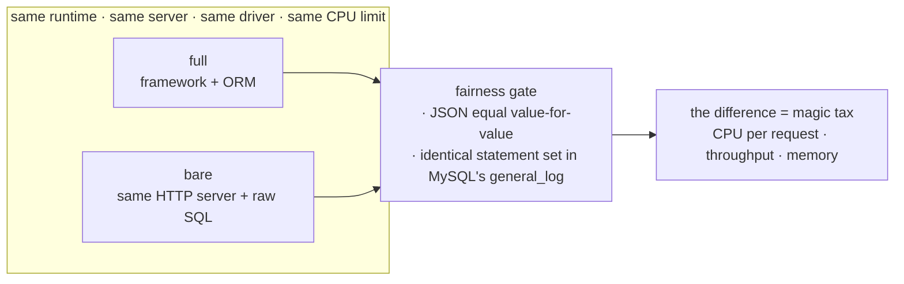

> Measured: 2026-08-31
> Code and raw results: https://github.com/MartianLee/study-rails-compare
> Environment: Docker Linux containers + MySQL 8.4 · median of three independent runs

---

_This article is mostly written by Claude Code_

## Contents

1. [Why this argument never resolves](#1-why-this-argument-never-resolves)
2. [Rewriting it into a question that has an answer](#2-rewriting-it-into-a-question-that-has-an-answer)
3. [Hello-world measures a router](#3-hello-world-measures-a-router)
4. [What makes a benchmark believable is the gate, not the numbers](#4-what-makes-a-benchmark-believable-is-the-gate-not-the-numbers)
5. [The magic tax](#5-the-magic-tax)
6. [What is Active Record actually spending?](#6-what-is-active-record-actually-spending)
7. [Why god models cost — measuring column count](#7-why-god-models-cost--measuring-column-count)
8. [Slicing one Rails request into layers](#8-slicing-one-rails-request-into-layers)
9. [Give it four cores and one process still cannot pass one](#9-give-it-four-cores-and-one-process-still-cannot-pass-one)
10. [Eight workers is not eight times the memory](#10-eight-workers-is-not-eight-times-the-memory)
11. [YJIT depends enormously on the workload](#11-yjit-depends-enormously-on-the-workload)
12. [Latency is a completely different story](#12-latency-is-a-completely-different-story)
13. [I threw away two campaigns — and that was the most useful result](#13-i-threw-away-two-campaigns--and-that-was-the-most-useful-result)
14. [What this does not measure](#14-what-this-does-not-measure)
15. [Running it yourself](#15-running-it-yourself)

## 1. Why this argument never resolves

"Is Rails slow?"

The question has no answer — not because the answer is hidden, but because **four different questions are wearing one costume**.

| what "slow" means                     | what you would have to measure              |
| ------------------------------------- | ------------------------------------------- |
| users wait a long time for a response | p50 / p95 latency                           |
| the same traffic costs more servers   | throughput per core                         |
| it eats memory                        | resident memory per process × process count |
| development is slow                   | boot time, CI time, feedback loop           |

The four answers differ. So when one person answers #1 with "no" and another answers #2 with "yes," both are right and the conversation still goes nowhere.

Underneath sits a deeper problem. **A Rails app and a Go app are never doing the same work.** Rails takes a request through a middleware stack, routes it, turns database rows into objects, hangs association methods on those objects, arms dirty tracking, and runs callbacks. The Go `net/http` handler calls `rows.Scan`. Dividing one throughput by the other tells you far less about "how much faster Go is than Ruby" than about **how much more work you asked one of them to do**.

## 2. Rewriting it into a question that has an answer

So I narrowed it:

> **Inside one runtime, how much are you paying for the framework and the ORM?**

That one is answerable, because you can put **two servers that return the same response** on the same language, the same HTTP server, the same driver and the same machine — and subtract.

| runtime | full — framework + ORM    | bare — same server, raw SQL |
| ------- | ------------------------- | --------------------------- |
| Ruby    | Rails 8.1 + Active Record | Rack + `mysql2`             |
| Node    | Express 4 + Sequelize 6   | `node:http` + `mysql2`      |
| Python  | Django 5.1 + Django ORM   | WSGI + `mysqlclient`        |
| Go      | Gin + GORM                | `net/http` + `database/sql` |

Each pair shares the runtime, the HTTP server, the driver, the MySQL wire protocol, the CPU limit and the machine. **The only difference is the framework and the ORM.** Because the subtraction happens inside one runtime, the result is not contaminated by the fact that Go is faster than Ruby.

I will call that difference the **magic tax**.



## 3. Hello-world measures a router

Most framework benchmarks return `"Hello, World"`. That measures a router. **Nobody deploys a router.**

So the workload is a **blog list endpoint** — the most common shape in a CRUD service:

```
GET /api/posts?page=3
  → 20 published posts, newest first
  → each with its author, its tags, and its comment count
  → 4 SQL statements, all preloaded, no N+1
```

Plus a detail page that exercises nested serialisation (6 statements) and a write path that validates, inserts and bumps a counter cache in one transaction. Against 500 users, 5,000 posts, 40,000 comments and 15,167 post/tag links.

## 4. What makes a benchmark believable is the gate, not the numbers

The real failure mode of a benchmark post is not wrong arithmetic. It is that **the things being compared are quietly doing different work**. If one ORM fetches with a single join and the other fires three queries, comparing their throughput compares query plans, not frameworks.

So the gate came before the measurement. `harness/verify.py` boots each of the eight in turn and refuses to let a run count unless three things hold.

**① The JSON is equal value-for-value.** Every stack's response is diffed against the Rails app's. Key order and integer formatting are normalised; nothing else may differ.

**② The SQL MySQL actually received is the same.** This is the important one. Rather than trusting each stack's own query log, the harness **turns on MySQL's `general_log` and reads back the statements the server actually received.** Four for the list, six for the detail, same tables, same predicates.

**③ The write path really works.** Returns `201`, collapses whitespace, actually increments the counter cache, returns `422` on a blank body.

The full text of all 80 statements MySQL received is committed at [`docs/sql-emitted.md`](https://github.com/MartianLee/study-rails-compare/blob/main/docs/sql-emitted.md). Check that file rather than trusting this paragraph.

### The concession I had to make

The tag load on the list endpoint is **two statements, not one join**. Active Record's `has_and_belongs_to_many` preload and GORM's `many2many` preload both fetch the join rows first and the tags second, and neither can reasonably be talked out of it. Rather than bend two ORMs into an unnatural shape, **I wrote the other six stacks to emit what those two emit.**

There are a few more concessions like it, all written down in [`SPEC.md`](https://github.com/MartianLee/study-rails-compare/blob/main/SPEC.md). **In a benchmark, the lies live in the silences, not in the numbers.**

### The setup

|                |                                                                |
| -------------- | -------------------------------------------------------------- |
| where it runs  | Linux containers throughout (Docker Compose), MySQL 8.4        |
| limits         | identical cgroup CPU and memory limits per app container       |
| load generator | **a container on the same bridge network**                     |
| concurrency    | exactly **one app container runs at a time**                   |
| repeats        | median of 3 runs, database reloaded from seed before every run |

Putting the load generator inside the network is not a preference. Measuring from the macOS host would send every packet through Docker's port forwarder and put that latency in every sample. Host ports are used only for readiness and correctness checks. The load generator itself is in the repo too ([`loadgen/main.go`](https://github.com/MartianLee/study-rails-compare/blob/main/loadgen/main.go), 190 lines of dependency-free Go) — **a benchmark whose measuring instrument is a third-party image nobody can pin is not evidence.**

## 5. The magic tax

Normalised to one core, one process, one thread.

| stack       | what it is              |   rps | CPU per request |   memory |
| ----------- | ----------------------- | ----: | --------------: | -------: |
| rails       | Rails 8 + Active Record |   581 |        1.113 ms | 107.1 MB |
| rails-bare  | Rack + raw SQL          | 2,904 |        0.145 ms |  48.5 MB |
| node        | Express + Sequelize     | 1,406 |        0.567 ms | 183.7 MB |
| node-bare   | node:http + raw SQL     | 4,598 |        0.216 ms |  80.6 MB |
| python      | Django + Django ORM     |   613 |        1.439 ms |  71.4 MB |
| python-bare | WSGI + raw SQL          | 1,911 |        0.234 ms |  27.7 MB |
| go          | Gin + GORM              | 3,420 |        0.277 ms |  25.4 MB |
| go-bare     | net/http + database/sql | 7,986 |        0.110 ms |  15.4 MB |

Divided inside each pair, that is the magic tax:

| runtime | CPU per request | throughput | memory |
| ------- | --------------: | ---------: | -----: |
| Ruby    |       **×7.67** |      ÷5.00 |  ×2.21 |
| Python  |       **×6.14** |      ÷3.12 |  ×2.58 |
| Node    |       **×2.62** |      ÷3.27 |  ×2.28 |
| Go      |       **×2.51** |      ÷2.34 |  ×1.65 |

Three things read out of this.

**① On throughput alone, Rails is genuinely slow.** One fifth of Gin+GORM, one half of Express+Sequelize. That multiplies straight onto your server bill. This axis is not defensible.

**② But the same table contains a number pointing the other way.** Ruby with the magic removed — Rack plus raw SQL — costs 0.145 ms per request, which is **3.9× cheaper than Express+Sequelize (0.567 ms) and the same order of magnitude as Gin+GORM (0.277 ms)**. Same language, same web server, same driver; remove Active Record and you get 7.67×. The accurate sentence is not "Ruby is slow" but **"Active Record is expensive."**

**③ And it isn't a Ruby problem.** Django's ORM costs ×6.14. **The amount of magic is the price**, and the two frameworks that do the most of it cost the most. Go's tax is small not because Go is fast but because GORM has no callbacks, no dirty tracking, and no generated association methods.

On memory the folk wisdom inverts. **Express+Sequelize uses 183.7 MB — 1.7× Rails' 107.1 MB.** "Ruby is a memory hog" does not survive an equal-functionality comparison. The impression that Rails eats memory comes not from a heavy runtime but from **having to run several workers**, which is what sections 9 and 10 are about.

## 6. What is Active Record actually spending?

"The ORM is expensive" explains nothing by itself. So I stacked the same four queries up in four steps **inside the Rails process**, counting time and **objects allocated**. The SQL is identical at every step.

| step                                                                |    time | objects | delta             |
| ------------------------------------------------------------------- | ------: | ------: | ----------------- |
| ① raw mysql2 + hand-built hashes                                    | 0.213ms |     602 | baseline          |
| ② same 4 statements via AR, `pluck` (no models)                     | 0.420ms |   1,473 | +0.207ms · +871   |
| ③ `includes(:user,:tags).to_a` — models built, attributes untouched | 0.755ms |   3,222 | +0.335ms · +1,749 |
| ④ + full serialisation — every attribute read                       | 0.870ms |   3,896 | +0.115ms · +674   |

Running exactly the same SQL costs **121 extra objects and 22 µs per row**. The cost splits three ways — **query layer (Arel, relations, result handling) 32%, model instantiation 51%, attribute reads and type casts 17%.** Note that **passing through Active Record already doubles the cost before a single model is built**.

Counting the objects one request actually creates, by class, shows why:

| class                           |    instances | what it is                                                           |
| ------------------------------- | -----------: | -------------------------------------------------------------------- |
| `ActiveModel::Attribute`        |          140 | one object per attribute — a wrapper so type casting can be deferred |
| `ActiveModel::AttributeSet`     |          137 | one attribute set per model instance                                 |
| `ActiveModel::LazyAttributeSet` |          137 | and a lazy version of that set                                       |
| `…::BelongsToAssociation`       |           86 | a proxy per association so `post.user` can exist                     |
| `ActiveRecord::Relation`        |           66 | `post.tags` is a fresh relation each time                            |
| `Post` / `User` / `Tag`         | 20 / 20 / 31 | **the things we actually wanted**                                    |

**71 objects we wanted, dragging 566 objects of machinery behind them.**

That is the mechanical identity of "Active Record is slow." There is no slow algorithm anywhere; it is that **every time a row becomes an object, the machinery for everything that object might later do gets built alongside it.** Dirty tracking, deferred type casting, `post.user` — all of them are what that machinery buys. The magic isn't free; it's **prepaid**.

## 7. Why god models cost — measuring column count

Real-world Rails leans hard on god models. The intuition that "a bigger model is slower" is right, but what it costs depends entirely on **which thing gets bigger**. Same 20 rows, same table, same index; only the number of columns that become attributes changes:

| columns selected |    time | objects |
| ---------------: | ------: | ------: |
|                2 | 0.095ms |     353 |
|                4 | 0.104ms |     435 |
|                7 | 0.122ms |     438 |
|               11 | 0.179ms |     862 |

Going from 2 to 11 columns costs **+0.084 ms and +509 objects** — about **0.5 µs and 2.8 objects per row per column**. A 60-column god model adds roughly **0.5 ms and 2,700 objects** to the same 20-row request, which about doubles it.

What is genuinely **free per request** is just as clear:

- **Method count.** Attribute methods are defined once on first use (measured: **0 before, 245 after**) and inline caches take it from there. **A 3,000-line model with 12 columns costs the same per request as a thin one.**
- Association declarations you don't traverse.
- Lines of code in the model file — that is boot time only.

So the cost is **not "the model is big" but "the table is wide."**

That said, what actually makes god models slow in production hits harder than column count. **`after_commit` fires on every save while the call site shows one line of `save`**, `default_scope` adds a predicate to every query, and a wide serialisation surface makes forgetting `includes` structurally likely. That is N+1, and it is tens of times the column cost.

**A god model is not slow because it is heavy. It is slow because you cannot see, at the call site, what comes with it.**

## 8. Slicing one Rails request into layers

Same Rails process, same middleware, same router, same renderer — only the inside of the action changes, so every difference belongs to that layer.

| what runs inside the action            |      rps | CPU per request |
| -------------------------------------- | -------: | --------------: |
| Rails, no database (`/api/static`)     | 5,562rps |        0.127 ms |
| same 4 queries, `pluck`, no AR objects |   854rps |        0.675 ms |
| same 4 queries, full Active Record     |   581rps |        1.113 ms |

**What's slow is not Rails, it's Active Record.** Thirteen middlewares, the router, the controller and the renderer together account for 0.127 ms per request — **11.4% of the total**. The other 88.6% is the ORM.

And this is **not a fixed cost you pay once.** The fixed part is only 11.4%; 88.6% scales with rows and objects. Active Record is not a runtime you switch on and use for free — it is the work of building an object per row and attaching machinery to each one.

**What that means in practice:** trimming middleware or tuning routing is **carving up an 11% pie**. Avoiding AR object construction with `pluck` or `select` is a **1.6× lever**, and dropping columns you don't need is the same kind of lever.

## 9. Give it four cores and one process still cannot pass one

Ruby has a **GVL (Global VM Lock)**. One lock per process; to run Ruby code you must hold it. Create a hundred threads and exactly one of them runs Ruby code.

There is a moment when the lock is released, though — while waiting for the database. So the received wisdom is that more threads let you overlap that wait. I measured it. **One process, 1 CPU, concurrency 8, varying only the thread count:**

| Puma threads | rps | vs 1 thread | cores used | CPU per request |
| -----------: | --: | ----------: | ---------: | --------------: |
|            1 | 616 |       1.00× |       0.66 |        1.072 ms |
|            2 | 606 |       0.98× |       0.84 |        1.395 ms |
|            3 | 452 |       0.73× |       0.81 |        1.801 ms |
|            5 | 398 |   **0.65×** |       0.81 |        2.038 ms |
|           10 | 422 |       0.69× |       0.83 |        1.962 ms |

**Throughput goes down, not up.** The threads _do_ claim the idle CPU — 0.66 → 0.81 cores. But that CPU goes into **GVL handoff and context switching** rather than into requests. CPU per request nearly doubles, 1.07 → 2.04 ms.

Strip Rails away and it is starker. Rack plus raw SQL on the same Puma goes **2,938 → 824 rps (0.28×)**, with CPU per request rising 0.139 → 0.834 ms — **six times**. The less Ruby work per request, the larger the handoff cost looms.

To check this wasn't a single-core artifact I repeated it with **four CPUs** and concurrency 32:

| Puma threads (4 CPUs) | rps | vs 1 thread | cores used / 4.0 | CPU per request |
| --------------------: | --: | ----------: | ---------------: | --------------: |
|                     1 | 462 |       1.00× |             0.48 |        1.041 ms |
|                     2 | 512 |       1.11× |             0.70 |        1.358 ms |
|                     3 | 383 |       0.83× |             0.71 |        1.855 ms |
|                     5 | 362 |       0.78× |             0.74 |        2.040 ms |
|                    10 | 425 |       0.92× |         **0.81** |        1.915 ms |

**This is the cleanest picture of the GVL in the whole study.** Four cores available, ten threads running, and the process uses **0.81 cores**. The other 3.2 sit idle with no way to reach them. And CPU per request comes out nearly identical to the single-core run (1.041/1.072, 2.040/2.038), so this is **a real cost, not scheduler noise**. It is why Rails 7.2 dropped Puma's default thread count from 5 to 3.

This conclusion is bound to the workload, though. This endpoint fires four statements at a local MySQL and returns; the wait is milliseconds. **An action that waits 200 ms on a third-party API has far more to overlap, and threads clearly pay there.** What threads buy is directly proportional to the share of request time not spent executing Ruby, and that share is app-specific.

**So the only way to use your cores is more processes.** And that is the memory bill.

## 10. Eight workers is not eight times the memory

If workers are the memory problem, is eight workers eight times the memory? No. And the misconception costs real money — it buys instances you don't need and sets container limits too high.

| workers | actual memory | naive estimate | overestimate | per extra worker |   rps |
| ------: | ------------: | -------------: | -----------: | ---------------: | ----: |
|       1 |      122.6 MB |       122.6 MB |        ×1.00 |                — |   364 |
|       2 |      198.2 MB |       245.2 MB |        ×1.24 |          75.6 MB |   847 |
|       4 |      316.5 MB |       490.4 MB |        ×1.55 |          64.6 MB | 1,585 |
|       8 |      553.2 MB |       980.8 MB |    **×1.77** |      **61.5 MB** | 2,291 |

Workers are made with `fork`, and `fork` does not copy memory — the child **points at the parent's pages** until someone writes (copy-on-write). A Rails app's code, classes and method tables do not change after boot, so all workers share them outright. The first worker costs 122.6 MB; **each additional one costs about 61.5 MB.**

In the same measurement throughput went from 364 rps at one worker to 2,291 at eight — **6.3×**. **You put in 8× and got 6.3× for 4.5× the memory.** That is the actual exchange rate when you buy concurrency with RAM.

## 11. YJIT depends enormously on the workload

| 1 core, blog list API        | throughput | CPU per request |    memory |
| ---------------------------- | ---------: | --------------: | --------: |
| YJIT off                     |     370rps |        2.021 ms |   89.1 MB |
| YJIT on (Rails 7.2+ default) |     581rps |        1.113 ms |  107.1 MB |
|                              |      ×1.57 |        **−45%** | **+18MB** |

What makes this interesting is that measuring the same Rails against a **sqlite workload gave YJIT +0.3%** — it didn't pay for itself. That is not a contradiction but a question of **what YJIT compiles**. YJIT only shortens **time spent executing Ruby code**. The sqlite endpoint spent most of its time inside a C extension, leaving little Ruby to shorten; this blog endpoint, as section 6 showed, **builds 3,900 Ruby objects per request** — precisely YJIT's range.

**The practical lesson is not "turn YJIT on" but "measure it on your workload."** The same YJIT on the same Rails is worth +0.3% or ×1.57.

## 12. Latency is a completely different story

Every number so far was measured **at saturation**. To see what a user waits for, you have to look at an unsaturated system. Measured separately at concurrency 4:

| stack                   |     p50 |     p95 |     p99 |
| ----------------------- | ------: | ------: | ------: |
| Rails 8 + Active Record | 3.06 ms | 7.79 ms | 9.30 ms |
| Django + Django ORM     | 2.99 ms | 6.76 ms | 8.93 ms |
| Gin + GORM              | 1.48 ms | 2.61 ms | 3.24 ms |
| Express + Sequelize     | 1.06 ms | 1.49 ms | 2.24 ms |
| Rack + raw SQL          | 0.99 ms | 1.74 ms | 2.24 ms |
| WSGI + raw SQL          | 0.85 ms | 1.27 ms | 1.54 ms |
| net/http + database/sql | 0.70 ms | 1.28 ms | 1.72 ms |
| node:http + raw SQL     | 0.69 ms | 1.08 ms | 1.32 ms |

**The slowest, Rails, is 2.4 ms behind the fastest.** Against a real API response of 100–300 ms, the framework accounts for **1–2% of it**.

Measure the same endpoint at concurrency 50 and Rails' p99 jumps to **552 ms**. That is not performance — it is Puma's `max_fast_inline` default, which serves up to ten keep-alive requests on one connection before yielding, producing a low p50 and an exploding p99. Rack plus raw SQL on the same Puma shows the same shape at 183 ms, and Node and Go show none of it. **It is a property of Puma, not of Ruby.**

**Always state the concurrency when you quote a latency.** 3.06 ms and 552 ms are the same code on the same endpoint.

## 13. I threw away two campaigns — and that was the most useful result

Getting to the final numbers meant discarding two complete campaigns. The reasons are useful to other people, so here they are.

**First — I gave MySQL only four CPUs.** The fast bare stacks pushed it to 3.2 cores, and from there they were **queueing on the database rather than on themselves.** Run-to-run spread reached ±95%. Raising MySQL to eight cores settled go-bare at 7,449 / 7,421 / 7,444. Every measurement window now records how many cores MySQL burned.

**Second — the Go pair was tilted in GORM's favour.** `database/sql`'s `db.Query(sql, args...)` does not cache: it prepares, executes and closes on every call — three round trips plus a fresh parse in MySQL. GORM with `PrepareStmt: true` caches. **The thing GORM was being compared against was handicapped.** I added a statement cache to the bare app and verified from `general_log` that `Prepare` rows per request are zero.

**Also in that campaign** — the write test inserts and deletes 150,000 rows per stack, which fragments the tables. A run against a fragmented table and a run against a freshly loaded one are not the same experiment. The database is now **reloaded from seed before every run**.

Out of all that came the most transferable result in this post.

> Across two campaigns with different configurations, **app CPU per request reproduced within a few percent** (Rails 1.13 → 1.11, Rack 0.144 → 0.140) while **throughput moved by a third**.

The reason is structural: a bare stack does so little per request that its throughput is set by **database round-trip latency**. Therefore —

**The magic tax measured as a throughput ratio depends on how fast your database is.** It is at its maximum against a local unloaded MySQL; against a managed database across a network the framework's share shrinks and the ratio falls. **The CPU ratio does not move, because it is a property of the code rather than of the wire.**

Quote CPU per request when you quote a multiple; state the database conditions when you quote throughput.

## 14. What this does not measure

In a benchmark, the lies live in the silences. So, explicitly:

**Nothing about developer productivity.** The entire reason frameworks exist is missing from every number here. A magic tax of ×7.67 is not an argument against magic; it is **the price tag on it**. Buying with the tag visible differs from buying blind, and that difference is all this post is trying to make.

**Memory is "container working set under load"** (cgroup `memory.current` minus page cache) — the basis on which you are billed and scheduled, not the size of your live data. I did not measure how much a forced GC reclaims; neither V8 nor Ruby promptly returns freed pages to the OS, so the effect runs the same direction for both runtimes.

**In the two-core configuration, MySQL saturated in some measurement windows.** Those windows measured the database rather than the app, so `mysql_cores` is reported alongside every result. The one-core configuration is clean (MySQL peaked at 2.24 of 8.0).

**One endpoint, uniform load.** No cache, no CDN, no background jobs. **The whole dataset fits in the buffer pool** — on purpose, since the goal is to measure the app rather than the disk. In a real service with longer database waits, **the framework's share is smaller than it is here.**

**No framework was tuned.** Every stack is close to what its `new` command or its documentation hands you. **One machine, arm64.** The ratios and the direction travel; the absolute numbers do not.

## 15. Running it yourself

Docker and Python 3 are the only requirements. The host OS does not matter — everything runs inside Linux containers.

```sh
git clone https://github.com/MartianLee/study-rails-compare
cd study-rails-compare

docker compose up -d mysql     # MySQL 8.4
./db/load.sh                   # generates the seed deterministically, loads it
docker compose build           # 8 app images + the load generator

python3 harness/verify.py      # the fairness gate — must pass
python3 harness/run.py --runs 3
python3 harness/report.py      # -> docs/RESULTS.md
```

The seed comes from a fixed PRNG seed, so any machine produces identical bytes. Image builds are pinned to the committed `Gemfile.lock` / `package-lock.json` / `go.sum`.

Full code, raw per-run results, and the SQL MySQL actually received:

**https://github.com/MartianLee/study-rails-compare**

---

So, the answer to the original question. **On latency, no** — 3.06 ms, 1–2% of a real request. **On server count, yes** — one fifth of Gin+GORM. **And the source of that gap is not Ruby, it is Active Record**: same language, same Puma, same driver, and CPU per request drops by 7.67×.

Which makes the real question not "is Rails slow" but **"what are we paying for this magic, and do we know the price when we pay it?"**
