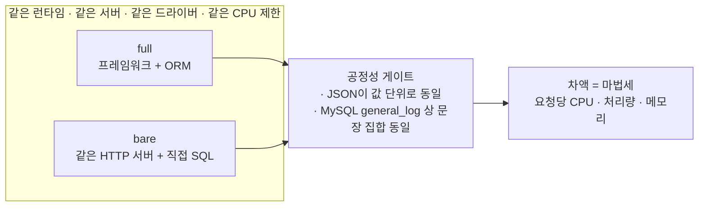

> 측정 일자: 2026-08-31
> 코드·원본 결과: https://github.com/MartianLee/study-rails-compare
> 환경: Docker Linux 컨테이너 + MySQL 8.4 · 3회 독립 측정의 중앙값

---

_This article is mostly written by Claude Code_

## 목차

1. [이 논쟁이 늘 겉도는 이유](#1-이-논쟁이-늘-겉도는-이유)
2. [답할 수 있는 질문으로 바꾸기](#2-답할-수-있는-질문으로-바꾸기)
3. [hello world는 라우터를 잽니다](#3-hello-world는-라우터를-잽니다)
4. [벤치마크를 믿게 만드는 건 숫자가 아니라 게이트입니다](#4-벤치마크를-믿게-만드는-건-숫자가-아니라-게이트입니다)
5. [마법세 — 결과](#5-마법세--결과)
6. [Active Record는 대체 무엇을 쓰고 있나](#6-active-record는-대체-무엇을-쓰고-있나)
7. [god model은 왜 비싼가 — 컬럼 수를 재봤습니다](#7-god-model은-왜-비싼가--컬럼-수를-재봤습니다)
8. [Rails 요청을 층으로 자르면](#8-rails-요청을-층으로-자르면)
9. [코어를 4개 줘도 한 프로세스는 1코어를 못 넘습니다](#9-코어를-4개-줘도-한-프로세스는-1코어를-못-넘습니다)
10. [워커 8개는 메모리 8배가 아닙니다](#10-워커-8개는-메모리-8배가-아닙니다)
11. [YJIT은 워크로드를 심하게 탑니다](#11-yjit은-워크로드를-심하게-탑니다)
12. [응답 시간은 완전히 다른 얘기입니다](#12-응답-시간은-완전히-다른-얘기입니다)
13. [측정을 두 번 통째로 버렸습니다 — 그리고 그게 제일 쓸모 있는 결과였습니다](#13-측정을-두-번-통째로-버렸습니다--그리고-그게-제일-쓸모-있는-결과였습니다)
14. [이 측정이 말하지 않는 것](#14-이-측정이-말하지-않는-것)
15. [재현하기](#15-재현하기)

## 1. 이 논쟁이 늘 겉도는 이유

"Rails는 느린가요?"

이 질문에는 답이 없습니다. **질문 하나에 서로 다른 뜻 네 가지가 섞여 있기 때문**입니다.

| "느리다"의 뜻                 | 실제로 재야 하는 것                  |
| ----------------------------- | ------------------------------------ |
| 사용자가 응답을 오래 기다린다 | p50 / p95 지연시간                   |
| 같은 트래픽에 서버가 더 든다  | 코어당 처리량                        |
| 메모리를 많이 먹는다          | 프로세스당 상주 메모리 × 프로세스 수 |
| 개발이 느리다                 | 부팅 시간, CI 시간, 피드백 루프      |

넷의 답이 전부 다릅니다. 그래서 한 사람은 응답 시간을 두고 "아니요"라고 답하고 다른 사람은 서버 대수를 두고 "예"라고 답합니다. 둘 다 맞는데 대화는 끝나지 않습니다.

그리고 그 밑에 더 근본적인 문제가 깔려 있습니다. **Rails 앱과 Go 앱은 애초에 같은 일을 하지 않습니다.** Rails는 요청을 미들웨어 스택에 통과시키고 라우팅하고 DB 행을 객체로 만들고 그 객체에 연관관계 메서드를 달아주고 더티 트래킹을 걸고 콜백을 돌립니다. Go의 `net/http` 핸들러는 `rows.Scan`을 부릅니다. 이 둘의 처리량을 나눈 숫자는 Go가 Ruby보다 몇 배 빠른지보다 **"우리가 한쪽에 얼마나 더 많은 일을 시켰는가"**에 훨씬 가깝습니다.

## 2. 답할 수 있는 질문으로 바꾸기

그래서 질문을 좁혔습니다.

> **한 런타임 안에서, 프레임워크와 ORM에 얼마를 지불하고 있는가?**

이건 답할 수 있습니다. 같은 언어, 같은 HTTP 서버, 같은 DB 드라이버, 같은 머신 위에 **같은 응답을 내는 서버를 두 개** 올려 두고 그 차이를 재면 되기 때문입니다.

| 런타임 | full — 프레임워크 + ORM   | bare — 같은 서버, 직접 SQL  |
| ------ | ------------------------- | --------------------------- |
| Ruby   | Rails 8.1 + Active Record | Rack + `mysql2`             |
| Node   | Express 4 + Sequelize 6   | `node:http` + `mysql2`      |
| Python | Django 5.1 + Django ORM   | WSGI + `mysqlclient`        |
| Go     | Gin + GORM                | `net/http` + `database/sql` |

각 쌍은 런타임도, HTTP 서버도, 드라이버도, MySQL 와이어 프로토콜도, CPU 제한도, 머신도 같습니다. **다른 것은 프레임워크와 ORM뿐입니다.** 차이를 한 런타임 안에서 구하기 때문에 이 값에는 Go가 Ruby보다 빠르다는 언어 차이가 섞여 들지 않습니다.

이 글에서는 그 차액을 **마법세(magic tax)** 라고 부르겠습니다.



## 3. hello world는 라우터를 잽니다

기존 프레임워크 벤치마크의 대부분은 `"Hello, World"`를 반환합니다. 그 숫자는 라우터의 속도일 뿐입니다. **라우터만 배포하는 사람은 없습니다.**

그래서 워크로드를 **블로그 목록 API**로 잡았습니다. CRUD 서비스에서 가장 흔한 모양이기 때문입니다.

```
GET /api/posts?page=3
  → 발행된 글 20건, 최신순
  → 각 글마다 작성자, 태그 목록, 댓글 수
  → SQL 4문장, 전부 preload, N+1 없음
```

여기에 중첩 직렬화를 재는 상세 페이지(6문장)와 쓰기 경로를 더했습니다. 쓰기 경로는 검증·삽입·카운터 갱신을 한 트랜잭션에서 처리합니다. 데이터는 사용자 500명, 글 5,000건, 댓글 40,000건, 글–태그 연결 15,167건입니다.

## 4. 벤치마크를 믿게 만드는 건 숫자가 아니라 게이트입니다

벤치마크 글은 산수가 틀려서 실패하지 않습니다. **비교 대상이 몰래 다른 일을 하고 있는 것**이 진짜 실패입니다. 한쪽 ORM은 조인 한 방으로 가져오고 다른 쪽은 쿼리 세 방을 날리는데 처리량만 비교하면 그건 프레임워크 비교가 아니라 쿼리 플랜 비교입니다.

그래서 측정보다 게이트를 먼저 만들었습니다. `harness/verify.py`는 여덟 스택을 차례로 띄워 세 가지를 확인하고 하나라도 어긋나면 그 측정을 거부합니다.

**① JSON이 값 단위로 같은가.** Rails 앱의 응답을 기준으로 나머지 일곱 개를 값 대 값으로 비교합니다. 키 순서와 정수 표기만 정규화하고 그 외에는 완전히 같아야 합니다.

**② MySQL이 실제로 받은 SQL이 같은가.** 세 가지 중에 이게 제일 중요합니다. 각 스택의 자기 로그를 믿지 않고 **MySQL의 `general_log`를 켜서 서버가 실제로 받은 문장을 되읽습니다.** 목록 4문장, 상세 6문장, 같은 테이블에 같은 조건.

**③ 쓰기 경로가 진짜 동작하는가.** `201`을 주는지, 공백을 정규화하는지, 카운터 캐시가 실제로 1 증가하는지, 빈 본문에 `422`를 주는지.

MySQL이 각 스택에서 실제로 받은 문장 80개 전문은 저장소의 [`docs/sql-emitted.md`](https://github.com/MartianLee/study-rails-compare/blob/main/docs/sql-emitted.md)에 그대로 커밋돼 있습니다. 이 문단을 믿지 마시고 그 파일을 보시면 됩니다.

### 여기서 양보한 것

목록 엔드포인트의 태그 로딩은 **조인 한 방이 아니라 두 문장**입니다. Active Record의 `has_and_belongs_to_many` preload와 GORM의 `many2many` preload가 둘 다 조인 행을 먼저 가져오고 태그를 그다음에 가져옵니다. 둘 다 이걸 바꿀 방법이 마땅치 않습니다. 두 ORM을 부자연스러운 모양으로 비트는 대신 **나머지 여섯 스택을 그 둘이 내는 문장에 맞췄습니다.**

이런 양보가 몇 개 더 있고 전부 [`SPEC.md`](https://github.com/MartianLee/study-rails-compare/blob/main/SPEC.md)에 적어 두었습니다. **벤치마크의 거짓말은 숫자가 아니라 말하지 않은 것 속에 숨어 있습니다.**

### 측정 환경

|             |                                                      |
| ----------- | ---------------------------------------------------- |
| 실행        | 전부 Linux 컨테이너(Docker Compose), MySQL 8.4       |
| 제한        | 앱 컨테이너마다 동일한 cgroup CPU·메모리 제한        |
| 부하 생성기 | **같은 브리지 네트워크 안의 컨테이너**               |
| 동시 실행   | 앱은 **한 번에 하나만** 기동                         |
| 반복        | 3회 독립 측정의 중앙값, run마다 DB를 시드에서 재적재 |

부하 생성기를 컨테이너 안에 둔 것은 취향의 문제가 아닙니다. macOS 호스트에서 재면 모든 패킷이 Docker의 포트 포워더를 통과하고 그 지연이 모든 샘플에 들어갑니다. 호스트 포트는 준비 상태 확인과 정합성 검증에만 씁니다. 부하 생성기 자체도 저장소 안에 있습니다([`loadgen/main.go`](https://github.com/MartianLee/study-rails-compare/blob/main/loadgen/main.go), 의존성 없는 Go 190줄). **서드파티 이미지를 측정 도구로 쓰면서 버전도 고정하지 못하는 벤치마크는 증거가 될 수 없기 때문**입니다.

## 5. 마법세 — 결과

코어 1개, 프로세스 1개, 스레드 1개로 정규화한 값입니다.

| 스택        | 무엇인가                |   rps | 요청당 CPU |   메모리 |
| ----------- | ----------------------- | ----: | ---------: | -------: |
| rails       | Rails 8 + Active Record |   581 |   1.113 ms | 107.1 MB |
| rails-bare  | Rack + 직접 SQL         | 2,904 |   0.145 ms |  48.5 MB |
| node        | Express + Sequelize     | 1,406 |   0.567 ms | 183.7 MB |
| node-bare   | node:http + 직접 SQL    | 4,598 |   0.216 ms |  80.6 MB |
| python      | Django + Django ORM     |   613 |   1.439 ms |  71.4 MB |
| python-bare | WSGI + 직접 SQL         | 1,911 |   0.234 ms |  27.7 MB |
| go          | Gin + GORM              | 3,420 |   0.277 ms |  25.4 MB |
| go-bare     | net/http + database/sql | 7,986 |   0.110 ms |  15.4 MB |

각 쌍에서 full을 bare로 나눈 값이 마법세입니다.

| 런타임 | 요청당 CPU | 처리량 | 메모리 |
| ------ | ---------: | -----: | -----: |
| Ruby   |  **×7.67** |  ÷5.00 |  ×2.21 |
| Python |  **×6.14** |  ÷3.12 |  ×2.58 |
| Node   |  **×2.62** |  ÷3.27 |  ×2.28 |
| Go     |  **×2.51** |  ÷2.34 |  ×1.65 |

이 표는 세 가지를 말해 줍니다.

**처리량만 보면 Rails는 확실히 느립니다.** Gin+GORM의 1/5.9, Express+Sequelize의 1/2.4입니다. 이건 그대로 서버 청구서에 곱해집니다. 이 기준으로는 반박할 여지가 없습니다.

**그런데 같은 표에 반대 방향 숫자가 있습니다.** 마법을 뺀 Ruby(Rack + 직접 SQL)는 요청당 CPU 0.145ms로 **Express+Sequelize(0.567ms)보다 3.9배 싸고 Gin+GORM(0.277ms)과 같은 자릿수**입니다. 언어도, 웹서버도, 드라이버도 안 바꾸고 Active Record만 뺐는데 7.67배가 나옵니다. 정확히 말하면 Ruby가 느린 게 아닙니다. **Active Record가 비싼 것**입니다.

**그리고 이건 루비만의 문제가 아닙니다.** Django ORM도 ×6.14입니다. **마법의 양이 곧 가격**이고 마법을 제일 많이 부리는 두 프레임워크가 제일 비쌉니다. Go의 세금이 작은 건 Go가 빨라서가 아닙니다. GORM에 콜백도, 더티 트래킹도, 연관관계 메서드 자동 생성도 없기 때문입니다.

메모리에서는 통념이 뒤집힙니다. **Express+Sequelize가 183.7MB로 Rails(107.1MB)의 1.7배**입니다. 루비가 메모리를 많이 먹는다는 말은 동일 기능 비교 앞에서는 성립하지 않습니다. Rails가 메모리를 많이 쓴다는 인상은 런타임이 무거워서가 아니라 **워커를 여러 개 띄워야 하기 때문**입니다. 그건 9장과 10장의 주제입니다.

## 6. Active Record는 대체 무엇을 쓰고 있나

ORM이 비싸다는 말은 그 자체로 아무것도 설명하지 않습니다. 그래서 Rails 프로세스 **안에서** 같은 4개 쿼리를 네 단계로 쌓아 올리며 시간과 **할당된 객체 수**를 셌습니다. SQL은 전 단계 동일합니다.

| 단계                                                    |    시간 | 할당 객체 | 증분              |
| ------------------------------------------------------- | ------: | --------: | ----------------- |
| ① mysql2 직접 + 손으로 만든 해시                        | 0.213ms |       602 | 기준선            |
| ② 같은 4문장을 AR로, `pluck` (모델 없음)                | 0.420ms |     1,473 | +0.207ms · +871   |
| ③ `includes(:user,:tags).to_a` — 모델 생성, 속성 미접근 | 0.755ms |     3,222 | +0.335ms · +1,749 |
| ④ + 전체 직렬화 — 모든 속성 실제 읽기                   | 0.870ms |     3,896 | +0.115ms · +674   |

같은 SQL을 돌리고도 모델을 만들고 읽는 두 단계(②→④)에서만 **행 하나당 객체 121개와 22µs**가 더 듭니다. 비용은 셋으로 갈립니다. **쿼리 계층(Arel·릴레이션·결과 처리) 32%, 모델 생성 51%, 속성 읽기(타입 캐스팅) 17%.** **모델을 하나도 만들지 않아도 AR을 통과하는 것만으로 이미 2배**입니다.

요청 1건에서 실제로 생긴 객체를 클래스별로 세면 왜 그런지가 보입니다.

| 클래스                          |         개수 | 정체                                                           |
| ------------------------------- | -----------: | -------------------------------------------------------------- |
| `ActiveModel::Attribute`        |          140 | 속성 하나가 곧 객체 하나. 타입 캐스팅을 미루려고 값을 감쌉니다 |
| `ActiveModel::AttributeSet`     |          137 | 모델 인스턴스마다 속성 집합이 하나씩                           |
| `ActiveModel::LazyAttributeSet` |          137 | 그 집합의 지연 버전이 또 하나                                  |
| `…::BelongsToAssociation`       |           86 | `post.user`를 부를 수 있게 하려고 연관관계마다 프록시          |
| `ActiveRecord::Relation`        |           66 | `post.tags`가 매번 새 릴레이션                                 |
| `Post` / `User` / `Tag`         | 20 / 20 / 31 | **정작 우리가 원한 것**                                        |

**실제로 원한 객체는 71개인데 그걸 감싸는 기계장치가 566개 따라옵니다.**

이게 Active Record가 느리다는 말의 기계적 정체입니다. 어딘가에 느린 알고리즘이 있는 게 아닙니다. **행 하나를 객체로 만들 때마다 그 객체가 나중에 무엇이든 할 수 있도록 준비물을 함께 만드는** 것입니다. 더티 트래킹도, 지연 타입 캐스팅도, `post.user`도 전부 그 준비물 덕분에 되는 것들입니다. 마법은 공짜가 아닙니다. **선불**입니다.

## 7. god model은 왜 비싼가 — 컬럼 수를 재봤습니다

실무의 Rails MVC는 god model에 크게 의존합니다. 모델이 커지면 느려지겠다는 직관은 맞습니다. 다만 **무엇이 커지느냐**에 따라 비용이 0일 수도 있고 선형으로 늘 수도 있습니다. 같은 20행, 같은 테이블, 같은 인덱스에서 **속성이 되는 컬럼 수만** 바꿔 재봤습니다.

| 선택한 컬럼 |    시간 | 할당 객체 |
| ----------: | ------: | --------: |
|         2개 | 0.095ms |       353 |
|         4개 | 0.104ms |       435 |
|         7개 | 0.122ms |       438 |
|        11개 | 0.179ms |       862 |

2개에서 11개로 늘리면 **+0.084ms, +509객체**. 행당 컬럼당 약 **0.5µs와 객체 2.8개**입니다. 컬럼 60개짜리 god model이면 같은 20행에 요청당 **0.5ms와 객체 2,700개가 더** 붙습니다. 요청 비용이 대략 두 배가 됩니다.

반대로 **요청당 공짜인 것**도 분명합니다.

- **메서드 개수.** 속성 메서드는 최초 사용 때 한 번 생성되고(실측: 사용 전 0개 → 후 **245개**) 그 뒤로는 인라인 캐시가 처리합니다. **3,000줄짜리 모델이라도 컬럼이 12개면 요청당 비용은 얇은 모델과 같습니다.**
- 연관관계 선언 — 실제로 호출하지 않으면 공짜입니다.
- 모델 파일 줄 수 — 부팅 시간에만 영향을 줍니다.

**비용을 만드는 건 모델의 크기가 아니라 테이블의 너비**입니다.

다만 실무에서는 컬럼 수보다 다음 세 가지가 god model을 더 느리게 만듭니다. **`after_commit`이 저장마다 도는데 호출부에서는 `save` 한 줄로 보이고**, `default_scope`는 모든 쿼리에 조건을 얹으며 직렬화 대상이 넓으니 `includes`를 빠뜨릴 확률이 구조적으로 높습니다. 그게 N+1이고 컬럼 비용의 수십 배입니다.

**god model은 무거워서 느린 게 아닙니다. 무엇이 딸려오는지 호출부에서 안 보여서 느립니다.**

## 8. Rails 요청을 층으로 자르면

같은 Rails 프로세스에서 미들웨어도 라우터도 렌더러도 그대로 두고 **액션 안쪽만** 바꿔가며 측정했습니다. 차이는 전부 해당 층의 몫입니다.

| 액션 안에서 도는 것                  |   처리량 | 요청당 CPU |
| ------------------------------------ | -------: | ---------: |
| Rails, DB 없음 (`/api/static`)       | 5,562rps |   0.127 ms |
| 같은 쿼리 4개, `pluck`, AR 객체 없음 |   854rps |   0.675 ms |
| 같은 쿼리 4개, 전체 Active Record    |   581rps |   1.113 ms |

**느린 건 Rails가 아니라 Active Record입니다.** 미들웨어 13개, 라우터, 컨트롤러, 렌더러를 다 합친 Rails 프레임워크의 몫은 요청당 0.127ms, **전체의 11.4%**입니다. 나머지 88.6%가 ORM입니다.

그리고 이건 **한 번 내면 끝나는 고정비가 아닙니다.** 고정비는 11.4%뿐이고 88.6%가 행 수·객체 수에 비례합니다. Active Record는 켜두면 공짜로 쓰는 런타임이 아닙니다. 행마다 객체를 만들고 그 객체마다 준비물을 붙이는 일입니다.

**실무에서 의미하는 것:** 미들웨어를 줄이거나 라우팅을 손보는 최적화는 **11%짜리 파이를 나누는 일**입니다. 반대로 `pluck`·`select`로 AR 객체를 안 만드는 것은 **1.6배짜리 레버**이고 필요 없는 컬럼을 빼는 것도 같은 종류의 레버입니다.

## 9. 코어를 4개 줘도 한 프로세스는 1코어를 못 넘습니다

루비에는 **GVL(Global VM Lock)** 이 있습니다. 프로세스 하나에 자물쇠가 딱 하나 있고 루비 코드를 실행하려면 그 자물쇠를 쥐어야 합니다. 스레드를 100개 만들어도 그중 하나만 루비 코드를 실행합니다.

다만 자물쇠를 놓는 순간이 있습니다. DB 응답을 기다리는 동안에는 놓습니다. 그래서 스레드를 늘리면 그 대기 시간을 겹칠 수 있다는 게 통설입니다. 재봤습니다. **프로세스 1개, CPU 1코어, 동시성 8, 스레드 수만 변경:**

| Puma 스레드 | rps | 1스레드 대비 | 쓴 코어 | 요청당 CPU |
| ----------: | --: | -----------: | ------: | ---------: |
|           1 | 616 |       1.00배 |    0.66 |   1.072 ms |
|           2 | 606 |       0.98배 |    0.84 |   1.395 ms |
|           3 | 452 |       0.73배 |    0.81 |   1.801 ms |
|           5 | 398 |   **0.65배** |    0.81 |   2.038 ms |
|          10 | 422 |       0.69배 |    0.83 |   1.962 ms |

**처리량이 올라가지 않고 떨어집니다.** 스레드는 유휴 CPU를 **실제로 가져갑니다**(0.66 → 0.81코어). 그런데 그 CPU가 요청 처리가 아니라 **GVL 인계와 컨텍스트 스위칭**에 쓰입니다. 요청당 CPU가 1.07 → 2.04ms로 거의 두 배가 됩니다.

Rails를 걷어내면 더 선명합니다. 같은 Puma 위의 Rack + 직접 SQL은 **2,938 → 824 rps(0.28배)**, 요청당 CPU는 0.139 → 0.834ms로 **6배**가 됩니다. 요청당 루비 코드가 적을수록 인계 비용의 비중이 커지기 때문입니다.

1코어라서 그런 것 아니냐 싶어 **CPU를 4개** 주고 동시성을 32로 올려 반복했습니다.

| Puma 스레드 (CPU 4개) | rps | 1스레드 대비 | 쓴 코어 / 4.0 | 요청당 CPU |
| --------------------: | --: | -----------: | ------------: | ---------: |
|                     1 | 462 |       1.00배 |          0.48 |   1.041 ms |
|                     2 | 512 |       1.11배 |          0.70 |   1.358 ms |
|                     3 | 383 |       0.83배 |          0.71 |   1.855 ms |
|                     5 | 362 |       0.78배 |          0.74 |   2.040 ms |
|                    10 | 425 |       0.92배 |      **0.81** |   1.915 ms |

**이것이 GVL을 가장 선명하게 보여 주는 결과입니다.** 코어를 4개 주고 스레드를 10개 띄웠는데 **쓴 코어는 0.81개**입니다. 나머지 3.2코어는 놀고 있는데 쓸 방법이 없습니다. 그리고 요청당 CPU는 1코어 실험과 거의 같은 값(1.041/1.072, 2.040/2.038)이라 **실재하는 비용**입니다. 스케줄링 잡음이 아닙니다. Rails가 7.2에서 Puma 기본 스레드를 5에서 3으로 낮춘 이유가 이것입니다.

다만 이 결론은 워크로드에 따라 달라집니다. 이 엔드포인트는 로컬 MySQL에 4문장을 던지고 끝나서 대기가 밀리초 단위입니다. **외부 API를 200ms 기다리는 액션이라면 겹칠 시간이 훨씬 커서 스레드가 확실히 이득을 냅니다.** 스레드로 얻는 이득은 요청 시간 중 루비 코드를 실행하지 않는 비중에 정비례하고 그건 앱마다 다릅니다.

**그래서 코어를 쓰려면 프로세스를 더 띄우는 수밖에 없습니다.** 그리고 그게 메모리 청구서입니다.

## 10. 워커 8개는 메모리 8배가 아닙니다

워커가 메모리 문제라면 워커 8개는 메모리 8배일까요. 아닙니다. 그리고 이 오해는 실제로 돈이 듭니다. 필요 없는 인스턴스를 사거나 컨테이너 메모리 제한을 과하게 잡게 만들기 때문입니다.

| 워커 | 실제 메모리 | 순진한 계산 |  과대추정 | 추가 워커 한 개당 |   rps |
| ---: | ----------: | ----------: | --------: | ----------------: | ----: |
|    1 |    122.6 MB |    122.6 MB |     ×1.00 |                 — |   364 |
|    2 |    198.2 MB |    245.2 MB |     ×1.24 |           75.6 MB |   847 |
|    4 |    316.5 MB |    490.4 MB |     ×1.55 |           64.6 MB | 1,585 |
|    8 |    553.2 MB |    980.8 MB | **×1.77** |       **61.5 MB** | 2,291 |

워커는 `fork`로 만들어지는데 `fork`는 메모리를 복사하지 않고 **부모와 같은 페이지를 가리키게만 합니다**(copy-on-write). 쓰기가 일어난 페이지만 그때 복사됩니다. Rails 앱의 코드·클래스·메서드 테이블은 부팅 후 변하지 않으므로 워커 전체가 그대로 공유합니다. 그래서 첫 워커는 122.6MB지만 **추가 워커 한 개의 한계비용은 약 61.5MB**입니다.

같은 측정에서 처리량은 워커 1개 364rps → 8개 2,291rps로 **6.3배** 늘었습니다. **8배를 넣어 6.3배를 얻고 메모리는 4.5배를 낸 셈**입니다. 동시성을 메모리로 산다는 말의 실제 환율이 이겁니다.

## 11. YJIT은 워크로드를 심하게 탑니다

| 코어 1개, 블로그 목록 API   | 처리량 | 요청당 CPU | 부하 중 메모리 |
| --------------------------- | -----: | ---------: | -------------: |
| YJIT 끔                     | 370rps |   2.021 ms |        89.1 MB |
| YJIT 켬 (Rails 7.2+ 기본값) | 581rps |   1.113 ms |       107.1 MB |
|                             |  ×1.57 |   **−45%** |      **+18MB** |

제가 같은 Rails를 **sqlite 워크로드로 쟀을 때는 YJIT이 +0.3%로 본전도 못 뽑았습니다.** 그래서 이 결과가 흥미롭습니다. 모순은 아닙니다. **YJIT이 무엇을 컴파일하는지**의 문제입니다. YJIT은 **루비 코드를 실행하는 시간만** 줄입니다. sqlite 엔드포인트는 비용의 대부분이 C 확장 안에 있어 줄일 루비 코드가 별로 없었습니다. 이 블로그 엔드포인트는 6장에서 봤듯 **요청마다 루비 객체를 3,900개 만드는** 일이라 정확히 YJIT의 사정거리입니다.

**실무 교훈은 "YJIT을 켜라"가 아닙니다. 여러분의 워크로드에서 직접 재보셔야 합니다.** 같은 YJIT이 같은 Rails 위에서 +0.3%도 되고 ×1.57도 됩니다.

## 12. 응답 시간은 완전히 다른 얘기입니다

지금까지의 숫자는 전부 **포화 상태**에서 잰 것입니다. 사용자가 기다리는 시간을 보려면 포화되지 않은 상태를 봐야 합니다. 동시성 4로 따로 쟀습니다.

| 스택                    |     p50 |     p95 |     p99 |
| ----------------------- | ------: | ------: | ------: |
| Rails 8 + Active Record | 3.06 ms | 7.79 ms | 9.30 ms |
| Django + Django ORM     | 2.99 ms | 6.76 ms | 8.93 ms |
| Gin + GORM              | 1.48 ms | 2.61 ms | 3.24 ms |
| Express + Sequelize     | 1.06 ms | 1.49 ms | 2.24 ms |
| Rack + 직접 SQL         | 0.99 ms | 1.74 ms | 2.24 ms |
| WSGI + 직접 SQL         | 0.85 ms | 1.27 ms | 1.54 ms |
| net/http + database/sql | 0.70 ms | 1.28 ms | 1.72 ms |
| node:http + 직접 SQL    | 0.69 ms | 1.08 ms | 1.32 ms |

**가장 느린 Rails가 가장 빠른 것보다 2.4ms 느립니다.** 실무 API 응답이 100~300ms인 걸 감안하면 프레임워크가 만드는 차이는 **전체의 1~2%**입니다.

같은 엔드포인트를 동시성 50으로 재면 Rails의 p99가 **552ms**까지 튑니다. 그건 성능이 아니라 Puma의 `max_fast_inline` 기본값 때문입니다. 한 keep-alive 연결에서 최대 10개를 연속 처리한 뒤에야 다른 연결로 넘어가서 p50은 낮고 p99만 폭발합니다. 같은 Puma를 쓰는 Rack+직접SQL도 183ms로 같은 모양이 나오고 Node·Go에는 없습니다. **Puma의 성질이지 루비의 성질이 아닙니다.**

**지연시간을 인용할 땐 동시성을 반드시 같이 적어야 합니다.** 3.06ms와 552ms는 같은 코드의 같은 엔드포인트입니다.

## 13. 측정을 두 번 통째로 버렸습니다 — 그리고 그게 제일 쓸모 있는 결과였습니다

최종 수치를 얻기까지 측정 전체를 두 번 폐기했습니다. 그 이유가 다른 분들께도 쓸모가 있을 것 같아 적습니다.

**1차 — MySQL에 CPU를 4개만 줬습니다.** 빠른 bare 스택들이 MySQL을 3.2코어까지 밀어붙였습니다. 그때부터는 앱이 아니라 **DB에 줄을 서고 있었습니다.** run 간 편차가 최대 ±95%까지 벌어졌습니다. MySQL을 8코어로 올리니 go-bare가 7,449 / 7,421 / 7,444로 안정됐습니다. 지금은 모든 측정 창에 MySQL이 쓴 코어 수를 같이 기록합니다.

**2차 — Go 쌍이 GORM에 유리하게 기울어 있었습니다.** `database/sql`의 `db.Query(sql, args...)`는 캐시를 하지 않아서 호출마다 prepare → execute → close(왕복 3번 + MySQL 재파싱)를 합니다. GORM은 `PrepareStmt: true`로 캐시합니다. 즉 **GORM의 비교 상대가 핸디캡을 안고 있던 셈**이었습니다. bare 쪽에 statement 캐시를 붙이고 `general_log`의 `Prepare` 행 수가 0인지 직접 확인했습니다.

**같은 2차에서 또 하나** — 쓰기 테스트가 스택당 15만 행을 넣고 지웁니다. 그러면 테이블이 조각납니다. 조각난 테이블에서 잰 run과 갓 적재한 테이블에서 잰 run은 같은 실험이 아닙니다. 지금은 **run마다 시드에서 DB를 다시 적재**합니다.

그 과정에서 이 글에서 가장 널리 적용할 수 있는 결과가 나왔습니다.

> 설정이 다른 두 차례의 측정에서 **앱의 요청당 CPU는 몇 % 안에서 재현**됐는데(Rails 1.13 → 1.11, Rack 0.144 → 0.140) **처리량은 3분의 1이 움직였습니다.**

이유는 구조적입니다. bare 스택은 요청당 자기 일이 워낙 적어서 처리량이 **DB 왕복 지연에 지배**됩니다. 그래서 다음이 성립합니다.

**마법세를 처리량 비율로 재면 DB가 빠를수록 커집니다.** 로컬 MySQL에서 최대치가 나오고 실제로 쓰는 네트워크 너머 매니지드 DB로 가면 프레임워크의 몫이 줄어 비율이 내려갑니다. **CPU 비율은 코드의 성질이라 움직이지 않습니다.**

배수를 인용할 땐 요청당 CPU를, 처리량을 인용할 땐 DB 조건을 함께 적으셔야 합니다.

## 14. 이 측정이 말하지 않는 것

벤치마크의 거짓말은 말하지 않은 것 속에 숨습니다. 그래서 이 측정이 다루지 않은 것을 명시적으로 적습니다.

**개발 생산성은 하나도 재지 않았습니다.** 프레임워크가 존재하는 이유 전체가 이 숫자들에서 빠져 있습니다. 마법세 ×7.67은 마법에 반대하는 논거가 아니라 **마법에 붙은 가격표**입니다. 가격표를 보고 사는 것과 모르고 사는 것은 다릅니다. 이 글은 그 차이만 만들려는 것입니다.

**메모리 수치는 "부하 중 컨테이너 working set"** (cgroup `memory.current` − 페이지 캐시)이며 과금·스케줄링의 기준이지 살아 있는 데이터의 크기가 아닙니다. 강제 GC 후 회수량은 재지 않았습니다. V8도 루비도 회수한 페이지를 OS에 곧바로 반납하지 않으므로 이 값은 두 런타임에 같은 방향으로 작용합니다.

**2코어 설정의 일부 측정 창에서 MySQL이 포화했습니다.** 그 창은 앱이 아니라 DB를 잰 것이라 결과에 `mysql_cores`를 같이 실었습니다. 1코어 설정은 깨끗합니다(MySQL 최대 2.24/8.0).

**단일 엔드포인트, 균일한 부하.** 캐시도 CDN도 백그라운드 잡도 없습니다. **데이터는 전부 버퍼 풀에 들어갑니다.** 일부러 그렇게 잡았습니다. 앱을 재려는 것이지 디스크를 재려는 게 아니기 때문입니다. 실제 서비스처럼 DB 대기가 길어지면 **프레임워크의 비중은 여기보다 작아집니다.**

**어떤 프레임워크도 튜닝하지 않았습니다.** 전부 `rails new` 같은 생성 명령이나 공식 문서의 기본 구성에 가깝습니다. **단일 머신, arm64.** 배수와 방향은 다른 환경에도 옮길 수 있지만 절대값은 그렇지 않습니다.

## 15. 재현하기

Docker와 Python 3만 있으면 됩니다. 호스트 OS는 상관없습니다. 전부 Linux 컨테이너 안에서 돕니다.

```sh
git clone https://github.com/MartianLee/study-rails-compare
cd study-rails-compare

docker compose up -d mysql     # MySQL 8.4
./db/load.sh                   # 시드를 결정론적으로 생성하고 적재
docker compose build           # 앱 이미지 8개 + 부하 생성기

python3 harness/verify.py      # 공정성 게이트 — 통과해야 함
python3 harness/run.py --runs 3
python3 harness/report.py      # -> docs/RESULTS.md
```

시드 데이터는 고정 PRNG 시드로 생성하므로 어느 머신에서 만들어도 같은 바이트가 나옵니다. 이미지 빌드는 커밋된 `Gemfile.lock` / `package-lock.json` / `go.sum`에 고정돼 있습니다.

전체 코드 · 원본 결과 JSON · MySQL이 실제로 받은 SQL 전문:

**https://github.com/MartianLee/study-rails-compare**

---

정리하면, 처음 질문의 답은 이렇습니다. **응답 시간이라면 아니요**(3.06ms, 실무 요청의 1~2%). **서버 대수라면 예**(Gin+GORM의 1/5.9). **그리고 그 격차의 출처는 루비가 아니라 Active Record입니다.** Active Record만 빼면 같은 루비, 같은 Puma, 같은 드라이버에서 요청당 CPU가 7.67배 싸집니다.

그래서 진짜 질문은 "Rails가 느린가"가 아니라 **"우리는 이 마법을 얼마에 사고 있고, 그 값을 알고 지불하는가"**입니다.
