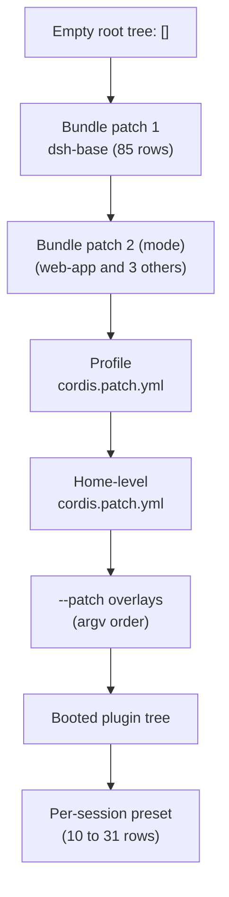
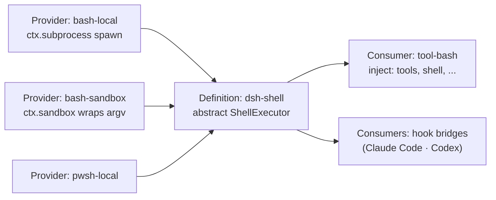
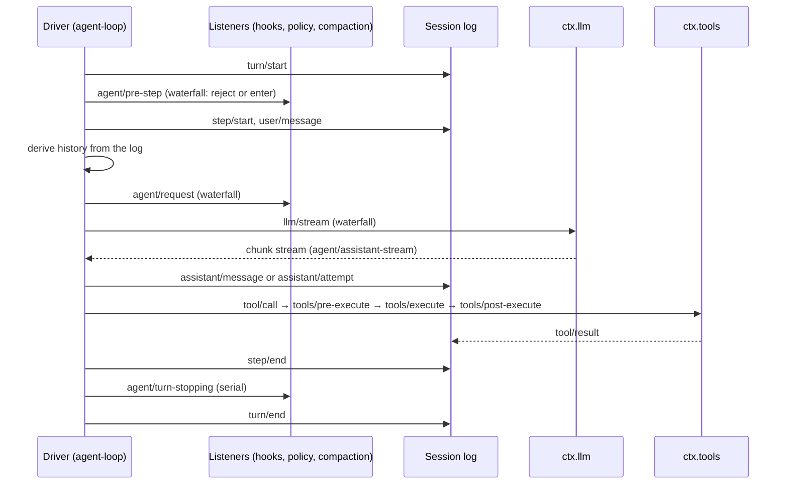

> Analysis date: 2026-09-05
> Target package: `@deepseek-ai/dsh` `0.1.3-alpha.1` (developer preview)
> Target commit: `d347e703908d0406b7a7ef80e3a0e594d86b2215` (`master`, 2026-09-04)
> Repository: https://github.com/deepseek-ai/deepseek-harness
> Local analysis path: shallow clone (`git clone --depth 1`)

---

_This article is mostly written by Claude Code_

## Table of Contents

1. [Why DeepSeek Harness?](#1-why-deepseek-harness)
2. [Where Does It Sit Among the Previous Articles?](#2-where-does-it-sit-among-the-previous-articles)
3. [Understanding the Project in One Sentence](#3-understanding-the-project-in-one-sentence)
4. [Tech Stack and Scale](#4-tech-stack-and-scale)
5. [The Big Picture: The Product Is Patches Stacked on an Empty Tree](#5-the-big-picture-the-product-is-patches-stacked-on-an-empty-tree)
6. [Codebase Map](#6-codebase-map)
7. [The Cordis Kernel: Contexts, Plugins, Effects, and Five Dispatch Modes](#7-the-cordis-kernel-contexts-plugins-effects-and-five-dispatch-modes)
8. [Profiles and Bundles: cordis.yml Is the Product Configuration](#8-profiles-and-bundles-cordisyml-is-the-product-configuration)
9. [Capability Seams: Definition, Provider, Consumer](#9-capability-seams-definition-provider-consumer)
10. [The Agent Loop: Turns, Steps, and a Swappable Driver](#10-the-agent-loop-turns-steps-and-a-swappable-driver)
11. [The Session Log: Everything the Model Saw Is in the Log](#11-the-session-log-everything-the-model-saw-is-in-the-log)
12. [The Tool Execution Pipeline and PTC Mode](#12-the-tool-execution-pipeline-and-ptc-mode)
13. [Sandboxing: bwrap, Landlock, Seatbelt, Windows ACL](#13-sandboxing-bwrap-landlock-seatbelt-windows-acl)
14. [Subagents: Claude Code and Codex as Components](#14-subagents-claude-code-and-codex-as-components)
15. [Workflows, Ralph, and Goals: Three Primitives for Autonomy](#15-workflows-ralph-and-goals-three-primitives-for-autonomy)
16. [Self-Modification: The Agent Edits Its Own Plugin Graph](#16-self-modification-the-agent-edits-its-own-plugin-graph)
17. [Surfaces and Integrations: Web GUI, SDKs, ACP, MCP, Hooks](#17-surfaces-and-integrations-web-gui-sdks-acp-mcp-hooks)
18. [How the Repository Is Run: 100% Coverage, Agent Notes, 53 Verification Gates](#18-how-the-repository-is-run-100-coverage-agent-notes-53-verification-gates)
19. [Compared with OpenCode and Pi: Three Ways to Open a Harness](#19-compared-with-opencode-and-pi-three-ways-to-open-a-harness)
20. [Recommended Reading Order](#20-recommended-reading-order)
21. [Impressive Design Points](#21-impressive-design-points)
22. [Things to Watch Out For](#22-things-to-watch-out-for)
23. [Conclusion](#23-conclusion)

---

## 1. Why DeepSeek Harness?

DeepSeek Harness (`dsh`) was published on August 13, 2026 and crossed 200,000 GitHub stars within two weeks. At the time of this analysis it stands at 212,133 stars and 24,893 forks. Two things explain why a coding-agent harness drew that much attention that fast. One is that a model company, DeepSeek, released its own harness as open source. The other is a single line in the README: **"Everything is a Plugin."**

That line is not marketing. The architecture document puts it this way: "Every part of the product is a plugin, including the model adapter, the tool registry, the session log, and the agent loop itself, so each is replaceable from configuration. There is no privileged core to patch."

Every coding agent covered on this blog answered the question "what do you leave open?" differently. [OpenCode](/kb/2026-06-29-opencode-architecture) opened the model and the client, [Cline](/kb/2026-06-30-cline-architecture) split the core away from its host, and [Qwen Code](/kb/2026-05-17-qwen-code-architecture) extended itself with plugins and a daemon. DeepSeek Harness answers "everything." What that answer looks like in real code, and what it costs, is the subject of this article.

## 2. Where Does It Sit Among the Previous Articles?

| Article | Central problem | Relationship to DeepSeek Harness |
| --- | --- | --- |
| [OpenCode](/kb/2026-06-29-opencode-architecture) | A provider-agnostic headless engine | OpenCode externalized model metadata as data. dsh externalizes the model adapter itself as a plugin row. |
| [Cline](/kb/2026-06-30-cline-architecture) | Separating the core from the host over gRPC | dsh's Web GUI also splits host and client, but both halves are Cordis plugin trees and the RPC layer is generated from a type graph. |
| [Qwen Code](/kb/2026-05-17-qwen-code-architecture) | Plugin and daemon extension of a terminal agent | Qwen Code added extension points. dsh assembles the whole product out of nothing but extension points. |
| [OpenClaw](/kb/2026-03-11-openclaw-architecture) | A personal agent that lives in messengers | The LLM layer of Pi, the harness beneath OpenClaw (`pi-ai`), is dsh's multi-provider adapter, unchanged. |
| [Ruflo](/kb/2026-05-17-ruflo-architecture) | An operations layer outside Claude Code | dsh goes the other way and calls Claude Code and Codex as subagent providers inside itself. |
| [Superpowers](/kb/2026-04-18-superpowers-architecture) | Forcing process and skills onto an agent | dsh's skill provider reads the `SKILL.md` frontmatter format, and the repository enforces its own development process with 11 skills. |
| [agentmemory](/kb/2026-05-13-agentmemory-architecture) | A memory layer for coding agents | dsh ships no built-in memory. It provides three MCP memory-server overlay examples, all off by default. |

## 3. Understanding the Project in One Sentence

**DeepSeek Harness is a TypeScript harness that assembles an agent product by stacking bundles and user patches, in order, onto an empty plugin tree running on the Cordis plugin kernel.**

Three words summarize the project.

- **Cordis**: a framework in which plugins contribute services, typed events, and reversible effects to a shared context.
- **Seam**: the unit of a swappable capability. It consists of three roles, a service definition, a provider, and a consumer.
- **Session log**: an append-only event log from which everything the model saw can be reconstructed. Message history is derived from it.

## 4. Tech Stack and Scale

| Item | Value |
| --- | --- |
| Language | TypeScript (strict, `noImplicitAny`), ESM only |
| Runtime | Node 22.19+ or 24+, pnpm 11.7 workspaces |
| Kernel | Cordis 4.0.0-rc.7, vendored and rescoped as `@deepseek-ai/cordis` |
| Build and test | tsc + tsdown, Vitest 4, oxlint, jscpd, lefthook |
| Packages | 50 groups and 255 workspace packages under `packages/` |
| Code size | about 710k lines of TS/TSX including tests, 863 test files |
| Largest groups | `client` 84k lines, `experimental` 39k, `extensions` 18k, `api` 15k, `core` 14k |
| License | MIT |
| Releases | 10 tags in three weeks, from the `0.1.0-rc` series on 2026-08-13 to `0.1.3-alpha.1` on 2026-09-04 |
| Default model | `deepseek-v4-flash` (`deepseek-v4-pro` and an experimental vision model are also in the catalog) |
| Contributors | 31 |

Two numbers stand out. First, the Web GUI client is the single largest group. The default entry point is not a terminal coding agent but `npx @deepseek-ai/dsh web`, which opens a browser UI. Second, documentation and gates weigh more than the code itself. Section 18 covers that.

## 5. The Big Picture: The Product Is Patches Stacked on an Empty Tree

When `dsh` boots, the profile root `cordis.yml` is **always rewritten to an empty list, `[]`**. The product is the patch layers applied on top of it, in order.



Each patch targets a row by id and replaces its whole `config`, or inserts new rows. Running `dsh --profile web --dump-config` prints the exact tree your machine boots, and any row it prints can be replaced by a patch of your own. The agent loop, the session log, and the model adapter are all rows, so in principle all three are replaceable.

## 6. Codebase Map

```text
vendor/        Vendored Cordis source (cordis, loader, include, group, hmr, timer, schemastery, cosmokit)
packages/      @deepseek-ai/dsh-<pkg>, laid out as packages/<group>/<package>
  core/          Product API spine: session, system-prompt, tools, agent, agent-loop, scope
  llm/           LLM seam + the DeepSeek adapter + the pi-ai multi-provider adapter
  shell/ subprocess/ terminal/ fs/ lsp/   Execution seams
  sandbox/       bwrap / Landlock / Seatbelt / Windows ACL backends
  code-runtime/  Worker-thread code execution for PTC mode
  subagent/      6 providers (in-process spawn/fork, ACP, Codex, Claude Code, dsh SDK)
  workflow/      Worker-thread workflow engine + the workflow/ralph tools
  goal/ schedule/ jobs/ plan/ todo/   Autonomy and state management
  session/ session-query/ storage/    JSONL log, SQLite full-text search, KV storage
  skill/ hooks/ mcp/ acp/ sdk/        Skills, Claude Code/Codex hook bridges, MCP client, ACP server, JSON-RPC SDK
  extensions/    Agent self-modification (the cordis_* tools)
  bundle/ preset/ boot/               Bundles, agent presets, boot glue
  api/ typert/ host/ client/          Typert RPC gateway, Web GUI host and client
  experimental/  Agent Teams, Python code runtime, inspector, WebWorker runtime
apps/cli/      The dsh binary (profile boot, plugin install, dump-config)
python/        Python SDK + a wheel that bundles the dsh runtime
native/        Landlock launcher Node addon
docs/          architecture, cordis-primer, 50-odd subsystem documents (all bilingual English/Chinese)
.agents/       873 Agent Notes, 11 skills the repository uses on itself
scripts/       197 scripts, 53 of them verify-* gates
```

## 7. The Cordis Kernel: Contexts, Plugins, Effects, and Five Dispatch Modes

Cordis is a plugin framework developed since 2022 as the kernel of Koishi, a cross-platform chatbot framework. Its author, Shigma (Yifan Shi), co-wrote "A Programming Paradigm for Spatiotemporal Composability" with DeepSeek researchers, posted to arXiv on August 26, 2026, and it is the paper the dsh README cites. The paper defines two axes. **Temporal composability** is the ability to completely revert a component's side effects when it is removed. **Spatial composability** is the ability to declare and reactively manage dependencies between components. Cordis turns the first into "revertible effects" and the second into "reactive coeffects" as runtime mechanisms.

dsh vendors Cordis as source rather than as an npm dependency. The kernel is small: 9 files and 2,693 lines. The project's own primer summarizes it in five ideas.

1. **A plugin is a function or object with `apply(ctx)`, or a `Service` subclass.**
2. **A context is a repository of services.** A service claims a stable key such as `ctx.tools`, `ctx.llm`, or `ctx.sessions`, and other plugins find it by key instead of importing an implementation.
3. **Dependencies are declared with `inject`.** A plugin waits until the services it names exist, so load order is expressed through service requirements rather than a boot sequence.
4. **Communication goes through typed events.** Event names are registered through declaration merging and dispatched in one of five modes: `emit`, `waterfall`, `parallel`, `serial`, and `bail`.
5. **Registrations are reversible effects.** Prompt sections, tool schemas, adapters, and listeners are all installed through `ctx.effect()` or `ctx.on()`, so reloads and teardown unwind predictably.

`ctx.<key>` is not a field. `Context` is a Proxy, a read walks up the fiber chain's service store, and reading a key that is not declared in `inject` throws. When a service provider changes, every fiber that injected it unloads and reloads against the new implementation. That is the entire hot-swap story, and HMR, provider replacement, and dynamic plugins all sit on that one mechanism.

Of the five dispatch modes, the harness leans on `waterfall` the most. It behaves like around-middleware: a listener receives `(...args, next)` and either calls `next()` to delegate or returns without it to short-circuit. That is why AGENTS.md carries a hard rule: "Waterfall listeners MUST call `next()` to delegate; returning without it short-circuits the chain."

## 8. Profiles and Bundles: cordis.yml Is the Product Configuration

A **profile** is a directory under the harness home whose `package.json` lists, in its `dsh.profile` field, the bundles it stacks. A **bundle** is an npm package that carries Cordis config rows and the code they mount, and points at its patch file through `dsh.bundle.patch`. Five profile templates ship.

| Profile | Bundles | Patch reload | Purpose |
| --- | --- | --- | --- |
| `web` | dsh-base + dsh-web-app | live | Browser GUI (`dsh web`) |
| `headless` | dsh-base + dsh-headless | startup | One-shot runner |
| `sdk` | dsh-base + dsh-sdk-app | startup | JSON-RPC server launched by the TS and Python SDKs |
| `acp` | dsh-base + dsh-acp-app | startup | Automation-only ACP server |
| `sdk-minimal` | dsh-sdk-minimal alone (33 rows) | startup | Owns a complete tree without base |

`dsh-base` inserts 85 rows in a single `insert`: the timer, the LLM seam and its two adapters, sessions with JSONL persistence, SQLite queries, the Typert registry and gateway, the agent and the agent loop, tools and the system prompt, subprocess, sandbox and approval policy, file, search and bash tools, skills, goals, plan mode, compaction, subagents, workflows, and web search. The interesting part is that the `web-app` bundle **disables** 24 of base's tool rows and inserts 61 rows of its own. The web profile re-mounts tools not in the host tree but in an **agent preset mounted per session**. The shipped presets are `standard` (30 rows), `ptc` (31), `minimal` (10), and `cordis` (31), and a preset row that publishes a service must sit inside an `isolate` realm or the mount is rejected.

YAML values may contain JavaScript expressions through the `!!js` tag. The base bundle, for example, tags the bash tool row with `disabled: !!js process.platform === 'win32'` to switch it per platform. The expression is evaluated lazily inside the vendored loader as `with (ctx) { eval(expr) }`, in the row's own fiber context. That is convenient, and it also means the configuration file is code execution.

## 9. Capability Seams: Definition, Provider, Consumer

The glossary defines a seam as "a swappable capability with three roles: a **Service Definition** (the Cordis `Service` that owns its `ctx.<key>` and vocabulary types, an abstract class, never a TypeScript `interface`), one or more **Service Providers**, and one or more **Consumers** that inject the service." One role alone is not a seam, and adding a capability means designing all three.

`packages/shell` is the textbook example.



Providing the same service name twice fails loudly at load, so there is always exactly one `ctx.shell`. Swapping the provider never touches a tool schema. And because the shell seam sits on the subprocess seam, the architecture document can say that "pointing [the filesystem and subprocess providers] at a remote sandbox moves Bash, PTY, and LSP with them." The `packages/e2b` proof of concept is exactly that: replace the two providers, `fs-e2b` and `subprocess-e2b`, and the rest of the tool layer stays untouched.

The seam catalog in the docs lists roughly 60 such keys. The most representative ones:

| ctx key | Providers | Consumers |
| --- | --- | --- |
| `ctx.llm` | llm-deepseek, llm-pi-ai, llm-replay (tests) | agent-loop, compaction-basic |
| `ctx.subagents` | spawn-in-process, fork-in-process, acp, codex, claude-code, dsh-sdk | tool-subagent, tool-subagent-control, tool-ralph |
| `ctx.fs` | fs-local, fs-sandbox, fs-e2b | tool-fs |
| `ctx.subprocess` | subprocess-local, subprocess-e2b | bash executors, PTY, LSP, out-of-process subagents |
| `ctx.sandbox` | sandbox-local | bash-sandbox, terminal-bash |
| `ctx.web` | web-search-exa, web-search-perplexity, web-search-deepseek, web-fetch-http | tool-web |
| `ctx.codeRuntime` | code-runtime-worker-thread, experimental python | tools (PTC mode) |
| `ctx.workflowEngine` | workflow-worker-thread | tool-workflow, tool-ralph |
| `ctx.sessionPersistence` | session-persistence-jsonl | agent-loop, hook bridges, session query |
| `ctx.skills` | skill-filesystem, skill-badge | tool-skill |

## 10. The Agent Loop: Turns, Steps, and a Swappable Driver

`dsh-agent` owns the contract. The `ctx.agents` registry holds a single factory slot, and calling `ctx.agents.create()` with no driver mounted fails with "no agent factory registered (load an agent-loop plugin)". `dsh-agent-loop` implements that factory and registers itself in its constructor with one line, `ctx.effect(() => ctx.agents.setFactory(this))`. Unload the loop and the slot empties. UI, hook, and tool plugins compile against `dsh-agent`'s events and services only, so nothing else notices. In the words of the package documentation, "`dsh-agent-loop` is swappable."

A **step** is one model request plus the tools it calls. A **turn** is zero or more steps. The turn flow from the documentation looks like this.



Events fall into three domains. `turn/*`, `step/*`, `user/message`, `assistant/*`, and `tool/*` are **durable session events** that go into the log. `agent/*` events carry a live agent and are **live extension points**. `fs/*`, `tools/*`, and `telemetry/*` are **capability events** that attach policy to a seam without importing the loop. New behavior attaches to those extension points, and changing the loop itself requires updating the architecture document. That is the "Plugins, not loop changes" rule in AGENTS.md.

## 11. The Session Log: Everything the Model Saw Is in the Log

A session is an append-only log of `SessionEvent`s, and the message history sent to the model is **derived** from it by `deriveMessages()`. It is never stored separately. Each `assistant/message` embeds the exact compact stream that produced it, and failed, retried, or cancelled attempts are kept as `assistant/attempt` without entering the history. Fork, resume, transcripts, telemetry, and persistence all derive from this one log.

The AGENTS.md rule is a single line: **"Model-visible ⟺ logged."** Anything that reaches a model request must be reconstructable from the log, and a runtime invariant asserts it. Adding a new model-visible input therefore requires declaring a new event in `SessionEventMap`. Synthetic context that enters through `agent.inject()`, such as skill bodies, a subdirectory's AGENTS.md, or file-change notices, is recorded as a `user/message` event too, distinguished by its `source` field.

This principle dictates how the project is tested. The repository's snapshot tests **replay** recorded sessions through the shipped profiles without an API key, which is possible precisely because everything the model saw is in the log. Persistence is JSONL: v0 is `session.jsonl`, v1 and later are `session.vN.jsonl`, each migration package owns exactly one step between adjacent versions, and committed generations are never renamed or deleted.

## 12. The Tool Execution Pipeline and PTC Mode

A single tool call passes through several waterfall layers.

1. A `tool/call` session event is logged before execution.
2. The `tools/pre-execute` waterfall runs hooks, permission, and sandbox policy, and resolves to allow, deny, or ask.
3. On ask, `ctx.approval` raises a one-shot approval prompt, and if nobody can answer it the call closes as denied.
4. Registered monotonic guards deny or abstain.
5. The `tools/execute` waterfall wraps the tool body with timeouts, retries, and metrics. File-mutating tools pass an `fs/write-intent` gate here.
6. The `tools/post-execute` waterfall accepts, blocks, replaces, or adds context to the result. The spill policy that moves oversized results into files attaches here.
7. The registry normalizes the result, `tools/result` announces the frozen outcome, and a `tool/result` session event is logged.

The default catalog contains `bash`/`pwsh`, `read`/`write`/`edit`/`read_image`, `glob`/`grep`, `str_replace_editor`, `todo_write`, `skill`, `subagent`/`list_subagent_models`, `send_message`/`interrupt_agent`/`list_agents`, `workflow`, `ralph`, `create_goal`/`get_goal`/`update_goal`, `job_*`, `web_search`/`web_fetch`, `ask_user_question`, and `exit_plan_mode`. Depending on the preset, `terminal_*`, `lsp`, `session_*`, `schedule_*`, `run_code`, and `cordis_*` join them.

**PTC mode** replaces one-call-at-a-time tool use with a TypeScript program the model writes against the tool registry and runs through a single `run_code` call. The `ctx.codeRuntime` seam executes the program in a vm context inside a worker thread, with host functions bound as a global object named `tools`. The pipeline document notes that sub-calls travel the same pipeline: "PTC mode sends both the reserved `run_code` transport and its serialized sub-calls through the pipeline; sub-calls carry the parent token, log `tool/code-dispatch`, return denials as binding rejections." Each preset chooses how its models see tools: `native`, `ptc`, or `both`.

## 13. Sandboxing: bwrap, Landlock, Seatbelt, Windows ACL

`ctx.sandbox` is the seam that "wraps a same-world subprocess argv in a file-effect policy." A consumer hands over the argv it was about to spawn, and the backend returns the wrapped argv together with an **enforcement completeness**. `dsh-sandbox-local` supplies the Linux bwrap and Landlock backends, macOS Seatbelt, and the Windows ACL restricted-token backend, and `native/landlock-run` is the Node addon that launches under Landlock.

There are three modes. `read-only` denies writes, `workspace-write` permits writes under the workspace root and the backend's promised temp area, and `danger-full-access` bypasses confinement. The documentation draws the line clearly: "Network and process visibility are outside this vocabulary." This sandbox governs **file effects only**. Enforcement is reported as `full` or `partial`, and older Landlock ABIs plus the Windows ACL runner's Everyone and hard-link boundaries are the current partial cases. Policy is carried **per call** rather than fixed on the provider, so at the same instant bash can run read-only while a child agent keeps its state directory writable.

Each backend speaks a different denial dialect: EROFS under bwrap's read-only binds, EACCES under Landlock, EPERM under Seatbelt. A consumer matches only its own backend's dialect, because, as the docs put it, a cross-backend union "claims denials a given backend never produces." Failure classification is split too. A confined command being blocked and the sandbox runner itself failing before execution are different errors, and the latter surfaces as an infrastructure failure, never an ordinary task failure.

## 14. Subagents: Claude Code and Codex as Components

Unlike bash, `ctx.subagents` is a registry where **multiple providers coexist by name**. Six ship.

| Provider | How it runs |
| --- | --- |
| `subagent-spawn-in-process` | A fresh child agent in the same process |
| `subagent-fork-in-process` | A child that inherits the parent conversation |
| `subagent-dsh-sdk` | A separate dsh runtime driven through the SDK |
| `subagent-acp` | Spawns an ACP server as a child process and delegates to it |
| `subagent-codex` | Runs a real Codex child through the official app-server protocol (`app-server --stdio`) |
| `subagent-claude-code` | Runs a real Claude Code CLI child through the official Agent SDK |

In other words, "hand this task to Claude Code and that one to Codex" is a first-party feature of DeepSeek's harness. `pnpm-workspace.yaml` even carves out supply-chain policy exceptions for the exact platform binaries of both SDKs. That said, neither provider is in any shipped bundle, the preset tool rows for them ship with `disabled: true`, and the comment reads "Production dsh does not install these optional providers."

A provider advertises its start-time capabilities on a static descriptor: the five flags `agentOptions`, `outputSchema`, `depthLimit`, `toolFilter`, and `persona`. A request that needs a capability the provider lacks is rejected with `UNSUPPORTED_CAPABILITY` rather than silently ignored. In-process providers narrow tools with `tools.restrict()` in the child's setup window and register a scoped persona section. The ACP, Codex, and Claude Code providers reject `agentOptions`, since you cannot force model options onto someone else's product.

There are also **continuable children**. One durable child session gets at most one process-local activation, and the parent can steer a running child's next step with `send_message` or stop it with `interrupt_agent`. The experimental `agent-team` package layers a roster, a task board, and a mailbox on top of that as a team coordination seam.

## 15. Workflows, Ralph, and Goals: Three Primitives for Autonomy

A **workflow** runs a model-written orchestration script in a worker thread. The script starts children with `agent()`, fans out with the `parallel()` and `pipeline()` combinators, and reports progress with `phase()`. The `meta` block is validated as data before any script text is evaluated, and the docs note that its field vocabulary "matches the Claude Code dynamic-workflows meta block." Failure discipline is strict: hook misuse throws an error with `fatal: true` that kills the script, and the combinators never swallow it as `null`.

**Ralph** is defined precisely in the glossary: "one foreground fresh-agent workflow run toward an immutable objective. It is a model-facing tool policy composed from workflow and subagent primitives, not a same-session goal, agent-loop mode, scheduler, or generic workflow-script feature." Each round is a **fresh child session** that inherits neither the parent nor any prior child's conversation, and the only things that cross rounds are the shared workspace and one **bounded handoff** carrying status, summary, evidence, next steps, and blockers. Context never gets polluted, and in exchange memory has to live in files. It is an honest implementation of the Ralph loop pattern.

A **goal** is a single completion objective attached to an existing session, with `active`, `paused`, `blocked`, and `complete` phases and a round cap. The docs insist that "a goal is state, not a scheduler or a separate conversation." The interesting detail is that **activation (armed or disarmed) is deliberately left out of the log**. After a resume or a fork, work does not continue automatically until a human re-authorizes it through the `/goal` command or the tool.

## 16. Self-Modification: The Agent Edits Its Own Plugin Graph

`packages/extensions` lets a running agent inspect its own plugin graph and mount or unmount plugins the model wrote. Seven tools are exposed to the model.

| Tool | What it does |
| --- | --- |
| `cordis_inspect_list` | Lists host and client inspect providers and their queries |
| `cordis_inspect_query` | Queries live service methods, event modes, tool schemas, slot trees |
| `cordis_inspect_self` | This session's dynamic plugin versions, source, and diagnostics |
| `cordis_define` | Records an immutable package. Parses and syntax-checks only, runs nothing |
| `cordis_run` | Activates a package. Browser halves wait for human approval |
| `cordis_stop` | Stops the run, keeps the definition |
| `cordis_undefine` | Stops and forgets every version |

The implementation is not a new mechanism but the kernel as is. The host half is evaluated as the body of an async function in a `node:vm` context, and the returned plugin is mounted as a child of an internal `cordis-dynamic` group. Stopping is just `fiber.dispose()`, because everything the plugin registered is an effect on its fiber. The design record explains why a structured `cordis_register_tool` API was rejected: one mount primitive "covers every effect, present and future."

There are guardrails. No shipped bundle mounts `tool-cordis`, so it is enabled only through an overlay or the `cordis` preset, whose header says to treat a session on it as shell access. `require`, timers, and `fetch` are traps that redirect to `ctx.fs`, `ctx.web`, and Cordis timers, while `process` and `Buffer` are `undefined`. Session ownership, human approval for browser halves, and the fact that define, run, and stop are logged as ordinary `tool/call` events round it out. And yet the README repeats the same sentence three times: "The sandbox isolates globals but is not a security boundary. Treat a dynamic package like bash access."

## 17. Surfaces and Integrations: Web GUI, SDKs, ACP, MCP, Hooks

**Web GUI.** The browser side is a Cordis application too. The host writes the composed boot graph to `window.__DSH_BOOT__`, and the browser boot kernel mounts the vendored Cordis loader and creates every graph entry. Host services mark methods with the `@Remote` decorator, the Typert generator analyzes the type graph at build time to emit host-side descriptors and client-side codecs, and the runtime API gateway serves `POST /api/<namespace>/<method>`. The client calls generated methods such as `ctx.remote.goals.create`. UI composition is a slot registry plus React, and a tool becomes a card under the rule that "host presenters stay pure; Web cards derive from raw events and persisted result metadata." Product copy must go through typed dictionaries, and the `verify-client-ui-i18n` gate rejects hardcoded strings.

**SDKs.** On top of a newline-delimited JSON-RPC protocol over stdio there are TypeScript and Python clients. Both launch `dsh --profile sdk` as a child process, and the Python wheel bundles a platform-specific dsh runtime whole. The architecture rule is that "every supported Node application starts at the `dsh` CLI with a named profile," and a verification script rejects any entry point that bypasses it.

**ACP.** `packages/acp` is an Agent Client Protocol server, but an "automation-only" one. A program can create sessions, attach MCP servers, send prompts, answer permission prompts, and cancel work, with no human in the loop. The client side of the same protocol is `subagent-acp`.

**MCP.** A single `mcp-client` attaches an external MCP server and exposes its tools as native tools under server-qualified names. Only the tools capability is bridged, resources and prompts are not supported, and nothing ships enabled. Overlay examples for three memory servers (engram, memorix, mcp-reference-memory) are provided, all off by default.

**Hooks.** `hooks-claude-code` and `hooks-codex` read the `hooks.json` you already wrote for Claude Code or Codex and run the same shell hooks at session start, prompt submission, before and after a tool runs, and just before a stop. Hooks can block a prompt or tool call with a message the model sees, attach context, or force the run to continue.

**Skills.** `skill-filesystem` scans roots such as `.agents/skills` for `SKILL.md` directory bundles or flat `.md` files, turns their YAML frontmatter (`name`, `description`, `whenToUse`, `metadata`, `disable-model-invocation`, `user-invocable`) into a catalog, and re-reads the body on every load. The directories are watched, so changes land without a restart.

## 18. How the Repository Is Run: 100% Coverage, Agent Notes, 53 Verification Gates

What impresses as much as the code is how the repository is operated.

- **A per-file 100% coverage gate.** `vitest.config.ts` demands 100% statements, branches, functions, and lines per file. The comment reads: "100% or it doesn't merge. Per-file so a well-covered big file can't subsidize a bare one." The testing document treats an uncovered line as "often dead code the gate flags for deletion."
- **Agent Notes.** "Non-trivial changes MUST include an Agent Note in the same PR." `.agents/notes` holds 873 English notes (659 implemented, 27 proposed, 9 rejected, 176 archived), and archived notes are frozen against editing. Most of the design rationale quoted in this article comes from them.
- **53 `verify-*` gates.** Scripts check Cordis config validity, mandatory export JSDoc, client copy i18n, document word budgets, whether each package README has its Model Experience and Known Limitations sections, application entry-point classification, vendored links, licenses, markdown links, and even mermaid diagrams.
- **Bilingual documentation.** `docs/` and every package README come as English and Chinese pairs kept in sync through `.i18n.yaml` files. The 50-odd subsystem documents embed Cordis API sections generated from source JSDoc.
- **Prose rules.** AGENTS.md forbids metaphors, asks that words like `contract`, `boundary`, and `shape` be replaced by more exact terms, and enforces it through the repository's own `dsh-prose-standard` skill.
- **11 self-development skills.** Code review, pre-push checks, CI reliability, simplification hunting, stacked-PR merging, document translation, and postmortem writing all live in `.agents/skills`. `CLAUDE.md` is a symlink to `AGENTS.md`.
- **Four postmortems.** An ACP default export dropping `inject`, a `!!js` expression disabling the filesystem tools, and a Landlock partial-enforcement notice misclassified as child failures are all written up.

As a record of agents developing an agent harness, this repository may teach more through its process than through its code.

## 19. Compared with OpenCode and Pi: Three Ways to Open a Harness

| Aspect | OpenCode | Pi | DeepSeek Harness |
| --- | --- | --- | --- |
| What is open | Models (models.dev) and clients (headless HTTP) | Almost everything. Four built-in tools and a tiny system prompt, the rest in TypeScript extensions | Everything. Loop, log, and adapters are config rows |
| Unit of assembly | Effect-based services | Extensions | Cordis plugin rows and patch layers |
| Other models | Its own LLM protocol layer | The `pi-ai` package | The official DeepSeek adapter plus Pi's `pi-ai`, used as an adapter as is |
| Other agents | None | None | Claude Code, Codex, and ACP as subagent providers |
| Default surface | TUI | TUI | Web GUI |

Pi is known as the "minimal harness" and is also the foundation of OpenClaw. It is telling that DeepSeek Harness took Pi's LLM layer wholesale. Instead of solving multi-provider routing again, you list routes such as `openai` and `anthropic` in a `providers` dictionary and inherit pi-ai's catalogs and login flows. An OpenAI-compatible gateway is configuration, not code. What dsh built itself is the kernel side, the part that "turns anything into a row and makes it revertible." The three projects opened the same problem at different layers.

## 20. Recommended Reading Order

1. `AGENTS.md` and `docs/architecture.md`: the rules and the picture first.
2. `docs/cordis-primer.md` and `vendor/cordis/src/`: `context.ts`, `fiber.ts`, then `events.ts`, 2,700 lines in total.
3. `packages/bundle/base/cordis.patch.yml`: 85 rows that are the product's parts list. Run `dsh --profile web --dump-config` to see the real tree.
4. `packages/shell/`: the three seam roles in one group.
5. `packages/core/agent/src/index.ts` and `packages/core/agent-loop/src/agent.ts`: the factory slot and the turn flow.
6. `docs/subsystems/session.md` and `packages/core/session/src/types.ts`: `SessionEventMap` is the product's vocabulary.
7. `docs/tool-execution-pipeline.md` and `packages/core/tools/`: follow the waterfall layers.
8. `docs/subsystems/subagent.md` and `packages/subagent/subagent-claude-code/`: how another product becomes a component.
9. `packages/extensions/cordis-host-runner/src/sandbox.ts`: the real boundary of self-modification.
10. `.agents/notes/implemented/architecture/`: the reasons live here.

## 21. Impressive Design Points

### 1. The product tree is literally an empty list plus patches.

The profile root is rewritten to `[]` on every boot, and every row, including the loop, the log, and the adapters, is an `insert` from a bundle patch. "No privileged core" is proven in code.

### 2. The agent loop is a factory registered as an effect.

One line, `ctx.agents.setFactory(this)`, plugs the loop into the product. Every other plugin sees only the contract package `dsh-agent`, so swapping the loop wholesale breaks no compilation.

### 3. A service swap is a dependency epoch change.

When a provider fiber's uid changes, every dependent plugin unwinds and re-runs. HMR, provider swaps, and provide/inject between dynamic plugins are all this one mechanism.

### 4. The invariant that everything the model saw is in the log.

That rule is why keyless session replay tests, forks, resumes, and transcripts all come from the same log. The friction of declaring a new event for every new model input is what protects the design.

### 5. A seam that uses competitor agents as parts.

Behind `ctx.subagents`, Claude Code and Codex attach through their official SDK and app-server. In the middle of the harness wars, "run their loop inside ours" was chosen as a first-party feature.

### 6. Self-modification solved with the kernel, not a new mechanism.

A model-written plugin is just a fiber, and stopping it is just dispose. The decision to reject a structured registration API in favor of one mount primitive is on record.

### 7. Process designed as carefully as code.

Per-file 100% coverage, an Agent Note per PR, 53 verification gates, bilingual documentation, and a no-metaphor prose rule are part of the repository.

## 22. Things to Watch Out For

### 1. It is a developer preview.

The README warns in capitals: "THERE WILL BE COMPATIBILITY-BREAKING CHANGES." Ten tags in three weeks, and the session format is already at v2. Public APIs are pre-stable.

### 2. `!!js` is unsandboxed eval.

YAML from any layer, profile, home, or `--patch`, is arbitrary code execution at boot. The docs say to treat compositions as shell access, but users may not expect YAML to be executable. Postmortem 2 records a single `!!js` expression disabling the filesystem tools.

### 3. A patch replaces a row's whole `config`.

It does not merge, so every overriding layer must restate every field. The long comments in the bundle files repeating this rule are themselves evidence that it is a trap. An unknown id or a mismatched name only warns and skips.

### 4. HMR leans on Node internals.

Module reload needs Node's internal module loader obtained through a native addon, and Node 24.0 through 24.11 shipped a different loader shape that left `dsh web` with an empty client graph. The base bundle ships the HMR row disabled, and the live profile mounts a watch-only instance.

### 5. The sandbox governs file effects only.

Network and process visibility are outside the policy vocabulary, and environments where enforcement is `partial` exist. SAFETY.md states that the project "has not undergone a security audit and must not be treated as secure or production-ready."

### 6. The self-modification sandbox is not a security boundary.

The README says so three times. Host-realm helper closures are a known escape route, and a dynamic plugin can affect other sessions in the same process.

### 7. Complexity is the cost.

To change one row you need to understand 255 packages, 60 seams, five dispatch modes, and four layers of assembly across profiles, bundles, presets, and patches. The price of "everything is a plugin" is close to "you must know everything." The docs recommending an agent to explore the codebase is itself a signal.

### 8. Small inconsistencies.

The CLI help shows a `--profile tui` example four times, but no such profile exists. The design note and error text for the self-modification package still name an older set of three tools. These are traces of speed.

## 23. Conclusion

DeepSeek Harness realizes the slogan "everything is a plugin" at the kernel level. It builds the product by stacking patches on an empty tree, treats registrations as revertible effects, keeps everything the model saw in the log, and cuts capabilities into definition, provider, and consumer seams. On that foundation, sandbox backends, another company's coding agent, and a plugin the model wrote on the spot all plug in the same way.

The costs are just as clear. Assembly is four layers deep, configuration is code, and stability is still developer preview. But what this repository shows is not one harness so much as **a way for agents to build agent infrastructure**. Per-file 100% coverage, a design record with every PR, 53 verification gates, and a prose rule that bans metaphors are devices for humans and models to maintain the same codebase for a long time. Even if you never read the code, `AGENTS.md` alone is worth a look.

### Related Articles

- [Analyzing OpenCode](/kb/2026-06-29-opencode-architecture)
- [Analyzing Cline](/kb/2026-06-30-cline-architecture)
- [OpenClaw Architecture Analysis](/kb/2026-03-11-openclaw-architecture)
- [Superpowers Review](/kb/2026-04-18-superpowers-architecture)

### References

- [deepseek-ai/deepseek-harness](https://github.com/deepseek-ai/deepseek-harness)
- [DeepSeek Harness documentation site](https://deepseek-harness.github.io/deepseek-harness/)
- [cordiverse/cordis](https://github.com/cordiverse/cordis)
- [A Programming Paradigm for Spatiotemporal Composability (arXiv 2608.25512)](https://arxiv.org/abs/2608.25512)
- [badlogic/pi-mono](https://github.com/badlogic/pi-mono)
