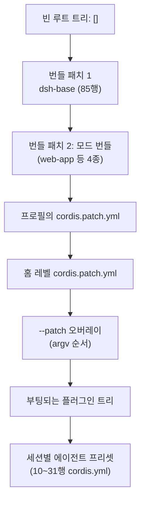
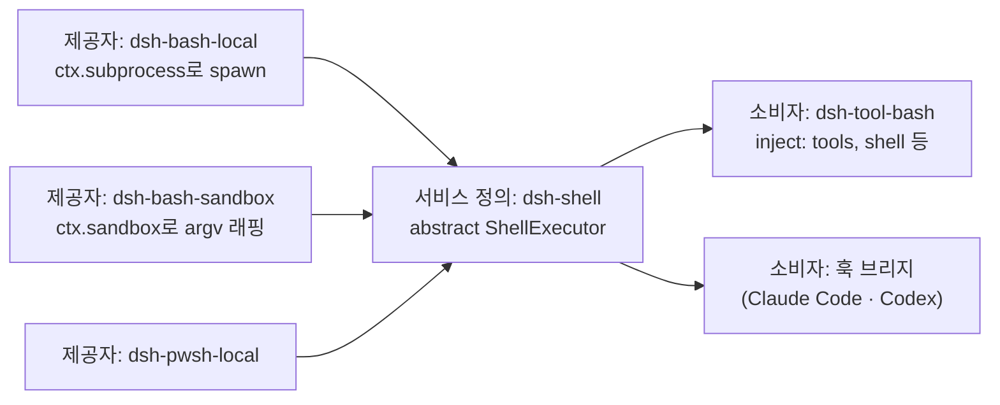
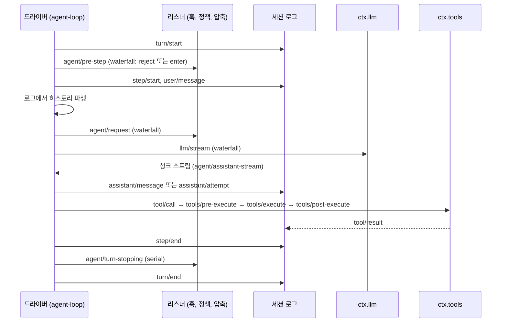

> 분석 일자: 2026-09-05
> 대상 패키지: `@deepseek-ai/dsh` `0.1.3-alpha.1` (developer preview)
> 대상 커밋: `d347e703908d0406b7a7ef80e3a0e594d86b2215` (`master`, 2026-09-04)
> 저장소: https://github.com/deepseek-ai/deepseek-harness
> 로컬 분석 경로: 얕은 clone (`git clone --depth 1`)

---

_This article is mostly written by Claude Code_

## 목차

1. [왜 DeepSeek Harness인가요?](#1-왜-deepseek-harness인가요)
2. [기존 글과의 관계](#2-기존-글과의-관계)
3. [프로젝트를 한 문장으로 이해하기](#3-프로젝트를-한-문장으로-이해하기)
4. [기술 스택과 규모](#4-기술-스택과-규모)
5. [전체 그림: 빈 트리 위에 패치를 쌓아 제품을 만듭니다](#5-전체-그림-빈-트리-위에-패치를-쌓아-제품을-만듭니다)
6. [코드베이스 지도](#6-코드베이스-지도)
7. [커널 Cordis: 컨텍스트, 플러그인, 효과, 다섯 가지 디스패치](#7-커널-cordis-컨텍스트-플러그인-효과-다섯-가지-디스패치)
8. [프로필과 번들: cordis.yml이 곧 제품 구성입니다](#8-프로필과-번들-cordisyml이-곧-제품-구성입니다)
9. [능력 seam: 정의, 제공자, 소비자](#9-능력-seam-정의-제공자-소비자)
10. [에이전트 루프: 턴과 스텝, 그리고 갈아끼울 수 있는 드라이버](#10-에이전트-루프-턴과-스텝-그리고-갈아끼울-수-있는-드라이버)
11. [세션 로그: 모델이 본 것은 전부 로그에 있습니다](#11-세션-로그-모델이-본-것은-전부-로그에-있습니다)
12. [도구 실행 파이프라인과 PTC 모드](#12-도구-실행-파이프라인과-ptc-모드)
13. [샌드박스: bwrap, Landlock, Seatbelt, Windows ACL](#13-샌드박스-bwrap-landlock-seatbelt-windows-acl)
14. [서브에이전트: Claude Code와 Codex를 부품으로 씁니다](#14-서브에이전트-claude-code와-codex를-부품으로-씁니다)
15. [워크플로, Ralph, 목표: 자율성을 위한 세 가지 원시 요소](#15-워크플로-ralph-목표-자율성을-위한-세-가지-원시-요소)
16. [자기 수정: 에이전트가 자기 플러그인 그래프를 고칩니다](#16-자기-수정-에이전트가-자기-플러그인-그래프를-고칩니다)
17. [표면과 통합: Web GUI, SDK, ACP, MCP, 훅](#17-표면과-통합-web-gui-sdk-acp-mcp-훅)
18. [저장소를 운영하는 방식: 커버리지 100%, Agent Note, 53개 검증 게이트](#18-저장소를-운영하는-방식-커버리지-100-agent-note-53개-검증-게이트)
19. [OpenCode, Pi와 비교: 하네스를 여는 세 가지 방법](#19-opencode-pi와-비교-하네스를-여는-세-가지-방법)
20. [코드를 읽는 추천 순서](#20-코드를-읽는-추천-순서)
21. [인상적인 설계 포인트](#21-인상적인-설계-포인트)
22. [주의해서 볼 지점](#22-주의해서-볼-지점)
23. [결론](#23-결론)

---

## 1. 왜 DeepSeek Harness인가요?

DeepSeek Harness(`dsh`)는 2026년 8월 13일에 공개된 뒤 2주 만에 GitHub 스타 20만을 넘겼습니다. 분석 시점 기준 212,133 스타, 24,893 포크입니다. 코딩 에이전트 하네스가 이렇게 빨리 주목받은 이유는 두 가지입니다. 하나는 DeepSeek라는 모델 회사가 자기 하네스를 오픈소스로 공개했다는 사실이고, 다른 하나는 README의 한 줄입니다. **"Everything is a Plugin."**

실제로 아키텍처 문서에는 이렇게 쓰여 있습니다. "제품의 모든 부분이 플러그인입니다. 모델 어댑터, 도구 레지스트리, 세션 로그, 그리고 에이전트 루프 자체까지 포함해서요. 그래서 각각을 설정에서 교체할 수 있습니다. 패치할 특권적인 코어는 없습니다."

이 블로그에서 다룬 코딩 에이전트들은 저마다 어디까지 교체 가능하게 만들지를 다르게 정했습니다. [OpenCode](/kb/2026-06-29-opencode-architecture)는 모델과 클라이언트를 열었고, [Cline](/kb/2026-06-30-cline-architecture)은 코어를 호스트에서 떼어냈으며, [Qwen Code](/kb/2026-05-17-qwen-code-architecture)는 플러그인과 데몬으로 확장했습니다. DeepSeek Harness는 "전부"라고 답합니다. 그 답이 실제 코드에서 어떤 구조가 되는지, 그렇다면 트레이드오프가 무엇인지가 이 글의 주제입니다.

## 2. 기존 글과의 관계

| 글 | 중심 문제 | DeepSeek Harness와의 관계 |
| --- | --- | --- |
| [OpenCode](/kb/2026-06-29-opencode-architecture) | provider-agnostic 헤드리스 엔진 | OpenCode가 모델 메타데이터를 데이터로 외부화했다면, dsh는 모델 어댑터 자체를 플러그인 행(row)으로 외부화합니다. |
| [Cline](/kb/2026-06-30-cline-architecture) | 코어를 호스트에서 gRPC로 분리 | dsh의 Web GUI도 호스트와 클라이언트를 나누지만, 양쪽 모두 Cordis 플러그인 트리이고 RPC는 타입 그래프에서 생성됩니다. |
| [Qwen Code](/kb/2026-05-17-qwen-code-architecture) | 터미널 에이전트의 플러그인·데몬 확장 | Qwen Code가 확장 지점을 추가했다면, dsh는 확장 지점만으로 제품을 조립합니다. |
| [OpenClaw](/kb/2026-03-11-openclaw-architecture) | 메신저에 사는 개인 에이전트 | OpenClaw의 밑바닥 하네스인 Pi의 LLM 계층(`pi-ai`)이 dsh의 멀티 프로바이더 어댑터로 그대로 들어와 있습니다. |
| [Ruflo](/kb/2026-05-17-ruflo-architecture) | Claude Code 바깥의 운영 계층 | dsh는 반대로 Claude Code와 Codex를 자기 안의 서브에이전트 제공자로 부릅니다. |
| [Superpowers](/kb/2026-04-18-superpowers-architecture) | 에이전트에게 절차와 스킬을 강제 | dsh의 스킬 제공자는 `SKILL.md` 프론트매터 규격을 읽고, 저장소 자체가 11개의 스킬로 자기 개발 절차를 강제합니다. |
| [agentmemory](/kb/2026-05-13-agentmemory-architecture) | 코딩 에이전트의 메모리 계층 | dsh는 메모리를 내장하지 않고 MCP 메모리 서버 오버레이 예제 세 개를 기본 꺼짐으로 제공합니다. |

## 3. 프로젝트를 한 문장으로 이해하기

**DeepSeek Harness는 Cordis라는 플러그인 커널 위에서, 빈 플러그인 트리에 번들과 사용자 패치를 순서대로 쌓아 에이전트 제품을 조립하는 TypeScript 하네스입니다.**

세 단어가 이 프로젝트를 요약합니다.

- **Cordis**: 플러그인이 서비스, 타입이 있는 이벤트, 되돌릴 수 있는 효과를 공유 컨텍스트에 기여하는 프레임워크입니다.
- **seam**: 교체 가능한 능력의 단위입니다. 서비스 정의, 제공자, 소비자의 세 역할로 이루어집니다.
- **세션 로그**: 모델이 본 모든 것을 재구성할 수 있는 append-only 이벤트 로그입니다. 메시지 히스토리는 로그에서 파생됩니다.

## 4. 기술 스택과 규모

| 항목 | 값 |
| --- | --- |
| 언어 | TypeScript (strict, `noImplicitAny`), ESM 전용 |
| 런타임 | Node 22.19 이상 또는 24 이상, pnpm 11.7 워크스페이스 |
| 커널 | Cordis 4.0.0-rc.7을 벤더링해 `@deepseek-ai/cordis`로 재스코프 |
| 빌드·테스트 | tsc + tsdown, Vitest 4, oxlint, jscpd, lefthook |
| 패키지 | `packages/` 아래 50개 그룹, 255개 워크스페이스 패키지 |
| 코드량 | TS/TSX 약 71만 줄 (테스트 포함), 테스트 파일 863개 |
| 가장 큰 그룹 | `client` 8.4만 줄, `experimental` 3.9만 줄, `extensions` 1.8만 줄, `api` 1.5만 줄, `core` 1.4만 줄 |
| 라이선스 | MIT |
| 릴리스 | 2026-08-13 `0.1.0-rc` 계열부터 2026-09-04 `0.1.3-alpha.1`까지 3주 동안 태그 10개 |
| 기본 모델 | `deepseek-v4-flash` (`deepseek-v4-pro`, 비전 실험 모델도 카탈로그에 있음) |
| 기여자 | 31명 |

숫자 두 개가 눈에 띕니다. 첫째, Web GUI 클라이언트가 전체에서 가장 큰 그룹입니다. "터미널 코딩 에이전트"가 아니라 `npx @deepseek-ai/dsh web`으로 브라우저 UI를 띄우는 제품이 기본 진입점입니다. 둘째, 코드 자체보다 문서와 게이트가 무겁습니다. 이 점은 18절에서 다룹니다.

## 5. 전체 그림: 빈 트리 위에 패치를 쌓아 제품을 만듭니다

`dsh`가 부팅하면 프로필 루트의 `cordis.yml`은 **항상 빈 목록 `[]`로 다시 쓰입니다**. 제품은 그 위에 순서대로 적용되는 패치 계층입니다.



각 패치는 행(row)을 id로 지목해 `config` 전체를 교체하거나 새 행을 삽입합니다. `dsh --profile web --dump-config`를 실행하면 내 머신이 부팅할 트리를 그대로 출력하고, 거기 찍힌 어떤 행이든 내 패치로 바꿀 수 있습니다. 에이전트 루프, 세션 로그, 모델 어댑터가 모두 "행"이므로, 이론상 셋 다 교체 대상입니다.

## 6. 코드베이스 지도

```text
vendor/        벤더링한 Cordis 소스 (cordis, loader, include, group, hmr, timer, schemastery, cosmokit)
packages/      @deepseek-ai/dsh-<pkg>, packages/<그룹>/<패키지>
  core/          제품 API 척추: session, system-prompt, tools, agent, agent-loop, scope
  llm/           LLM seam + DeepSeek 어댑터 + pi-ai 멀티 프로바이더 어댑터
  shell/ subprocess/ terminal/ fs/ lsp/   실행 계열 seam
  sandbox/       bwrap / Landlock / Seatbelt / Windows ACL 백엔드
  code-runtime/  PTC 모드용 worker-thread 코드 실행
  subagent/      6개 제공자 (in-process spawn/fork, ACP, Codex, Claude Code, dsh SDK)
  workflow/      worker-thread 워크플로 엔진 + workflow/ralph 도구
  goal/ schedule/ jobs/ plan/ todo/   자율성·상태 관리
  session/ session-query/ storage/    JSONL 로그, SQLite 전문검색, KV 저장소
  skill/ hooks/ mcp/ acp/ sdk/        스킬, Claude Code·Codex 훅 브리지, MCP 클라이언트, ACP 서버, JSON-RPC SDK
  extensions/    에이전트 자기 수정 (cordis_* 도구)
  bundle/ preset/ boot/               번들, 에이전트 프리셋, 부팅 글루
  api/ typert/ host/ client/          Typert RPC 게이트웨이, Web GUI 호스트·클라이언트
  experimental/  Agent Teams, Python 코드 런타임, 인스펙터, WebWorker 런타임
apps/cli/      dsh 바이너리 (profile 부팅, plugin 설치, dump-config)
python/        Python SDK + 번들된 dsh 런타임 wheel
native/        Landlock 실행기 Node 애드온
docs/          architecture, cordis-primer, 서브시스템 문서 50여 편 (전부 영·중 이중언어)
.agents/       Agent Note 873편, 저장소 자체 스킬 11개
scripts/       197개 스크립트, 그중 verify-* 게이트 53개
```

## 7. 커널 Cordis: 컨텍스트, 플러그인, 효과, 다섯 가지 디스패치

Cordis는 Koishi라는 크로스플랫폼 챗봇 프레임워크의 커널로 2022년부터 개발된 플러그인 프레임워크입니다. 제작자 Shigma(Yifan Shi)는 DeepSeek 연구자들과 함께 2026년 8월 26일 arXiv에 "A Programming Paradigm for Spatiotemporal Composability"를 올렸는데, dsh README가 인용하는 바로 그 논문입니다. 논문은 두 축을 정의합니다. **시간적 합성 가능성**은 컴포넌트를 제거할 때 부작용을 완전히 되돌리는 능력이고, **공간적 합성 가능성**은 컴포넌트 간 의존성을 선언하고 반응적으로 관리하는 능력입니다. 전자를 "되돌릴 수 있는 효과", 후자를 "반응적 코이펙트"로 런타임 기제화한 것이 Cordis입니다.

dsh는 Cordis를 npm 의존성이 아니라 소스로 벤더링합니다. 커널은 9개 파일 2,693줄로 작습니다. 프로젝트의 primer가 요약한 다섯 가지 아이디어는 다음과 같습니다.

1. **플러그인은 `apply(ctx)`를 가진 함수·객체이거나 `Service` 서브클래스입니다.**
2. **컨텍스트는 서비스 저장소입니다.** 서비스는 `ctx.tools`, `ctx.llm`, `ctx.sessions` 같은 안정된 키를 차지하고, 다른 플러그인은 구현을 import하는 대신 키로 찾습니다.
3. **의존성은 `inject`로 선언합니다.** 필요한 서비스가 생길 때까지 플러그인은 기다리므로, 로드 순서는 부팅 시퀀스가 아니라 서비스 요구로 표현됩니다.
4. **타입이 있는 이벤트로 통신합니다.** 선언 병합으로 이벤트 이름을 등록하고, `emit`, `waterfall`, `parallel`, `serial`, `bail` 다섯 모드로 디스패치합니다.
5. **등록은 되돌릴 수 있는 효과입니다.** 프롬프트 섹션, 도구 스키마, 어댑터, 리스너가 모두 `ctx.effect()` 또는 `ctx.on()`을 통해 설치되어, 리로드와 해체가 예측 가능하게 되감깁니다.

`ctx.<key>`는 필드가 아닙니다. `Context`는 Proxy이고, 읽기는 파이버(fiber) 체인의 서비스 저장소를 거슬러 올라가며, `inject`에 선언하지 않은 키를 읽으면 예외를 던집니다. 서비스 제공자가 바뀌면 그 서비스를 주입받은 모든 파이버가 언로드되고 새 구현에 대해 리로드됩니다. 이것이 핫스왑의 전부이며, HMR과 제공자 교체와 동적 플러그인이 모두 이 한 가지 기제 위에 있습니다.

다섯 디스패치 모드 중 하네스가 가장 많이 쓰는 것은 `waterfall`입니다. around 미들웨어와 같아서, 리스너는 `(...args, next)`를 받고 `next()`를 불러 위임하거나 부르지 않고 단락시킵니다. 그래서 AGENTS.md에는 이런 규칙이 있습니다. "Waterfall 리스너는 반드시 `next()`를 불러야 합니다. 부르지 않고 반환하면 체인이 끊깁니다."

## 8. 프로필과 번들: cordis.yml이 곧 제품 구성입니다

**프로필**은 하네스 홈 아래 디렉터리이고, 자기 `package.json`의 `dsh.profile` 필드에 쌓을 번들을 나열합니다. **번들**은 Cordis 설정 행과 그것이 마운트할 코드를 담은 npm 패키지이며 `dsh.bundle.patch`로 패치 파일을 가리킵니다. 출하되는 프로필 템플릿은 다섯입니다.

| 프로필 | 번들 | 패치 리로드 | 용도 |
| --- | --- | --- | --- |
| `web` | dsh-base + dsh-web-app | live | 브라우저 GUI (`dsh web`) |
| `headless` | dsh-base + dsh-headless | startup | 한 번 실행하는 러너 |
| `sdk` | dsh-base + dsh-sdk-app | startup | JSON-RPC 서버, TS·Python SDK가 띄움 |
| `acp` | dsh-base + dsh-acp-app | startup | 자동화 전용 ACP 서버 |
| `sdk-minimal` | dsh-sdk-minimal 단독 (33행) | startup | base 없이 완전한 트리를 직접 소유 |

`dsh-base`는 85행을 한 번의 `insert`로 넣습니다. 타이머, LLM seam과 두 어댑터, 세션과 JSONL 영속화, SQLite 질의, Typert 레지스트리와 게이트웨이, 에이전트와 에이전트 루프, 도구와 시스템 프롬프트, 서브프로세스·샌드박스·승인 정책, 파일·검색·bash 도구, 스킬, 목표, 플랜 모드, 압축, 서브에이전트, 워크플로, 웹 검색까지가 여기 있습니다. 흥미로운 것은 `web-app` 번들이 base의 도구 행 24개를 **비활성화**하고 61행을 삽입한다는 점입니다. 웹 프로필은 도구를 호스트 트리가 아니라 **세션마다 마운트되는 에이전트 프리셋**에서 다시 올립니다. 프리셋은 `standard`(30행), `ptc`(31행), `minimal`(10행), `cordis`(31행)가 출하되며, 서비스를 발행하는 프리셋 행은 `isolate` 영역 안에 있어야 마운트가 허용됩니다.

YAML 값에는 `!!js` 태그로 JavaScript 식을 쓸 수 있습니다. 예를 들어 base 번들은 bash 도구 행에 `disabled: !!js process.platform === 'win32'`를 달아 플랫폼별로 켜고 끕니다. 이 식은 벤더링된 로더 안에서 `with (ctx) { eval(expr) }`로, 행 자신의 파이버 컨텍스트에서 지연 평가됩니다. 편리하지만 설정 파일이 곧 코드 실행이라는 뜻이기도 합니다.

## 9. 능력 seam: 정의, 제공자, 소비자

용어집은 seam을 이렇게 정의합니다. "교체 가능한 능력으로, 세 역할을 가집니다. `ctx.<key>`와 어휘 타입을 소유하는 Cordis `Service`인 **서비스 정의**(추상 클래스이지 TypeScript `interface`가 아닙니다), 하나 이상의 **서비스 제공자**, 그 서비스를 주입받는 하나 이상의 **소비자**." 한 역할만 있는 것은 seam이 아니며, 새 능력을 추가한다는 것은 세 역할을 모두 설계한다는 뜻입니다.

`packages/shell`이 교과서적 예입니다.



같은 이름의 서비스를 두 번 제공하면 로드가 큰 소리로 실패하므로 `ctx.shell`은 언제나 정확히 하나입니다. 제공자를 갈아끼워도 도구 스키마는 건드리지 않습니다. 그리고 shell seam은 subprocess seam 위에 놓여 있어서, 아키텍처 문서의 표현대로 "파일시스템과 서브프로세스 제공자를 원격 샌드박스로 향하게 하면 Bash, PTY, LSP가 함께 옮겨갑니다." `packages/e2b`의 POC가 정확히 그것입니다. E2B용 `fs-e2b`와 `subprocess-e2b` 두 제공자만 바꾸면 나머지 도구 계층은 그대로입니다.

문서의 seam 카탈로그에는 이런 키가 60개 남짓 있습니다. 대표적인 것만 추리면 다음과 같습니다.

| ctx 키 | 제공자 | 소비자 |
| --- | --- | --- |
| `ctx.llm` | llm-deepseek, llm-pi-ai, llm-replay(테스트) | agent-loop, compaction-basic |
| `ctx.subagents` | spawn-in-process, fork-in-process, acp, codex, claude-code, dsh-sdk | tool-subagent, tool-subagent-control, tool-ralph |
| `ctx.fs` | fs-local, fs-sandbox, fs-e2b | tool-fs |
| `ctx.subprocess` | subprocess-local, subprocess-e2b | bash 실행기, PTY, LSP, 외부 프로세스 서브에이전트 |
| `ctx.sandbox` | sandbox-local | bash-sandbox, terminal-bash |
| `ctx.web` | web-search-exa, web-search-perplexity, web-search-deepseek, web-fetch-http | tool-web |
| `ctx.codeRuntime` | code-runtime-worker-thread, experimental python | tools (PTC 모드) |
| `ctx.workflowEngine` | workflow-worker-thread | tool-workflow, tool-ralph |
| `ctx.sessionPersistence` | session-persistence-jsonl | agent-loop, 훅 브리지, 세션 질의 |
| `ctx.skills` | skill-filesystem, skill-badge | tool-skill |

## 10. 에이전트 루프: 턴과 스텝, 그리고 갈아끼울 수 있는 드라이버

`dsh-agent`가 계약을 소유합니다. `ctx.agents` 레지스트리는 팩토리 슬롯 하나를 갖고, 드라이버가 없을 때 `ctx.agents.create()`를 부르면 "no agent factory registered (load an agent-loop plugin)"이라는 오류가 납니다. `dsh-agent-loop`는 그 팩토리를 구현하고, 생성자에서 `ctx.effect(() => ctx.agents.setFactory(this))` 한 줄로 자신을 등록합니다. 루프를 언로드하면 슬롯이 비고, UI·훅·도구 플러그인은 `dsh-agent`의 이벤트와 서비스만 보고 컴파일되므로 영향이 없습니다. 패키지 문서의 표현대로 "`dsh-agent-loop`는 교체 가능합니다."

**스텝**은 모델 요청 하나와 그것이 부른 도구들이고, **턴**은 0개 이상의 스텝입니다. 문서의 턴 흐름을 옮기면 이렇습니다.



이벤트는 세 도메인으로 나뉩니다. `turn/*`, `step/*`, `user/message`, `assistant/*`, `tool/*`는 **로그에 남는 세션 이벤트**입니다. `agent/*`는 살아 있는 에이전트를 실어 나르는 **라이브 확장 지점**입니다. `fs/*`, `tools/*`, `telemetry/*`는 루프를 import하지 않고 seam에 정책을 붙이는 **능력 이벤트**입니다. 새 동작은 이 확장 지점에 붙이고, 루프 자체를 바꾸려면 아키텍처 문서를 갱신해야 한다는 것이 AGENTS.md의 "Plugins, not loop changes" 규칙입니다.

## 11. 세션 로그: 모델이 본 것은 전부 로그에 있습니다

세션은 append-only `SessionEvent` 로그이고, 모델에게 보내는 메시지 히스토리는 `deriveMessages()`로 로그에서 **파생**됩니다. 따로 저장하지 않습니다. 각 `assistant/message`는 자신을 만든 컴팩트 스트림을 그대로 품고, 실패·재시도·취소된 시도는 `assistant/attempt`로 남되 히스토리에는 들어가지 않습니다. 포크, 재개, 트랜스크립트, 텔레메트리, 영속화가 전부 이 로그에서 파생됩니다.

AGENTS.md의 규칙은 한 줄입니다. **"Model-visible ⟺ logged."** 모델 요청에 닿는 것은 무엇이든 로그에서 재구성할 수 있어야 하고, 런타임 불변식이 이를 검증합니다. 그래서 모델에게 보이는 새 입력을 추가하려면 `SessionEventMap`에 새 이벤트를 선언해야 합니다. 스킬 본문, 하위 디렉터리의 AGENTS.md, 파일 변경 알림처럼 `agent.inject()`로 들어가는 합성 컨텍스트도 `user/message` 이벤트로 기록되고 `source` 필드로 구분됩니다.

이 원칙이 테스트 방식을 결정합니다. 저장소의 스냅샷 테스트는 API 키 없이 기록된 세션을 출하 프로필로 **재생**합니다. 모델이 본 모든 것이 로그에 있으니 재생이 가능합니다. 영속화 형식은 JSONL이고, v0는 `session.jsonl`, v1 이후는 `session.vN.jsonl`이며, 마이그레이션은 인접한 두 버전 사이의 한 단계씩만 존재하고 이미 커밋된 세대는 절대 이름을 바꾸거나 지우지 않습니다.

## 12. 도구 실행 파이프라인과 PTC 모드

도구 호출 하나는 여러 겹의 waterfall을 지납니다.

1. `tool/call` 세션 이벤트가 실행 전에 기록됩니다.
2. `tools/pre-execute` waterfall에서 훅, 권한, 샌드박스 정책이 돌고, 결과는 allow, deny, ask 중 하나입니다.
3. ask이면 `ctx.approval`이 한 번짜리 승인 프롬프트를 띄우고, 답할 사람이 없으면 거부로 닫힙니다.
4. 등록된 단조 가드(monotonic guard)가 거부하거나 기권합니다.
5. `tools/execute` waterfall이 타임아웃, 재시도, 메트릭을 감싸며 도구 본문을 실행합니다. 파일 변경 도구는 여기서 `fs/write-intent` 게이트를 통과합니다.
6. `tools/post-execute` waterfall이 결과를 받아들이거나 막거나 바꾸거나 컨텍스트를 덧붙입니다. 큰 결과를 파일로 흘려보내는 spill 정책이 여기 붙습니다.
7. 레지스트리가 결과를 정규화하고, `tools/result`가 확정된 결과를 알리며, `tool/result` 세션 이벤트가 기록됩니다.

기본 카탈로그의 도구는 이렇습니다. `bash`/`pwsh`, `read`/`write`/`edit`/`read_image`, `glob`/`grep`, `str_replace_editor`, `todo_write`, `skill`, `subagent`/`list_subagent_models`, `send_message`/`interrupt_agent`/`list_agents`, `workflow`, `ralph`, `create_goal`/`get_goal`/`update_goal`, `job_*`, `web_search`/`web_fetch`, `ask_user_question`, `exit_plan_mode`. 프리셋에 따라 `terminal_*`, `lsp`, `session_*`, `schedule_*`, `run_code`, `cordis_*`가 추가됩니다.

**PTC 모드**는 도구를 하나씩 부르는 대신 모델이 도구 레지스트리를 상대로 TypeScript 프로그램을 작성해 `run_code` 하나로 실행하는 방식입니다. `ctx.codeRuntime` seam이 worker thread 안의 vm 컨텍스트에서 프로그램을 돌리고, 호스트 함수는 `tools`라는 전역 객체로 바인딩됩니다. 파이프라인 문서는 서브 호출도 같은 파이프라인을 지난다고 적습니다. "PTC 모드는 예약된 `run_code` 전송과 직렬화된 서브 호출을 모두 파이프라인으로 보냅니다. 서브 호출은 부모 토큰을 지니고 `tool/code-dispatch`를 기록하며, 거부는 바인딩 거부로 돌아갑니다." 도구 프레젠테이션은 프리셋별로 `native`, `ptc`, `both` 중 하나를 고릅니다.

## 13. 샌드박스: bwrap, Landlock, Seatbelt, Windows ACL

`ctx.sandbox`는 "같은 세계의 서브프로세스 argv를 파일 효과 정책으로 감싸는" seam입니다. 소비자는 자기가 spawn하려던 argv를 넘기고, 백엔드는 감싼 argv와 **집행 완전성**을 돌려줍니다. `dsh-sandbox-local`이 Linux의 bwrap과 Landlock, macOS의 Seatbelt, Windows의 ACL 제한 토큰 백엔드를 제공하고, `native/landlock-run`이 Landlock 실행기 Node 애드온입니다.

모드는 셋입니다. `read-only`는 쓰기를 막고, `workspace-write`는 워크스페이스 루트와 백엔드가 약속한 임시 영역만 허용하며, `danger-full-access`는 격리를 우회합니다. 문서는 경계를 분명히 긋습니다. "네트워크와 프로세스 가시성은 이 어휘 바깥입니다." 즉 이 샌드박스는 **파일 효과만** 다룹니다. 집행 완전성은 `full` 또는 `partial`로 보고되는데, 오래된 Landlock ABI와 Windows ACL의 Everyone·하드링크 경계가 현재의 partial 사례입니다. 정책은 제공자에 고정되지 않고 **호출마다** 실려서, 같은 순간에 bash는 read-only로, 자식 에이전트는 상태 디렉터리를 쓸 수 있게 격리할 수 있습니다.

백엔드마다 거부 메시지의 방언이 다릅니다. bwrap의 읽기 전용 바인드는 EROFS, Landlock은 EACCES, Seatbelt는 EPERM입니다. 소비자는 자기 백엔드의 방언만 매칭합니다. 세 방언의 합집합을 쓰면 "해당 백엔드가 낸 적 없는 거부를 주장하게 된다"는 것이 문서의 설명입니다. 실패 분류도 둘로 나뉩니다. 격리된 명령이 막힌 것과 샌드박스 실행기 자체가 실행 전에 실패한 것은 다른 오류이며, 후자는 과제 실패가 아니라 인프라 실패로 표면화됩니다.

## 14. 서브에이전트: Claude Code와 Codex를 부품으로 씁니다

`ctx.subagents`는 bash와 달리 **여러 제공자가 이름으로 공존**하는 레지스트리입니다. 여섯 제공자가 출하됩니다.

| 제공자 | 실행 방식 |
| --- | --- |
| `subagent-spawn-in-process` | 같은 프로세스에 새 자식 에이전트 |
| `subagent-fork-in-process` | 부모 대화를 물려받는 자식 |
| `subagent-dsh-sdk` | 별도 dsh 런타임을 SDK로 띄움 |
| `subagent-acp` | ACP 서버를 자식 프로세스로 띄워 위임 |
| `subagent-codex` | 공식 app-server 프로토콜(`app-server --stdio`)로 실제 Codex 자식 실행 |
| `subagent-claude-code` | 공식 Agent SDK로 실제 Claude Code CLI 자식 실행 |

즉 DeepSeek의 하네스 안에서 "이 작업은 Claude Code에게, 저 작업은 Codex에게" 위임하는 구조가 첫 번째 파티로 들어 있습니다. `pnpm-workspace.yaml`에는 두 SDK의 정확한 플랫폼 바이너리 버전을 공급망 정책에서 예외 처리하는 항목이 있습니다. 다만 두 제공자는 어떤 출하 번들에도 포함되지 않고, 프리셋의 도구 행은 `disabled: true`로 실려 있으며 주석은 "프로덕션 dsh는 이 선택적 제공자를 설치하지 않습니다"라고 적습니다.

제공자는 시작 시점 능력을 정적 디스크립터로 광고합니다. `agentOptions`, `outputSchema`, `depthLimit`, `toolFilter`, `persona` 다섯 플래그이고, 제공자가 없는 능력을 요구하는 요청은 조용히 무시되지 않고 `UNSUPPORTED_CAPABILITY`로 거부됩니다. in-process 제공자는 자식 생성 창(setup window)에서 `tools.restrict()`로 도구를 좁히고 스코프된 페르소나 섹션을 등록합니다. ACP, Codex, Claude Code 제공자는 `agentOptions`를 거부합니다. 남의 제품에 모델 옵션을 강제할 수 없기 때문입니다.

**계속 이어갈 수 있는 자식**도 있습니다. 하나의 내구성 있는 자식 세션에 최대 하나의 프로세스 로컬 활성화(Activation)가 붙고, 부모는 `send_message`로 실행 중인 자식의 다음 스텝을 조향하거나 `interrupt_agent`로 끊습니다. 실험 패키지 `agent-team`은 그 위에 명단, 과제 보드, 메일박스를 얹은 팀 조정 seam입니다.

## 15. 워크플로, Ralph, 목표: 자율성을 위한 세 가지 원시 요소

**워크플로**는 모델이 쓴 오케스트레이션 스크립트를 worker thread에서 실행합니다. 스크립트는 `agent()`로 자식을 띄우고 `parallel()`, `pipeline()` 조합자로 팬아웃하며 `phase()`로 진행 단계를 알립니다. `meta` 블록은 스크립트를 평가하지 않고 데이터로 먼저 검증됩니다. 문서는 이 필드 어휘가 "Claude Code의 dynamic-workflows meta 블록과 일치한다"고 적습니다. 오류 규율이 엄격해서, 훅 오용은 `fatal: true`인 오류로 스크립트를 죽이고 조합자는 그것을 `null`로 삼키지 않습니다.

**Ralph**는 용어집 정의가 정확합니다. "변경 불가능한 목표를 향해 새 에이전트로 도는 하나의 포그라운드 워크플로 실행입니다. 워크플로와 서브에이전트 원시 요소로 조합된 모델용 도구 정책이지, 같은 세션의 목표나 루프 모드나 스케줄러가 아닙니다." 각 라운드는 부모나 이전 자식의 대화를 물려받지 않는 **새 자식 세션**이고, 공유 워크스페이스와 상태·요약·증거·다음 단계·차단 사유를 담은 **bounded handoff** 하나만 라운드 사이를 건넙니다. 컨텍스트가 오염되지 않는 대신 기억은 파일에 남겨야 하는, Ralph 루프 패턴의 정직한 구현입니다.

**목표(goal)**는 기존 세션에 붙는 하나의 완료 목표로, `active`, `paused`, `blocked`, `complete` 단계와 라운드 상한을 가집니다. 문서는 "목표는 상태이지 스케줄러나 별도 대화가 아니다"라고 못 박습니다. 흥미로운 것은 **활성화(armed/disarmed)를 일부러 로그에 남기지 않는다**는 점입니다. 재개나 포크 뒤에 자동으로 일이 이어지려면 사람이 `/goal` 명령이나 도구로 다시 승인해야 합니다.

## 16. 자기 수정: 에이전트가 자기 플러그인 그래프를 고칩니다

`packages/extensions`는 실행 중인 에이전트가 자기 플러그인 그래프를 들여다보고, 모델이 쓴 플러그인을 마운트·언마운트하게 합니다. 모델에게 열리는 도구는 일곱입니다.

| 도구 | 하는 일 |
| --- | --- |
| `cordis_inspect_list` | 호스트·클라이언트 인스펙트 제공자와 질의 목록 |
| `cordis_inspect_query` | 살아 있는 서비스 메서드, 이벤트 모드, 도구 스키마, 슬롯 트리 질의 |
| `cordis_inspect_self` | 이 세션의 동적 플러그인 버전과 소스, 진단 |
| `cordis_define` | 불변 패키지 정의. 파싱과 문법 검사만 하고 실행하지 않음 |
| `cordis_run` | 패키지 활성화. 브라우저 절반은 사람 승인 대기 |
| `cordis_stop` | 실행 중지, 정의는 유지 |
| `cordis_undefine` | 중지 후 모든 버전 삭제 |

구현은 새 기제가 아니라 커널 그대로입니다. 호스트 절반은 `node:vm` 컨텍스트에서 비동기 함수 본문으로 평가되고, 반환된 플러그인은 내부 `cordis-dynamic` 그룹의 자식으로 마운트됩니다. 중지는 그냥 `fiber.dispose()`입니다. 플러그인이 등록한 모든 것이 파이버의 효과이기 때문입니다. 설계 기록은 구조화된 `cordis_register_tool` API를 거부한 이유를 "마운트 원시 요소 하나가 현재와 미래의 모든 효과를 덮기 때문"이라고 적습니다.

안전장치도 있습니다. 출하 번들 어디에도 `tool-cordis`는 없어서 오버레이나 `cordis` 프리셋으로만 켜지고, 프리셋 머리말은 "이 프리셋의 세션을 셸 접근으로 취급하라"고 적습니다. `require`, 타이머, `fetch`는 `ctx.fs`·`ctx.web`·Cordis 타이머로 안내하는 트랩이고 `process`와 `Buffer`는 `undefined`입니다. 세션 소유권, 브라우저 절반의 사람 승인, define/run/stop이 일반 `tool/call`로 기록되는 것까지 갖췄습니다. 그러나 README는 세 번 반복합니다. "샌드박스는 전역을 격리하지만 보안 경계가 아닙니다. 동적 패키지를 bash 접근처럼 취급하세요."

## 17. 표면과 통합: Web GUI, SDK, ACP, MCP, 훅

**Web GUI.** 브라우저 쪽도 Cordis 애플리케이션입니다. 호스트가 조립한 부팅 그래프를 `window.__DSH_BOOT__`에 쓰면, 브라우저의 부팅 커널이 벤더링된 Cordis 로더를 마운트하고 모든 그래프 엔트리를 생성합니다. 호스트 서비스는 `@Remote` 데코레이터로 메서드를 표시하고, 빌드 시 Typert 생성기가 타입 그래프를 분석해 호스트용 디스크립터와 클라이언트용 코덱을 뽑아내며, 런타임의 API 게이트웨이가 `POST /api/<namespace>/<method>`를 서빙합니다. 클라이언트는 `ctx.remote.goals.create` 같은 생성된 메서드를 부릅니다. UI 조립은 슬롯 레지스트리와 React이고, 도구 하나는 "호스트 프레젠터는 순수하게, 웹 카드는 원시 이벤트와 저장된 결과 메타데이터에서 파생"이라는 규칙으로 카드가 됩니다. 제품 문구는 타입이 있는 사전을 거쳐야 하며 하드코딩된 문구는 `verify-client-ui-i18n` 게이트가 거부합니다.

**SDK.** 줄바꿈 구분 JSON-RPC를 stdio로 말하는 프로토콜 위에 TypeScript 클라이언트와 Python 클라이언트가 있습니다. 둘 다 `dsh --profile sdk`를 자식 프로세스로 띄우고, Python wheel은 플랫폼별 dsh 런타임을 통째로 번들합니다. 아키텍처 규칙은 "지원되는 모든 Node 앱은 `dsh` CLI와 이름 붙은 프로필로 시작한다"이며, 검증 스크립트가 이를 우회하는 진입점을 거부합니다.

**ACP.** `packages/acp`는 Agent Client Protocol 서버인데 "자동화 전용"입니다. 프로그램이 세션을 만들고, MCP 서버를 붙이고, 프롬프트를 보내고, 권한 프롬프트에 답하고, 취소할 수 있되 사람은 루프에 없습니다. 같은 프로토콜의 클라이언트 쪽이 `subagent-acp`입니다.

**MCP.** `mcp-client` 하나가 외부 MCP 서버를 붙여 그 도구를 서버 접두사가 붙은 이름으로 네이티브 도구처럼 노출합니다. 도구 능력만 브리지하고 리소스와 프롬프트는 지원하지 않으며, 아무것도 기본으로 켜져 있지 않습니다. 메모리 서버 세 종(engram, memorix, mcp-reference-memory)의 오버레이 예제가 기본 꺼짐으로 제공됩니다.

**훅.** `hooks-claude-code`와 `hooks-codex`는 사용자가 이미 써 둔 Claude Code 또는 Codex의 `hooks.json`을 그대로 읽어, 세션 시작·프롬프트 제출·도구 실행 전후·정지 직전에 같은 셸 훅을 실행합니다. 훅은 메시지를 남기며 프롬프트나 도구 호출을 막을 수 있고, 컨텍스트를 덧붙이거나 실행을 계속시킬 수 있습니다.

**스킬.** `skill-filesystem`은 `.agents/skills` 같은 루트에서 `SKILL.md` 디렉터리 번들 또는 단일 `.md` 파일을 찾아 YAML 프론트매터(`name`, `description`, `whenToUse`, `metadata`, `disable-model-invocation`, `user-invocable`)를 카탈로그로 만들고 본문은 호출 시마다 다시 읽습니다. 디렉터리를 감시하므로 재시작 없이 반영됩니다.

## 18. 저장소를 운영하는 방식: 커버리지 100%, Agent Note, 53개 검증 게이트

이 저장소에서 코드만큼 인상적인 것은 운영 방식입니다.

- **파일별 100% 커버리지 게이트.** `vitest.config.ts`는 statements, branches, functions, lines 모두 100%를 파일 단위로 요구합니다. 주석은 이렇습니다. "100%가 아니면 머지되지 않습니다. 파일 단위라서 잘 덮인 큰 파일이 빈약한 파일을 보조할 수 없습니다." 테스트 문서는 덮이지 않은 줄을 "보통 삭제해야 할 죽은 코드"로 봅니다.
- **Agent Note.** "사소하지 않은 변경은 반드시 같은 PR에 Agent Note를 포함"합니다. `.agents/notes`에는 영문 기준 873편(구현 659, 제안 27, 거부 9, 보관 176)이 있고, 보관된 노트는 동결되어 편집이 금지됩니다. 이 글에서 인용한 설계 근거의 대부분이 이 노트들입니다.
- **53개 `verify-*` 게이트.** Cordis 설정 검증, export JSDoc 강제, 클라이언트 문구 i18n, 문서 분량 예산, 패키지 README의 Model Experience·Known Limitations 절 유무, 애플리케이션 진입점 분류, 벤더 링크, 라이선스, 마크다운 링크와 mermaid까지 스크립트가 검사합니다.
- **이중언어 문서.** `docs/`와 모든 패키지 README가 영어·중국어 쌍이고 `.i18n.yaml`로 동기화됩니다. 서브시스템 문서 50여 편은 소스 JSDoc에서 생성된 Cordis API 절을 품습니다.
- **프로즈 규칙.** AGENTS.md는 "은유를 쓰지 말 것", `contract`·`boundary`·`shape` 같은 단어를 더 정확한 용어로 바꿀 것을 요구하고, 저장소 자체 스킬 `dsh-prose-standard`로 강제합니다.
- **자기 개발 스킬 11개.** 코드 리뷰, 사전 푸시 검사, CI 안정성, 단순화 탐색, 스택 PR 머지, 문서 번역, 사고 후 분석까지 `.agents/skills`에 있습니다. `CLAUDE.md`는 `AGENTS.md`의 심볼릭 링크입니다.
- **포스트모템 4편.** ACP default export가 `inject`를 떨어뜨린 사고, `!!js` 식이 파일시스템 도구를 꺼 버린 사고, Landlock 부분 집행 알림이 자식 실패로 오분류된 사고가 문서화되어 있습니다.

에이전트가 에이전트 하네스를 개발하는 현장의 기록이라는 점에서, 이 저장소는 코드보다 프로세스가 더 배울 거리일 수 있습니다.

## 19. OpenCode, Pi와 비교: 하네스를 여는 세 가지 방법

| 관점 | OpenCode | Pi | DeepSeek Harness |
| --- | --- | --- | --- |
| 무엇을 여나 | 모델(models.dev)과 클라이언트(헤드리스 HTTP) | 거의 전부. 내장 도구 4개와 짧은 시스템 프롬프트만 두고 나머지는 TypeScript 확장 | 전부. 루프·로그·어댑터까지 설정 행 |
| 조립 단위 | Effect 기반 서비스 | 확장 | Cordis 플러그인 행과 패치 계층 |
| 다른 모델 | 자체 LLM 프로토콜 계층 | `pi-ai` 패키지 | 공식 DeepSeek 어댑터 + Pi의 `pi-ai`를 그대로 어댑터로 사용 |
| 다른 에이전트 | 없음 | 없음 | Claude Code·Codex·ACP를 서브에이전트 제공자로 |
| 기본 표면 | TUI | TUI | Web GUI |

Pi는 "최소 하네스"로 유명하고 OpenClaw의 밑바닥이기도 합니다. DeepSeek Harness가 Pi의 LLM 계층을 그대로 가져다 쓴 것은 의미심장합니다. 멀티 프로바이더 라우팅 문제를 다시 풀지 않고, `providers` 사전에 `openai`, `anthropic` 같은 경로를 적으면 pi-ai의 카탈로그와 로그인 흐름을 물려받습니다. OpenAI 호환 게이트웨이도 코드가 아니라 설정입니다. 반대로 dsh가 직접 만든 것은 "무엇이든 행으로 만들고 되감을 수 있게 하는" 커널 쪽입니다. 세 프로젝트는 같은 문제를 다른 층에서 열었습니다.

## 20. 코드를 읽는 추천 순서

1. `AGENTS.md`와 `docs/architecture.md`: 규칙과 그림을 먼저 봅니다.
2. `docs/cordis-primer.md`와 `vendor/cordis/src/`: `context.ts`, `fiber.ts`, `events.ts` 순으로 2,700줄입니다.
3. `packages/bundle/base/cordis.patch.yml`: 85행이 제품의 부품 목록입니다. `dsh --profile web --dump-config`로 실제 트리를 찍어 보세요.
4. `packages/shell/`: seam의 세 역할을 한 그룹에서 봅니다.
5. `packages/core/agent/src/index.ts`와 `packages/core/agent-loop/src/agent.ts`: 팩토리 슬롯과 턴 흐름입니다.
6. `docs/subsystems/session.md`와 `packages/core/session/src/types.ts`: `SessionEventMap`이 곧 제품의 어휘입니다.
7. `docs/tool-execution-pipeline.md`와 `packages/core/tools/`: waterfall 겹을 따라갑니다.
8. `docs/subsystems/subagent.md`와 `packages/subagent/subagent-claude-code/`: 다른 제품을 부품으로 쓰는 방법입니다.
9. `packages/extensions/cordis-host-runner/src/sandbox.ts`: 자기 수정의 실제 경계입니다.
10. `.agents/notes/implemented/architecture/`: 왜 그렇게 했는지가 여기 있습니다.

## 21. 인상적인 설계 포인트

### 1. 제품 트리가 문자 그대로 빈 목록과 패치입니다.

프로필 루트는 매 부팅마다 `[]`로 다시 쓰이고, 루프·로그·어댑터를 포함한 모든 행이 번들 패치의 `insert`입니다. "특권적인 코어가 없다"는 말이 코드로 증명됩니다.

### 2. 에이전트 루프는 효과로 등록된 팩토리입니다.

`ctx.agents.setFactory(this)` 한 줄이 루프를 제품에 꽂습니다. 다른 모든 플러그인은 계약 패키지 `dsh-agent`만 보므로 루프를 통째로 바꿔도 컴파일이 깨지지 않습니다.

### 3. 서비스 교체가 곧 의존성 epoch 변화입니다.

제공자 파이버의 uid가 바뀌면 의존 플러그인이 전부 되감기고 다시 실행됩니다. HMR, 제공자 스왑, 동적 플러그인 간 provide/inject가 모두 이 하나의 기제입니다.

### 4. 모델이 본 것은 전부 로그에 있다는 불변식.

이 규칙 덕분에 키 없는 세션 재생 테스트, 포크, 재개, 트랜스크립트가 전부 같은 로그에서 나옵니다. 새 모델 입력을 추가하려면 새 이벤트를 선언해야 한다는 마찰이 오히려 설계를 보호합니다.

### 5. 경쟁사 에이전트를 부품으로 쓰는 seam.

`ctx.subagents` 뒤에 Claude Code와 Codex가 공식 SDK와 app-server로 붙어 있습니다. 하네스 전쟁의 한복판에서 "우리 루프 안에서 그들의 루프를 돌린다"는 선택을 첫 번째 파티로 한 것입니다.

### 6. 자기 수정을 새 기제 없이 커널로 해결합니다.

모델이 쓴 플러그인도 그냥 파이버이고, 중지도 그냥 dispose입니다. 구조화된 등록 API를 거부하고 마운트 원시 요소 하나로 통일한 결정이 기록으로 남아 있습니다.

### 7. 프로세스가 코드만큼 설계되어 있습니다.

파일별 100% 커버리지, PR마다 Agent Note, 53개 검증 게이트, 이중언어 문서, 은유 금지 프로즈 규칙까지가 저장소의 일부입니다.

## 22. 주의해서 볼 지점

### 1. developer preview입니다.

README가 대문자로 경고합니다. "호환성을 깨는 변경이 있을 것입니다." 3주 동안 태그가 10개였고, 세션 형식은 이미 v2입니다. 공개 API는 pre-stable입니다.

### 2. `!!js`는 샌드박스 없는 eval입니다.

프로필, 홈, `--patch` 어떤 계층의 YAML이든 부팅 시 임의 코드 실행입니다. 문서는 구성을 "셸 접근"으로 다루라고 하지만, YAML이 실행 가능하다는 것을 사용자가 예상하지 못할 수 있습니다. 포스트모템 2편이 `!!js` 식 하나가 파일시스템 도구를 꺼 버린 사고를 기록합니다.

### 3. 패치는 행의 `config` 전체를 교체합니다.

병합이 아니므로 위 계층은 모든 필드를 다시 적어야 합니다. 번들 파일의 긴 주석이 이 규칙을 반복하는 것 자체가 함정이라는 증거입니다. 모르는 id나 이름 불일치는 경고만 남기고 건너뜁니다.

### 4. HMR은 Node 내부에 기대고 있습니다.

모듈 리로드는 네이티브 애드온으로 얻은 Node 내부 모듈 로더가 필요하고, Node 24.0부터 24.11까지는 로더 모양이 달라 `dsh web`의 클라이언트 그래프가 비는 문제가 있었습니다. base 번들은 HMR 행을 꺼 둔 채 출하하고, 라이브 프로필은 감시 전용 인스턴스만 마운트합니다.

### 5. 샌드박스는 파일 효과만 다룹니다.

네트워크와 프로세스 가시성은 정책 어휘 바깥이고, 집행 완전성이 `partial`인 환경이 존재합니다. SAFETY.md는 "보안 감사를 받지 않았고 프로덕션 준비가 된 것으로 취급하면 안 된다"고 적습니다.

### 6. 자기 수정 샌드박스는 보안 경계가 아닙니다.

README가 세 번 반복하는 말입니다. 호스트 영역의 헬퍼 클로저가 알려진 탈출 경로이고, 동적 플러그인은 같은 프로세스의 다른 세션에 영향을 줄 수 있습니다.

### 7. 복잡도가 비용입니다.

255개 패키지, 60개 seam, 다섯 디스패치 모드, 프로필·번들·프리셋·패치의 네 겹 조립을 이해해야 행 하나를 바꿀 수 있습니다. "모든 것이 플러그인"의 대가는 "모든 것을 알아야 한다"에 가깝습니다. 문서가 "코드베이스 탐색에 에이전트를 쓰라"고 권하는 것은 그 자체로 신호입니다.

### 8. 작은 불일치들.

CLI 도움말에 `--profile tui` 예제가 네 번 나오지만 그런 프로필은 없습니다. 자기 수정 패키지의 설계 노트와 오류 문구는 옛 3개 도구 이름을 언급합니다. 빠른 속도의 흔적입니다.

## 23. 결론

DeepSeek Harness는 "모든 것이 플러그인"이라는 구호를 커널 수준에서 실현한 프로젝트입니다. 빈 트리에 패치를 쌓아 제품을 만들고, 등록을 되감을 수 있는 효과로 두며, 모델이 본 모든 것을 로그에 남기고, 능력을 정의·제공자·소비자의 seam으로 자릅니다. 그 위에서 샌드박스 백엔드도, 다른 회사의 코딩 에이전트도, 모델이 즉석에서 쓴 플러그인도 같은 방식으로 꽂힙니다.

대가도 분명합니다. 조립 계층이 네 겹이고, 설정이 곧 코드이며, 안정성은 아직 developer preview입니다. 그러나 이 저장소가 보여 주는 것은 하네스 하나가 아니라 **에이전트가 에이전트 인프라를 만드는 방식**입니다. 파일별 100% 커버리지, PR마다의 설계 기록, 53개의 검증 게이트, 은유를 금지하는 프로즈 규칙은 사람과 모델이 같은 코드베이스를 오래 유지하기 위한 장치입니다. 코드를 다 읽지 않더라도 `AGENTS.md` 한 장은 읽어 볼 가치가 있습니다.

### 관련 글

- [OpenCode 프로젝트 분석](/kb/2026-06-29-opencode-architecture)
- [Cline 프로젝트 분석](/kb/2026-06-30-cline-architecture)
- [OpenClaw 아키텍처 분석](/kb/2026-03-11-openclaw-architecture)
- [Superpowers 사용기](/kb/2026-04-18-superpowers-architecture)

### 참고 자료

- [deepseek-ai/deepseek-harness](https://github.com/deepseek-ai/deepseek-harness)
- [DeepSeek Harness 문서 사이트](https://deepseek-harness.github.io/deepseek-harness/)
- [cordiverse/cordis](https://github.com/cordiverse/cordis)
- [A Programming Paradigm for Spatiotemporal Composability (arXiv 2608.25512)](https://arxiv.org/abs/2608.25512)
- [badlogic/pi-mono](https://github.com/badlogic/pi-mono)
