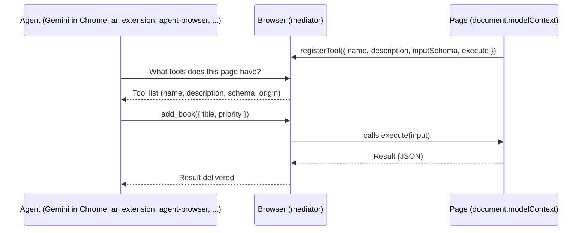

> Written: 2026-09-05
> Target spec: WebMCP Draft Community Group Report (2026-09-04 edition) and the explainer repository `webmachinelearning/webmcp`
> Test environment: Google Chrome 152.0.7977.66 (headless) + agent-browser 0.36.0, macOS

---

_This article is mostly written by Claude Code_

## Table of Contents

1. [Why WebMCP, and Why Now?](#1-why-webmcp-and-why-now)
2. [Where Does It Sit Among the Previous Articles?](#2-where-does-it-sit-among-the-previous-articles)
3. [Understanding It in One Sentence](#3-understanding-it-in-one-sentence)
4. [Three Generations of Browser Automation: Selectors, Accessibility Trees, Declared Tools](#4-three-generations-of-browser-automation-selectors-accessibility-trees-declared-tools)
5. [The Imperative API: document.modelContext](#5-the-imperative-api-documentmodelcontext)
6. [The Declarative API: Two Attributes Turn a Form into a Tool](#6-the-declarative-api-two-attributes-turn-a-form-into-a-tool)
7. [What the Browser Guarantees, and What It Does Not](#7-what-the-browser-guarantees-and-what-it-does-not)
8. [Hands-On: Chrome 152 + agent-browser 0.36](#8-hands-on-chrome-152--agent-browser-036)
9. [How agent-browser Wired Up WebMCP](#9-how-agent-browser-wired-up-webmcp)
10. [The Relationship to MCP](#10-the-relationship-to-mcp)
11. [The Ecosystem as of September 2026](#11-the-ecosystem-as-of-september-2026)
12. [Things to Watch Out For](#12-things-to-watch-out-for)
13. [Conclusion](#13-conclusion)

---

## 1. Why WebMCP, and Why Now?

This blog has analyzed browser automation tools across several articles. [Playwright](/kb/2026-04-17-playwright-architecture) is the standard for selector-based scripts written by humans, [agent-browser](/kb/2026-04-09-agent-browser-architecture) attaches references like `@e1` to the accessibility tree so an LLM can "read" and operate a page, and [Browser Use](/kb/2026-06-30-browser-use-architecture) focuses on how to summarize the DOM for the model. The three approaches differ, but they share one premise: **the page was built for humans, and the agent has to interpret it somehow.**

WebMCP flips that premise. The page declares, as structured tools, "here is what I can do and here is how to call it," and the browser mediates those tools to the agent. Instead of interpreting screenshots or hunting for a button in the accessibility tree, the agent calls a function that comes with a name and a JSON Schema.

In 2026 the proposal started leaving the experimental stage.

| When | What happened |
| --- | --- |
| 2025-08-13 | Google and Microsoft engineers publish the first explainer in the W3C Web Machine Learning Community Group |
| 2026-02 | Early preview ships in Chrome 146 |
| 2026-05-19 | Google I/O 2026 presents it as a pillar of the "Agentic Web", the Chrome 149 origin trial starts, and Gemini in Chrome support is announced |
| 2026-05-27 | The spec moves the API getter from `navigator` to `document` |
| 2026-09-01 | agent-browser 0.36.0 adds experimental WebMCP support (`webmcp list/invoke`) |
| 2026-09-04 | The latest spec draft is published (Draft Community Group Report) |

Edge 150 opened an origin trial as well, and the implementation-status document lists ChatGPT Desktop as a client that consumes WebMCP tools. Two browsers and several agent clients are pushing the same idea at the same time: the page declares its tools.

## 2. Where Does It Sit Among the Previous Articles?

| Article | Central problem | Relationship to WebMCP |
| --- | --- | --- |
| [Playwright architecture](/kb/2026-04-17-playwright-architecture) | Cross-browser E2E scripts written by humans | Playwright drives the UI through selectors. WebMCP calls functions the page declared instead, so the object under test can move from "the screen" to "the tool contract." |
| [agent-browser architecture](/kb/2026-04-09-agent-browser-architecture) | An LLM operating a page through accessibility-tree refs | From 0.36.0 the same CLI handles both the accessibility tree and WebMCP tools. The hands-on section of this article uses that path. |
| [Lightpanda architecture](/kb/2026-03-13-lightpanda-architecture) | An ultra-light browser engine for AI crawling | WebMCP is exposed as a Chromium CDP domain, so a separate engine has no such path yet. |
| [Browser Use architecture](/kb/2026-06-30-browser-use-architecture) | How to show the DOM to an LLM | On a page with WebMCP, the "showing" problem shrinks to "reading the tool list." |
| [Firecrawl architecture](/kb/2026-07-06-firecrawl-architecture) | Turning the web into LLM-ready markdown | Read-only consumption still needs crawling. WebMCP is a standard for "acting." |
| [Browser automation tool comparison](/kb/2026-04-16-browser-automation-comparison) | Choosing among the three tools | This article is the sequel. It is not one more option but a new axis, where the page cooperates. |

## 3. Understanding It in One Sentence

**WebMCP is a browser API in which a web page registers JavaScript functions or HTML forms as "tools" on `document.modelContext`, and the browser mediates those tools to the user's agent.**



The key point is that the browser is the **mediator**. The page never meets the agent directly, and the agent never executes the page's JavaScript directly. The browser decides what to show to whom based on origin, permissions policy, and document lifecycle.

## 4. Three Generations of Browser Automation: Selectors, Accessibility Trees, Declared Tools

| Generation | What the agent sees | Representative tools | Strength | Weakness |
| --- | --- | --- | --- | --- |
| 1. Selectors | DOM selectors, XPath | Playwright, Selenium | Precise and fast | A human must know the selectors, and markup changes break them |
| 2. Accessibility tree and screenshots | A tree of roles, names, and states, or pixels | agent-browser, Browser Use, computer use | Works on any page | Token-heavy, meaning must be inferred, many steps |
| 3. Declared tools | A list of functions with names, descriptions, and JSON Schemas | WebMCP | One call, a clear contract, reuse of client-side logic | The page must cooperate, and it is still experimental |

The third generation does not replace the second. The WebMCP explainer itself lists "headless browsing" and "fully autonomous workflows" as non-goals. The aim is to open page functionality to an agent inside the browser the user is looking at, in a form that keeps a human in the loop. Pages that declare no tools still need the accessibility tree, which is why a design like agent-browser's, with both paths in one CLI, is the natural shape.

## 5. The Imperative API: document.modelContext

The spec's WebIDL is short. `ModelContext` inherits from `EventTarget` and has three methods and one event.

```webidl
[Exposed=Window, SecureContext]
interface ModelContext : EventTarget {
  Promise<undefined> registerTool(ModelContextTool tool, optional ModelContextRegisterToolOptions options = {});
  Promise<sequence<RegisteredTool>> getTools(optional ModelContextGetToolOptions options = {});
  Promise<DOMString> executeTool(RegisteredTool tool, optional object inputObject = {}, optional ModelContextExecuteToolOptions options = {});
  attribute EventHandler ontoolchange;
};
```

It is `SecureContext`, so it works only over HTTPS or on localhost, and each `Document` owns one `ModelContext`. Registering a tool looks like this (the explainer's example).

```js
const controller = new AbortController();

await document.modelContext.registerTool(
  {
    name: 'add-todo',
    description: "Add a new item to the user's active todo list",
    inputSchema: {
      type: 'object',
      properties: {
        text: { type: 'string', description: 'The text content of the todo item' },
      },
      required: ['text'],
    },
    async execute({ text }) {
      await addTodoItemToCollection(text);
      return {
        content: [{ type: 'text', text: `Added todo item: "${text}" successfully.` }],
      };
    },
  },
  { signal: controller.signal }
);
```

Passing an `AbortSignal` unregisters the tool when the signal aborts. It is the mechanism for tying a tool's lifetime to a component's lifetime as views change in an SPA.

### Tool descriptor fields

| Field | Required | Meaning |
| --- | --- | --- |
| `name` | Yes | 1 to 128 characters, ASCII letters, digits, `_`, `-`, and `.` only. Unique within the document. |
| `description` | Yes | Natural-language description the model reads |
| `title` | No | Human-readable label for UI |
| `inputSchema` | No | JSON Schema for the input |
| `execute` | Yes | The callback. Its return value is serialized to JSON and delivered to the agent as a string. |
| `annotations` | No | The `readOnlyHint`, `untrustedContentHint`, and `consequentialHint` hints |

The `RegisteredTool` returned by `getTools()` adds `window` (the registering document's Window) and `origin` (the serialized origin) to the registration data, so the agent always knows which frame and which origin produced a tool.

### Cross-origin exposure

By default a tool is visible only to the same origin and to the browser's built-in agents. To open it to a partner origin, use `exposedTo`.

```js
await document.modelContext.registerTool(
  {
    name: 'share-location',
    execute() {
      return { office: 'Building 4' };
    },
  },
  { exposedTo: ['https://trusted-partner.example'] }
);
```

The other side queries with `getTools({ fromOrigins: [...] })`. A cross-origin `<iframe>` must carry `allow="tools"`, governed by the `tools` feature of Permissions Policy, whose default allowlist is `self`.

## 6. The Declarative API: Two Attributes Turn a Form into a Tool

Where the imperative API requires JavaScript, the declarative API only adds attributes to a `<form>` you already have. Below is the form used in this article's hands-on section.

```html
<form
  id="add-form"
  toolname="add_book"
  tooldescription="Add a book to the reading list"
  toolautosubmit
>
  <label for="title">Title</label>
  <input id="title" name="title" required toolparamdescription="Exact book title" />
  <label for="author">Author</label>
  <input id="author" name="author" toolparamdescription="Author name (optional)" />
  <label for="priority">Priority</label>
  <select id="priority" name="priority">
    <option value="low">low</option>
    <option value="normal" selected>normal</option>
    <option value="high">high</option>
  </select>
  <button type="submit">Add</button>
</form>
```

| Attribute | Where | Meaning |
| --- | --- | --- |
| `toolname` | `<form>` | The tool name. Removing this or `tooldescription` unregisters the tool. |
| `tooldescription` | `<form>` | The tool description |
| `toolautosubmit` | `<form>` | If present, the agent submits right after filling the fields, without user review. If absent, the browser focuses the submit button and the agent is expected to ask the user to review. |
| `toolparamdescription` | Each form control | The schema property description. If absent, the associated `<label>` text is used, then `aria-description`. |

The browser **synthesizes** a JSON Schema from the form controls. Here is the schema Chrome 152 actually produced for the form above (excerpted from agent-browser's `webmcp list --json` output).

```json
{
  "type": "object",
  "properties": {
    "title": { "type": "string", "description": "Exact book title" },
    "author": { "type": "string", "description": "Author name (optional)" },
    "priority": {
      "type": "string",
      "description": "Priority",
      "enum": ["low", "normal", "high"],
      "anyOf": [
        { "const": "low", "title": "low", "type": "string" },
        { "const": "normal", "title": "normal", "type": "string" },
        { "const": "high", "title": "high", "type": "string" }
      ]
    }
  },
  "required": ["title"]
}
```

The `required` attribute became the `required` array, the `<select>` options became `enum` plus `anyOf`, and `priority`, which had no `toolparamdescription`, picked up the `<label>` text "Priority" as its description. Exactly what the documentation says.

### The submit event and the response

When the agent submits the form, the usual `submit` event fires. Two things are different. `SubmitEvent.agentInvoked` is `true`, and after calling `preventDefault()` you can return a result to the agent with `respondWith(promise)`.

```js
form.addEventListener('submit', (event) => {
  event.preventDefault();
  const data = Object.fromEntries(new FormData(event.target));
  books.push(data);
  render();
  if (event.agentInvoked && typeof event.respondWith === 'function') {
    event.respondWith(Promise.resolve({ added: data, total: books.length }));
  } else {
    event.target.reset();
  }
});
```

The same handler runs whether a human or an agent submitted; only the response path differs. For a form that navigates, the first `<script type="application/ld+json">` on the destination page is used as the response instead of `respondWith`.

In addition, `window` receives `toolactivated` (right after the fields are filled) and `toolcancel` (user cancellation or `reset()`), and the CSS pseudo-classes `:tool-form-active` and `:tool-submit-active` let you visualize "an agent is filling this form right now."

## 7. What the Browser Guarantees, and What It Does Not

What the browser **guarantees** is boundaries.

- A tool runs only in the context of the document that registered it. The agent is not injecting arbitrary JavaScript.
- By default a tool is visible only to the same origin and built-in agents, and cross-origin exposure requires `exposedTo` and `fromOrigins` to agree on both sides.
- The `tools` Permissions Policy controls allowance per iframe.
- Every tool carries its `origin` and `window`, so provenance cannot be hidden.

What the browser **does not guarantee** is trust.

- `readOnlyHint`, `untrustedContentHint`, and `consequentialHint` are, as the names say, hints. If the page lies, the browser does not check.
- `inputSchema` is a description, not enforcement (section 8 confirms this in practice). Authorization checks belong inside the page's `execute`.
- Tool descriptions and results are text the page wrote, so from the agent's point of view they are a prompt-injection surface.

And the explainer's non-goals bear repeating. Headless browsing, fully autonomous workflows, replacing backend integrations, and replacing human interfaces are not goals. WebMCP's first customer is the agent inside the browser the user is looking at.

## 8. Hands-On: Chrome 152 + agent-browser 0.36

For this article I called real tools locally. Two things were needed.

- Chrome 152. WebMCP is still behind a feature flag, and agent-browser passes `--enable-features=WebMCPTesting,DevToolsWebMCPSupport` when it launches Chrome.
- agent-browser 0.36.0 (`npm install agent-browser@0.36.0`).

The demo page is a "reading list." It has the declarative `add_book` form from section 6 plus two imperative tools, `list_books` (read-only) and `remove_book` (mutating).

```js
const mc = document.modelContext || navigator.modelContext;
mc.registerTool({
  name: 'list_books',
  description: 'List the books on the reading list, optionally filtered by priority',
  inputSchema: {
    type: 'object',
    properties: { priority: { type: 'string', enum: ['low', 'normal', 'high'] } },
  },
  annotations: { readOnlyHint: true },
  async execute({ priority } = {}) {
    const rows = priority ? books.filter((b) => b.priority === priority) : books;
    return { content: [{ type: 'text', text: JSON.stringify(rows) }] };
  },
});
mc.registerTool({
  name: 'remove_book',
  description: 'Remove a book from the reading list by its exact title',
  inputSchema: { type: 'object', properties: { title: { type: 'string' } }, required: ['title'] },
  annotations: { readOnlyHint: false, consequentialHint: true },
  async execute({ title }) {
    const index = books.findIndex((b) => b.title === title);
    if (index < 0) throw new Error(`No book titled "${title}"`);
    const [removed] = books.splice(index, 1);
    render();
    return { removed, total: books.length };
  },
});
```

### Listing tools

```bash
$ agent-browser open http://127.0.0.1:8765/
$ agent-browser webmcp list
add_book [6BC294DC597AFED36D0F0DF75E6FC625]
  Add a book to the reading list
  http://127.0.0.1:8765
list_books [6BC294DC597AFED36D0F0DF75E6FC625]
  List the books on the reading list, optionally filtered by priority
  http://127.0.0.1:8765
remove_book [6BC294DC597AFED36D0F0DF75E6FC625]
  Remove a book from the reading list by its exact title
  http://127.0.0.1:8765
```

The value in brackets is the frame ID. The declarative form `add_book` showed up as a tool without a single line of JavaScript, and with `--json` its `annotations` carry `autosubmit: true`, while the imperative tools carry `readOnly` and `untrustedContent`.

### Invoking

```bash
$ agent-browser webmcp invoke list_books --params '{"priority":"high"}'
F351E543B94C89DB7761867EFDD4BC55: completed
{
  "content": [
    { "text": "[{\"title\":\"Designing Data-Intensive Applications\",\"author\":\"Martin Kleppmann\",\"priority\":\"high\"}]", "type": "text" }
  ]
}

$ agent-browser webmcp invoke add_book --params '{"title":"The Pragmatic Programmer","author":"Hunt & Thomas","priority":"low"}'
B11ED9F5A2B3F37259631F4FC4D902DD: completed
{
  "added": { "author": "Hunt & Thomas", "priority": "low", "title": "The Pragmatic Programmer" },
  "total": 3
}

$ agent-browser webmcp invoke remove_book --params '{"title":"A Philosophy of Software Design"}'
0AAACDCA7E07F1240E5EDA4BE9538006: completed
{
  "removed": { "author": "John Ousterhout", "priority": "normal", "title": "A Philosophy of Software Design" },
  "total": 2
}
```

`add_book` was a form, but to the agent it is one function. Doing the same job through the accessibility tree means taking a `snapshot` with eight refs (`e1` through `e8`) and performing at least four actions: fill the title, fill the author, choose the priority, click Add. With WebMCP the schema already says what needs filling, so one call finishes it.

### Three traps I hit along the way

**First, `reset()` cancels the call.** My first handler called `form.reset()` right after submission, the way human-facing code usually does. The book was added, but the invocation came back like this.

```text
FD718E8D3498C8967C6FD68A49D1CD48: canceled
Tool execution cancelled by a form reset
```

Per the spec, `reset()` cancels the tool activation. Scheduling the `reset()` after the `respondWith()` promise resolved gave the same result. On the agent path, either do not reset the form or reset it only after confirming the response finished some other way.

**Second, the schema is not validated.** Passing `"priority": "urgent"`, a value outside the `enum`, to `list_books` was not rejected; the tool ran and returned an empty array. The spec's open questions still include "schema validation timing." Validate inside `execute`.

**Third, exception messages do not come through.** Passing a missing title to `remove_book` to trigger `throw new Error(...)` gave status `failed` and `rawStatus` `Error`, but the `error` field was an empty string. To tell the agent why something failed, returning an error inside the result object is safer than throwing.

### Detached runs and turning it off

A long-running tool can be invoked with `--detach` and collected later with `webmcp result <id>`, or cancelled with `webmcp cancel <id>`. Launching Chrome with `--no-webmcp` made `document.modelContext` itself `undefined` and the tool list empty. In other words, WebMCP is not on by default yet; it is tied to a feature flag or an origin trial.

## 9. How agent-browser Wired Up WebMCP

agent-browser injects no script into the page. It uses Chrome's experimental CDP domain, `WebMCP`. From the source (`cli/src/native/webmcp.rs`, about 890 lines) the structure is as follows.

- At Chrome launch it enables the `WebMCPTesting` and `DevToolsWebMCPSupport` features. That is what brings `document.modelContext` to life and opens the DevTools-side domain.
- After `WebMCP.enable`, it maintains the tool list through the `WebMCP.toolsAdded` and `WebMCP.toolsRemoved` events; invocation is `WebMCP.invokeTool`, results arrive as `WebMCP.toolResponded`, and cancellation is `WebMCP.cancelInvocation`.
- Tools are keyed by the (frame ID, name) pair and each frame's origin is tracked separately. When several frames register the same name, you must pick one with `--frame`.
- Everything the page sends is bounded.

| Bound | Value |
| --- | --- |
| Tool input | 1 MiB |
| Tool output | 2 MiB (truncated beyond that, with the original size reported) |
| One tool record | 256 KiB |
| Whole tool list | 2 MiB |
| Number of tools | 512 |
| Retained invocation history | 128 |
| Error string | 64 KiB |

- In unsupported environments (an attached external browser, remote providers, Lightpanda, Safari, iOS, older Chrome builds) it returns a `webmcp_unsupported` error.
- In MCP server mode the WebMCP tools stay out of the default profile; `agent-browser mcp --tools core,webmcp` opts in and exposes `agent_browser_webmcp_list/invoke/result/cancel`.

The most interesting addition is the accompanying `webmcp-gen` skill. For a site without WebMCP, it has the agent write a `webmcp.init.js`, inject it with `--init-script`, wrap the existing UI workflow as a tool, and then verify with `manifest.json` and `eval.json` that "the tool produces the same result as the UI." If the site will not declare tools, the agent declares them instead. The skill document also states that credentials and cookies must never enter the generated code, that a missing or false `readOnlyHint` should be read as a possible mutation, and that one must not claim JSON Schema enforces authorization.

## 10. The Relationship to MCP

Despite the similar name, WebMCP is not an MCP server. What they share is vocabulary. `name`, `description`, `inputSchema`, the `content` array, and annotations such as `readOnlyHint` are taken directly from MCP's tool definition, so anyone who has built an MCP client will find the code that reads a tool list familiar.

The difference is where execution happens and what the boundary is. MCP tools run in a separate process or server and have a transport layer (stdio, HTTP). WebMCP tools run inside the page's JavaScript, and instead of a transport layer they use the browser's origin model and Permissions Policy. Reusing the user's login session, the page state, and the client-side validation logic as they are is the advantage WebMCP claims, and the explainer describes it as "preventing the disintermediation of the web." Rather than opening a separate backend API that lets agents bypass the front end, the front end becomes the agent's entry point.

## 11. The Ecosystem as of September 2026

| Component | Status |
| --- | --- |
| Chrome | Origin trial from 149. Local development via `chrome://flags/#enable-webmcp-testing`. Tested here on 152 |
| Edge | Origin trial from 150 |
| Brave | Experimental support in Leo AI chat |
| Firefox, Safari | Under review in standards-positions |
| Gemini in Chrome | Support announced at I/O 2026 |
| ChatGPT Desktop | Listed as a consuming client in the implementation-status document |
| agent-browser | Experimental support via CDP from 0.36.0 |
| Playwright | No official support that I could confirm. There are articles that call `document.modelContext` through evaluate in the page context |
| Developer tools | The Model Context Tool Inspector on the Chrome Web Store (uses the testing `navigator.modelContextTesting` API), GoogleChromeLabs/webmcp-tools |
| Polyfill | `@mcp-b/webmcp-polyfill` |
| Frameworks | Angular announced experimental support |

## 12. Things to Watch Out For

### 1. The spec is still moving.

On May 27, 2026 the getter moved from `navigator` to `document`, and in the Chrome 152 I tested, `navigator.modelContext` was already `undefined`. The spec's declarative API section is marked "entirely a TODO" and defers to the explainer, and the cancel event is named differently in the explainer (`toolcanceled`) and the Chrome docs (`toolcancel`). If you write code today, feature detection like `document.modelContext || navigator.modelContext` is mandatory.

### 2. Schemas and hints are not contracts.

As section 8 showed, values outside the `enum` still execute, and `consequentialHint` did not appear at all in agent-browser's CDP record (only `readOnly` and `untrustedContent` do). Authorization and validation are the job of `execute`.

### 3. Error information is thin.

The exception message never reached the agent. I could not determine whether that is a limit of the CDP domain or of agent-browser's handling, but either way, returning errors in the result value is the better choice for now.

### 4. Discovery is unsolved.

As the Chrome docs themselves note, you have to visit a site to learn whether it has tools. There is no ahead-of-time discovery path such as `robots.txt` or a manifest yet.

### 5. For automation tools, this is the "testing path."

The features agent-browser enables are named `WebMCPTesting` and `DevToolsWebMCPSupport`. You cannot assume that path is open in an ordinary user's Chrome. Conversely, it is already perfectly usable for verifying your own site's WebMCP tool contract in E2E tests.

### 6. The prompt-injection surface grows.

Tool descriptions, schemas, and results are all text the page wrote. The agent-browser docs say to treat all of it as "untrusted page content," and the `webmcp-gen` skill requires at least one "contaminated output or malicious description" case in its evaluation.

## 13. Conclusion

WebMCP changes the question browser automation asks. Until now the problem was "how do we show the page to the agent," and Playwright's selectors, agent-browser's accessibility-tree refs, and Browser Use's DOM summaries were each an answer. WebMCP asks the page to "say what you can do yourself." In return, the agent finishes a form in one function call, and the page reuses its login session and client-side logic unchanged.

Running it myself, the Chrome 152 and agent-browser 0.36 combination handled both the declarative form and the imperative tools. It also exposed the corners the spec is still smoothing out: cancellation by `reset()`, unvalidated schemas, vanishing exception messages. At work, automating E2E test authoring with agent-browser, I have felt first-hand that accessibility-tree snapshots are faster and cheaper in tokens than Playwright selectors, and WebMCP looks like the next step. What a test has to verify is starting to move from the buttons on the screen to the tool contract the page declares.

The accessibility tree is not going away. Most pages declare no tools, and the explainer excluded headless automation from its goals. But for a team that has to open its own site to agents, now, when you can start by adding two attributes to a form, is a good time to experiment.

### Related Articles

- [Playwright vs agent-browser vs Lightpanda: Which Browser Automation Tool Should You Use?](/kb/2026-04-16-browser-automation-comparison)
- [agent-browser Architecture Analysis](/kb/2026-04-09-agent-browser-architecture)
- [Analyzing Browser Use](/kb/2026-06-30-browser-use-architecture)
- [Playwright Architecture Explained](/kb/2026-04-17-playwright-architecture)

### References

- [WebMCP explainer (webmachinelearning/webmcp)](https://github.com/webmachinelearning/webmcp)
- [WebMCP spec draft](https://webmachinelearning.github.io/webmcp/)
- [Chrome for Developers: WebMCP](https://developer.chrome.com/docs/ai/webmcp)
- [Chrome for Developers: WebMCP Declarative API](https://developer.chrome.com/docs/ai/webmcp/declarative-api)
- [Chrome at Google I/O 2026](https://developer.chrome.com/blog/chrome-at-io26)
- [agent-browser 0.36.0 WebMCP docs](https://github.com/vercel-labs/agent-browser)
