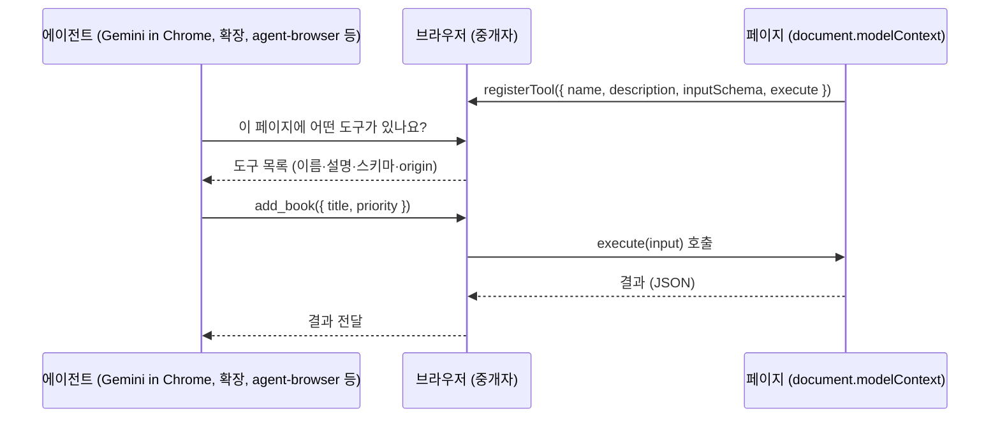

> 작성 일자: 2026-09-05
> 대상 스펙: WebMCP Draft Community Group Report (2026-09-04 판) 및 explainer 저장소 `webmachinelearning/webmcp`
> 테스트 환경: Google Chrome 152.0.7977.66 (headless) + agent-browser 0.36.0, macOS

---

_This article is mostly written by Claude Code_

## 목차

1. [왜 지금 WebMCP인가요?](#1-왜-지금-webmcp인가요)
2. [기존 글과의 관계](#2-기존-글과의-관계)
3. [한 문장으로 이해하기](#3-한-문장으로-이해하기)
4. [브라우저 자동화의 세 세대: 셀렉터, 접근성 트리, 도구 선언](#4-브라우저-자동화의-세-세대-셀렉터-접근성-트리-도구-선언)
5. [명령형 API: document.modelContext](#5-명령형-api-documentmodelcontext)
6. [선언형 API: 폼에 속성 두 개를 붙이면 도구가 됩니다](#6-선언형-api-폼에-속성-두-개를-붙이면-도구가-됩니다)
7. [브라우저가 보장하는 것과 보장하지 않는 것](#7-브라우저가-보장하는-것과-보장하지-않는-것)
8. [직접 해보기: Chrome 152 + agent-browser 0.36](#8-직접-해보기-chrome-152--agent-browser-036)
9. [agent-browser는 WebMCP를 어떻게 붙였나요?](#9-agent-browser는-webmcp를-어떻게-붙였나요)
10. [MCP와의 관계](#10-mcp와의-관계)
11. [생태계 현황 (2026년 9월)](#11-생태계-현황-2026년-9월)
12. [주의해서 볼 지점](#12-주의해서-볼-지점)
13. [결론](#13-결론)

---

## 1. 왜 지금 WebMCP인가요?

이 블로그에서는 브라우저 자동화 도구를 여러 편에 걸쳐 분석했습니다. [Playwright](/kb/2026-04-17-playwright-architecture)는 사람이 쓰는 셀렉터 기반 스크립트의 표준이고, [agent-browser](/kb/2026-04-09-agent-browser-architecture)는 접근성 트리에 `@e1` 같은 참조를 붙여 LLM이 페이지를 "읽고" 조작하게 하며, [Browser Use](/kb/2026-06-30-browser-use-architecture)는 DOM을 어떻게 요약해 모델에게 보여줄지에 집중합니다. 세 도구는 접근 방식이 다르지만 한 가지 전제를 공유합니다. **페이지는 사람을 위해 만들어졌고, 에이전트는 그것을 어떻게든 해석해야 한다**는 전제입니다.

WebMCP는 이 전제를 뒤집습니다. 페이지가 "나는 이런 일을 할 수 있고, 이렇게 호출하면 된다"를 구조화된 도구로 직접 선언하고, 브라우저가 그 도구를 에이전트에게 중개합니다. 에이전트는 스크린샷을 해석하거나 접근성 트리에서 버튼을 찾는 대신, 이름과 JSON Schema가 붙은 함수를 호출합니다.

2026년 들어 이 제안이 실험 단계를 벗어나기 시작했습니다.

| 시점 | 일어난 일 |
| --- | --- |
| 2025-08-13 | Google과 Microsoft 엔지니어가 W3C Web Machine Learning 커뮤니티 그룹에 explainer 첫 공개 |
| 2026-02 | Chrome 146에 early preview 탑재 |
| 2026-05-19 | Google I/O 2026에서 "Agentic Web"의 핵심으로 소개, Chrome 149 origin trial 시작, Gemini in Chrome 지원 예고 |
| 2026-05-27 | 스펙이 API getter를 `navigator`에서 `document`로 이동 |
| 2026-09-01 | agent-browser 0.36.0이 실험적 WebMCP 지원(`webmcp list/invoke`) 추가 |
| 2026-09-04 | 스펙 초안 최신 판 공개 (Draft Community Group Report) |

Edge 150도 origin trial을 열었고, 구현 현황 문서에는 ChatGPT Desktop이 WebMCP 도구를 소비하는 클라이언트로 올라와 있습니다. 즉 "페이지가 도구를 선언한다"는 아이디어를 브라우저 두 개와 에이전트 클라이언트 여럿이 동시에 밀고 있습니다.

## 2. 기존 글과의 관계

| 글 | 중심 문제 | WebMCP와의 관계 |
| --- | --- | --- |
| [Playwright 아키텍처](/kb/2026-04-17-playwright-architecture) | 사람이 쓰는 크로스 브라우저 E2E 스크립트 | Playwright는 셀렉터로 UI를 조작합니다. WebMCP는 UI 대신 페이지가 선언한 함수를 호출하므로, 테스트 대상이 "화면"에서 "도구 계약"으로 옮겨갈 수 있습니다. |
| [agent-browser 아키텍처](/kb/2026-04-09-agent-browser-architecture) | 접근성 트리 ref로 LLM이 페이지를 조작 | 0.36.0부터 같은 CLI가 접근성 트리와 WebMCP 도구를 모두 다룹니다. 이 글의 실습이 그 경로를 씁니다. |
| [Lightpanda 아키텍처](/kb/2026-03-13-lightpanda-architecture) | AI 크롤링용 초경량 브라우저 엔진 | WebMCP는 Chromium의 CDP 도메인으로 노출되므로, 별도 엔진은 아직 이 경로가 없습니다. |
| [Browser Use 아키텍처](/kb/2026-06-30-browser-use-architecture) | DOM을 LLM에게 어떻게 보여줄 것인가 | WebMCP가 있는 페이지에서는 "보여주기" 문제가 "도구 목록 읽기"로 줄어듭니다. |
| [Firecrawl 아키텍처](/kb/2026-07-06-firecrawl-architecture) | 웹을 LLM용 마크다운으로 변환 | 읽기 전용 소비에는 여전히 크롤링이 필요합니다. WebMCP는 "행동"을 위한 표준입니다. |
| [브라우저 자동화 도구 비교](/kb/2026-04-16-browser-automation-comparison) | 세 도구의 선택 기준 | 이 글은 그 비교의 다음 편입니다. 선택지가 하나 늘어난 것이 아니라, 페이지 쪽이 협조하는 새 축이 생겼습니다. |

## 3. 한 문장으로 이해하기

**WebMCP는 웹페이지가 `document.modelContext`에 JavaScript 함수나 HTML 폼을 "도구"로 등록하면, 브라우저가 그 도구를 사용자의 에이전트에게 중개해 주는 브라우저 API입니다.**



핵심은 브라우저가 **중개자**라는 점입니다. 페이지는 에이전트를 직접 만나지 않고, 에이전트도 페이지의 JavaScript를 직접 실행하지 않습니다. 브라우저가 origin, 권한 정책, 문서 생명주기를 기준으로 무엇을 누구에게 보여줄지 결정합니다.

## 4. 브라우저 자동화의 세 세대: 셀렉터, 접근성 트리, 도구 선언

| 세대 | 에이전트가 보는 것 | 대표 도구 | 강점 | 약점 |
| --- | --- | --- | --- | --- |
| 1. 셀렉터 | DOM 셀렉터, XPath | Playwright, Selenium | 정확하고 빠름 | 사람이 셀렉터를 알아야 하고, 마크업이 바뀌면 깨짐 |
| 2. 접근성 트리·스크린샷 | 역할·이름·상태가 붙은 트리, 또는 픽셀 | agent-browser, Browser Use, computer use | 어떤 페이지든 동작 | 토큰이 많이 들고, 의미를 추론해야 하며, 여러 단계가 필요 |
| 3. 도구 선언 | 이름·설명·JSON Schema가 붙은 함수 목록 | WebMCP | 한 번의 호출, 명확한 계약, 클라이언트 로직 재사용 | 페이지가 협조해야 함, 아직 실험 단계 |

3세대는 2세대를 대체하지 않습니다. WebMCP explainer 자체가 "헤드리스 브라우징"과 "완전 자율 워크플로"를 non-goal로 못 박고 있습니다. 목표는 사용자가 보고 있는 브라우저 안에서, 사람이 개입할 수 있는 형태로, 페이지 기능을 에이전트에게 열어 주는 것입니다. 도구를 선언하지 않은 페이지에서는 여전히 접근성 트리가 필요합니다. 그래서 agent-browser처럼 두 경로를 한 CLI에 두는 설계가 자연스럽습니다.

## 5. 명령형 API: document.modelContext

스펙의 WebIDL은 짧습니다. `ModelContext`는 `EventTarget`을 상속하고, 메서드 세 개와 이벤트 하나를 가집니다.

```webidl
[Exposed=Window, SecureContext]
interface ModelContext : EventTarget {
  Promise<undefined> registerTool(ModelContextTool tool, optional ModelContextRegisterToolOptions options = {});
  Promise<sequence<RegisteredTool>> getTools(optional ModelContextGetToolOptions options = {});
  Promise<DOMString> executeTool(RegisteredTool tool, optional object inputObject = {}, optional ModelContextExecuteToolOptions options = {});
  attribute EventHandler ontoolchange;
};
```

`SecureContext`이므로 HTTPS 또는 localhost에서만 쓸 수 있고, 각 `Document`가 자기 `ModelContext`를 하나씩 가집니다. 도구 등록은 이렇게 생겼습니다 (explainer의 예제).

```js
const controller = new AbortController();

await document.modelContext.registerTool(
  {
    name: 'add-todo',
    description: "Add a new item to the user's active todo list",
    inputSchema: {
      type: 'object',
      properties: {
        text: { type: 'string', description: 'The text content of the todo item' },
      },
      required: ['text'],
    },
    async execute({ text }) {
      await addTodoItemToCollection(text);
      return {
        content: [{ type: 'text', text: `Added todo item: "${text}" successfully.` }],
      };
    },
  },
  { signal: controller.signal }
);
```

`AbortSignal`을 넘기면 신호가 abort될 때 도구가 등록 해제됩니다. SPA에서 화면이 바뀔 때 도구 수명을 컴포넌트 수명에 묶기 위한 장치입니다.

### 도구 descriptor의 필드

| 필드 | 필수 | 의미 |
| --- | --- | --- |
| `name` | 예 | 1~128자, ASCII 영숫자·`_`·`-`·`.`만 허용. 같은 문서 안에서 유일해야 합니다. |
| `description` | 예 | 모델이 읽는 자연어 설명 |
| `title` | 아니오 | UI에 표시할 사람용 이름 |
| `inputSchema` | 아니오 | 입력 JSON Schema |
| `execute` | 예 | 실제 실행 콜백. 반환값은 JSON으로 직렬화되어 문자열로 에이전트에 전달됩니다. |
| `annotations` | 아니오 | `readOnlyHint`, `untrustedContentHint`, `consequentialHint` 힌트 |

`getTools()`가 돌려주는 `RegisteredTool`에는 등록 정보 외에 `window`(등록한 문서의 Window)와 `origin`(직렬화된 origin)이 붙습니다. 어떤 프레임의 어떤 origin이 낸 도구인지 에이전트가 항상 알 수 있게 한 것입니다.

### 교차 origin 노출

기본값은 같은 origin과 브라우저 내장 에이전트에게만 보이는 것입니다. 파트너 origin에 열려면 `exposedTo`를 씁니다.

```js
await document.modelContext.registerTool(
  {
    name: 'share-location',
    execute() {
      return { office: 'Building 4' };
    },
  },
  { exposedTo: ['https://trusted-partner.example'] }
);
```

반대편에서는 `getTools({ fromOrigins: [...] })`로 조회합니다. 교차 origin `<iframe>`은 `allow="tools"`를 붙여야 하며, 이는 Permissions Policy의 `tools` 기능(기본 allowlist `self`)으로 통제됩니다.

## 6. 선언형 API: 폼에 속성 두 개를 붙이면 도구가 됩니다

명령형 API가 JavaScript를 요구한다면, 선언형 API는 이미 있는 `<form>`에 속성만 붙입니다. 아래는 이 글의 실습에서 쓴 폼입니다.

```html
<form
  id="add-form"
  toolname="add_book"
  tooldescription="Add a book to the reading list"
  toolautosubmit
>
  <label for="title">Title</label>
  <input id="title" name="title" required toolparamdescription="Exact book title" />
  <label for="author">Author</label>
  <input id="author" name="author" toolparamdescription="Author name (optional)" />
  <label for="priority">Priority</label>
  <select id="priority" name="priority">
    <option value="low">low</option>
    <option value="normal" selected>normal</option>
    <option value="high">high</option>
  </select>
  <button type="submit">Add</button>
</form>
```

| 속성 | 위치 | 의미 |
| --- | --- | --- |
| `toolname` | `<form>` | 도구 이름. 이 속성이나 `tooldescription`을 제거하면 도구가 등록 해제됩니다. |
| `tooldescription` | `<form>` | 도구 설명 |
| `toolautosubmit` | `<form>` | 있으면 에이전트가 값을 채운 뒤 사용자 검토 없이 바로 제출합니다. 없으면 브라우저가 제출 버튼에 포커스를 두고, 에이전트는 사용자에게 검토를 요청해야 합니다. |
| `toolparamdescription` | 각 폼 컨트롤 | 스키마 속성 설명. 없으면 연결된 `<label>` 텍스트, 그것도 없으면 `aria-description`을 씁니다. |

브라우저는 폼 컨트롤에서 JSON Schema를 **합성**합니다. 실제로 Chrome 152가 위 폼에서 만든 스키마는 다음과 같았습니다 (agent-browser `webmcp list --json` 출력에서 발췌).

```json
{
  "type": "object",
  "properties": {
    "title": { "type": "string", "description": "Exact book title" },
    "author": { "type": "string", "description": "Author name (optional)" },
    "priority": {
      "type": "string",
      "description": "Priority",
      "enum": ["low", "normal", "high"],
      "anyOf": [
        { "const": "low", "title": "low", "type": "string" },
        { "const": "normal", "title": "normal", "type": "string" },
        { "const": "high", "title": "high", "type": "string" }
      ]
    }
  },
  "required": ["title"]
}
```

`required` 속성은 `required` 배열로, `<select>`의 옵션은 `enum`과 `anyOf`로, `toolparamdescription`이 없는 `priority`는 `<label>` 텍스트 "Priority"가 설명으로 들어갔습니다. 문서에 적힌 규칙 그대로입니다.

### 제출 이벤트와 응답

에이전트가 폼을 제출하면 평소와 같은 `submit` 이벤트가 옵니다. 다른 점은 두 가지입니다. `SubmitEvent.agentInvoked`가 `true`이고, `preventDefault()`를 부른 뒤 `respondWith(promise)`로 에이전트에게 결과를 돌려줄 수 있습니다.

```js
form.addEventListener('submit', (event) => {
  event.preventDefault();
  const data = Object.fromEntries(new FormData(event.target));
  books.push(data);
  render();
  if (event.agentInvoked && typeof event.respondWith === 'function') {
    event.respondWith(Promise.resolve({ added: data, total: books.length }));
  } else {
    event.target.reset();
  }
});
```

사람이 제출하든 에이전트가 제출하든 같은 핸들러가 돌고, 응답 경로만 갈립니다. 페이지 이동이 일어나는 폼이라면 `respondWith` 대신 이동한 페이지의 첫 `<script type="application/ld+json">`이 응답으로 쓰입니다.

그 밖에 `window`에 `toolactivated`(필드가 채워진 직후)와 `toolcancel`(사용자 취소 또는 `reset()`) 이벤트가 오고, CSS `:tool-form-active`와 `:tool-submit-active` 의사 클래스로 "지금 에이전트가 이 폼을 채우고 있다"를 시각화할 수 있습니다.

## 7. 브라우저가 보장하는 것과 보장하지 않는 것

브라우저가 **보장하는 것**은 경계입니다.

- 도구는 등록한 문서의 컨텍스트에서만 실행됩니다. 에이전트가 임의 JavaScript를 주입하는 것이 아닙니다.
- 기본적으로 같은 origin과 내장 에이전트에게만 보이고, 교차 origin 노출은 `exposedTo`와 `fromOrigins`가 양쪽에서 맞아야 합니다.
- Permissions Policy `tools`로 iframe 단위 허용을 통제합니다.
- 모든 도구에 `origin`과 `window`가 붙어 출처를 숨길 수 없습니다.

브라우저가 **보장하지 않는 것**은 신뢰입니다.

- `readOnlyHint`, `untrustedContentHint`, `consequentialHint`는 이름 그대로 힌트입니다. 페이지가 거짓말을 해도 브라우저는 검증하지 않습니다.
- `inputSchema`는 설명이지 강제가 아닙니다 (8절에서 실제로 확인합니다). 권한 검사는 페이지의 `execute` 안에서 직접 해야 합니다.
- 도구 설명과 결과는 페이지가 쓴 텍스트이므로, 에이전트 입장에서는 프롬프트 인젝션 표면입니다.

그리고 explainer의 non-goal을 다시 적어 둡니다. 헤드리스 브라우징, 완전 자율 워크플로, 백엔드 통합 대체, 사람용 인터페이스 대체는 목표가 아닙니다. WebMCP의 1차 고객은 사용자가 보고 있는 브라우저 안의 에이전트입니다.

## 8. 직접 해보기: Chrome 152 + agent-browser 0.36

이 글을 위해 로컬에서 실제로 호출해 봤습니다. 필요한 것은 두 가지였습니다.

- Chrome 152 (WebMCP는 아직 feature flag 뒤에 있습니다. agent-browser가 Chrome을 띄울 때 `--enable-features=WebMCPTesting,DevToolsWebMCPSupport`를 넘겨 줍니다.)
- agent-browser 0.36.0 (`npm install agent-browser@0.36.0`)

데모 페이지는 "읽을 책 목록"입니다. 6절의 선언형 폼 `add_book` 하나와, 명령형으로 등록한 `list_books`(읽기 전용)와 `remove_book`(변경) 두 개를 두었습니다.

```js
const mc = document.modelContext || navigator.modelContext;
mc.registerTool({
  name: 'list_books',
  description: 'List the books on the reading list, optionally filtered by priority',
  inputSchema: {
    type: 'object',
    properties: { priority: { type: 'string', enum: ['low', 'normal', 'high'] } },
  },
  annotations: { readOnlyHint: true },
  async execute({ priority } = {}) {
    const rows = priority ? books.filter((b) => b.priority === priority) : books;
    return { content: [{ type: 'text', text: JSON.stringify(rows) }] };
  },
});
mc.registerTool({
  name: 'remove_book',
  description: 'Remove a book from the reading list by its exact title',
  inputSchema: { type: 'object', properties: { title: { type: 'string' } }, required: ['title'] },
  annotations: { readOnlyHint: false, consequentialHint: true },
  async execute({ title }) {
    const index = books.findIndex((b) => b.title === title);
    if (index < 0) throw new Error(`No book titled "${title}"`);
    const [removed] = books.splice(index, 1);
    render();
    return { removed, total: books.length };
  },
});
```

### 도구 목록

```bash
$ agent-browser open http://127.0.0.1:8765/
$ agent-browser webmcp list
add_book [6BC294DC597AFED36D0F0DF75E6FC625]
  Add a book to the reading list
  http://127.0.0.1:8765
list_books [6BC294DC597AFED36D0F0DF75E6FC625]
  List the books on the reading list, optionally filtered by priority
  http://127.0.0.1:8765
remove_book [6BC294DC597AFED36D0F0DF75E6FC625]
  Remove a book from the reading list by its exact title
  http://127.0.0.1:8765
```

대괄호 안은 프레임 ID입니다. 선언형 폼 `add_book`이 JavaScript 한 줄 없이 도구로 잡혔고, `--json`으로 보면 `annotations`에 `autosubmit: true`가, 명령형 도구에는 `readOnly`와 `untrustedContent`가 붙어 있습니다.

### 호출

```bash
$ agent-browser webmcp invoke list_books --params '{"priority":"high"}'
F351E543B94C89DB7761867EFDD4BC55: completed
{
  "content": [
    { "text": "[{\"title\":\"Designing Data-Intensive Applications\",\"author\":\"Martin Kleppmann\",\"priority\":\"high\"}]", "type": "text" }
  ]
}

$ agent-browser webmcp invoke add_book --params '{"title":"The Pragmatic Programmer","author":"Hunt & Thomas","priority":"low"}'
B11ED9F5A2B3F37259631F4FC4D902DD: completed
{
  "added": { "author": "Hunt & Thomas", "priority": "low", "title": "The Pragmatic Programmer" },
  "total": 3
}

$ agent-browser webmcp invoke remove_book --params '{"title":"A Philosophy of Software Design"}'
0AAACDCA7E07F1240E5EDA4BE9538006: completed
{
  "removed": { "author": "John Ousterhout", "priority": "normal", "title": "A Philosophy of Software Design" },
  "total": 2
}
```

`add_book`은 폼이었지만 에이전트 입장에서는 함수 하나입니다. 접근성 트리로 같은 일을 하려면 `snapshot`으로 참조 8개(`e1`~`e8`)를 받고, 제목 입력·저자 입력·우선순위 선택·버튼 클릭까지 최소 네 번의 조작이 필요합니다. WebMCP에서는 스키마가 이미 "무엇을 채워야 하는지"를 말해 주므로 한 번의 호출로 끝납니다.

### 실습에서 만난 함정 세 가지

**첫째, `reset()`이 호출을 취소합니다.** 처음 작성한 핸들러는 사람용 코드처럼 제출 직후 `form.reset()`을 불렀습니다. 그러자 책은 추가됐는데 호출 상태는 이렇게 나왔습니다.

```text
FD718E8D3498C8967C6FD68A49D1CD48: canceled
Tool execution cancelled by a form reset
```

스펙대로 `reset()`은 도구 활성화를 취소합니다. `respondWith()`의 promise가 resolve된 뒤에 `reset()`을 예약해도 같은 결과였습니다. 에이전트 경로에서는 폼을 초기화하지 말거나, 응답이 끝난 것을 다른 방식으로 확인한 뒤 초기화해야 합니다.

**둘째, 스키마는 검증되지 않습니다.** `list_books`에 `enum`에 없는 `"priority": "urgent"`를 넘겼더니 거부되지 않고 그대로 실행되어 빈 배열이 돌아왔습니다. 스펙의 open question에도 "스키마 검증 시점"이 남아 있습니다. 검증은 `execute` 안에서 직접 해야 합니다.

**셋째, 예외 메시지가 전달되지 않습니다.** `remove_book`에 없는 제목을 넘겨 `throw new Error(...)`를 유발하면 상태는 `failed`, `rawStatus`는 `Error`였지만 `error` 필드는 빈 문자열이었습니다. 에이전트에게 실패 이유를 알리려면 예외를 던지는 대신 결과 객체에 오류를 담아 반환하는 편이 안전합니다.

### 분리 실행과 비활성화

오래 걸리는 도구는 `--detach`로 호출한 뒤 `webmcp result <id>`로 받을 수 있고, `webmcp cancel <id>`로 취소할 수 있습니다. `--no-webmcp`로 Chrome을 띄우면 `document.modelContext` 자체가 `undefined`가 되고 도구 목록은 비어 있었습니다. WebMCP가 아직 기본 활성화가 아니라 feature flag 또는 origin trial에 묶여 있다는 뜻입니다.

## 9. agent-browser는 WebMCP를 어떻게 붙였나요?

agent-browser는 페이지에 스크립트를 주입하지 않습니다. Chrome의 실험적 CDP 도메인 `WebMCP`를 씁니다. 소스(`cli/src/native/webmcp.rs`, 약 890줄)에서 확인한 구조는 다음과 같습니다.

- Chrome 실행 시 `WebMCPTesting`과 `DevToolsWebMCPSupport` 기능을 켭니다. 그래서 `document.modelContext`가 살아나고 DevTools 쪽 도메인이 열립니다.
- `WebMCP.enable` 뒤에 `WebMCP.toolsAdded`, `WebMCP.toolsRemoved` 이벤트로 도구 목록을 유지하고, 호출은 `WebMCP.invokeTool`, 결과는 `WebMCP.toolResponded`, 취소는 `WebMCP.cancelInvocation`입니다.
- 도구는 (프레임 ID, 이름) 쌍으로 관리하고 프레임별 origin을 따로 추적합니다. 여러 프레임이 같은 이름을 등록하면 `--frame`으로 골라야 합니다.
- 페이지가 보내는 모든 것에 상한을 둡니다.

| 상한 | 값 |
| --- | --- |
| 도구 입력 | 1 MiB |
| 도구 출력 | 2 MiB (초과 시 잘라내고 원래 크기를 함께 보고) |
| 도구 레코드 하나 | 256 KiB |
| 도구 목록 전체 | 2 MiB |
| 도구 개수 | 512 |
| 보관하는 호출 이력 | 128 |
| 오류 문자열 | 64 KiB |

- 지원하지 않는 환경(외부 브라우저 attach, 원격 provider, Lightpanda, Safari, iOS, 구형 Chrome)에서는 `webmcp_unsupported` 오류를 돌려줍니다.
- MCP 서버 모드에서는 기본 프로필에 넣지 않고 `agent-browser mcp --tools core,webmcp`로 옵트인해야 `agent_browser_webmcp_list/invoke/result/cancel` 도구가 열립니다.

가장 흥미로운 부분은 함께 추가된 `webmcp-gen` 스킬입니다. WebMCP를 지원하지 않는 사이트에 대해 에이전트가 `webmcp.init.js`를 작성해 `--init-script`로 주입하고, 기존 UI 워크플로를 도구로 감싼 뒤, `manifest.json`과 `eval.json`으로 "도구가 UI와 같은 결과를 내는지"를 검증하게 합니다. 사이트가 도구를 선언해 주지 않으면 에이전트가 대신 선언하는 셈입니다. 스킬 문서는 이때 자격 증명이나 쿠키를 코드에 넣지 말 것, `readOnlyHint`가 없거나 거짓이면 변경 가능성으로 볼 것, JSON Schema가 권한을 강제한다고 주장하지 말 것을 명시합니다.

## 10. MCP와의 관계

이름이 비슷하지만 WebMCP는 MCP 서버가 아닙니다. 공통점은 어휘입니다. `name`, `description`, `inputSchema`, `content` 배열, `readOnlyHint` 같은 annotation은 MCP의 tool 정의를 그대로 가져왔습니다. 그래서 MCP 클라이언트를 만들어 본 사람이라면 도구 목록을 읽는 코드가 낯설지 않습니다.

차이는 실행 위치와 경계입니다. MCP 도구는 별도 프로세스나 서버에서 돌고 전송 계층(stdio, HTTP)을 가집니다. WebMCP 도구는 페이지의 JavaScript 안에서 돌고, 전송 계층 대신 브라우저의 origin 모델과 Permissions Policy를 씁니다. 사용자의 로그인 세션, 페이지 상태, 클라이언트 측 검증 로직을 그대로 재사용한다는 것이 WebMCP가 내세우는 장점이고, explainer는 이를 "웹의 disintermediation을 막는다"고 표현합니다. 백엔드 API를 따로 열어 에이전트가 프론트엔드를 우회하게 만드는 대신, 프론트엔드가 에이전트의 진입점이 되게 하자는 것입니다.

## 11. 생태계 현황 (2026년 9월)

| 구성 요소 | 상태 |
| --- | --- |
| Chrome | 149부터 origin trial. 로컬 개발은 `chrome://flags/#enable-webmcp-testing`. 이 글은 152로 테스트 |
| Edge | 150부터 origin trial |
| Brave | Leo AI 채팅에 실험적 지원 |
| Firefox, Safari | standards-positions에서 검토 중 |
| Gemini in Chrome | I/O 2026에서 지원 예고 |
| ChatGPT Desktop | 구현 현황 문서에 소비 클라이언트로 등재 |
| agent-browser | 0.36.0부터 CDP 경유 실험적 지원 |
| Playwright | 공식 지원은 확인하지 못했습니다. 페이지 컨텍스트에서 `document.modelContext`를 evaluate로 호출하는 방식의 글이 있습니다 |
| 개발 도구 | Chrome Web Store의 Model Context Tool Inspector(테스트용 `navigator.modelContextTesting` 사용), GoogleChromeLabs/webmcp-tools |
| 폴리필 | `@mcp-b/webmcp-polyfill` |
| 프레임워크 | Angular가 실험적 지원을 발표 |

## 12. 주의해서 볼 지점

### 1. 스펙이 아직 움직입니다.

2026년 5월 27일에 getter가 `navigator`에서 `document`로 옮겨졌고, 제가 테스트한 Chrome 152에서는 `navigator.modelContext`가 이미 `undefined`였습니다. 스펙 문서의 선언형 API 절은 "entirely a TODO"로 표시되어 explainer를 참조하고, 취소 이벤트 이름도 explainer(`toolcanceled`)와 Chrome 문서(`toolcancel`)가 다릅니다. 지금 코드를 쓴다면 `document.modelContext || navigator.modelContext` 같은 feature detection이 필수입니다.

### 2. 스키마와 힌트는 계약이 아닙니다.

8절에서 본 것처럼 `enum` 밖의 값도 실행되고, `consequentialHint`는 agent-browser의 CDP 레코드에 아예 나타나지 않았습니다 (`readOnly`, `untrustedContent`만 보입니다). 권한과 검증은 `execute` 안의 몫입니다.

### 3. 오류 정보가 얇습니다.

예외 메시지가 에이전트에게 도달하지 않았습니다. 이것이 CDP 도메인의 한계인지 agent-browser 쪽 처리인지는 확인하지 못했지만, 어느 쪽이든 지금은 오류를 반환값에 담는 편이 낫습니다.

### 4. 발견 문제가 남아 있습니다.

Chrome 문서가 스스로 한계로 적듯, 어떤 사이트에 도구가 있는지 알려면 직접 방문해야 합니다. `robots.txt`나 manifest 같은 사전 발견 경로는 아직 없습니다.

### 5. 자동화 도구에게는 "테스트 경로"입니다.

agent-browser가 켜는 기능 이름은 `WebMCPTesting`과 `DevToolsWebMCPSupport`입니다. 일반 사용자의 Chrome에서 이 경로가 열려 있다고 가정할 수 없습니다. 반대로 말하면, 자기 사이트의 E2E 테스트에서 WebMCP 도구 계약을 검증하는 용도로는 지금도 충분히 쓸 수 있습니다.

### 6. 프롬프트 인젝션 표면이 넓어집니다.

도구 설명, 스키마, 결과가 모두 페이지가 쓴 텍스트입니다. agent-browser 문서는 이를 전부 "untrusted page content"로 다루라고 적고, `webmcp-gen` 스킬은 평가 항목에 "오염된 출력 또는 악의적 설명" 케이스를 하나 이상 포함하라고 요구합니다.

## 13. 결론

WebMCP는 브라우저 자동화의 질문을 바꿉니다. 지금까지는 "에이전트에게 페이지를 어떻게 보여줄 것인가"가 문제였고, Playwright의 셀렉터, agent-browser의 접근성 트리 참조, Browser Use의 DOM 요약이 각자의 답이었습니다. WebMCP는 페이지 쪽에 "무엇을 할 수 있는지 스스로 말하라"고 요구합니다. 그 대가로 에이전트는 한 번의 함수 호출로 폼 하나를 끝내고, 페이지는 로그인 세션과 클라이언트 로직을 그대로 재사용합니다.

직접 돌려 본 결과, Chrome 152와 agent-browser 0.36 조합에서는 선언형 폼과 명령형 도구 모두 동작했습니다. 다만 `reset()` 취소, 검증 없는 스키마, 사라지는 예외 메시지처럼 스펙이 아직 정리 중인 모서리도 함께 드러났습니다. 회사에서 agent-browser로 E2E 테스트 작성을 자동화하며 접근성 트리 스냅샷이 Playwright 셀렉터보다 빠르고 토큰을 덜 쓴다는 것을 체감했는데, WebMCP는 그 다음 단계로 보입니다. 테스트가 검증해야 할 대상이 화면의 버튼에서 페이지가 선언한 도구 계약으로 옮겨가기 시작했습니다.

접근성 트리는 사라지지 않습니다. 도구를 선언하지 않은 페이지가 대부분이고, explainer도 헤드리스 자동화를 목표에서 뺐습니다. 하지만 자기 사이트를 에이전트에게 열어야 하는 팀이라면, 폼에 속성 두 개를 붙이는 것으로 시작할 수 있는 지금이 실험하기 좋은 시점입니다.

### 관련 글

- [Playwright vs agent-browser vs Lightpanda: 브라우저 자동화 도구, 어떤 걸 써야 할까?](/kb/2026-04-16-browser-automation-comparison)
- [agent-browser 아키텍처 분석 보고서](/kb/2026-04-09-agent-browser-architecture)
- [Browser Use 프로젝트 분석](/kb/2026-06-30-browser-use-architecture)
- [Playwright 아키텍처 해설](/kb/2026-04-17-playwright-architecture)

### 참고 자료

- [WebMCP explainer (webmachinelearning/webmcp)](https://github.com/webmachinelearning/webmcp)
- [WebMCP 스펙 초안](https://webmachinelearning.github.io/webmcp/)
- [Chrome for Developers: WebMCP](https://developer.chrome.com/docs/ai/webmcp)
- [Chrome for Developers: WebMCP Declarative API](https://developer.chrome.com/docs/ai/webmcp/declarative-api)
- [Chrome at Google I/O 2026](https://developer.chrome.com/blog/chrome-at-io26)
- [agent-browser 0.36.0 WebMCP 문서](https://github.com/vercel-labs/agent-browser)
