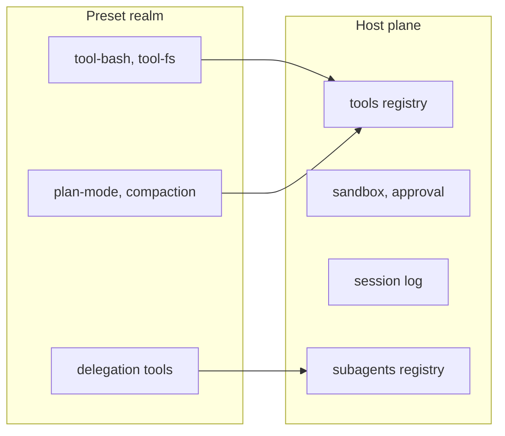

> Analysis date: 2026-09-09
> Target package: `@deepseek-ai/dsh` `0.1.2-rc.1` (npm `latest`, developer preview)
> Target commit: `5dda764ed3aa172535a7967b06ff95d9cbfe536a` (`master`, 2026-09-08)
> Repository: https://github.com/deepseek-ai/deepseek-harness
> Local analysis path: `~/workspace/opensources/deepseek-harness`
> Environment: macOS (Darwin 25.6.0), Node 24.15.0, `DSH_HOME` isolated to a temp directory

---

_This article is mostly written by Claude Code_

## Table of Contents

1. [Why a Hands-On Article?](#1-why-a-hands-on-article)
2. [Where This Sits Among the Previous Articles](#2-where-this-sits-among-the-previous-articles)
3. [Setup: One npx Command](#3-setup-one-npx-command)
4. [What the First Run Creates: A Profile of Four Files](#4-what-the-first-run-creates-a-profile-of-four-files)
5. [`--dump-config`: A 145-Row Product Specification](#5---dump-config-a-145-row-product-specification)
6. [Provenance Comments: Which Layer Touched This Row](#6-provenance-comments-which-layer-touched-this-row)
7. [The Surprise: The Web Profile Has No Tools Enabled](#7-the-surprise-the-web-profile-has-no-tools-enabled)
8. [Why: The Host Plane and the Preset Realm](#8-why-the-host-plane-and-the-preset-realm)
9. [Opening the Presets: standard at 30 Rows, minimal at 10](#9-opening-the-presets-standard-at-30-rows-minimal-at-10)
10. [Experiment 1: Disable, Enable, Insert](#10-experiment-1-disable-enable-insert)
11. [Experiment 2: Replacing a config Kills a CLI Flag](#11-experiment-2-replacing-a-config-kills-a-cli-flag)
12. [Experiment 3: Deliberately Writing the Wrong Thing](#12-experiment-3-deliberately-writing-the-wrong-thing)
13. [Comparing Five Profiles](#13-comparing-five-profiles)
14. [How Far Can You Get Without a Key?](#14-how-far-can-you-get-without-a-key)
15. [879 Commits in Four Days](#15-879-commits-in-four-days)
16. [What the Hands-On Taught Me to Watch For](#16-what-the-hands-on-taught-me-to-watch-for)
17. [Conclusion](#17-conclusion)

---

## 1. Why a Hands-On Article?

Last week I published an [architecture analysis of DeepSeek Harness](/kb/2026-09-05-deepseek-harness-architecture). It came from reading the source and the docs, and one thing was missing from it: **I had never actually run the thing.**

I wrote that "the product tree is literally an empty list plus patches," but I had never seen that empty list. I warned that "a patch replaces a row's entire `config`," but I had no idea what that replacement actually breaks. A sentence written from documentation and a sentence written after stepping on the rake are not the same sentence.

So this time I started from a single `npx` command, dumped the boot tree, built a patch layer by hand, deliberately wrote invalid things, and watched what broke and how. **I did not use a DeepSeek API key.** Without one you cannot talk to a model, but you can touch every part of the composition layer — which is the first finding of this article.

## 2. Where This Sits Among the Previous Articles

The earlier piece asked how this harness was built. This one asks how far I can change that structure with my own hands. The profile, bundle, and patch layers that the architecture article covered at an overview level get confirmed against real output here, and a **fifth layer that was invisible then — agent presets** — gets its own treatment.

It also continues the question that ran through the [OpenCode analysis](/kb/2026-06-29-opencode-architecture) and the [Cline analysis](/kb/2026-06-30-cline-architecture): how far should a harness open itself to replacement? Those articles were the result of reading code. This one is a record of actually pushing on the door that was supposedly open.

## 3. Setup: One npx Command

No clone required, no pnpm install required.

```sh
npx -y @deepseek-ai/dsh@latest --help
```

The first run took 45.9 seconds, mostly download time; afterwards it starts instantly from cache. That cache is not small, though — `~/.npm/_npx` grew to 1.4 GB. Node must be `^22.19.0 || >=24.0.0`.

The help text opens like this:

```text
dsh: boot a DeepSeek Harness profile — an ordered stack of plugin-bundle patch
layers under your own overrides.
```

Not "boots a profile" but "boots an ordered stack of patch layers, sitting under your own overrides." That is a summary of the composition model, not a description of a tool. And the options list contains the star of this article:

```text
  --profile <name>            the profile under $DSH_HOME/profiles to boot
  --patch <path>              extra patch-list overlay applied after the profile
                              layer (repeatable)
  --dump-config               print the composed profile tree and exit
  --dump-default-config       print the profile tree without its user layer or
                              --patch overlays and exit
```

Note that `--dump-config` and `--dump-default-config` come as a pair. Later on, diffing those two turns out to be the only reliable way to see exactly what my patch changed.

Throughout the experiments I pointed `DSH_HOME` at a temp directory, so nothing touched my home directory and everything could be deleted at once.

```sh
export DSH_HOME=$PWD/dsh-home
```

## 4. What the First Run Creates: A Profile of Four Files

The first `--profile web --dump-config` creates the profile directory. It holds four files and nothing else.

```text
dsh-home/profiles/web/
├── cordis.yml
├── cordis.patch.yml
├── package.json
└── pnpm-workspace.yaml
```

Here is `cordis.yml`:

```yaml
# dsh profile root — an empty entry list. The tree is composed as patches:
# each bundle in package.json's dsh.profile.bundles, then cordis.patch.yml, then any
# --patch overlays. Edit cordis.patch.yml, not this file.
[]
```

The "empty list" I described last week really is an empty list. Three comment lines and one `[]` are the whole file.

I tried something here. What happens if I write a row into this file myself?

```yaml
- id: hand-written
  name: '@deepseek-ai/dsh-session-stats'
```

I saved that, booted again, and reopened the same file:

```yaml
# dsh profile root — an empty entry list. The tree is composed as patches:
# ...
[]
```

**It is rewritten to `[]` on every boot.** My hand-written row vanished without a trace. That last comment line ("Edit cordis.patch.yml, not this file") is not advice; it is a notification.

The product composition lives in `package.json`:

```json
{
  "name": "dsh-profile-web",
  "private": true,
  "dependencies": {},
  "dsh": {
    "profile": {
      "bundles": ["@deepseek-ai/dsh-base", "@deepseek-ai/dsh-web-app"],
      "patchReload": "live"
    }
  }
}
```

It is worth noticing that this boots with `dependencies` empty. Bundles are referenced by name and resolved on the `dsh` side. `patchReload: live` is the web profile's value; the headless profile uses `startup` in the same slot. Whether editing a patch file gets picked up immediately or waits for a restart is a property of the profile.

## 5. `--dump-config`: A 145-Row Product Specification

Now for the main event.

```sh
npx -y @deepseek-ai/dsh@latest --profile web --dump-config > dump-web.txt
```

**0.46 seconds, no API key, no network call**, and out came 525 lines. Parsed, it looks like this:

| Metric                                           | Value |
| ------------------------------------------------ | ----- |
| Top-level rows                                   | 145   |
| Rows with `disabled: true`                       | 27    |
| Rows carrying a `!!js` expression                | 11    |
| Contributed by `@deepseek-ai/dsh-base` unchanged | 59    |
| `dsh-base` rows overridden by `dsh-web-app`      | 26    |
| Rows inserted by `dsh-web-app`                   | 60    |

This output is the product specification. Which plugin mounts, with what settings, in what order — it is all in one file. The web server row, for instance:

```yaml
- id: webserver
  name: '@deepseek-ai/dsh-host-webserver'
  inject:
    - webStartup
  config:
    host: !!js ctx.webStartup.host ?? '127.0.0.1'
    port: !!js ctx.webStartup.port ?? 3080
    compression: gzip
    compressionLevel: 1
    compressionThresholdBytes: 1024
```

The claim from last week that "`!!js` is lazily evaluated on the row's own fiber" is sitting right there in the flesh. The `--host` and `--port` CLI flags arrive through the `webStartup` service and into those expressions. A command-line flag is wired not to an `if` statement somewhere in the code but to **a line in a config file**. That fact trips me up in section 11.

## 6. Provenance Comments: Which Layer Touched This Row

My favorite part of the dump was not a row but a comment.

```yaml
# == @deepseek-ai/dsh-base
- id: fs-observation-policy
  name: '@deepseek-ai/dsh-fs-observation-policy'
# == @deepseek-ai/dsh-base, patched by @deepseek-ai/dsh-web-app
- id: tool-fs
  name: '@deepseek-ai/dsh-tool-fs'
  disabled: true
```

The `# ==` lines declare provenance: which bundle the row came from, and which layer modified it. The comment is reprinted wherever the layering changes, so simply scrolling shows you where the web-app's edits begin.

Once I added my own patch, the comment grew:

```text
# == @deepseek-ai/dsh-base, patched by @deepseek-ai/dsh-web-app, /tmp/.../profiles/web/cordis.patch.yml
```

Every layer of the four-layer composition signs its work. Once configuration gets as complex as code, "where on earth did this value come from" becomes the dominant debugging cost — and this project put the answer directly into the output.

## 7. The Surprise: The Web Profile Has No Tools Enabled

I pulled out the 27 rows carrying `disabled: true`. Then I read the list twice.

```text
tool-bash            tool-pwsh             tool-jobs
tool-fs              tool-fs-search        tool-str-replace-editor
tool-skill           tool-todo             tool-goal
tool-web             tool-ralph            tool-workflow
tool-subagent        tool-subagent-fork    tool-subagent-control
tool-subagent-list-agents                  workflow-worker-thread
skill-filesystem     agent-instructions    command-goal
plan-mode            compaction-basic      command-compact
tool-result-pruner   skill-badge           ui-schedule   hmr
```

Strip out `hmr`, `skill-badge`, and `ui-schedule` and **every model-facing tool is switched off.** No bash, no file reads, no search, no subagents, no workflows. And this is the default profile that serves the web UI. A coding agent does not ship unable to read files, so either I had misread something or I had misunderstood the structure.

It was the latter.

## 8. Why: The Host Plane and the Preset Realm

I opened the corresponding section of the bundle source. `packages/bundle/web-app/cordis.patch.yml` explains itself at length:

```text
# ── the agent plane moves behind agent presets ─────────────────────────────
#
# Every row below composes what ONE agent contributes to the host registries:
# its tools, its prompt sections, its delegation backends. The base keeps them
# for the TUI, which is single-session and composes its agent process-wide; the
# Web surface disables them here and lets each session mount a preset instead.
```

The structure works like this. dsh splits plugin rows across two planes:

- **The host plane**: whatever the whole process shares. The tool registry itself, the sandbox and approval stack, the session log, the model route, the token meter.
- **The preset realm**: whatever one agent contributes. The tools that agent sees, its prompt sections, its delegation backends.

The web profile serves many sessions at once. Each session must be able to pick a different preset, so model-facing tools cannot be mounted process-wide. The base bundle's tool rows are therefore all switched off and moved into per-session presets. A single-session surface like the TUI keeps using the process-wide composition as-is.

The criterion that decides which plane owns what is spelled out too:

```text
# `shell-env` STAYS in the host plane: ... a host row that injects a service is
# the criterion for host-plane ownership — injection resolves before any session
# exists, so there is no agent to key by.
```

**A row that injects a service belongs to the host plane**, because injection resolves before any session exists, leaving no agent to key it by. The background-job registry stays host-side for the same reason while only the `job_*` tools move into presets. The comment even records what went wrong when that rule was not followed:

```text
# ... an entry-local realm around the registry is invisible to
# every sibling row outside that realm, so `run_in_background` answered
# "background jobs unavailable" while the controls sat in the catalog.
```

The tool was listed in the catalog but answered "background jobs unavailable" when called. That judgment now survives as a comment and an Agent Note.



## 9. Opening the Presets: standard at 30 Rows, minimal at 10

So where are these presets? Four of them ship under `packages/preset/agent-presets/presets/`.

| Preset     | Rows | Character                                                                           |
| ---------- | ---- | ----------------------------------------------------------------------------------- |
| `standard` | 30   | The default: file editing, shell, search, skills, plan, goals, subagents, workflows |
| `ptc`      | 31   | The mode where the model calls tools by writing TypeScript                          |
| `minimal`  | 10   | Persistent bash and `str_replace_editor`, nothing else                              |
| `cordis`   | 31   | Includes the self-modification tools                                                |

Each preset consists of a `preset.yml` (name and description) and an `agent.cordis.yml` (the composition). And `agent.cordis.yml` uses exactly the same syntax as the boot tree. **This is one more composition layer, not a new concept.**

The opening of `standard`:

```yaml
- id: tool-bash
  name: '@deepseek-ai/dsh-tool-bash'
  disabled: !!js process.platform === 'win32'

- id: tool-pwsh
  name: '@deepseek-ai/dsh-tool-pwsh'
  disabled: !!js process.platform !== 'win32'
```

The `tool-bash` that was disabled in the boot tree gets switched on here. Even the platform branch is a line of YAML rather than an `if` statement.

One rule stood out. A row inside a preset that publishes a service must sit inside a group carrying an `isolate` realm, and the comment explains why:

```text
# A service row here MUST sit inside a group carrying an `isolate` realm.
# Without one it publishes into the root realm, where it is process-global —
# another preset publishing the same name collides ...
# `dsh-agent-presets` rejects that at mount.
```

The rule is not merely documented; it is rejected at mount time. That is why `plan-mode` and `compaction` are wrapped in groups:

```yaml
- id: compaction
  name: cordis:group
  group: true
  isolate:
    compaction: true
    toolResultPruner: true
  config:
    - id: compaction-basic
      name: '@deepseek-ai/dsh-compaction-basic'
    - id: tool-result-pruner
      name: '@deepseek-ai/dsh-compaction-tool-result-pruner'
```

But something in the `minimal` preset gave me pause:

```yaml
- id: filesystem
  name: cordis:group
  group: true
  isolate:
    fs: true
  config:
    - id: fs-local
      name: '@deepseek-ai/dsh-fs-local'
      config:
        cwd: !!js process.env.DSH_CWD ?? process.cwd()
```

The comment reads: "The bare local filesystem shadows the host's sandboxed provider only for this preset." **Switching the preset to `minimal` in the UI shadows the host's sandboxed filesystem provider with a bare local one.** Choosing a preset is choosing a sandbox.

That property leads straight into user-authored presets. You can write your own into `$DSH_HOME/.agent-presets`, and the bundle comment defines what that permission means:

```text
# ... and carries the same trust as shell access because a preset IS a
# composition.
```

Authoring a preset carries the same trust as shell access, because a preset is a composition and a composition can contain `!!js`.

One more thing. The `standard` preset already contains rows that run Codex and Claude Code as subagents — sitting there `disabled: true`.

```yaml
- id: tool-subagent-codex
  name: '@deepseek-ai/dsh-tool-subagent'
  disabled: true
  config:
    provider: codex
    toolName: subagent_codex
```

The comment tells you to install the matching bundle, restart the host, copy the preset, and remove `disabled` — then closes with one sentence: "Host availability alone grants no tool." Having a provider on the host does not give an agent the tool.

## 10. Experiment 1: Disable, Enable, Insert

Time to touch it. I put four operations into the profile's `cordis.patch.yml` at once.

```yaml
# 1) Replace an existing row's config
- id: webserver
  config:
    host: 127.0.0.1
    port: 3080
    compression: gzip
    compressionLevel: 1
    compressionThresholdBytes: 1024

# 2) Turn a row off
- id: ui-trajectory
  disabled: true

# 3) Revive a row the bundle shipped disabled
- id: tool-web
  disabled: false

# 4) Insert a new row
- insert:
    - id: my-marker
      name: '@deepseek-ai/dsh-session-stats'
```

Then I dumped both trees — one with my layer, one without — and diffed them.

```sh
npx -y @deepseek-ai/dsh@latest --profile web --dump-config > dump-patched.txt
npx -y @deepseek-ai/dsh@latest --profile web --dump-default-config > dump-default.txt
diff dump-default.txt dump-patched.txt
```

All four operations landed.

```diff
< - id: tool-web
<   disabled: true
---
> - id: tool-web
>   disabled: false
```

```diff
> # == /tmp/.../profiles/web/cordis.patch.yml
> - id: my-marker
>   name: '@deepseek-ai/dsh-session-stats'
```

525 lines became 534. That diff is effectively **a review tool for my own overrides**. After changing configuration you never have to guess what moved.

## 11. Experiment 2: Replacing a config Kills a CLI Flag

Operation 1 above contained a trap. The diff showed this:

```diff
<     host: !!js ctx.webStartup.host ?? '127.0.0.1'
<     port: !!js ctx.webStartup.port ?? 3080
---
>     host: 127.0.0.1
>     port: 3080
```

The values are identical — `127.0.0.1` and `3080`. But the expressions are gone. As section 5 showed, the `--host` and `--port` flags arrive _only_ through those expressions. I had just severed the CLI flags.

I checked whether that was really true. With the patch still in place, I booted on a different port:

```sh
npx -y @deepseek-ai/dsh@latest --profile web --no-open --port 8080
```

```text
dsh web: http://127.0.0.1:3080/?token=nTY9hwahZyUyXtJPU61i43DMncWuK38PogFP6xYrrm4
```

**I passed `--port 8080` and it came up on 3080.** `lsof` confirmed 8080 was empty and only 3080 was listening. No error, no warning, no "that flag was ignored."

As a control I deleted just the `webserver` patch block and ran the same command:

```text
dsh web: http://127.0.0.1:8080/?token=2mLD9GEAN7-zGgL8xiltr4AcuLJOAy8R5A46YA_K_3M
```

This time it came up on 8080.

Last week I wrote that "a patch replaces the row's entire `config`; since it is not a merge, the upper layer must restate every field." The sentence was correct, but I had not understood the size of the risk. The real danger is not omitting a field. It is **copying a field across accurately as a value while erasing the fact that it was an expression.** The most natural thing to do — copy what you saw in the dump — is exactly what causes this. Which is why the bundle files warn about it in their opening comments:

```text
# A patch replaces the targeted row's whole `config`, so each row below
# restates every key it owns.
```

## 12. Experiment 3: Deliberately Writing the Wrong Thing

To see how forgiving the composition layer is, I wrote two things wrong on purpose.

```yaml
- id: this-row-does-not-exist
  disabled: true
- id: session-stats
  config:
    someUnknownKey: 1
```

I applied that with `--patch`. The result:

```text
dsh: [/tmp/probe.yml] patch: entry "this-row-does-not-exist" not found
```

An unknown id produces **one warning line on stderr and is then ignored**. The exit code is 0 and the boot proceeds normally. A typo in a row name means nothing happens, silently — so writing a patch has to be followed by a `--dump-config` check.

Unknown config keys were even more forgiving. `someUnknownKey: 1` went straight into the tree with no warning at all. Schema validation does not happen at composition time; it happens when the plugin loads. A successful `--dump-config` is no guarantee of a successful boot.

## 13. Comparing Five Profiles

I dumped every shipped profile template and compared them.

| Profile       | Rows | `disabled` | Bundles         | `patchReload` |
| ------------- | ---- | ---------- | --------------- | ------------- |
| `web`         | 145  | 27         | base + web-app  | `live`        |
| `headless`    | 88   | 2          | base + headless | `startup`     |
| `sdk`         | 87   | 3          | base + sdk-app  | `startup`     |
| `acp`         | 87   | 3          | base + acp-app  | `startup`     |
| `sdk-minimal` | 33   | 0          | standalone      | `startup`     |

The only two disabled rows in `headless` are `hmr` and `skill-badge`. What about the tools?

```yaml
- id: tool-bash
  name: '@deepseek-ai/dsh-tool-bash'
  disabled: !!js process.platform === 'win32'
```

**Alive on the host plane.** This is section 8 confirmed in numbers. A single-session surface keeps its tools process-wide; the multi-session web surface disables 27 rows and moves them into presets. On top of the same base bundle, the character of the surface alone splits the composition this far apart.

`sdk-minimal` is a 33-row standalone composition, and its row list shows what the minimum form of this project is: the LLM adapter, sessions, the agent loop, four invariant checkers, and then persistent bash plus `str_replace_editor`. There is a sandbox policy, but the filesystem is `fs-local`.

## 14. How Far Can You Get Without a Key?

Booting `dsh web` with no API key prints this:

```text
dsh web: http://127.0.0.1:8080/?token=2mLD9GEAN7-zGgL8xiltr4AcuLJOAy8R5A46YA_K_3M
```

There is a token. Without it:

```sh
curl -s -o /dev/null -w '%{http_code}\n' http://127.0.0.1:8080/
# 401
curl -s http://127.0.0.1:8080/
# dsh web authentication required; reopen the URL printed by dsh web.
```

The `/api` paths return 401 as well. With the token you get a 303 and a session. Even bound to loopback, there is a separate browser-trust fence: another process on the same machine cannot get in just by knocking on the local port.

The UI itself comes up fully without a key. Sidebar, workspace list, settings, and session tree all render, with a "Preview" badge at the top. The composer and send button stay disabled until you pick a workspace. You cannot call a model, but nothing stops you from inspecting the result of the composition.

One thing I ran into deserves recording. The help text uses `--profile tui` in three of its examples:

```text
  dsh --profile tui --patch ./extra.yml      boot a custom profile with one extra overlay
  dsh --profile tui --resume <session>       arguments after the launcher flags reach the app
  dsh plugin --profile tui add <package>     install a plugin into the tui profile
```

I ran it verbatim:

```text
Error: dsh: profile "tui" does not exist; create it with 'dsh plugin --profile tui add <package>'
    at loadProfile (.../dsh-app-boot/lib/index.js:851:34)
    ...
Node.js v24.15.0
```

Last week's "small inconsistencies" section noted that this profile exists only in the help. Stepping on it in person, the failure is not a clean one-line error but an unhandled exception with a stack trace. The message content is helpful and even names the next action, but as the screen you get from typing a command your own help recommends three times, it is rough.

## 15. 879 Commits in Four Days

The previous analysis was pinned to commit `d347e70` (2026-09-04). I cloned again and compared.

| Metric   | At the 2026-09-05 analysis | 2026-09-09                                     |
| -------- | -------------------------- | ---------------------------------------------- |
| Stars    | 212,133                    | 216,971                                        |
| Forks    | 24,893                     | 25,647                                         |
| Version  | `0.1.3-alpha.1`            | `0.1.5-alpha.1` (npm `latest` is `0.1.2-rc.1`) |
| Packages | 255                        | 265                                            |

**879 commits** landed in four days. `docs/architecture.md` and `AGENTS.md` alone show substantial movement.

The biggest addition is an **Electron desktop application**. It owns a reserved profile at `$DSH_HOME/profiles/desktop`, and each signed release binds one exact dsh version. A single sentence from the docs summarizes the design: "the desktop composition opens no Web server or loopback port." No web server, no loopback port; versioned framed byte pipes and the `dsh-app://` protocol carry everything to the renderer. In effect they built a structure where the token fence from section 14 is unnecessary.

The agent loop changed too. `system/message` joined the list of durable session events, and the system prompt is now treated as a "surface node." The prompt travels only as `system/message` history, and an empty rendering clears every active system node. The invariant I summarized last week as "model-visible means logged" now extends to the system prompt. A new rule also states that retries do not repeat prompt assembly or `agent/pre-step`.

Smaller changes are visible as well. The native addon was renamed from `node-addon-landlock-run` to `node-addon-system`, and a `benchmarks/` directory of performance gates appeared. At the current commit there are 936 English Agent Notes (272 implemented, 20 proposed, 14 rejected, 628 archived), 54 files under `docs/subsystems/`, and 211 scripts of which 55 are `verify-*`.

The developer-preview warning is not decoration. An article citing a four-day-old commit is already nearly 900 commits out of date.

## 16. What the Hands-On Taught Me to Watch For

### 1. Do not copy values straight out of the dump.

That is section 11. The moment you transcribe a `!!js` expression as a literal value, a CLI flag dies quietly. Write patches from **the original row in the bundle source**, not from the dump.

### 2. Always verify a patch with a dump.

An unknown id gets one stderr warning; an unknown config key gets nothing at all. Diffing `--dump-config` against `--dump-default-config` is the only trustworthy confirmation.

### 3. Choosing a preset is choosing a sandbox.

The `minimal` preset shadows the host's sandboxed filesystem provider with a bare `fs-local`. One dropdown in the UI changes the isolation level. User-authored presets should be treated, as the bundle comment says outright, at the same trust level as shell access.

### 4. A successful `--dump-config` is not a successful boot.

Composition and validation are separate. Building the tree can succeed while plugin loading fails.

### 5. Do not take the help text at face value.

The `tui` profile its three examples recommend does not exist, and running it produces a stack trace.

### 6. The cache is large.

I only ever used `npx`, and `~/.npm/_npx` reached 1.4 GB. If you plan to look around and then clean up, clear the npx cache along with `DSH_HOME`.

## 17. Conclusion

What changed between before and after running it was not the facts but the feel. "Stacking patches on an empty tree" was already in last week's article, but only after opening a one-line `[]` file and watching my hand-written row get erased on the next boot did I understand how literally that sentence was meant.

The most impressive thing was the existence of `--dump-config` itself. In a configuration system composed of four layers, "where did this value come from" is an inevitable question, and this project answered it in advance with one command and a provenance comment. Pairing it with `--dump-default-config` so that your own overrides can be isolated with `diff` is just as good. It reads as a judgment that if you are going to treat configuration like code, configuration needs a debugger too.

What felt most dangerous was the other side of the same system. It passes over an unknown id with a single warning, and says nothing at all when you overwrite an expression with a value. High freedom in composition means just as many ways to be quietly wrong. Touching configuration in this project demands the same care as changing code — and this is the week I understood in my hands why the documentation keeps saying to treat composition as shell access.

You can see all of this without an API key. If the composition layer of a harness interests you, start with one line: `npx @deepseek-ai/dsh --profile web --dump-config`. Half a second later you have a 145-row product specification.

### Related Articles

- [Analyzing DeepSeek Harness](/kb/2026-09-05-deepseek-harness-architecture)
- [Analyzing OpenCode](/kb/2026-06-29-opencode-architecture)
- [Analyzing Cline](/kb/2026-06-30-cline-architecture)
- [Analyzing OpenClaw](/kb/2026-03-11-openclaw-architecture)

### References

- [deepseek-ai/deepseek-harness](https://github.com/deepseek-ai/deepseek-harness)
- [DeepSeek Harness documentation site](https://deepseek-harness.github.io/deepseek-harness/)
- [cordiverse/cordis](https://github.com/cordiverse/cordis)
- [A Programming Paradigm for Spatiotemporal Composability (arXiv 2608.25512)](https://arxiv.org/abs/2608.25512)
