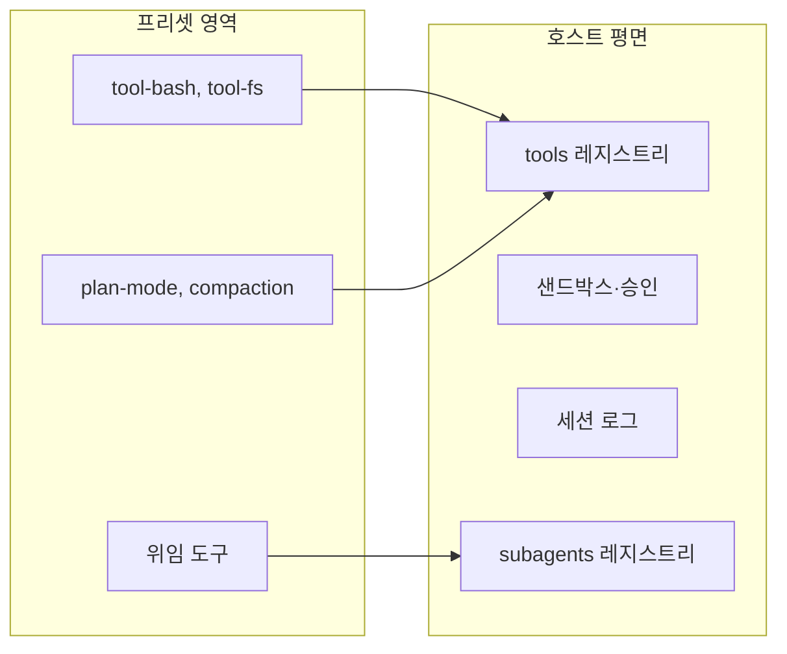

> 분석 일자: 2026-09-09
> 대상 패키지: `@deepseek-ai/dsh` `0.1.2-rc.1` (npm `latest`, developer preview)
> 대상 커밋: `5dda764ed3aa172535a7967b06ff95d9cbfe536a` (`master`, 2026-09-08)
> 저장소: https://github.com/deepseek-ai/deepseek-harness
> 로컬 분석 경로: `~/workspace/opensources/deepseek-harness`
> 실행 환경: macOS(Darwin 25.6.0), Node 24.15.0, `DSH_HOME`을 임시 디렉터리로 격리

---

_This article is mostly written by Claude Code_

## 목차

1. [왜 실습인가요?](#1-왜-실습인가요)
2. [기존 글과의 관계](#2-기존-글과의-관계)
3. [준비: npx 한 줄이면 됩니다](#3-준비-npx-한-줄이면-됩니다)
4. [첫 실행이 만드는 것: 파일 네 개짜리 프로필](#4-첫-실행이-만드는-것-파일-네-개짜리-프로필)
5. [`--dump-config`: 145행짜리 제품 명세서](#5---dump-config-145행짜리-제품-명세서)
6. [출처 주석: 어느 계층이 이 행을 건드렸나](#6-출처-주석-어느-계층이-이-행을-건드렸나)
7. [예상 밖의 결과: web 프로필에는 도구가 하나도 켜져 있지 않습니다](#7-예상-밖의-결과-web-프로필에는-도구가-하나도-켜져-있지-않습니다)
8. [이유: 호스트 평면과 프리셋 영역](#8-이유-호스트-평면과-프리셋-영역)
9. [프리셋 열어보기: standard 30행, minimal 10행](#9-프리셋-열어보기-standard-30행-minimal-10행)
10. [실습 1: 행을 끄고, 켜고, 끼워넣기](#10-실습-1-행을-끄고-켜고-끼워넣기)
11. [실습 2: config 교체가 CLI 플래그를 죽입니다](#11-실습-2-config-교체가-cli-플래그를-죽입니다)
12. [실습 3: 틀린 것을 일부러 써 보기](#12-실습-3-틀린-것을-일부러-써-보기)
13. [프로필 다섯 개 비교](#13-프로필-다섯-개-비교)
14. [키 없이 어디까지 되나요](#14-키-없이-어디까지-되나요)
15. [나흘 만에 879 커밋](#15-나흘-만에-879-커밋)
16. [실습에서 얻은 주의점](#16-실습에서-얻은-주의점)
17. [결론](#17-결론)

---

## 1. 왜 실습인가요?

지난주에 [DeepSeek Harness 아키텍처 분석](/kb/2026-09-05-deepseek-harness-architecture)을 썼습니다. 소스와 문서를 읽고 정리한 글인데 한 가지가 빠져 있었습니다. **정작 저는 그 도구를 한 번도 실행해 본 적이 없었습니다.**

"제품 트리가 문자 그대로 빈 목록과 패치입니다"라고 썼지만 그 빈 목록을 직접 본 적이 없었습니다. "패치는 행의 `config` 전체를 교체합니다"라고 경고했지만 그 교체가 실제로 무엇을 부수는지는 몰랐습니다. 문서를 읽고 쓴 문장과 직접 실행해 보고 쓴 문장은 다릅니다.

그래서 이번에는 `npx` 한 줄로 시작해 부팅 트리를 뽑고 패치 계층을 직접 만들고 일부러 틀린 것을 써 보며 무엇이 어떻게 깨지는지 확인했습니다. **DeepSeek API 키는 쓰지 않았습니다.** 키가 없으면 모델과 대화할 수 없지만 조립 계층은 전부 만져 볼 수 있습니다. 이것이 이 글의 첫 번째 발견입니다.

## 2. 기존 글과의 관계

앞선 글이 "이 하네스는 어떻게 만들어졌는가"였다면 이 글은 "그 구조를 내 손으로 어디까지 바꿀 수 있는가"입니다. 아키텍처 글에서 개요로만 지나간 프로필·번들·패치 계층을 실제 출력으로 확인하고 그때는 보이지 않았던 **다섯 번째 계층(에이전트 프리셋)** 을 새로 다룹니다.

[OpenCode 분석](/kb/2026-06-29-opencode-architecture)과 [Cline 분석](/kb/2026-06-30-cline-architecture)에서 다룬 "어디까지 교체 가능하게 열 것인가"라는 질문의 연장선이기도 합니다. 다만 그 글들이 코드를 읽은 결과라면 이 글은 그 문이 정말 열리는지 직접 밀어 본 기록입니다.

## 3. 준비: npx 한 줄이면 됩니다

저장소를 클론할 필요도, pnpm을 설치할 필요도 없었습니다.

```sh
npx -y @deepseek-ai/dsh@latest --help
```

첫 실행에는 45.9초가 걸렸습니다. 대부분 다운로드 시간이고 이후에는 캐시에서 즉시 뜹니다. 다만 이 캐시가 작지 않습니다. `~/.npm/_npx`가 1.4GB까지 늘었습니다. Node 버전은 `^22.19.0 || >=24.0.0`이어야 합니다.

도움말 첫 줄부터 성격이 드러납니다.

```text
dsh: boot a DeepSeek Harness profile — an ordered stack of plugin-bundle patch
layers under your own overrides.
```

"프로필을 부팅한다"가 아니라 "패치 계층을 순서대로 쌓은 스택을, 사용자 오버라이드 밑에 깔고 부팅한다"입니다. 도구 하나의 사용법 설명 대신 조립 모델의 요약이 먼저 옵니다. 그리고 옵션 목록에 이 글의 주인공이 있습니다.

```text
  --profile <name>            the profile under $DSH_HOME/profiles to boot
  --patch <path>              extra patch-list overlay applied after the profile
                              layer (repeatable)
  --dump-config               print the composed profile tree and exit
  --dump-default-config       print the profile tree without its user layer or
                              --patch overlays and exit
```

`--dump-config`와 `--dump-default-config`가 쌍으로 있습니다. 이 점을 기억해 두시면 좋습니다. 뒤에서 이 둘을 `diff`로 비교하는 것만으로 제 패치가 정확히 무엇을 바꿨는지 확인할 수 있습니다.

실습 내내 `DSH_HOME`을 임시 디렉터리로 지정해 두었습니다. 덕분에 홈 디렉터리를 건드리지 않고 실습 흔적을 통째로 지울 수 있었습니다.

```sh
export DSH_HOME=$PWD/dsh-home
```

## 4. 첫 실행이 만드는 것: 파일 네 개짜리 프로필

`--profile web --dump-config`를 처음 실행하면 프로필 디렉터리가 생깁니다. 파일은 네 개뿐이었습니다.

```text
dsh-home/profiles/web/
├── cordis.yml
├── cordis.patch.yml
├── package.json
└── pnpm-workspace.yaml
```

`cordis.yml`을 열어 봤습니다.

```yaml
# dsh profile root — an empty entry list. The tree is composed as patches:
# each bundle in package.json's dsh.profile.bundles, then cordis.patch.yml, then any
# --patch overlays. Edit cordis.patch.yml, not this file.
[]
```

지난 글에서 "빈 목록"이라고 쓴 것이 정말로 빈 목록이었습니다. 주석 세 줄과 `[]` 하나가 파일의 전부입니다.

여기서 한 가지를 시험해 봤습니다. 이 파일에 행을 직접 써 넣으면 어떻게 될까요?

```yaml
- id: hand-written
  name: '@deepseek-ai/dsh-session-stats'
```

이렇게 저장하고 다시 부팅한 뒤 같은 파일을 열었습니다.

```yaml
# dsh profile root — an empty entry list. The tree is composed as patches:
# ...
[]
```

**부팅할 때마다 `[]`로 되돌아갑니다.** 손으로 쓴 행은 흔적도 없이 사라졌습니다. 주석의 마지막 문장("Edit cordis.patch.yml, not this file")은 권고가 아니라 있는 그대로의 통보였습니다.

제품 구성은 `package.json`이 결정합니다.

```json
{
  "name": "dsh-profile-web",
  "private": true,
  "dependencies": {},
  "dsh": {
    "profile": {
      "bundles": ["@deepseek-ai/dsh-base", "@deepseek-ai/dsh-web-app"],
      "patchReload": "live"
    }
  }
}
```

`dependencies`가 비어 있는 채로 부팅된다는 점이 재미있습니다. 번들은 이름으로 참조되고 실제 해석은 `dsh` 패키지 쪽에서 이뤄집니다. `patchReload: live`는 web 프로필의 값이고 headless 프로필은 같은 자리에 `startup`을 씁니다. 패치 파일을 고쳤을 때 바로 다시 읽을지 재시작을 기다릴지는 프로필 속성입니다.

## 5. `--dump-config`: 145행짜리 제품 명세서

이제 본론입니다.

```sh
npx -y @deepseek-ai/dsh@latest --profile web --dump-config > dump-web.txt
```

**0.46초, API 키 없이, 네트워크 호출 없이** 525줄이 나왔습니다. 파싱해서 표로 옮겼습니다.

| 항목                                   | 값    |
| -------------------------------------- | ----- |
| 최상위 행                              | 145개 |
| `disabled: true` 행                    | 27개  |
| `!!js` 표현식을 가진 행                | 11개  |
| `@deepseek-ai/dsh-base`가 그대로 기여  | 59행  |
| `dsh-base`를 `dsh-web-app`이 덮어쓴 행 | 26행  |
| `dsh-web-app`이 새로 넣은 행           | 60행  |

이 출력이 곧 제품 명세서입니다. 어떤 플러그인이 어떤 설정으로 어떤 순서로 마운트되는지가 한 파일에 다 있습니다. 예를 들어 웹 서버 행을 보겠습니다.

```yaml
- id: webserver
  name: '@deepseek-ai/dsh-host-webserver'
  inject:
    - webStartup
  config:
    host: !!js ctx.webStartup.host ?? '127.0.0.1'
    port: !!js ctx.webStartup.port ?? 3080
    compression: gzip
    compressionLevel: 1
    compressionThresholdBytes: 1024
```

지난 글에서 "`!!js`는 행 자신의 파이버에서 지연 평가된다"고 썼던 것이 여기 실물로 있습니다. `--host`와 `--port` CLI 플래그가 `webStartup` 서비스를 통해 이 표현식으로 들어옵니다. 플래그가 코드 어딘가의 `if` 문이 아니라 **설정 파일의 한 줄**로 연결되어 있습니다. 저는 11절에서 이 사실에 걸려 넘어집니다.

## 6. 출처 주석: 어느 계층이 이 행을 건드렸나

덤프에서 가장 마음에 든 부분은 행이 아니라 주석이었습니다.

```yaml
# == @deepseek-ai/dsh-base
- id: fs-observation-policy
  name: '@deepseek-ai/dsh-fs-observation-policy'
# == @deepseek-ai/dsh-base, patched by @deepseek-ai/dsh-web-app
- id: tool-fs
  name: '@deepseek-ai/dsh-tool-fs'
  disabled: true
```

`# ==` 줄이 출처를 밝힙니다. 이 행이 어느 번들에서 왔고 어느 계층이 그것을 수정했는지가 눈으로 읽힙니다. 계층이 바뀌는 지점마다 주석이 다시 찍히기 때문에 스크롤만 해도 "여기부터는 web-app이 손댄 구간"이 보입니다.

나중에 제 패치를 넣자 그 줄이 이만큼 길어졌습니다.

```text
# == @deepseek-ai/dsh-base, patched by @deepseek-ai/dsh-web-app, /tmp/.../profiles/web/cordis.patch.yml
```

네 겹 조립의 각 겹이 자기 이름을 남깁니다. 설정이 코드만큼 복잡해지면 "이 값이 대체 어디서 왔나"가 최대의 디버깅 비용입니다. 이 프로젝트는 그 답을 출력에 미리 넣어 두었습니다.

## 7. 예상 밖의 결과: web 프로필에는 도구가 하나도 켜져 있지 않습니다

27개의 `disabled: true` 행이 무엇인지 뽑아 봤습니다. 그리고 목록을 두 번 확인했습니다.

```text
tool-bash            tool-pwsh             tool-jobs
tool-fs              tool-fs-search        tool-str-replace-editor
tool-skill           tool-todo             tool-goal
tool-web             tool-ralph            tool-workflow
tool-subagent        tool-subagent-fork    tool-subagent-control
tool-subagent-list-agents                  workflow-worker-thread
skill-filesystem     agent-instructions    command-goal
plan-mode            compaction-basic      command-compact
tool-result-pruner   skill-badge           ui-schedule   hmr
```

`hmr`, `skill-badge`, `ui-schedule`을 빼면 **모델이 보는 도구가 전부 꺼져 있습니다.** bash도, 파일 읽기도, 검색도, 서브에이전트도, 워크플로도 없습니다. 그런데 이것은 웹 UI를 띄우는 기본 프로필입니다. 코딩 에이전트가 파일도 못 읽는 채로 출하될 리는 없습니다. 제가 무언가를 잘못 읽었거나 구조를 잘못 이해한 것입니다.

후자였습니다.

## 8. 이유: 호스트 평면과 프리셋 영역

번들 소스의 해당 구간을 열어 봤습니다. `packages/bundle/web-app/cordis.patch.yml`에 이유가 주석으로 길게 적혀 있었습니다.

```text
# ── the agent plane moves behind agent presets ─────────────────────────────
#
# Every row below composes what ONE agent contributes to the host registries:
# its tools, its prompt sections, its delegation backends. The base keeps them
# for the TUI, which is single-session and composes its agent process-wide; the
# Web surface disables them here and lets each session mount a preset instead.
```

dsh는 플러그인 행을 두 평면으로 나눕니다.

- **호스트 평면**: 프로세스 전체가 공유하는 것. 도구 레지스트리 그 자체, 샌드박스와 승인 정책, 세션 로그, 모델 경로, 토큰 미터.
- **프리셋 영역**: 에이전트 한 명이 기여하는 것. 그 에이전트가 보는 도구, 프롬프트 조각, 위임 백엔드.

web 프로필은 세션이 여러 개입니다. 세션마다 다른 프리셋을 고를 수 있어야 하므로 모델이 보는 도구를 프로세스 전역에 마운트할 수 없습니다. 그래서 base 번들이 넣어 둔 도구 행을 전부 끄고 세션마다 프리셋을 마운트하는 방식으로 옮겼습니다. TUI처럼 세션이 하나뿐인 표면은 프로세스 전역 조립을 그대로 씁니다.

어느 쪽이 무엇을 갖는지를 가르는 기준도 주석에 명시돼 있었습니다.

```text
# `shell-env` STAYS in the host plane: ... a host row that injects a service is
# the criterion for host-plane ownership — injection resolves before any session
# exists, so there is no agent to key by.
```

**서비스를 주입(inject)하는 행은 호스트 평면 소유**입니다. 주입은 세션이 생기기 전에 해석되므로 그 시점에는 기준으로 삼을 에이전트가 아직 없기 때문입니다. 백그라운드 작업 레지스트리도 같은 이유로 호스트에 남고 `job_*` 도구만 프리셋으로 갑니다. 이 규칙을 지키지 않았을 때 실제로 무슨 일이 있었는지도 같은 주석에 남아 있습니다.

```text
# ... an entry-local realm around the registry is invisible to
# every sibling row outside that realm, so `run_in_background` answered
# "background jobs unavailable" while the controls sat in the catalog.
```

도구는 카탈로그에 있는데 실행하면 "백그라운드 작업을 쓸 수 없다"고 답하는 버그였습니다. 지금은 그 판단 기준이 주석과 Agent Note로 남아 있습니다.



## 9. 프리셋 열어보기: standard 30행, minimal 10행

그러면 그 프리셋은 어디에 있을까요? `packages/preset/agent-presets/presets/` 아래에 네 벌이 있었습니다.

| 프리셋     | 행 수 | 성격                                                                  |
| ---------- | ----- | --------------------------------------------------------------------- |
| `standard` | 30    | 기본값. 파일 편집, 셸, 검색, 스킬, 계획, 목표, 서브에이전트, 워크플로 |
| `ptc`      | 31    | 모델이 TypeScript로 도구를 호출하는 모드                              |
| `minimal`  | 10    | 지속 bash와 `str_replace_editor` 두 개뿐                              |
| `cordis`   | 31    | 자기 수정 도구를 포함                                                 |

각 프리셋은 `preset.yml`(이름과 설명)과 `agent.cordis.yml`(조립)로 이뤄집니다. 그리고 `agent.cordis.yml`은 부팅 트리와 정확히 같은 문법입니다. **조립 계층이 하나 더 있는 것이지, 다른 개념이 새로 생긴 것이 아닙니다.**

`standard`의 첫머리를 보겠습니다.

```yaml
- id: tool-bash
  name: '@deepseek-ai/dsh-tool-bash'
  disabled: !!js process.platform === 'win32'

- id: tool-pwsh
  name: '@deepseek-ai/dsh-tool-pwsh'
  disabled: !!js process.platform !== 'win32'
```

부팅 트리에서 꺼져 있던 `tool-bash`가 여기서 켜집니다. 플랫폼 분기 역시 `if` 문 없이 YAML 한 줄로 끝납니다.

한 가지 규칙이 눈에 띄었습니다. 프리셋 안에서 서비스를 발행하는 행은 반드시 `isolate` 영역을 가진 그룹 안에 있어야 합니다. 이유는 바로 아래에 적혀 있습니다.

```text
# A service row here MUST sit inside a group carrying an `isolate` realm.
# Without one it publishes into the root realm, where it is process-global —
# another preset publishing the same name collides ...
# `dsh-agent-presets` rejects that at mount.
```

규칙을 문서에 적어 두는 데서 그치지 않고 마운트 시점에 거부합니다. 그래서 `plan-mode`와 `compaction`은 그룹으로 묶여 있습니다.

```yaml
- id: compaction
  name: cordis:group
  group: true
  isolate:
    compaction: true
    toolResultPruner: true
  config:
    - id: compaction-basic
      name: '@deepseek-ai/dsh-compaction-basic'
    - id: tool-result-pruner
      name: '@deepseek-ai/dsh-compaction-tool-result-pruner'
```

그런데 `minimal` 프리셋에서 신경 쓰이는 것을 발견했습니다.

```yaml
- id: filesystem
  name: cordis:group
  group: true
  isolate:
    fs: true
  config:
    - id: fs-local
      name: '@deepseek-ai/dsh-fs-local'
      config:
        cwd: !!js process.env.DSH_CWD ?? process.cwd()
```

여기 붙은 주석 한 줄이 결정적입니다. "The bare local filesystem shadows the host's sandboxed provider only for this preset." **UI에서 프리셋을 `minimal`로 바꾸면 호스트의 샌드박스를 거치는 파일시스템 제공자가 아무 제한 없는 로컬 파일시스템에 가려집니다.** 프리셋 선택이 곧 샌드박스 선택입니다.

이 성질은 사용자 정의 프리셋 이야기로 이어집니다. `$DSH_HOME/.agent-presets`에 자기 프리셋을 쓸 수 있고 그 권한의 무게는 번들 주석에 못박혀 있습니다.

```text
# ... and carries the same trust as shell access because a preset IS a
# composition.
```

프리셋을 쓰는 일은 셸 접근을 허용하는 것과 같은 수준의 신뢰를 요구합니다. 프리셋이 곧 조립이고 조립에는 `!!js`가 들어갈 수 있기 때문입니다.

한 가지 더. `standard` 프리셋에는 Codex와 Claude Code를 서브에이전트로 부르는 행이 이미 들어 있습니다. `disabled: true`인 채로요.

```yaml
- id: tool-subagent-codex
  name: '@deepseek-ai/dsh-tool-subagent'
  disabled: true
  config:
    provider: codex
    toolName: subagent_codex
```

주석에는 "번들을 설치하고 호스트를 재시작한 뒤 이 프리셋을 복사해서 `disabled`를 지우라"는 안내가 붙어 있고, 마지막에 한 문장이 더 있습니다. "Host availability alone grants no tool." 호스트에 제공자가 있다고 해서 도구가 생기지는 않습니다.

## 10. 실습 1: 행을 끄고, 켜고, 끼워넣기

이제 직접 만져 볼 차례입니다. 프로필의 `cordis.patch.yml`에 네 가지 연산을 한꺼번에 넣었습니다.

```yaml
# 1) 기존 행의 config 교체
- id: webserver
  config:
    host: 127.0.0.1
    port: 3080
    compression: gzip
    compressionLevel: 1
    compressionThresholdBytes: 1024

# 2) 행 하나 끄기
- id: ui-trajectory
  disabled: true

# 3) 번들이 꺼서 출하한 행 되살리기
- id: tool-web
  disabled: false

# 4) 새 행 끼워넣기
- insert:
    - id: my-marker
      name: '@deepseek-ai/dsh-session-stats'
```

그리고 `--dump-config`(제 계층 포함)와 `--dump-default-config`(제 계층 제외)를 각각 뽑아 `diff`로 비교했습니다.

```sh
npx -y @deepseek-ai/dsh@latest --profile web --dump-config > dump-patched.txt
npx -y @deepseek-ai/dsh@latest --profile web --dump-default-config > dump-default.txt
diff dump-default.txt dump-patched.txt
```

네 연산이 전부 반영됐습니다.

```diff
< - id: tool-web
<   disabled: true
---
> - id: tool-web
>   disabled: false
```

```diff
> # == /tmp/.../profiles/web/cordis.patch.yml
> - id: my-marker
>   name: '@deepseek-ai/dsh-session-stats'
```

525줄이던 트리가 534줄로 늘었습니다. 이 두 명령의 `diff`가 사실상 **제 오버라이드의 리뷰 도구**입니다. 설정을 바꾸고 나서 무엇이 달라졌는지 추측할 필요가 없습니다.

## 11. 실습 2: config 교체가 CLI 플래그를 죽입니다

그런데 위 패치의 1번 연산에 함정이 있었습니다. `diff`에 이런 줄이 찍혀 있었거든요.

```diff
<     host: !!js ctx.webStartup.host ?? '127.0.0.1'
<     port: !!js ctx.webStartup.port ?? 3080
---
>     host: 127.0.0.1
>     port: 3080
```

값은 같습니다. `127.0.0.1`과 `3080`. 그런데 표현식이 사라졌습니다. 5절에서 봤듯 `--host`와 `--port` 플래그는 저 표현식을 통해서만 들어옵니다. 즉 저는 방금 CLI 플래그를 끊어 놓았습니다.

정말 그런지 확인했습니다. 패치를 그대로 둔 채 다른 포트를 지정해서 띄웠습니다.

```sh
npx -y @deepseek-ai/dsh@latest --profile web --no-open --port 8080
```

```text
dsh web: http://127.0.0.1:3080/?token=nTY9hwahZyUyXtJPU61i43DMncWuK38PogFP6xYrrm4
```

**`--port 8080`을 줬는데 3080에 떴습니다.** `lsof`로 확인해도 8080은 비어 있고 3080만 LISTEN 상태였습니다. 오류도, 경고도, "플래그가 무시되었습니다"라는 안내도 없었습니다.

대조군으로 `webserver` 패치 블록만 지우고 같은 명령을 다시 실행했습니다.

```text
dsh web: http://127.0.0.1:8080/?token=2mLD9GEAN7-zGgL8xiltr4AcuLJOAy8R5A46YA_K_3M
```

이번에는 8080에 떴습니다.

지난 글에서 저는 "패치는 행의 `config` 전체를 교체합니다. 병합이 아니므로 위 계층은 모든 필드를 다시 적어야 합니다"라고 썼습니다. 문장은 맞았지만 위험의 크기를 몰랐습니다. 진짜 문제는 필드를 빠뜨리는 것이 아닙니다. **표현식을 그 결과값으로 정확히 옮겨 적는 순간, 그것이 원래 표현식이었다는 사실이 함께 지워지는 것**입니다. 덤프에서 본 값을 그대로 복사해 넣는, 가장 자연스러운 그 행동이 바로 이 사고로 이어집니다. 그래서 번들 파일 첫머리마다 이 경고가 붙어 있습니다.

```text
# A patch replaces the targeted row's whole `config`, so each row below
# restates every key it owns.
```

## 12. 실습 3: 틀린 것을 일부러 써 보기

조립 계층이 얼마나 관대한지 확인하려고 두 가지를 일부러 틀리게 썼습니다.

```yaml
- id: this-row-does-not-exist
  disabled: true
- id: session-stats
  config:
    someUnknownKey: 1
```

`--patch`로 얹었습니다. 돌아온 것은 경고 한 줄이었습니다.

```text
dsh: [/tmp/probe.yml] patch: entry "this-row-does-not-exist" not found
```

없는 id는 **stderr에 경고 한 줄을 남기고 무시**됩니다. 종료 코드는 0입니다. 부팅은 정상적으로 계속됐습니다. 이름에 오타가 나면 조용히 아무 일도 일어나지 않습니다. 그러니 패치를 쓴 뒤에는 `--dump-config`로 반영 여부를 확인하는 습관이 필요합니다.

모르는 설정 키 쪽은 더 관대했습니다. `someUnknownKey: 1`이 경고 없이 트리에 그대로 들어갔습니다. 조립 시점에는 스키마 검증을 하지 않고 해당 플러그인이 로드될 때 판정합니다. `--dump-config`가 성공했다고 해서 부팅이 성공한다는 보장은 없습니다.

## 13. 프로필 다섯 개 비교

출하되는 프로필 템플릿을 전부 덤프해서 비교했습니다.

| 프로필        | 행 수 | `disabled` | 번들            | `patchReload` |
| ------------- | ----- | ---------- | --------------- | ------------- |
| `web`         | 145   | 27         | base + web-app  | `live`        |
| `headless`    | 88    | 2          | base + headless | `startup`     |
| `sdk`         | 87    | 3          | base + sdk-app  | `startup`     |
| `acp`         | 87    | 3          | base + acp-app  | `startup`     |
| `sdk-minimal` | 33    | 0          | 단독            | `startup`     |

`headless`에서 꺼진 두 행은 `hmr`과 `skill-badge`뿐이었습니다. 도구는요?

```yaml
- id: tool-bash
  name: '@deepseek-ai/dsh-tool-bash'
  disabled: !!js process.platform === 'win32'
```

**호스트 평면에 그대로 살아 있습니다.** 8절의 설명이 숫자로 확인되는 지점입니다. 세션이 하나뿐인 표면은 도구를 프로세스 전역에 두고 세션이 여럿인 web은 27개를 끄고 프리셋으로 옮깁니다. 같은 base 번들 위에서 표면의 성격만으로 조립이 이렇게 갈립니다.

`sdk-minimal`은 33행짜리 단독 조립인데 목록을 보면 이 프로젝트의 최소 형태를 알 수 있습니다. LLM 어댑터, 세션, 에이전트 루프, 불변식 검사기 네 개, 그리고 지속 bash와 `str_replace_editor`. 샌드박스 정책은 있지만 파일시스템은 `fs-local`입니다.

## 14. 키 없이 어디까지 되나요

API 키 없이 `dsh web`을 띄우면 주소 한 줄이 찍힙니다.

```text
dsh web: http://127.0.0.1:8080/?token=2mLD9GEAN7-zGgL8xiltr4AcuLJOAy8R5A46YA_K_3M
```

주소 끝에 토큰이 붙습니다. 토큰 없이 접근하면 이렇게 막힙니다.

```sh
curl -s -o /dev/null -w '%{http_code}\n' http://127.0.0.1:8080/
# 401
curl -s http://127.0.0.1:8080/
# dsh web authentication required; reopen the URL printed by dsh web.
```

`/api` 경로도 마찬가지로 401입니다. 토큰을 붙이면 303으로 넘어가고 세션이 열립니다. 로컬호스트에 바인드하면서도 브라우저만 통과하는 관문을 따로 두었습니다. 같은 기기의 다른 프로세스가 로컬 포트를 두드리는 것만으로는 들어올 수 없습니다.

UI 자체는 키 없이도 완전히 뜹니다. 사이드바, 워크스페이스 목록, 설정, 세션 트리가 모두 정상이고 상단에 "Preview" 배지가 붙습니다. 다만 워크스페이스를 고르기 전까지 입력창과 전송 버튼이 비활성입니다. 모델 호출만 못 할 뿐, 조립 결과를 눈으로 확인하는 데는 지장이 없었습니다.

여기서 걸린 문제 하나도 적어 둡니다. 도움말은 예시 세 곳에서 `--profile tui`를 씁니다.

```text
  dsh --profile tui --patch ./extra.yml      boot a custom profile with one extra overlay
  dsh --profile tui --resume <session>       arguments after the launcher flags reach the app
  dsh plugin --profile tui add <package>     install a plugin into the tui profile
```

그대로 실행해 봤습니다.

```text
Error: dsh: profile "tui" does not exist; create it with 'dsh plugin --profile tui add <package>'
    at loadProfile (.../dsh-app-boot/lib/index.js:851:34)
    ...
Node.js v24.15.0
```

지난 글의 "작은 불일치들" 절에서 이 프로필이 도움말에만 있다고 적었습니다. 실제로 밟아 보니 오류 메시지가 깔끔한 한 줄이 아니라 처리되지 않은 예외의 스택 트레이스였습니다. 메시지 내용 자체는 친절하고 다음 행동까지 알려 주지만 자기 도움말이 세 번 권하는 명령을 그대로 쳤을 때 나오는 화면으로는 거칠습니다.

## 15. 나흘 만에 879 커밋

지난 분석은 커밋 `d347e70`(2026-09-04) 기준이었습니다. 이번에 다시 클론해 비교했습니다.

| 항목   | 2026-09-05 분석 시점 | 2026-09-09 현재                               |
| ------ | -------------------- | --------------------------------------------- |
| 스타   | 212,133              | 216,971                                       |
| 포크   | 24,893               | 25,647                                        |
| 버전   | `0.1.3-alpha.1`      | `0.1.5-alpha.1` (npm `latest`는 `0.1.2-rc.1`) |
| 패키지 | 255                  | 265                                           |

나흘 동안 커밋이 **879개** 쌓였습니다. `docs/architecture.md`와 `AGENTS.md`만 봐도 변화가 큽니다.

가장 큰 추가는 **Electron 데스크톱 앱**입니다. `$DSH_HOME/profiles/desktop`이라는 예약된 프로필을 하나 차지하고, 서명된 릴리스마다 dsh 버전을 정확히 하나만 묶습니다. 설계는 문서의 한 문장으로 요약됩니다. "the desktop composition opens no Web server or loopback port." 웹 서버도 루프백 포트도 열지 않고 버전이 붙은 프레임 바이트 파이프와 `dsh-app://` 프로토콜로 렌더러에 닿습니다. 14절에서 본 토큰 관문이 필요 없는 구조를 따로 만든 셈입니다.

에이전트 루프도 바뀌었습니다. `system/message`가 durable 세션 이벤트 목록에 새로 들어갔고 시스템 프롬프트가 "surface node"로 다뤄집니다. 프롬프트가 별도 채널이 아니라 `system/message` 히스토리로만 이동하고 빈 렌더링은 활성 시스템 노드를 전부 지웁니다. 지난 글에서 "모델이 본 것은 전부 로그에 있습니다"라고 정리한 불변식이 시스템 프롬프트까지 확장됐습니다. 재시도가 프롬프트 조립과 `agent/pre-step`을 반복하지 않는다는 규칙도 새로 명시됐습니다.

세부 변경도 눈에 띕니다. 네이티브 애드온 이름이 `node-addon-landlock-run`에서 `node-addon-system`으로 바뀌었고 `benchmarks/`라는 성능 게이트 디렉터리가 생겼습니다. 현재 커밋 기준으로 Agent Note는 영문 936편(구현 272, 제안 20, 거부 14, 보관 628), `docs/subsystems/`는 54편, `scripts/`는 211개 중 55개가 `verify-*`입니다.

developer preview라는 경고는 장식이 아닙니다. 나흘 전 커밋을 인용한 글은 이미 세 자리 수의 커밋만큼 낡아 있습니다.

## 16. 실습에서 얻은 주의점

### 1. 덤프에서 본 값을 그대로 복사하지 마세요.

11절이 그 이야기입니다. `!!js` 표현식을 리터럴 값으로 옮겨 적는 순간 CLI 플래그가 조용히 죽습니다. 패치를 쓸 때는 덤프가 아니라 **번들 소스의 원본 행**을 보고 옮겨야 합니다.

### 2. 패치를 쓴 뒤에는 반드시 덤프를 확인하세요.

없는 id는 stderr 경고 한 줄로 끝나고 모르는 설정 키는 경고조차 없습니다. `--dump-config`와 `--dump-default-config`의 `diff`가 유일하게 믿을 만한 확인 수단입니다.

### 3. 프리셋 선택은 샌드박스 선택입니다.

`minimal` 프리셋은 호스트의 샌드박스를 거치는 파일시스템 제공자를 아무 제한 없는 `fs-local`로 가려 버립니다. UI의 드롭다운 하나가 격리 수준을 바꿉니다. 사용자 정의 프리셋은 번들 주석에 적힌 대로 셸 접근과 같은 신뢰 수준으로 다뤄야 합니다.

### 4. `--dump-config` 성공은 부팅 성공이 아닙니다.

조립과 검증이 분리되어 있습니다. 트리를 만드는 데 성공해도 플러그인 로드에서 실패할 수 있습니다.

### 5. 도움말을 그대로 믿지 마세요.

세 예시가 권하는 `tui` 프로필은 존재하지 않고 실행하면 스택 트레이스가 그대로 쏟아집니다.

### 6. 캐시가 큽니다.

`npx`로만 썼는데 `~/.npm/_npx`가 1.4GB가 됐습니다. 잠깐 보고 지울 생각이라면 `DSH_HOME`과 npx 캐시를 함께 정리하셔야 합니다.

## 17. 결론

실행해 보기 전과 후에 바뀐 것은 사실관계가 아니라 감각입니다. "빈 트리에 패치를 쌓는다"는 문장은 지난 글에도 있었지만 `[]` 한 줄짜리 파일을 열어 보고, 손으로 쓴 행이 다음 부팅에 지워지는 걸 확인하고 나서야 그 문장이 말 그대로였다는 걸 알았습니다.

가장 인상적이었던 것은 `--dump-config`의 존재 자체입니다. 네 겹으로 조립되는 설정 시스템에서 "이 값이 어디서 왔나"는 필연적인 질문인데 이 프로젝트는 그 질문에 명령어 하나와 출처 주석으로 미리 답해 두었습니다. `--dump-default-config`와 나란히 두어 제 오버라이드만 `diff`로 떼어 볼 수 있게 한 것도 좋았습니다. 설정을 코드처럼 다루기로 했다면 설정에도 디버거가 있어야 한다는 판단으로 읽힙니다.

가장 위험하다고 느낀 것은 그 반대편입니다. 그 같은 시스템이, 존재하지 않는 id는 경고 한 줄로 넘기고 표현식을 값으로 덮어써도 아무 말이 없습니다. 조립의 자유도가 높다는 것은 조용히 틀릴 방법도 그만큼 많다는 뜻이었습니다. 이 프로젝트에서 설정을 만진다는 것은 코드를 고치는 것과 같은 주의를 요구합니다. 구성을 "셸 접근"으로 다루라는 경고가 왜 문서에 반복되는지 이번에 몸으로 이해했습니다.

API 키 없이도 여기까지는 볼 수 있습니다. 하네스의 조립 계층에 관심이 있으시다면 `npx @deepseek-ai/dsh --profile web --dump-config` 한 줄로 시작해 보시길 권합니다. 0.5초면 145행짜리 제품 명세서가 나옵니다.

### 관련 글

- [DeepSeek Harness 프로젝트 분석](/kb/2026-09-05-deepseek-harness-architecture)
- [OpenCode 프로젝트 분석](/kb/2026-06-29-opencode-architecture)
- [Cline 프로젝트 분석](/kb/2026-06-30-cline-architecture)
- [OpenClaw 아키텍처 분석](/kb/2026-03-11-openclaw-architecture)

### 참고 자료

- [deepseek-ai/deepseek-harness](https://github.com/deepseek-ai/deepseek-harness)
- [DeepSeek Harness 문서 사이트](https://deepseek-harness.github.io/deepseek-harness/)
- [cordiverse/cordis](https://github.com/cordiverse/cordis)
- [A Programming Paradigm for Spatiotemporal Composability (arXiv 2608.25512)](https://arxiv.org/abs/2608.25512)
