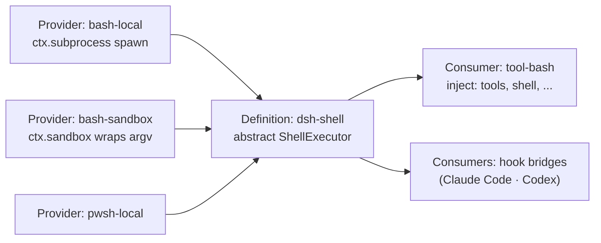

> Written: 2026-09-12
> Repository under analysis: `tt-a1i/archify` (MIT), commit `6db72a9aea3d0f67a6a034e41f8a5491476a11c1`, package version `2.17.0-dev.1`
> Environment: Node.js v24.15.0, macOS 15.6, Google Chrome (located automatically by visual-check)

---

_This article is mostly written by Claude Code_

## Table of contents

1. [Why Archify, and why now?](#1-why-archify-and-why-now)
2. [The one-sentence version](#2-the-one-sentence-version)
3. [Scale and stack: no runtime dependencies](#3-scale-and-stack-no-runtime-dependencies)
4. [Building the first diagram myself](#4-building-the-first-diagram-myself)
5. [What the validator actually refuses](#5-what-the-validator-actually-refuses)
6. [Three claims, kept separate](#6-three-claims-kept-separate)
7. [The authoring loop is written into the skill](#7-the-authoring-loop-is-written-into-the-skill)
8. [Who owns the coordinates](#8-who-owns-the-coordinates)
9. [Using the repository as evidence](#9-using-the-repository-as-evidence)
10. [Porting this blog's mermaid over](#10-porting-this-blogs-mermaid-over)
11. [Seeing what changed before you merge](#11-seeing-what-changed-before-you-merge)
12. [Things to watch](#12-things-to-watch)
13. [Conclusion](#13-conclusion)

---

## 1. Why Archify, and why now?

Architecture analysis is this blog's main line of work, and half of those posts are diagrams. I [wired mermaid in](/kb/2026-04-13-adding-mermaid-to-nextjs-blog) back in April 2026 and have managed diagrams as text ever since — including a retreat to client-side rendering after server-side rendering kept hanging in Chromium. So when a tool shows up claiming that an agent can produce architecture diagrams, I am not a bystander. I already hold the thing it has to be compared against.

Archify was created on 2026-04-15, and over the past month it gained 47,287 stars for a running total of 59,135 (2026-09-12, via the GitHub API). That is second on GitHub's monthly trending. Ten of the twenty-one repositories on that week's trending list were agent-skill repositories, though, so the number should not be read as a quality signal on its own. What I actually wanted to know was narrower: **if you ask an LLM to draw, you get a different drawing every time — how does this tool handle that?**

The short answer is that Archify takes the drawing away from the LLM.

## 2. The one-sentence version

**The agent writes JSON; a deterministic compiler checks it and then draws a self-contained HTML artifact.**

Spelled out: the agent's job ends at writing a typed specification — `{"components": [...], "connections": [...]}` — to a file. The agent decides where things go and what the labels mean, but how a line turns, whether a label covers another line, and whether text shrinks below 6px on a 1440px screen are all checked by the compiler. And if those checks fail, **nothing is rendered at all.**

Why that split matters becomes obvious once you think about what LLMs are bad at. Picking meaning: reasonably good. Counting pixels: no. Archify delegates the first and keeps the second.

## 3. Scale and stack: no runtime dependencies

| Item                 | Value                                                                                                                                         |
| -------------------- | --------------------------------------------------------------------------------------------------------------------------------------------- |
| License              | MIT (`archify/package.json`, and `LICENSE` at the repository root)                                                                            |
| Language             | JavaScript (ESM, `"type": "module"`)                                                                                                          |
| Node requirement     | `>=18` (I ran v24.15.0)                                                                                                                       |
| Runtime dependencies | **None** — the `dependencies` field is empty                                                                                                  |
| Dev dependencies     | 4 — `ajv`, `parse5`, `saxes`, `simple-icons`                                                                                                  |
| Tracked files        | 513, about 44MB in total                                                                                                                      |
| Diagram types        | 5 — `architecture`, `workflow`, `sequence`, `dataflow`, `lifecycle`                                                                           |
| CLI subcommands      | 14 — `render` `compare` `deliver` `preview` `validate` `migrate` `inspect` `check` `visual-check` `guide` `brands` `examples` `doctor` `demo` |
| Lineage              | SKILL.md's `based_on` names `Cocoon-AI/architecture-diagram-generator` (MIT, v1.0)                                                            |

Zero runtime dependencies is more than a bragging point. `ajv` lives in dev dependencies because the schema validators are **generated ahead of time and committed**. `scripts/generate-validators.mjs` produces them and `npm run check:validators` confirms the committed output has not drifted from the schemas. The viewer runtime and the brand marks follow the same pattern (`generate-viewer.mjs`, `generate-brand-marks.mjs`, each with a `--check` mode).

The practical result: clone it, install nothing, and diagnostics run immediately.

```bash
$ node bin/archify.mjs doctor
Archify doctor

[ok] Node.js v24.15.0 (requires >=18)
[ok] Core template
[ok] Example renderer
[ok] Live preview runtime
[ok] Visual-check runtime
[ok] Output path safety runtime
[ok] Scenario recipe guide
[ok] Progressive authoring references
[ok] Architecture compare runtime and proof fixtures
[ok] Standalone schema validators
[ok] architecture renderer, schema, and example
[ok] workflow renderer, schema, and example
[ok] sequence renderer, schema, and example
[ok] dataflow renderer, schema, and example
[ok] lifecycle renderer, schema, and example

Archify is ready.
```

Fifteen items, all green, without running a single install command.

## 4. Building the first diagram myself

Reading only goes so far, so I drew Archify's own pipeline with Archify. Here is what the IR looks like (excerpt).

```json
{
  "schema_version": 1,
  "diagram_type": "architecture",
  "meta": {
    "title": "Archify pipeline",
    "quality_profile": "showcase",
    "repository": {
      "url": "https://github.com/tt-a1i/archify",
      "revision": "6db72a9aea3d0f67a6a034e41f8a5491476a11c1"
    }
  },
  "components": [
    {
      "id": "schemas",
      "type": "security",
      "label": "5 schemas",
      "sublabel": "generated validators",
      "tag": "fail-closed",
      "pos": [490, 120],
      "size": [150, 64],
      "sources": [
        {
          "path": "archify/schemas/architecture.schema.json",
          "line": 1,
          "end_line": 178,
          "label": "architecture"
        }
      ]
    }
  ],
  "connections": [
    { "from": "validate", "to": "renderers", "label": "freeze on pass", "variant": "emphasis" }
  ]
}
```

Component types are closed to seven values — `frontend` `backend` `database` `cloud` `security` `messagebus` `external` — and connection variants to four: `default` `emphasis` `security` `dashed`. You cannot specify an arbitrary colour or shape. **Pick the meaning and the presentation follows.**

Here is what a 5.1KB JSON file turned into.

[](/static/images/archify/pipeline-en.webp)

The receipt that `deliver` returned:

```json
{
  "ok": true,
  "command": "deliver",
  "specification": { "sha256": "7c425063…", "bytes": 5142 },
  "artifact": { "sha256": "f78bf41d…", "bytes": 811173 },
  "validation": {
    "checksPassed": 9,
    "checkCount": 9,
    "compositionProfile": "showcase",
    "compositionStatus": "pass",
    "errors": 0,
    "warnings": 0
  },
  "evidence": {
    "verified": true,
    "repository": "https://github.com/tt-a1i/archify",
    "revision": "6db72a9aea3d0f67a6a034e41f8a5491476a11c1",
    "references": 6
  }
}
```

A 5,142-byte specification became one 811,173-byte HTML file. That file carries inline SVG, theme switching, pan and zoom, node search, relationship tracing, a presentation mode, and PNG/SVG/WebM export. It makes no external requests. Hence the 800KB.

`deliver` freezes the specification bytes into a private same-directory snapshot, renders that snapshot, atomically commits the HTML once the checks pass, and reports SHA-256 and byte counts for both. The skill also states that a specification which has passed final validation is **never edited afterwards**.

## 5. What the validator actually refuses

This is where the tool's character comes through most clearly. I did not get that diagram right on the first attempt — I was blocked three times.

### First: a label landed on another route

I spaced the nodes 200px apart, which left nowhere for the labels to sit.

```text
- Label "freeze on pass" overlaps component "validate" — adjust labelDx/labelDy/labelSegment or set labelAt.
  label rect: [576, 329, 77, 14]
  component "validate" rect: [440, 310, 150, 64]
  Suggested fix: labelAt [615, 388] or labelDy +49 (below); or labelAt [615, 306] or labelDy -33 (above)
- [composition/label-route-clearance] … label "freeze on pass" is 0px from connections[4] "repo" -> "validate"
  label "check sources" segment 1 [605, 182] -> [605, 335] (label rect [576, 329, 77, 14]; minimum 4px)
```

Pixel coordinates, rectangles, a 4px minimum clearance, and **concrete candidate fixes**. The JSON form of each diagnostic separates `subject` (what is wrong), `evidence` (the measurements), and `supportedFixes` (the permitted remedies). The structure exists so that an agent cannot just jiggle coordinates on a hunch.

### Second: technically valid, but unreadable

Widening the gaps removed the overlaps and tripped a different check instead.

```json
{
  "code": "composition/desktop-readability",
  "severity": "error",
  "evidence": {
    "viewportWidth": 1440,
    "availableDiagramWidth": 930,
    "viewBoxWidth": 1630,
    "scale": 0.5705521472392638,
    "text": "authoring contract",
    "sourceFontPx": 9,
    "projectedFontPx": 5.134969325153374,
    "minimumProjectedNodeTextPx": 6
  }
}
```

The diagram had grown to 1630px, which scales to 0.571 on a 1440px viewport, which projects a 9px sublabel at an actual 5.13px — under the 6px floor. Geometrically the drawing is fine. It is **rejected for being too small to read.** I had not seen a diagram tool carry that check before.

### Third: `deliver` passed and the browser still overflowed

To cut the width I folded the flow into a snake, which made it tall. All nine checks passed and the HTML was produced — and then `visual-check`, which opens that HTML in real Chrome, said this:

```json
{
  "code": "viewer/viewport-overflow",
  "message": "The rendered artifact overflows the 1440x900 light viewport.",
  "evidence": { "innerHeight": 900, "scrollHeight": 1126, "overflowY": true }
}
```

Four rows became three and it passed. That moment is the subject of the next section.

## 6. Three claims, kept separate

`deliver` succeeding while `visual-check` fails is not a bug. The skill says so directly:

> Keep the three claims separate: `deliver` proves deterministic artifact checks, `visual-check` proves bounded behavior in a real browser, and perceptual visual review requires an actual human or image-capable reviewer.

Each stage proves something different.

| Stage          | What it proves                                                                                        | What it does not               |
| -------------- | ----------------------------------------------------------------------------------------------------- | ------------------------------ |
| `deliver`      | Nine deterministic checks: SVG structure, orthogonal arrows, label clearance, route rhythm, and so on | Behaviour in a real browser    |
| `visual-check` | Containment and projected text size in real Chrome at 1440×900, 1600×1000, 1920×1080 and 2048×1320    | Whether the drawing looks good |
| Human review   | Perceptual quality                                                                                    | —                              |

Which is why one field survives to the end of every `visual-check` response:

```json
{ "status": "pass", "visualReview": "pending" }
```

Everything passed, and `visualReview` still reads `pending`. The tool declines to claim an approval it has no standing to give. Reading "AI handles it all for you" every day, a design that draws its own boundaries this narrowly earns more trust, not less.

As a side effect `visual-check` leaves behind something genuinely useful: PNGs at four resolutions in both light and dark themes, a receipt JSON with the measurements, and a contact-sheet HTML. Every image in this post is one of those outputs. I took no screenshots of my own.

## 7. The authoring loop is written into the skill

The process of failing three times and passing on the fourth was not improvised — it is a loop specified in `SKILL.md`. So I drew it with Archify's `workflow` type.

[](/static/images/archify/loop-en.webp)

Three rules in that loop stand out.

**The artifact comes first.** "The next tool action must write the candidate," it says. Write the candidate file before reading renderer internals, and do not plan exact coordinates in prose. There is even an explicit prohibition on reading `renderers/shared/geometry.mjs` or the validator source before the first candidate exists.

**Fix one thing at a time.** "Apply at most one diagnosed geometry control per repair." I followed that, and the only geometry control I set was a single `labelDy: 40`.

**There is a stopping rule.** Keep making focused corrections while the objective error count reaches a new minimum; if two consecutive rounds fail to improve that best count, stop and report the unresolved diagnostics truthfully. It is a rule aimed squarely at the failure mode where a model keeps trying and starts embellishing.

## 8. Who owns the coordinates

Both diagrams above came from the same tool, but the coordinates have different owners.

In `architecture` I wrote positions myself, as `pos: [490, 120]`. There is no auto-layout — the repository's own self-portrait diagram is literally tagged `no auto-layout`. What the renderer does decide is **routing**. The author places the nodes; the renderer chooses which side a line leaves from and how it bends.

`workflow` changes this in schema v2. Nodes carry no coordinates, only a `lane` (a semantically named row) and a `col`.

```json
{ "id": "validate", "lane": "gate", "col": 1, "type": "security", "label": "validate" }
```

On top of that you declare the spine with `mainPath`, name column bands with `phases`, and attach assertions about the topology with `semanticChecks`.

```json
{
  "semanticChecks": {
    "allowedRoots": ["draft"],
    "allowedTerminals": ["human", "halt"],
    "requiredEdges": [
      { "from": "validate", "to": "fix" },
      { "from": "fix", "to": "validate" }
    ],
    "requiredPaths": [{ "from": "draft", "to": "human" }]
  }
}
```

This is the fun part. "There must be exactly one root, the end must be one of these two, and this edge must exist" is held by the diagram **as an assertion about itself**. The diagram carries tests the way code does. If someone later edits the drawing and severs the loop, validation stops them.

Because the compiler owns the coordinates, the failures look different too. My first error in `workflow` was not about geometry but about width:

```text
- Label "Fix one diagnostic" (~122px) is wider than node "fix" (92px) — shorten the label or increase node.width.
```

## 9. Using the repository as evidence

The `architecture` type has a capability the others lack: a component can cite real source files, and those citations are verified against a revision.

```json
"meta": {
  "repository": {
    "url": "https://github.com/tt-a1i/archify",
    "revision": "6db72a9aea3d0f67a6a034e41f8a5491476a11c1"
  }
}
```

```json
"sources": [
  { "path": "archify/bin/visual-check.mjs", "line": 1, "end_line": 829, "label": "browser evidence" }
]
```

Up to three per component, and pointing `--repo-root` at an actual working copy puts the outcome in the `deliver` receipt.

```json
"evidence": { "verified": true, "references": 6 }
```

All six of my citations were confirmed at that commit. In the rendered diagram those nodes gain a `SRC 1` badge you can click through to the source. An architecture drawing stops being "someone's impression, drawn by hand" and becomes a claim about a specific commit — a checkable one. For someone who writes architecture analyses, this was the most enviable feature in the whole tool.

I also found one trap. The `tag` field never appears as visible text. Open the rendered HTML and it shows up here:

```html
<g
  data-node-kind="security"
  data-node-sublabel="generated validators"
  data-node-tag="fail-closed"
  …
>
  <title>5 schemas · generated validators · Architecture component · fail-closed</title></g
>
```

So it is metadata for search, hover, and accessibility. Anything that must be visible belongs in `sublabel`.

## 10. Porting this blog's mermaid over

For a comparison subject I picked one diagram from the [DeepSeek Harness architecture](/kb/2026-09-05-deepseek-harness-architecture) post: a single service definition with three providers and two consumers attached. Below is that mermaid as this blog actually renders it. The renderer swaps the code block for a picture, so the source itself never appears on screen.



The same content moved into an Archify IR. I deliberately left the node text as it was.

[](/static/images/archify/dsh-services-en.webp)

To be honest about it: **mermaid does fine on this diagram.** Six nodes and five edges is exactly the size its auto-layout handles well. The difference was not which drawing wins — it was elsewhere.

| Axis               | mermaid (this blog today)                                       | Archify                                                          |
| ------------------ | --------------------------------------------------------------- | ---------------------------------------------------------------- |
| Source             | A text DSL a human writes, 12 lines                             | A JSON IR an agent writes, 2,115 bytes                           |
| Layout             | Automatic, in the browser, at runtime                           | Author positions, renderer routes. Fixed at build time           |
| Render time        | Client-side; this blog gave up on SSR for it                    | A static file. No runtime                                        |
| Failure mode       | Silent drift — labels clip, lines overlap, and it still renders | Rendering is refused, with pixel coordinates and candidate fixes |
| Label limits       | In this theme, node labels fit two lines of ≤24 characters      | Insufficient width is refused, with the measurement              |
| Output             | An SVG inside the page                                          | An 800KB self-contained HTML plus PNG/SVG/WebM export            |
| Search and tracing | None                                                            | Node search, upstream/downstream tracing, role comparison        |
| Source citation    | None                                                            | Verified against a revision (§9)                                 |
| Version comparison | None                                                            | `compare` (§11)                                                  |
| Maintenance cost   | Twelve lines in the post body                                   | An IR file plus an image, both kept in the repository            |

The conclusion worth taking away: for small drawings, mermaid is still right. Twelve lines in the body, easy to edit, and a human-readable diff. Archify earns its cost when the drawing grows large enough that **auto-layout starts to break down**, and when the drawing needs to be a checkable claim about a specific commit.

## 11. Seeing what changed before you merge

`compare` is the most distinctive thing here. It takes two validated snapshots and extracts what was added, removed, changed, moved, and rerouted as facts.

To demonstrate it on a real change I used a difference the repository documents itself. Archify ships an integration for DeepSeek Harness (§12); the published plugin 0.1.0 bundles Archify Skill 2.14.0, while the pending 0.2.0 bundles 2.17.0-dev.1. According to its README, brand marks, workflow schema v2, viewer localization, and update awareness arrived in between. I encoded that difference as two small architecture IRs and compared them.

One thing blocked me.

```text
base connections require authored stable ids for comparison.
```

Without an `id` on an edge there is no way to decide whether it is the same edge across two versions. Nodes are identified by `components[].id` and boundaries are derived from `kind + label`, but edges require the author to supply a stable id. I added them and ran it again.

[](/static/images/archify/delta-en.webp)

The receipt is the more interesting half.

```json
{
  "ok": true,
  "completeness": "complete",
  "proofLevel": "authored",
  "base": { "rawSha256": "efd2a403…", "semanticSha256": "4787e898…", "bytes": 1973 },
  "head": { "rawSha256": "25c379fc…", "semanticSha256": "de7f2440…", "bytes": 2804 },
  "summary": {
    "components": { "added": 2, "changed": 2, "evidenceChanged": 0, "removed": 0, "moved": 0 },
    "connections": { "added": 2, "changed": 0, "removed": 0, "rerouted": 0 },
    "presentationChanged": true,
    "provenanceChanged": false
  },
  "changes": {
    "components": [
      {
        "id": "schemas",
        "status": "changed",
        "classifications": ["semantic"],
        "changedFields": ["/sublabel"]
      }
    ],
    "connections": [{ "id": "cli_upd", "status": "added", "classifications": ["topology"] }]
  },
  "validation": { "checksPassed": 28, "checkCount": 28 },
  "limitations": [
    "Authored Architecture IR only; no runtime impact, causality, risk, or mergeability is inferred.",
    "Boundary identity is conservatively derived from kind + label."
  ]
}
```

Three things worth pointing at.

**`rawSha256` and `semanticSha256` are separate.** Move a node without changing its meaning and the raw hash shifts while the semantic hash holds. `moved` and `rerouted` being their own counters serves the same purpose: a review can tell "a commit that tidied positions" from "a commit that changed the structure."

**Changed fields arrive as JSON pointers.** `changedFields: ["/sublabel"]` leaves nothing to guess, and every change is classified as `semantic` or `topology`.

**It writes down what it cannot do.** The `limitations` array states that this covers authored architecture IR only, and that no runtime impact, causality, risk, or mergeability is inferred. `proofLevel: "authored"` says the same thing. This delta is **the difference between two drawings somebody wrote** — not proof that the system changed that way. The posture from §6 repeats here.

## 12. Things to watch

**Korean falls back to an English viewer UI.** `meta.locale` accepts only `en` and `zh-CN`. Any other language has to omit `locale`, and then the viewer's fixed UI and `<html lang>` become English. That is why `Light`, `Classic`, `Present`, `Export`, `Legend` and `Backend` stay in English in the Korean diagrams in the Korean edition of this post. The renderer never translates authored content, so the authored text itself comes out in Korean correctly.

**The delta artifact does not pass the tool's own check.** That delta HTML is 2,185,304 bytes, and running `visual-check` on it fails with a vertical 1378px against a 1440×900 viewport. The containment rule is designed around a single diagram, so a comparison view stacking Before/Delta/After panels plus a change list sits outside it. It does not look like a bug, but it is one more place where "nine checks passed" and "browser containment passed" turn out to be different statements.

**The dsh integration is unofficial.** `integrations/deepseek-harness` ships on npm as `@tt-a1i/archify-dsh`, and its README opens by stating that it is not an official DeepSeek product and implies no DeepSeek endorsement. The published 0.1.0 offers experimental compatibility with the developer-preview `@deepseek-ai/dsh@0.1.0-rc.6` and requires Node `^22.19.0 || >=24.0.0`. 0.2.0 is not on npm yet. The adapter states that it registers no native tools, telemetry, credential handling, background services, or install hooks — appropriate self-restraint for an integration that loads a skill into someone else's harness.

**This is a development version.** I ran `2.17.0-dev.1`, not a stable release. If you quote numbers from it, quote the version and commit alongside them.

**Filter the README's marketing signals.** There is a sponsor badge at the top, and the +47,287 stars in a month are part of the agent-skill boom currently under way. What clearly separates this repository from the average of that boom, though: there is a real runtime, there are schemas and validators, eleven scenarios ship with validation receipts, and failures are called failures.

**Where the IR lives is a new chore.** Mermaid lives inside the post; Archify produces an IR file and an output image separately. This one post added ten IRs and eight images. If the drawing is a claim about a specific commit then that claim should be versioned too, so the cost is fair — but without a filing rule it scatters quickly. So the ten IRs behind this post are committed as they are, under [`public/static/archify-ir/`](https://github.com/MartianLee/martianlee.github.com/tree/main/public/static/archify-ir). Every diagram above can be regenerated from that JSON.

## 13. Conclusion

Archify's central decision is to **take drawing away from the LLM and leave it only the choice of meaning**. The agent writes a typed IR, and everything after that is deterministic. The schema closes the vocabulary, the validator counts pixels, the compiler picks the routes, and `deliver` freezes the bytes. So the same IR yields the same drawing.

After building with it, what impressed me most was not a feature but a posture. This tool keeps describing the scope of what it has proven in narrow terms. `deliver` proves artifact checks; `visual-check` proves bounded behaviour in a browser; even with everything green, `visualReview` stays `pending`. `compare` writes into its receipt that runtime impact and mergeability are not inferred. When it fails, it fails with pixel coordinates — and when two rounds bring no improvement, the rule is to stop and report.

I am not about to rip mermaid out of this blog. For a six-node drawing, mermaid still costs less effort. But the next time I write a large architecture post, I intend to move that one diagram — the one where auto-layout starts to break down — over to Archify. Source citations pinned to a revision, and a delta that shows what changed when I revise the post, are things mermaid simply cannot imitate.

### Posts this one follows from

| Post                                                                             | Its central problem                        | Relation to Archify                                                                                                                                                                                                   |
| -------------------------------------------------------------------------------- | ------------------------------------------ | --------------------------------------------------------------------------------------------------------------------------------------------------------------------------------------------------------------------- |
| [Adding mermaid to a Next.js blog](/kb/2026-04-13-adding-mermaid-to-nextjs-blog) | Managing diagrams as text                  | The direct predecessor. With mermaid a human writes a DSL and the browser lays it out at runtime; with Archify an agent writes an IR and a compiler lays it out at build time. §10 compares them on the same diagram. |
| [DeepSeek Harness architecture](/kb/2026-09-05-deepseek-harness-architecture)    | A harness's plugin and service structure   | One mermaid diagram from that post gets ported here as the comparison subject. As a bonus, the Archify repository ships a dsh integration of its own (§12).                                                           |
| [DeepSeek Harness hands-on](/kb/2026-09-09-deepseek-harness-hands-on)            | Actually running the harness               | Same "log of running it myself" format. This post also keeps the failed validation output, not just the successful result.                                                                                            |
| [Superpowers architecture](/kb/2026-04-18-superpowers-architecture)              | How a skill framework is built             | Archify ships as a skill — but as prompt plus validator plus renderer, not prompt alone.                                                                                                                              |
| [WebMCP explained](/kb/2026-09-05-webmcp-explained)                              | The tool contract between agent and target | The same idea in a different place: WebMCP has the page declare a contract, Archify gives the diagram one in the form of a schema.                                                                                    |

### References

- [tt-a1i/archify](https://github.com/tt-a1i/archify) — commit `6db72a9`, package `2.17.0-dev.1`
- [Archify project page](https://tt-a1i.github.io/archify/)
- [Archify Proof Lab](https://tt-a1i.github.io/archify/gallery.html) — eleven scenarios with validation receipts
- [Cocoon-AI/architecture-diagram-generator](https://github.com/Cocoon-AI/architecture-diagram-generator) — the origin named in SKILL.md (MIT, v1.0)
