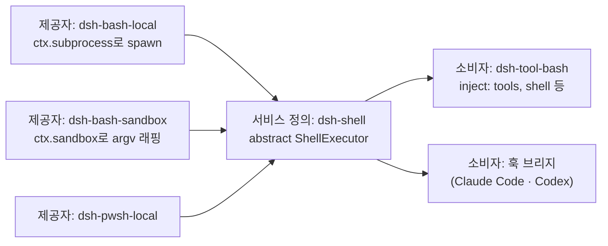

> 작성 일자: 2026-09-12
> 대상 저장소: `tt-a1i/archify` (MIT), 커밋 `6db72a9aea3d0f67a6a034e41f8a5491476a11c1`, 패키지 버전 `2.17.0-dev.1`
> 실행 환경: Node.js v24.15.0, macOS 15.6, Google Chrome (visual-check가 자동 탐색)

---

_This article is mostly written by Claude Code_

## 목차

1. [왜 지금 Archify인가요?](#1-왜-지금-archify인가요)
2. [한 문장으로 이해하기](#2-한-문장으로-이해하기)
3. [규모와 스택: 런타임 의존성이 없습니다](#3-규모와-스택-런타임-의존성이-없습니다)
4. [첫 다이어그램을 직접 만들어 봤습니다](#4-첫-다이어그램을-직접-만들어-봤습니다)
5. [검증기가 실제로 막는 것들](#5-검증기가-실제로-막는-것들)
6. [세 가지 주장을 분리합니다](#6-세-가지-주장을-분리합니다)
7. [저작 루프가 스킬 문서에 적혀 있습니다](#7-저작-루프가-스킬-문서에-적혀-있습니다)
8. [좌표를 누가 소유하는가](#8-좌표를-누가-소유하는가)
9. [저장소를 증거로 삼기](#9-저장소를-증거로-삼기)
10. [이 블로그의 mermaid를 이식해 봤습니다](#10-이-블로그의-mermaid를-이식해-봤습니다)
11. [머지 전에 무엇이 바뀌었는지](#11-머지-전에-무엇이-바뀌었는지)
12. [주의해서 볼 지점](#12-주의해서-볼-지점)
13. [결론](#13-결론)

---

## 1. 왜 지금 Archify인가요?

이 블로그는 아키텍처 분석 글이 주력이고 그 글들의 절반은 다이어그램입니다. 2026년 4월에 [mermaid를 붙이면서](/kb/2026-04-13-adding-mermaid-to-nextjs-blog) 다이어그램을 텍스트로 관리하기 시작했습니다. 그 뒤로 서버 사이드 렌더링이 Chromium에서 멈추는 문제 때문에 클라이언트 렌더링으로 물러난 이력도 있습니다. 그러니까 "에이전트가 아키텍처 다이어그램을 만든다"는 도구가 나왔다면, 저는 그걸 남 일처럼 구경할 입장이 아닙니다. 비교 대상을 이미 손에 들고 있습니다.

Archify는 2026년 4월 15일에 만들어진 저장소인데, 지난 한 달 동안 스타가 47,287개 늘어 누적 59,135개가 되었습니다(2026-09-12, GitHub API 기준). GitHub 월간 트렌딩 2위입니다. 다만 같은 주 트렌딩 21개 중 10개가 에이전트 스킬 저장소였으니 이 숫자를 품질 신호로 그대로 읽으면 안 됩니다. 스타는 제 관심 밖이었고 궁금했던 건 하나였습니다. **LLM에게 그림을 그리게 하면 매번 다른 그림이 나오는데 이 도구는 그 문제를 어떻게 다룰까요?**

Archify는 그림 그리는 일을 LLM에게서 빼앗습니다.

## 2. 한 문장으로 이해하기

**에이전트는 JSON을 쓰고 결정론적 컴파일러가 그것을 검사한 뒤 자체 완결 HTML로 그립니다.**

풀어 쓰면 이렇습니다. 에이전트가 하는 일은 `{"components": [...], "connections": [...]}` 형태의 타입드 명세를 파일로 쓰는 데서 끝납니다. 무엇을 어디에 놓고 라벨이 무슨 뜻인지 판단하는 것은 에이전트입니다. 선을 어떻게 돌릴지, 라벨이 다른 선을 가리지 않는지, 1440px 화면에서 글자가 6px 아래로 줄어들지 않는지는 전부 컴파일러가 검사합니다. 그리고 검사가 통과하지 못하면 **렌더링 자체가 일어나지 않습니다.**

이 분업이 왜 중요한지는 LLM이 무엇에 약한지를 생각하면 분명합니다. 의미를 고르는 일은 꽤 잘하지만 픽셀을 세는 일은 못합니다. Archify는 앞의 일을 LLM에게 맡기고 뒤의 일을 자기가 가져갑니다.

## 3. 규모와 스택: 런타임 의존성이 없습니다

| 항목            | 값                                                                                                                                              |
| --------------- | ----------------------------------------------------------------------------------------------------------------------------------------------- |
| 라이선스        | MIT (`archify/package.json`, 저장소 루트 `LICENSE`)                                                                                             |
| 언어            | JavaScript (ESM, `"type": "module"`)                                                                                                            |
| Node 요구       | `>=18` (실제 실행은 v24.15.0)                                                                                                                   |
| 런타임 의존성   | **없음** (`dependencies` 필드가 비어 있음)                                                                                                      |
| 개발 의존성     | 4개 — `ajv`, `parse5`, `saxes`, `simple-icons`                                                                                                  |
| 추적 파일       | 513개, 합계 약 44MB                                                                                                                             |
| 다이어그램 타입 | 5종 — `architecture`, `workflow`, `sequence`, `dataflow`, `lifecycle`                                                                           |
| CLI 서브커맨드  | 14개 — `render` `compare` `deliver` `preview` `validate` `migrate` `inspect` `check` `visual-check` `guide` `brands` `examples` `doctor` `demo` |
| 출처            | SKILL.md의 `based_on`에 `Cocoon-AI/architecture-diagram-generator` (MIT, v1.0) 명시                                                             |

런타임 의존성이 0개라는 점은 단순한 자랑거리가 아닙니다. `ajv`가 개발 의존성에만 있는 이유는 스키마 검증기를 **미리 생성해서 저장소에 커밋해 두기** 때문입니다. `scripts/generate-validators.mjs`가 검증기를 만들고 `npm run check:validators`가 커밋된 결과물이 스키마와 어긋나지 않았는지 확인합니다. 뷰어 런타임과 브랜드 마크도 같은 패턴입니다(`generate-viewer.mjs`, `generate-brand-marks.mjs`, 각각 `--check` 모드 있음).

그래서 클론만 하고 아무것도 설치하지 않은 상태에서 바로 진단이 돌아갑니다.

```bash
$ node bin/archify.mjs doctor
Archify doctor

[ok] Node.js v24.15.0 (requires >=18)
[ok] Core template
[ok] Example renderer
[ok] Live preview runtime
[ok] Visual-check runtime
[ok] Output path safety runtime
[ok] Scenario recipe guide
[ok] Progressive authoring references
[ok] Architecture compare runtime and proof fixtures
[ok] Standalone schema validators
[ok] architecture renderer, schema, and example
[ok] workflow renderer, schema, and example
[ok] sequence renderer, schema, and example
[ok] dataflow renderer, schema, and example
[ok] lifecycle renderer, schema, and example

Archify is ready.
```

15개 항목 전부 통과입니다. 설치 명령 한 번 없이요.

## 4. 첫 다이어그램을 직접 만들어 봤습니다

읽기만 해서는 알 수 없는 게 많아서 Archify 자신의 파이프라인을 Archify로 그려 봤습니다. IR은 이렇게 생겼습니다(발췌).

```json
{
  "schema_version": 1,
  "diagram_type": "architecture",
  "meta": {
    "title": "Archify 파이프라인",
    "quality_profile": "showcase",
    "repository": {
      "url": "https://github.com/tt-a1i/archify",
      "revision": "6db72a9aea3d0f67a6a034e41f8a5491476a11c1"
    }
  },
  "components": [
    {
      "id": "schemas",
      "type": "security",
      "label": "스키마 5종",
      "sublabel": "생성된 검증기",
      "tag": "fail-closed",
      "pos": [490, 120],
      "size": [150, 64],
      "sources": [
        {
          "path": "archify/schemas/architecture.schema.json",
          "line": 1,
          "end_line": 178,
          "label": "architecture"
        }
      ]
    }
  ],
  "connections": [
    { "from": "validate", "to": "renderers", "label": "통과 시 고정", "variant": "emphasis" }
  ]
}
```

컴포넌트 타입은 `frontend` `backend` `database` `cloud` `security` `messagebus` `external` 일곱 가지, 연결 변형은 `default` `emphasis` `security` `dashed` 네 가지로 닫혀 있습니다. 임의의 색이나 모양은 지정할 수 없습니다. **의미를 고르면 표현이 따라옵니다.**

5.1KB짜리 JSON을 넘긴 결과는 이렇습니다.

[](/static/images/archify/pipeline-ko.webp)

`deliver` 명령이 돌려준 영수증입니다.

```json
{
  "ok": true,
  "command": "deliver",
  "specification": { "sha256": "817f9575…", "bytes": 5181 },
  "artifact": { "sha256": "0bea2e2e…", "bytes": 811363 },
  "validation": {
    "checksPassed": 9,
    "checkCount": 9,
    "compositionProfile": "showcase",
    "compositionStatus": "pass",
    "errors": 0,
    "warnings": 0
  },
  "evidence": {
    "verified": true,
    "repository": "https://github.com/tt-a1i/archify",
    "revision": "6db72a9aea3d0f67a6a034e41f8a5491476a11c1",
    "references": 6
  }
}
```

5,181바이트 명세가 811,363바이트 HTML 한 개가 되었습니다. 이 HTML에는 인라인 SVG, 테마 전환, 팬·줌, 노드 검색, 관계 추적, 프레젠테이션 모드, PNG·SVG·WebM 내보내기가 전부 들어 있습니다. 외부 요청이 하나도 없기 때문에 800KB입니다.

`deliver`는 명세 바이트를 같은 디렉터리의 비공개 스냅샷으로 동결한 뒤 그 스냅샷을 렌더링하고 검사를 통과하면 HTML을 원자적으로 커밋해 양쪽의 SHA-256과 바이트 수를 돌려줍니다. 그리고 **한 번 통과한 명세는 다시 편집하지 않는다**는 규칙이 스킬 문서에 적혀 있습니다.

## 5. 검증기가 실제로 막는 것들

여기가 이 도구의 성격이 가장 잘 드러나는 부분이었습니다. 저는 위 다이어그램을 한 번에 만들지 못했고 세 번 막혔습니다.

### 첫 번째: 라벨이 다른 선 위에 앉았습니다

노드 간격을 200px로 잡았더니 라벨이 들어갈 자리가 없었습니다.

```text
- Label "통과 시 고정" overlaps component "validate" — adjust labelDx/labelDy/labelSegment or set labelAt.
  label rect: [581, 329, 68, 14]
  component "validate" rect: [440, 310, 150, 64]
  Suggested fix: labelAt [615, 388] or labelDy +49 (below); or labelAt [615, 306] or labelDy -33 (above)
- [composition/label-route-clearance] … label "통과 시 고정" is 0px from connections[4] "repo" -> "validate"
  label "sources 확인" segment 1 [605, 182] -> [605, 335] (label rect [581, 329, 68, 14]; minimum 4px)
```

픽셀 좌표와 경계 사각형, 최소 여백 4px, 그리고 **구체적인 수정 후보**까지 나옵니다. 진단은 JSON으로도 나오는데 `subject`(무엇이 문제인가), `evidence`(측정값), `supportedFixes`(허용된 수정 수단)가 분리돼 있습니다. 에이전트가 추측으로 좌표를 흔들지 못하게 만든 구조입니다.

### 두 번째: 기술적으로 옳지만 읽을 수 없는 다이어그램

간격을 넉넉히 벌려 겹침을 없앴더니 이번엔 다른 검사에 걸렸습니다.

```json
{
  "code": "composition/desktop-readability",
  "severity": "error",
  "evidence": {
    "viewportWidth": 1440,
    "availableDiagramWidth": 930,
    "viewBoxWidth": 1640,
    "scale": 0.5670731707317073,
    "text": "저작 규약",
    "sourceFontPx": 9,
    "projectedFontPx": 5.103658536585366,
    "minimumProjectedNodeTextPx": 6
  }
}
```

다이어그램이 1640px로 넓어져 1440px 화면에서는 0.567배로 줄어들고 그러면 9px 보조 라벨이 5.10px로 투사되니 최소 기준 6px에 미달합니다. 기하학적으로는 아무 문제가 없는 그림인데 **"작아서 못 읽는다"는 이유로 거부됩니다.** 다이어그램 도구에 이런 검사가 붙어 있는 건 처음 봤습니다.

### 세 번째: `deliver`는 통과했는데 브라우저에서 넘쳤습니다

폭을 줄이려고 흐름을 지그재그로 접었더니 세로가 길어졌습니다. 9개 검사를 전부 통과해 HTML이 나왔는데 그 HTML을 실제 Chrome에 띄우는 `visual-check`가 이렇게 답했습니다.

```json
{
  "code": "viewer/viewport-overflow",
  "message": "The rendered artifact overflows the 1440x900 light viewport.",
  "evidence": { "innerHeight": 900, "scrollHeight": 1099, "overflowY": true }
}
```

네 행을 세 행으로 줄여서 해결했습니다. 그리고 이 대목이 다음 절의 주제입니다.

## 6. 세 가지 주장을 분리합니다

`deliver`가 성공했는데 `visual-check`가 실패한 상황은 설계대로입니다. 스킬 문서에 이렇게 적혀 있습니다.

> Keep the three claims separate: `deliver` proves deterministic artifact checks, `visual-check` proves bounded behavior in a real browser, and perceptual visual review requires an actual human or image-capable reviewer.

세 가지는 증명하는 대상이 서로 다릅니다.

| 단계           | 증명하는 것                                                                        | 증명하지 못하는 것       |
| -------------- | ---------------------------------------------------------------------------------- | ------------------------ |
| `deliver`      | SVG 구조, 선의 직교성, 라벨 여백, 경로 리듬 등 9개 결정론적 검사                   | 실제 브라우저에서의 동작 |
| `visual-check` | 실제 Chrome에서 1440×900·1600×1000·1920×1080·2048×1320 컨테인먼트와 투사 글자 크기 | 그림이 보기 좋은지       |
| 사람의 검토    | 지각적 품질                                                                        | —                        |

그래서 `visual-check`의 응답에는 끝까지 이 필드가 남아 있습니다.

```json
{ "status": "pass", "visualReview": "pending" }
```

전부 통과했는데도 `visualReview`는 계속 `pending`으로 남습니다. 도구가 자기 권한을 넘어선 승인을 스스로 내리지 않기 때문입니다. "AI가 알아서 다 해준다"는 문구를 매일 보는 요즘이라 자기가 증명한 범위를 이렇게 좁게 적어 두는 설계에는 오히려 믿음이 갑니다.

덧붙여 `visual-check`는 부수 효과로 꽤 실용적인 걸 남깁니다. 네 가지 해상도 × 라이트·다크 테마의 PNG, 측정값이 담긴 영수증 JSON, 그리고 한눈에 보는 컨택트 시트 HTML입니다. 이 글에 실린 이미지는 전부 그 산출물이고 스크린샷은 따로 찍지 않았습니다.

## 7. 저작 루프가 스킬 문서에 적혀 있습니다

제가 세 번 막히고 네 번째에 통과한 그 과정은 즉흥이 아니었습니다. `SKILL.md`에 규정된 루프입니다. 그걸 Archify의 `workflow` 타입으로 그려 봤습니다.

[](/static/images/archify/loop-ko.webp)

이 루프에서 눈에 띄는 규칙은 세 개입니다.

**아티팩트가 먼저입니다.** "다음 도구 호출은 반드시 후보를 쓰는 것이어야 한다"고 적혀 있습니다. 렌더러 내부를 읽기 전에 후보 파일부터 쓰라는 뜻이고 산문으로 좌표를 미리 계획하지도 말라고 합니다. 실제로 첫 후보를 쓰기 전에는 `renderers/shared/geometry.mjs`나 검증기 소스를 읽지 말라는 금지가 따로 붙어 있습니다.

**한 번에 한 개만 고칩니다.** "한 번 고칠 때 진단된 기하 컨트롤은 최대 한 개만 적용하라"입니다. 저도 이 규칙을 따랐고 제가 넣은 기하 컨트롤은 `labelDy: 40` 하나뿐입니다.

**중단 조건이 있습니다.** "객관적 오류 수가 새 최소치에 도달하는 동안은 계속 고치되, 두 라운드 연속으로 그 최소치가 개선되지 않으면 멈추고 해결되지 않은 진단을 정직하게 보고하라"입니다. 무한히 시도하다 결국 말로 둘러대는 실패 모드를 규칙으로 막아 뒀습니다.

## 8. 좌표를 누가 소유하는가

위 두 다이어그램은 같은 도구로 만들었지만 좌표의 주인이 다릅니다.

`architecture`에서는 제가 `pos: [490, 120]`처럼 좌표를 직접 썼습니다. 자동 배치가 없습니다. 실제로 저장소가 자기 구조를 그려 둔 다이어그램에도 `no auto-layout`이라는 태그가 붙어 있습니다. 렌더러가 자동으로 정하는 것은 **경로**입니다. 노드를 어디 둘지는 저자가 정하고 선을 어느 면으로 내보내 어떻게 꺾을지는 렌더러가 정합니다.

`workflow`는 schema v2에서 달라집니다. 노드에 좌표가 없고 `lane`(의미 단위의 행)과 `col`(열)만 있습니다.

```json
{ "id": "validate", "lane": "gate", "col": 1, "type": "security", "label": "validate" }
```

여기에 `mainPath`로 주 경로를 선언하고 `phases`로 열 구간에 이름을 붙입니다. `semanticChecks`로는 위상 구조가 지켜야 할 조건을 선언합니다.

```json
{
  "semanticChecks": {
    "allowedRoots": ["draft"],
    "allowedTerminals": ["human", "halt"],
    "requiredEdges": [
      { "from": "validate", "to": "fix" },
      { "from": "fix", "to": "validate" }
    ],
    "requiredPaths": [{ "from": "draft", "to": "human" }]
  }
}
```

이게 재미있는 부분입니다. "시작점은 하나여야 하고, 끝은 이 둘 중 하나여야 하고, 이 간선은 반드시 있어야 한다"를 다이어그램이 **자기 자신에 대한 단정으로** 들고 있습니다. 코드에 테스트가 붙는 것과 같습니다. 나중에 누가 그림을 고쳐서 루프를 끊어 버리면 검증이 그걸 막아 줍니다.

좌표를 컴파일러가 소유하니 실패 양상도 달라집니다. `workflow`에서 제가 처음 받은 오류는 기하 쪽이 아니었습니다. 폭이었습니다.

```text
- Label "진단 1건만 수정" (~102px) is wider than node "fix" (92px) — shorten the label or increase node.width.
```

## 9. 저장소를 증거로 삼기

`architecture` 타입에는 다른 타입에 없는 기능이 있습니다. 컴포넌트가 실제 소스 파일을 인용할 수 있고 그 인용을 리비전과 대조해 검증합니다.

```json
"meta": {
  "repository": {
    "url": "https://github.com/tt-a1i/archify",
    "revision": "6db72a9aea3d0f67a6a034e41f8a5491476a11c1"
  }
}
```

```json
"sources": [
  { "path": "archify/bin/visual-check.mjs", "line": 1, "end_line": 829, "label": "브라우저 증거" }
]
```

컴포넌트당 최대 3개까지 붙일 수 있습니다. `--repo-root`로 실제 작업 트리를 가리키면 `deliver` 영수증에 결과가 찍힙니다.

```json
"evidence": { "verified": true, "references": 6 }
```

제가 붙인 6개 인용이 모두 그 커밋에서 확인됐습니다. 렌더링된 다이어그램에서는 해당 노드에 `SRC 1` 배지가 붙고 뷰어에서 눌러 원본을 열 수 있습니다. 아키텍처 그림이 "누군가 손으로 그린 인상"이 아니라 특정 커밋에 대한 주장이 되고 그 주장은 누구나 확인해 볼 수 있습니다. 아키텍처 분석 글을 쓰는 사람 입장에서는 이게 가장 탐나는 기능이었습니다.

한 가지 함정도 찾았는데 `tag` 필드는 화면에 글자로 나오지 않습니다. 렌더링된 HTML을 열어 보면 이렇게 들어가 있습니다.

```html
<g data-node-kind="security" data-node-sublabel="생성된 검증기" data-node-tag="fail-closed" …>
  <title>스키마 5종 · 생성된 검증기 · Architecture component · fail-closed</title></g
>
```

즉 검색·호버·접근성용 메타데이터입니다. 눈에 보여야 하는 정보라면 `sublabel`에 넣어야 합니다.

## 10. 이 블로그의 mermaid를 이식해 봤습니다

비교 대상으로 [DeepSeek Harness 아키텍처](/kb/2026-09-05-deepseek-harness-architecture) 글의 다이어그램 하나를 골랐습니다. 서비스 정의 하나에 제공자 셋과 소비자 둘이 붙는 구조입니다. 아래는 그 mermaid를 이 블로그가 실제로 렌더링한 결과입니다. 이 블로그의 렌더러가 코드 블록을 그림으로 바꿔치기하므로 소스는 화면에 보이지 않습니다.



같은 내용을 Archify IR로 옮겼습니다. 노드 텍스트는 일부러 그대로 뒀습니다.

[](/static/images/archify/dsh-services-ko.webp)

정직하게 적으면, **이 다이어그램에서는 mermaid가 나쁘지 않습니다.** 노드 여섯 개에 간선 다섯 개짜리 그림은 mermaid의 자동 배치가 잘 처리합니다. 차이가 드러난 곳은 그림의 우열이 아니었습니다.

| 축        | mermaid (이 블로그 현재)                             | Archify                                      |
| --------- | ---------------------------------------------------- | -------------------------------------------- |
| 소스      | 사람이 쓰는 텍스트 DSL, 12줄                         | 에이전트가 쓰는 JSON IR, 2,129바이트         |
| 배치      | 브라우저에서 런타임 자동 배치                        | 저자가 좌표, 렌더러가 경로. 빌드 시점 확정   |
| 렌더 시점 | 클라이언트. 이 블로그는 SSR을 포기한 이력이 있음     | 정적 파일. 런타임 없음                       |
| 실패 방식 | 조용히 어긋남. 라벨이 잘리거나 선이 겹쳐도 렌더는 됨 | 렌더가 거부됨. 픽셀 좌표와 수정 후보가 나옴  |
| 라벨 제약 | 이 테마에서 노드 라벨은 2줄까지, 한 줄 24자 이하     | 폭이 부족하면 수치와 함께 거부               |
| 산출물    | 페이지 안의 SVG                                      | 800KB 자체 완결 HTML + PNG·SVG·WebM 내보내기 |
| 검색·추적 | 없음                                                 | 노드 검색, 업·다운스트림 추적, 역할 비교     |
| 소스 인용 | 없음                                                 | 리비전 대조 검증 (§9)                        |
| 버전 비교 | 없음                                                 | `compare` (§11)                              |
| 유지 비용 | 본문에 12줄                                          | IR 파일 + 이미지를 저장소에 함께 관리        |

작은 그림에는 mermaid가 여전히 옳습니다. 본문 열두 줄로 끝나고 고치기 쉬운 데다 diff도 사람이 그대로 읽을 수 있습니다. Archify가 제값을 하는 지점은 그림이 커져서 **자동 배치가 무너지기 시작할 때**, 그리고 그림이 특정 커밋에 대한 검증 가능한 주장이어야 할 때입니다.

## 11. 머지 전에 무엇이 바뀌었는지

`compare`가 이 도구에서 가장 독특한 기능입니다. 검증된 스냅샷 두 개를 받아 무엇이 추가·삭제·변경·이동·재경로되었는지 사실 목록으로 정리합니다.

실제 변경으로 시연하려고 저장소에 문서화된 차이를 골랐습니다. Archify에는 DeepSeek Harness용 통합이 있습니다(§12). 공개된 플러그인 0.1.0에는 Archify 스킬 2.14.0이 들어 있고 대기 중인 0.2.0에는 2.17.0-dev.1이 들어 있습니다. README에 따르면 그 사이에 브랜드 마크, workflow 스키마 v2, 뷰어 로컬라이제이션, 업데이트 알림이 들어왔습니다. 이 차이를 두 개의 작은 아키텍처 IR로 만들어 비교했습니다.

한 번 막혔습니다.

```text
base connections require authored stable ids for comparison.
```

간선에 `id`가 없으면 두 버전 사이에서 같은 간선인지 판정할 수 없습니다. 노드는 `components[].id`로, 경계는 `kind + label`로 동일성을 잡지만 간선은 저자가 안정적인 ID를 직접 줘야 합니다. `id`를 붙이고 다시 돌렸습니다.

[](/static/images/archify/delta-ko.webp)

영수증이 더 흥미롭습니다.

```json
{
  "ok": true,
  "completeness": "complete",
  "proofLevel": "authored",
  "base": { "rawSha256": "d07d1991…", "semanticSha256": "3f456fde…", "bytes": 1961 },
  "head": { "rawSha256": "2541b156…", "semanticSha256": "4266e8a3…", "bytes": 2831 },
  "summary": {
    "components": { "added": 2, "changed": 2, "evidenceChanged": 0, "removed": 0, "moved": 0 },
    "connections": { "added": 2, "changed": 0, "removed": 0, "rerouted": 0 },
    "presentationChanged": true,
    "provenanceChanged": false
  },
  "changes": {
    "components": [
      {
        "id": "schemas",
        "status": "changed",
        "classifications": ["semantic"],
        "changedFields": ["/sublabel"]
      }
    ],
    "connections": [{ "id": "cli_upd", "status": "added", "classifications": ["topology"] }]
  },
  "validation": { "checksPassed": 28, "checkCount": 28 },
  "limitations": [
    "Authored Architecture IR only; no runtime impact, causality, risk, or mergeability is inferred.",
    "Boundary identity is conservatively derived from kind + label."
  ]
}
```

여기서 세 가지를 짚겠습니다.

**`rawSha256`과 `semanticSha256`이 따로 있습니다.** 좌표만 옮기고 의미를 바꾸지 않았다면 raw 해시는 달라지지만 semantic 해시는 그대로입니다. `moved`와 `rerouted`가 별도 항목인 것도 같은 이유입니다. "위치만 정리한 커밋"과 "구조를 바꾼 커밋"을 리뷰에서 구분할 수 있습니다.

**변경 필드가 JSON 포인터로 나옵니다.** `changedFields: ["/sublabel"]`이라서 무엇이 달라졌는지 추측할 필요가 없고 변경마다 `semantic`인지 `topology`인지 분류가 붙습니다.

**할 수 없는 일을 스스로 적어 둡니다.** `limitations`에 "저작된 아키텍처 IR만 다루며, 런타임 영향·인과·위험·머지 가능성은 추론하지 않는다"고 명시합니다. `proofLevel: "authored"`도 같은 이야기입니다. 이 델타는 **사람이 저작한 그림 두 장의 차이**이고 시스템이 실제로 그렇게 변했다는 증명이 아닙니다. §6의 태도가 여기서도 반복됩니다.

## 12. 주의해서 볼 지점

**한국어로 쓰면 뷰어 UI가 영어로 폴백됩니다.** `meta.locale`이 지원하는 값은 `en`과 `zh-CN` 둘뿐입니다. 다른 언어는 `locale`을 생략해야 하고 그러면 뷰어의 고정 UI와 `<html lang>`이 영어가 됩니다. 이 글의 한국어 다이어그램에서 `Light` `Classic` `Present` `Export` `Legend` `Backend`가 영어로 남아 있는 것이 그 결과입니다. 렌더러가 본문을 번역하지는 않으므로 저작 내용 자체는 한국어로 잘 나옵니다.

위 델타 HTML은 2,185,795바이트인데 `visual-check`를 돌리면 1440×900에서 세로 1379px로 넘쳐 실패합니다. 델타 아티팩트가 자기 검사를 통과하지 못하는 셈입니다. 컨테인먼트 규칙이 단일 다이어그램 기준으로 설계돼 있어서 Before·Delta·After 패널과 변경 목록을 함께 쌓는 비교 화면은 그 규칙 밖에 있습니다. 버그로 보이진 않지만 "9개 검사 통과"와 "브라우저 컨테인먼트 통과"가 다른 이야기라는 점을 여기서도 확인할 수 있습니다.

**dsh 통합은 비공식입니다.** `integrations/deepseek-harness`는 npm `@tt-a1i/archify-dsh`로 배포되는 커뮤니티 통합이고 README 첫 문단이 "DeepSeek 공식 제품이 아니며 DeepSeek의 보증을 뜻하지 않는다"고 명시합니다. 공개된 0.1.0은 개발자 프리뷰 `@deepseek-ai/dsh@0.1.0-rc.6`에 대한 실험적 호환이며 Node `^22.19.0 || >=24.0.0`을 요구합니다. 0.2.0은 아직 npm에 없습니다. 어댑터는 네이티브 도구·텔레메트리·자격 증명 처리·백그라운드 서비스·설치 훅을 등록하지 않는다고 적어 뒀는데 스킬을 남의 하네스에 싣는 통합으로서는 적절한 자기 제약입니다.

제가 돌린 건 개발 버전 `2.17.0-dev.1`이고 안정 릴리스가 아닙니다. 글에 쓸 숫자를 인용할 때는 버전과 커밋을 함께 적는 편이 안전합니다.

**README의 마케팅 신호는 걸러 읽어야 합니다.** 상단에는 스폰서 배지가 붙어 있고 월 +47,287 스타라는 증가폭도 지금 진행 중인 스킬 저장소 붐의 일부입니다. 다만 이 저장소가 붐의 평균과 다른 점은 분명합니다. 실제 런타임과 스키마와 검증기를 갖췄고 11개 시나리오의 검증 영수증을 공개하며 실패를 실패라고 말합니다.

**IR을 어디에 둘 것인가는 새 숙제입니다.** mermaid는 본문 안에 살지만 Archify는 IR 파일과 산출물 이미지가 따로 생깁니다. 이 글 하나로 IR 10개와 이미지 8개가 늘었습니다. 그림이 특정 커밋에 대한 주장이라면 그 주장도 버전 관리되어야 하니 당연한 비용인데 관리 규칙을 정해 두지 않으면 금방 흩어집니다. 그래서 이 글에 쓴 IR 10개는 [`public/static/archify-ir/`](https://github.com/MartianLee/martianlee.github.com/tree/main/public/static/archify-ir)에 그대로 올려 뒀습니다. 위 그림들은 모두 그 JSON에서 재생성할 수 있습니다.

## 13. 결론

Archify의 핵심 판단은 **LLM에게서 그림 그리는 일을 빼앗고 의미를 고르는 일만 남긴 것**입니다. 에이전트는 타입드 IR을 쓰고 그 뒤는 전부 결정론적입니다. 스키마가 어휘를 닫고 검증기가 픽셀을 세며 컴파일러가 경로를 정한 다음 `deliver`가 바이트를 동결합니다. 그래서 같은 IR에서는 언제나 같은 그림이 나옵니다.

직접 만들어 보고 가장 인상 깊었던 건 기능이 아니라 태도였습니다. 이 도구는 자기가 증명한 것의 범위를 계속 좁게 적어 둡니다. `deliver`가 증명하는 것은 아티팩트 검사뿐입니다. `visual-check`는 브라우저에서 벌어지는 제한된 동작만 증명하고 전부 통과해도 `visualReview`는 `pending`으로 남습니다. `compare`는 영수증에 "런타임 영향과 머지 가능성은 추론하지 않는다"고 적습니다. 실패할 때는 픽셀 좌표를 함께 내놓고 두 라운드 동안 나아지지 않으면 멈추고 보고하라고 규정합니다.

이 블로그에 당장 mermaid를 걷어낼 생각은 없습니다. 여섯 노드짜리 그림이라면 mermaid 쪽이 여전히 손이 덜 갑니다. 다만 다음에 큰 아키텍처 글을 쓸 때, 자동 배치가 무너지기 시작하는 그 다이어그램 하나만은 Archify로 옮겨 보려 합니다. 리비전에 묶인 소스 인용, 그리고 글을 고칠 때 무엇이 달라졌는지 보여주는 델타는 mermaid로는 흉내 낼 수 없습니다.

### 이 글과 이어지는 글

| 글                                                                              | 중심 문제                        | Archify와의 관계                                                                                                                                                                             |
| ------------------------------------------------------------------------------- | -------------------------------- | -------------------------------------------------------------------------------------------------------------------------------------------------------------------------------------------- |
| [Next.js 블로그에 mermaid 붙이기](/kb/2026-04-13-adding-mermaid-to-nextjs-blog) | 다이어그램을 텍스트로 관리하기   | 이 글의 직계 전편입니다. mermaid는 사람이 DSL을 쓰고 브라우저가 런타임에 배치하며, Archify는 에이전트가 IR을 쓰고 컴파일러가 빌드 시점에 배치합니다. §10에서 같은 다이어그램으로 비교합니다. |
| [DeepSeek Harness 아키텍처](/kb/2026-09-05-deepseek-harness-architecture)       | 하네스의 플러그인·서비스 구조    | 그 글의 mermaid 다이어그램 하나를 Archify로 이식해 비교 대상으로 씁니다. 게다가 Archify 저장소 안에 dsh 통합이 들어 있습니다(§12).                                                           |
| [DeepSeek Harness 실습](/kb/2026-09-09-deepseek-harness-hands-on)               | 하네스를 직접 돌려 보기          | 같은 "직접 돌려 본 기록" 형식입니다. 이 글도 성공한 결과만이 아니라 실패한 검증 로그를 그대로 싣습니다.                                                                                      |
| [Superpowers 아키텍처](/kb/2026-04-18-superpowers-architecture)                 | 스킬 프레임워크의 구조           | Archify는 스킬로 배포됩니다. 다만 프롬프트 묶음이 아니라 프롬프트 + 검증기 + 렌더러의 조합입니다.                                                                                            |
| [WebMCP 해설](/kb/2026-09-05-webmcp-explained)                                  | 에이전트와 대상 사이의 도구 계약 | 같은 발상이 다른 자리에 있습니다. WebMCP는 페이지가 계약을 선언하고, Archify는 다이어그램이 스키마로 계약을 갖습니다.                                                                        |

### 참고 자료

- [tt-a1i/archify](https://github.com/tt-a1i/archify) — 커밋 `6db72a9`, 패키지 `2.17.0-dev.1`
- [Archify 프로젝트 페이지](https://tt-a1i.github.io/archify/)
- [Archify Proof Lab](https://tt-a1i.github.io/archify/gallery.html) — 11개 시나리오와 검증 영수증
- [Cocoon-AI/architecture-diagram-generator](https://github.com/Cocoon-AI/architecture-diagram-generator) — SKILL.md가 밝힌 원본 (MIT, v1.0)
