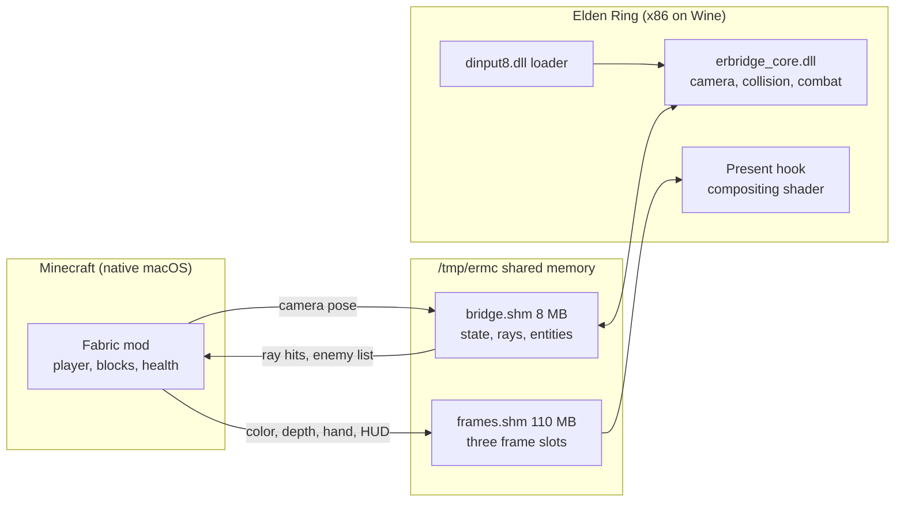
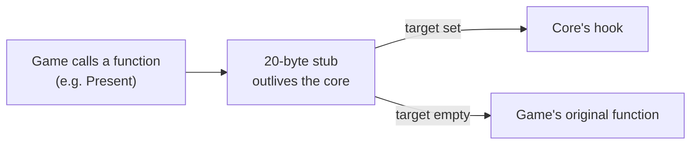
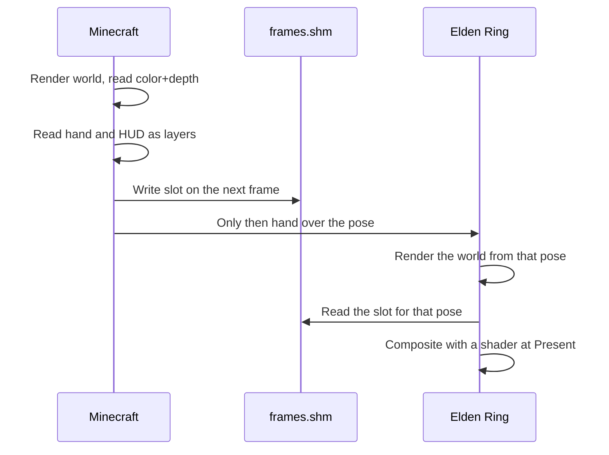

> Written: 2026-10-07
> Target repository: `justbustin/minecraft-crossover-bridge` (MIT), commit `d1723873ec8f370389cf19f74fac455b9e581321`
> Also read: `siddoff/Minecraft-Ring` 0.3.0 (`711015a`), `rehan-remade/universal-modder`, `JASGENIUS/crossover-modder`
> Scope: static code reading. Elden Ring was not actually run for this post.

---

_This article is mostly written by Claude Code_

## Table of Contents

1. [What happened?](#1-what-happened)
2. [The one-sentence version](#2-the-one-sentence-version)
3. [The big picture](#3-the-big-picture)
4. [Size and stack](#4-size-and-stack)
5. [Shared memory: Wine's Z: drive as the channel](#5-shared-memory-wines-z-drive-as-the-channel)
6. [Loader and core: swapping the DLL without quitting the game](#6-loader-and-core-swapping-the-dll-without-quitting-the-game)
7. [Passthrough compositing: why not just stack two windows](#7-passthrough-compositing-why-not-just-stack-two-windows)
8. [Terrain and combat: invisible blocks and a hidden stand-in](#8-terrain-and-combat-invisible-blocks-and-a-hidden-stand-in)
9. [37 MB per frame: doing the bandwidth math](#9-37-mb-per-frame-doing-the-bandwidth-math)
10. [What did the follow-up projects change?](#10-what-did-the-follow-up-projects-change)
11. [A suggested reading order](#11-a-suggested-reading-order)
12. [Things to watch out for](#12-things-to-watch-out-for)
13. [Conclusion](#13-conclusion)
14. [Trying it yourself](#14-trying-it-yourself)
15. [Related posts](#15-related-posts)

---

## 1. What happened?

On September 29, 2026, Tobyn Jacobs, best known for giant paper art, posted a clip of Steve swinging a sword in Elden Ring. Minecraft's hotbar and its hunger and armor bars sit at the bottom of the screen while Steve stacks blocks, runs redstone and cuts down Elden Ring enemies with a Minecraft sword. His own description was a single line: he'd put the entire game of Minecraft into Elden Ring as a mod, and it ran on a Mac. He didn't release any code.

<YouTube
  id="TmgAK5JjcDM"
  title="Minecraft In Elden Ring Mod"
  channel="Tobyn Jacobs"
  date="2026-09-29"
  lang="en"
/>

This is the two-minute video the original creator posted.

Over the following week, similar clips kept coming: Minecraft in GTA V, Escape from Tarkov mechanics in Skyrim, Call of Duty Zombies mixed with Mario Kart. People started calling it "passthrough modding": run both games at the same time, put a mod on each side, and have them exchange collision and pixels.

The day after the clip spread, September 30, two repositories went public.

- **`justbustin/minecraft-crossover-bridge`**: the README opens with "og idea from @tobynjacobs. implementation vibecoded on my own." It's a separate implementation built with an agent after seeing the original clip, and it supports two games, Monster Hunter: World and Elden Ring. This is the repository this post analyzes.
- **`rehan-remade/universal-modder`**: a Claude Code plugin released by Rehan Sheikh, an engineer at fal. It's a bundle of skills for "modding almost any PC game you own," and its `mashup-mods` skill sorts this whole trend into four patterns. It picked up 4,942 stars and 452 forks in a week (GitHub API, 2026-10-07).

The justbustin repository this post reads had only 22 stars as of the same day. Even so, a Windows port called `Minecraft-Ring` appeared on October 2, and both universal-modder and crossover-modder link to it as the example of passthrough. In practice, it has become the reference implementation for the trend.

Not everyone is impressed. The ResetEra thread filled up with "AI slop," "a Garry's Mod-style novelty you laugh at once," and worries about IP, and a moderator moved it to the AI-only forum. This post sets aside the question of whether it's a toy and focuses on **how two completely different engines split the work of drawing one picture**.

## 2. The one-sentence version

**Minecraft owns the player and the camera; Elden Ring renders its world from that camera and then slots Minecraft's pixels into its own frame with a depth test.**

A depth test compares, pixel by pixel, which thing is closer to the camera and keeps only the closer one. Here's what happens when the player taps W once. Minecraft moves Steve forward and tells Elden Ring where the camera is now. Elden Ring renders its world from that camera, then slots in the blocks, hand and HUD pixels that Minecraft rendered separately.

The two games split ownership cleanly.

- **Minecraft owns**: player movement, input, inventory, blocks, health, camera position
- **Elden Ring owns**: world geometry and collision, enemies and their AI, lighting, the final image, death and respawn

Each game only exists in the other as an "invisible stand-in." Looking at what the same thing is in each game makes the structure obvious.

| Thing            | In Minecraft                              | In Elden Ring                                     |
| ---------------- | ----------------------------------------- | ------------------------------------------------- |
| Steve            | Real: controls, health, inventory         | A hidden Tarnished (the hero) stands in           |
| Enemies          | Invisible entities with the same hitboxes | Real: AI, HP, attacks                             |
| Ground and walls | Invisible blocks built from raycasts      | Real: collision                                   |
| Blocks you place | Real                                      | Only composited pixels; nothing exists physically |

That last row comes back at the end of this post.

The setup itself is remarkable too. On a Mac, Minecraft is a native ARM macOS program, while Elden Ring is an x86 Windows program running on Wine (a compatibility layer that runs Windows programs on macOS) and Rosetta 2 (the translator that runs x86 programs on ARM Macs). Two programs with different operating systems and different CPU instruction sets draw the same frame together.

## 3. The big picture



The data flow from the README, as a table:

| Direction        | Data                                      | What the receiver does                            |
| ---------------- | ----------------------------------------- | ------------------------------------------------- |
| Minecraft → game | Camera pose, rendered frames              | Overwrites the game camera, composites the pixels |
| Game → Minecraft | Terrain raycast hits                      | Creates an invisible block at each hit            |
| Game → Minecraft | Enemy positions, hitboxes, HP             | Creates invisible entities                        |
| Minecraft → game | Hits on enemies                           | Applies damage through the game's own functions   |
| Game → Minecraft | Hits taken by the hidden player character | Turns them into damage on Steve                   |

## 4. Size and stack

| Item                           | Value                                                                                             |
| ------------------------------ | ------------------------------------------------------------------------------------------------- |
| License                        | MIT (MinHook vendored under BSD 2-Clause)                                                         |
| Supported games                | Elden Ring App Ver. 1.17.1, Monster Hunter: World 15.23.00 (one build each)                       |
| Minecraft side                 | Java Edition 1.21.1 + a Fabric mod, about 4,800 lines of Java (Elden Ring version)                |
| Game side                      | Windows DLLs cross-compiled with mingw-w64, about 4,300 lines of C++ + a 367-line protocol header |
| Dev tooling                    | Python debug scripts (`erctl.py` and friends), shell install and hot-reload scripts               |
| Runtime                        | Apple Silicon Mac + CrossOver 26. The game runs on Rosetta 2 and Wine; Minecraft runs natively    |
| Graphics path (Elden Ring)     | Direct3D 12 → Apple D3DMetal → Metal                                                              |
| Graphics path (Monster Hunter) | Direct3D 11 → DXMT → Metal                                                                        |

## 5. Shared memory: Wine's Z: drive as the channel

When a macOS process needs to talk to a Windows process inside Wine, sockets are the usual first thought. But this bridge moves more than 37 MB per frame ([section 9](#9-37-mb-per-frame-doing-the-bandwidth-math)); over a socket, that would mean copying more than 2 GB a second at maximum resolution and 60 fps. So it maps one file into memory from both sides instead. If a socket is like mailing letters back and forth, this is like two programs looking at the same whiteboard: whatever one writes, the other sees immediately, and nothing gets copied.

Wine exposes the Mac's root (`/`) to Windows programs as drive `Z:`. When the Windows DLL opens `Z:\tmp\ermc\bridge.shm`, it is the same file as macOS's `/tmp/ermc/bridge.shm`. And Wine implements file mappings with `mmap(MAP_SHARED)`. The Java side maps the same file as a `MappedByteBuffer`, so both processes read and write **the same physical pages, with no copies**. The header comment notes this was "verified under CrossOver on Apple Silicon."

There are two mappings.

- **`bridge.shm` (8 MB)**: header, game state, Minecraft's control block, terrain rays, entity table, a damage queue in each direction, and a debug mailbox
- **`frames.shm` (about 110 MB)**: Minecraft's rendered frames, three slots (triple-buffered)

Sharing a whiteboard means one side can read while the other is halfway through writing. So every such block is protected by a seqlock. The writer bumps `seq` to an odd number, writes the payload, then bumps it to the next even number, like hanging an "editing" sign on a document and taking it down when done. The reader retries if the sign was up or the number changed while it was reading.

Without this, Elden Ring could read a half-updated camera position. Render with a new X and an old Y, and the image jumps for a frame. There are no locks, so the game thread never stalls waiting on Minecraft either.

```c
typedef struct ErmcControl {
    volatile uint32_t seq;        /* 0x00 seqlock */
    uint32_t flags;               /* 0x04 ERMC_CTRL_* */
    uint64_t mcFrame;             /* 0x08 */
    float camPos[3];              /* 0x10 desired camera eye, ER units */
    float camTarget[3];           /* 0x1C desired look-at point */
    ...
```

There's a CPU difference hiding here too. Elden Ring's x86 code runs under Rosetta 2, which preserves x86's strict memory ordering. Minecraft's JVM, on the other hand, runs natively on ARM, which makes weaker guarantees about the order in which memory writes become visible. "Write the payload, then take the sign down" could appear in the opposite order from the other side. That's why the Java side's `BridgeShm.java` uses acquire/release fences (instructions that force ordering) when reading and writing seqlocked blocks. Its comment says as much: this JVM runs natively on ARM, with weaker ordering than the x86 side.

The single source of truth for the layout is one C header, `bridge_protocol.h`. The Java `Protocol.java` copies the same offsets by hand, and the header comment warns to "keep both files in sync." Keeping two languages aligned through a comment rather than code generation is a pragmatic choice at this size.

One small detail stands out. The magic value is `"MHMC"` (Monster Hunter + Minecraft), and it's unchanged in the Elden Ring version. The protocol still carries the trace of the Monster Hunter bridge being built first and then ported.

## 6. Loader and core: swapping the DLL without quitting the game

On startup, Elden Ring looks for `dinput8.dll` in its own folder first. The bridge puts a small proxy DLL there. The proxy forwards the real DirectInput functions to Wine's `dinput8` and separately loads `erbridge_core.dll`, which does the actual work.

- **Loader**: tiny, installed once, never changes.
- **Core**: holds every feature and can be swapped with `reload_core.sh` while the game is running. It's hot reload, like HMR in web development: replacing a running program's code in place.

The hard part of hot reloading is the function pointers the game holds. If you unload the core and the game then calls into it, it crashes immediately. So the hooks don't point at the core directly. They point at stubs on a separate memory page that outlives the core. Each stub is 20 bytes of x86.

```c
// mov rax,[rip+target]; test rax,rax; jz +2; jmp rax; jmp [rip+orig]
```



If `target` is set, the stub jumps to the core's hook; if it's empty, it jumps to the game's original function. During a swap, the bridge only has to clear `target`. Think of the stub as a switchboard: the game always calls the switchboard, which connects it to the core if one is loaded and to the original function if not. The page's address is stored in the shared-memory header (`hostTaskPage`, `hostPresentPage`), so a freshly loaded core finds the existing page and reuses it.

This matters a lot for a project built by an agent. Without hot reload, every edit means quitting Elden Ring, relaunching it and loading the save again. With it, that restart drops out of the edit-build-check loop. The debug mailbox, which lets `erctl.py` read game memory and fire test raycasts from the Mac, serves the same purpose. universal-modder's `mashup-mods` skill says the same thing in its own words: these projects "fail by drifting, not by lacking code," so plan how you'll verify progress before writing code.

### Elden Ring's code is never patched

The Monster Hunter version uses MinHook inline hooks that overwrite the start of functions. The Elden Ring version can't do that. The first comment in `game.cpp` says why: Elden Ring's executable is wrapped in Arxan, a code-protection tool, and patched code gets restored to its original state.

So the per-frame code is **registered with the game's own task scheduler**. Every frame, a game engine runs a list of jobs in a fixed order: physics, camera, drawing and so on. The bridge adds its own jobs to that list, much like registering middleware instead of editing a web server's code.

It calls `CSTaskImp::RegisterTask` to add two tasks, and where they go matters. The camera task goes into the group right after the game finishes computing this frame's camera (group 107, immediately after the camera step at 106). Run it any earlier and the game's own camera code would overwrite the pose Minecraft sent. The other task runs right after the physics update and handles the enemy list and damage. The game then dutifully runs both on its own main thread.

The compositing hook avoids game code as well. `Present` is the final call that pushes a finished frame to the screen, and the swapchain is the object that manages the buffers being presented. The bridge swaps the `Present` slot in D3DMetal's swapchain function table, which lives in writable memory. Both paths sit outside what the protection covers.

## 7. Passthrough compositing: why not just stack two windows

In one line: after Elden Ring finishes drawing its frame, it slots in Minecraft's pixels and asks three questions for each one. Who's in front, how bright is this spot, and how far away is it?

The easy approach is to put a transparent Minecraft window on top of the Elden Ring window. The bridge still has that mode (F6), but it isn't the default. The docs give two reasons.

1. The two windows refresh on their own schedules, so they drift apart by a frame or two. Turn your head and the blocks slide over the background.
2. Minecraft blocks can't hide behind Elden Ring's walls. A block placed behind a pillar shows up in front of it.

So Elden Ring draws Minecraft into its own frame. The ordering is the key.



Minecraft **puts the pixels in place first**, and only then hands over the camera pose those pixels were rendered from. Each slot header has a `poseId` that's matched against `mcFrame` in the control block, so Elden Ring always pulls Minecraft pixels from exactly the viewpoint it just rendered. Reverse the order and Elden Ring would either wait for a frame that hasn't arrived or use pixels from one frame ago.

### Where does the depth come from?

A depth buffer is a grayscale map that records, for every pixel on screen, how far it is from the camera. The game builds one every frame but doesn't hand it out, so the bridge has to find it. The engine wraps each depth view in a `DLCG3::CGDepthStencilView` object. The bridge scans the heap for objects carrying that class's vtable address (the marker that says what kind of C++ object something is), keeps the full-screen candidates, and settles on the scene depth by watching which buffer gets cleared each frame.

### What the shader does

The compositing shader (HLSL inside `compositor.cpp`) does three things.

```hlsl
if (useDepth > 0.5 && mc > linHost(hd) + bias + mc * 0.004) world = 0;
if (relight > 0.5) world.rgb *= lightAt(i.uv);
// Distance haze: fade toward the Elden Ring scenery behind the block.
```

- **Occlusion**: depth-buffer values aren't in meters, so it first converts them to meters (linear distance). Elden Ring uses reversed-Z, where closer means a larger value, so the shader has a separate formula for it. Then, for each pixel, it drops the Minecraft pixel if it's farther away than Elden Ring's. If the pillar pixel is 9 m away and the block pixel at the same spot is 13 m away, the block pixel goes. The tolerance is 3 cm plus 0.4% of the distance (`mc * 0.004`): about 6 cm at 7 m and about 27 cm at 60 m. Without it, the bottom face of a block sitting flush on the ground would flicker every frame from tiny differences between the two depth values.
- **Relighting**: it reads the brightness at that spot from a heavily blurred copy of Elden Ring's frame and multiplies the Minecraft pixel by it. Inside a dark chapel the blocks go dark; next to a torch they pick up an orange cast.
- **Distance haze**: far-away blocks gradually blend into the Elden Ring scenery behind them.

The hand layer gets relit but is never occluded, because, as the comment puts it, nothing in Elden Ring is that close. The HUD goes on top unlit so it stays readable. Most of the effect of Steve looking like he belongs in Elden Ring comes from those few relighting lines. It doesn't read Elden Ring's actual light sources; it's an approximation that **infers lighting backward from the finished image**.

Here is the compositing process, split into steps. Instead of Elden Ring it uses a simple stand-in scene, with the shader's math ported as-is and applied pixel by pixel. The pillar is 9 m away, the stack of blocks behind it is 13 m away, the block next to the torch is 7 m away, and the block at the upper right is 60 m away.

<PassthroughLayers lang="en" />

You can also play with the same scene yourself. "Overlay mode" turns all three effects off, the way F6 does, and switching them on one at a time shows what each step does to the image.

<PassthroughCompositor lang="en" />

## 8. Terrain and combat: invisible blocks and a hidden stand-in

### Terrain

Minecraft can't see Elden Ring's world, so it asks. The Fabric mod sends a batch of downward rays (a few hundred) around the player, and the bridge casts them on the game thread through Elden Ring's own collision function (`CSPhysWorld::CastRay`) and sends back the results. Each hit becomes a column of invisible "terrain blocks" on the Minecraft side, with the top of each column matched to the real ground within 1/16 of a block. Steve walks on these, and you can build on them.

The rays are filtered to skip characters; otherwise enemies would freeze into terrain. Smashing a crate or opening a door triggers a fresh sample of that spot.

Coordinate mapping takes more work than you might expect. First, the axes differ: Minecraft's Z is Elden Ring's -Z (Elden Ring is left-handed). The origin is the harder part. Havok is the physics engine Elden Ring uses, and in the open world the origin of Havok's physics space moves with the player. That's a common technique, because floating-point precision drops as coordinates grow large across a huge world. The bridge builds a fixed reference point per zone and recomputes the offset every tick so the coordinates it sends to Minecraft stay stable. Without that reference point, placed blocks would slide every time the origin moved. It's also why placed blocks can be saved per zone.

### Combat and a shared life

Every tick, the bridge reads the game's character lists and publishes nearby enemies' positions, hitboxes, HP and hostility to the entity table. On the Minecraft side, each enemy becomes an invisible entity with the same hitbox. Swords, arrows, critical hits and TNT then work by Minecraft's own rules. Hits are pushed into a damage queue, and the bridge applies them through Elden Ring's HP functions. Damage is scaled to the enemy's toughness, so a soldier goes down in a few hits and a boss takes dozens.

The other direction is more interesting. Elden Ring's enemy AI is built to go after the Tarnished. So the bridge keeps the Tarnished hidden and parked at Steve's feet. Enemies attack it as usual; the bridge keeps refilling its HP so it never dies and forwards every hit to Minecraft as "damage from that enemy." It turns Steve into a target without touching a single line of enemy AI.

The two games share one life. Die in Minecraft and the Tarnished dies too (`ChrIns::Kill`); fall to your death in Elden Ring and Steve dies too. Respawn uses Elden Ring's own "YOU DIED" screen and last Site of Grace, and once the Tarnished can move again, Steve is placed back on it. This handshake runs on three counters: `mcDeaths`, `hostDeaths` and `hostLife`. They're ever-increasing counters rather than boolean flags, so an event isn't lost if one side misses a beat.

### Safety checks

Every Elden Ring address the bridge uses is hard-coded as a relative address (RVA, an address written as an offset from the start of the executable). When the game is patched, functions shift, and calling the old address runs the wrong code. The game can crash, or with bad luck overwrite the wrong memory and corrupt a save. So at every startup, the bridge checks that the bytes at each address match an expected signature (a fingerprint of the machine code that should be there).

```c
{rva::kCastRay, "40 55 56 57 41 54 41 55 41 56 41 57 48 8D AC 24 70 FF FF FF ...",
 "CSPhysWorld::CastRay"},
```

If a required signature differs, the whole bridge turns off; if only a combat or interaction signature differs, only that feature turns off. As the README puts it, on another version it switches off "instead of guessing." Game functions are only called from the game thread, and other threads only exchange data through shared memory.

The Easy Anti-Cheat handling is careful too. The loader only activates when the dedicated launcher's `ERBRIDGE=1` marker is set and no EAC module is loaded. No registry override is installed, so a normal Steam launch never loads the bridge at all.

## 9. 37 MB per frame: doing the bandwidth math

The size of `frames.shm` is set by constants in the header.

```c
#define ERMC_FRAME_MAX_W 1920u
#define ERMC_FRAME_MAX_H 1200u
#define ERMC_FRAME_SLOTS 3u
#define ERMC_FRAME_SLOT_SIZE (ERMC_FRAME_HDR + ERMC_FRAME_MAX_W * ERMC_FRAME_MAX_H * 16u)
```

Sixteen bytes per pixel is four layers: world color (4 bytes), depth as float32 (4 bytes), hand (4 bytes) and HUD (4 bytes). Running the numbers:

| Item                          | Value                                 |
| ----------------------------- | ------------------------------------- |
| One slot                      | 256 + 1920 × 1200 × 16 = 36,864,256 B |
| Whole file (header + 3 slots) | 110,596,864 B ≈ 110.6 MB              |
| Max resolution at 60 fps      | about 2.2 GB per second               |

That matches the README's "about 110 MB for Elden Ring" exactly. Each frame, Minecraft reads the pixels the GPU drew back into CPU memory (an async readback) and writes them to shared memory, and Elden Ring uploads them back into a GPU texture. Every frame, that data makes a GPU → CPU → GPU round trip. That's about what a budget NVMe SSD delivers in nonstop sequential reads (2–3 GB per second). Apple Silicon's unified memory makes that survivable, and it also explains the 1920×1200 resolution cap. If the window is larger, the bridge gives up on compositing and falls back to overlay mode.

That bottleneck is the first thing the Windows fork in the next section went after.

## 10. What did the follow-up projects change?

### Minecraft-Ring: to Windows, and to shared GPU textures

`siddoff/Minecraft-Ring` is a fork that ports the Elden Ring half of justbustin's repository to native Windows (keeping the MIT notice). It went public on October 2 and reached 0.3.0 by October 6. The changes fall into three groups.

- **Frame transport**: shared D3D12 textures instead of CPU copies. The first line of `gpu_transport.h` reads "Full-resolution OpenGL -> D3D12 exchange, without GPU readback or CPU pixel copies." It opens six slots × four layers of textures with `CreateSharedHandle` and signals readiness through a shared fence (a flag that marks GPU work as finished), falling back to the old memory transfer when that isn't supported. This is only possible on Windows, without the Wine layer in between.
- **Terrain**: 0.2.0 added boarding and riding moving lifts and platforms, detailed collision for narrow arches and angled walls, and prefetching samples ahead in the direction of movement.
- **Verification**: `tools/` holds 20 test scripts such as `test_moving_platform.py` and `test_terrain_passages.py`, plus frame-transfer benchmarks, and there's now a crash recorder that writes minidumps.

### crossover-modder: translate instead of overlay

`JASGENIUS/crossover-modder` is a skill repository published on October 7. It comes out of a project that let you drive BeamNG.drive cars through Minecraft worlds, and its README takes direct aim at passthrough. The gist: passthrough gets a demo on screen fast, but the guest game's things exist in the host only as far as the bridge carries them (terrain rays, hitboxes, damage), and two renderers still draw the one picture.

Its alternative is "translation." One game draws everything, each game simulates what it's good at, and each receives its own translation of the other's part. A Minecraft city gets rebuilt for BeamNG as a terrain heightmap plus box colliders, and the BeamNG car is exported with BeamNG's own glTF exporter so Minecraft can draw it natively. A crumpled bonnet shows up on the Minecraft side too.

That critique lines up exactly with how minecraft-crossover-bridge is built. Elden Ring's enemies are just invisible boxes in Minecraft, and Minecraft's blocks don't exist in Elden Ring's physics.

### universal-modder: a map of the trend

The `mashup-mods` skill mentioned earlier lists its four patterns from lightest to heaviest.

| Pattern                   | Approach                                                        | Example                              |
| ------------------------- | --------------------------------------------------------------- | ------------------------------------ |
| 1. Port the content       | Reimplement the guest's enemy or weapon with the host's mod API | Creepers added to Dark Souls         |
| 2. Passthrough            | Run both games, exchange state, pixels and collision            | This bridge, Minecraft in GTA V      |
| 3. Decomp as a library    | Wrap a decompiled game as a library and embed it in the host    | libsm64 + Garry's Mod                |
| 4. Reimplement, then fuse | Rewrite both runtimes with an LLM and merge them in one process | MW2 + Skate 3 Rust reimplementations |

The skill advises picking the lightest pattern that delivers the idea. Passthrough is the second lightest. It uses the original games as they are, so there's no reimplementation cost, and in exchange you pay to keep two processes in sync. The seqlocks, the pose ordering, the stand-in character and the shared-life counters in this post are all that sync cost.

## 11. A suggested reading order

1. **`docs/how-it-works.md`**: includes a table of what you'd need to port this to another game. A good map to start with.
2. **`elden-ring/er-bridge/include/bridge_protocol.h`**: the full shared-memory layout. The field comments alone show everything the two games exchange.
3. **`elden-ring/er-bridge/src/proxy.cpp`**: the loader, hot reload and the EAC check.
4. **`elden-ring/er-bridge/src/compositor.cpp`**: start with the HLSL shader around lines 200–300 and work outward.
5. **`elden-ring/mc-bridge/.../client/FramePassthrough.java`**: frame readback and pose ordering on the Minecraft side.
6. **`elden-ring/er-bridge/src/game.cpp`**: the 2,000-line body of the reverse engineering. Read the opening comment (task registration, coordinates, shared life) first, then jump only to the functions you need.

## 12. Things to watch out for

- **Offline only.** It assumes the game runs without EAC, and the README warns never to take a modded game online. The Monster Hunter version loads on every start once installed, so it's solo play only.
- **Tied to one game build.** When the game is patched, signature checks will switch features off, and someone has to redo the reverse engineering. Whether a vibecoded project gets maintained through every patch remains to be seen.
- **The debug mailbox can be a security hole.** The mailbox in `bridge.shm` can read and write game memory, and since the file lives in `/tmp`, any program running as the same user can use it. The docs themselves say not to leave it installed on a machine you share with people you don't trust.
- **The original creator's code isn't public.** Tobyn Jacobs' viral clip claims 1,600 items and redstone, but no code was released. This repository is a separate implementation inspired by the clip, so don't assume it has every feature shown there. Issue #28 on universal-modder is still open with someone asking how to make it "identical to the video showcase."
- **IP is a gray area.** The repository says it contains no game files or assets and attaches to your own installed games at runtime. Whether the same reasoning covers sharing and monetizing videos is a separate question.

## 13. Conclusion

What you see on screen is "Steve in Elden Ring." The single moment where Steve walks behind an Elden Ring pillar uses nearly every mechanism in this post. Minecraft puts its camera pose and pixels into shared memory; Elden Ring renders its world from that pose, compares depths to erase the pixels hidden by the pillar, and tints the rest with brightness borrowed from a blurred copy of its own frame. The ground under Steve is invisible blocks built from raycasts, and enemy attacks land on the Tarnished hidden at Steve's feet and are passed on from there.

The other way around, Elden Ring's enemies can't stand on the blocks Steve stacks, because Elden Ring's physics engine has no idea those blocks exist. It looks like one world on screen, but each game knows the other only as invisible boxes and pixels. That's the reason crossover-modder argues for translating instead of overlaying.

## 14. Trying it yourself

> The steps below summarize the two repositories' READMEs and setup docs. They were not run for this post.

Which repository you use depends on your OS.

| Platform          | Repository                                                                             | Notes                                            |
| ----------------- | -------------------------------------------------------------------------------------- | ------------------------------------------------ |
| Apple Silicon Mac | [minecraft-crossover-bridge](https://github.com/justbustin/minecraft-crossover-bridge) | The one analyzed in this post. Runs on CrossOver |
| Windows x64       | [Minecraft-Ring](https://github.com/siddoff/Minecraft-Ring)                            | Windows fork of the above, 0.3.0 (experimental)  |

Either way, the same conditions apply.

- Only **Elden Ring App Ver. 1.17.1** (`eldenring.exe` 2.7.1.0) is supported. On any other build, the signature checks switch features off.
- It uses **Minecraft: Java Edition 1.21.1** with Fabric. The first run downloads a few hundred MB of Minecraft and Fabric.
- It's **offline single-player only**. Never take the modded game online.
- Back up your Elden Ring saves before you start. The Windows installer does this for you; the Mac scripts don't.

### Mac (Apple Silicon + CrossOver)

What you need:

- A CrossOver 26 **bottle named "Elden Ring"** with the Windows versions of Steam and Elden Ring installed, and the bottle's graphics set to **D3DMetal**. CrossOver 26's D3DMetal needs macOS 15.4 or later; on macOS 14, follow `docs/macos-14-d3dmetal-shim.md` in the repository first.
- Function keys that act as F1–F12. Turn on "Use F1, F2, etc. keys as standard function keys" in System Settings → Keyboard, or hold `fn`.

```sh
# Build tools
brew install mingw-w64                       # cross-compiles the Windows DLLs
brew install --cask temurin@21 temurin@25    # Java 21 for Minecraft, Java 25 for Gradle/Fabric Loom
xcode-select --install                       # git, make, clang, Python 3

git clone https://github.com/justbustin/minecraft-crossover-bridge.git
cd minecraft-crossover-bridge

elden-ring/scripts/install_er_bridge.sh      # build the DLLs and install them into the game folder
```

Then, in order:

1. Start Steam in the "Elden Ring" bottle and log in. The game checks ownership through it.
2. Double-click `elden-ring/Launch Elden Ring + Minecraft bridge.command`. Elden Ring starts offline without EAC, with the bridge enabled for this launch only. If you downloaded the repository as a ZIP, macOS may block the file; run `elden-ring/scripts/launch_er.sh` from Terminal instead.
3. Load your save, stand in the world, then run `elden-ring/scripts/run_minecraft.sh`.
4. Minecraft opens the "ER Bridge" world, covers the Elden Ring window, and takes over the keyboard and mouse.

If your bottle name or Steam library location differs, set the `ER_BOTTLE` and `ER_GAME_DIR` environment variables. If the game window is larger than 1920×1200, the bridge gives up on compositing and falls back to the overlay window, so keep the window within that size. To uninstall, run `elden-ring/scripts/install_er_bridge.sh --remove`. Even if you leave it installed, a normal Steam launch won't load the bridge.

### Windows (Minecraft-Ring)

There's no packaged installer yet, so you build from source. Install Python 3 and unpack the build tools into a `.tools/` folder inside the repository.

```text
Minecraft-Ring/
  .tools/
    compiler/<llvm-mingw folder>/bin/clang++.exe
    java/<JDK 25 folder>/bin/java.exe
    gradle/<Gradle 9.7.1 folder>/bin/gradle.bat
```

```powershell
git clone https://github.com/siddoff/Minecraft-Ring.git
cd Minecraft-Ring
python tools/build_native.py   # dist/dinput8.dll, dist/erbridge_core.dll

# With Elden Ring closed; replace the path with your own game folder
powershell -NoProfile -ExecutionPolicy Bypass -File .\Install.ps1 -GameDir 'D:\SteamLibrary\steamapps\common\ELDEN RING\Game'
```

The installer copies the DLLs, backs up your saves in `%APPDATA%\EldenRing`, and moves any existing mod files it recognizes into a `backups/` folder. After that, start Steam, double-click `start.bat` or `Play.bat`, and choose **Continue** in Elden Ring. The launcher builds and starts Minecraft and connects it to the bridge world automatically. Keep the launcher console open while you play. To undo everything, run `Restore.ps1`.

### Once you're in

The bridge world starts in creative mode, so enemies can't hurt you. Switch with `/gamemode survival` to actually fight. Controls are plain Minecraft, plus a few bridge keys (Mac version).

| Key                | What it does                                                                                          |
| ------------------ | ----------------------------------------------------------------------------------------------------- |
| WASD, mouse, Space | Minecraft as usual. Elden Ring's camera follows you                                                   |
| R                  | Elden Ring interaction: doors, levers, items, runes, Sites of Grace. E is still Minecraft's inventory |
| F6                 | Passthrough compositing ⇄ overlay window (the two presets in the visualization above)                 |
| F7                 | Camera: Minecraft leads ⇄ follow Elden Ring's camera                                                  |
| F8                 | Hand keyboard and mouse to the Tarnished (menus, map travel, leveling); press again to return         |
| F9                 | Debug view: status line, hitbox outlines, HP                                                          |
| F10                | Hidden Tarnished stand-in on/off                                                                      |

The Windows version uses F5 to cycle first- and third-person views and treats F6, F7, F9 and F10 as development keys. Placed blocks are saved per Elden Ring area in the Minecraft world (`mc-bridge/run/saves/er-bridge`).

## 15. Related posts

| Post                                                                             | Where it overlaps                                                                          |
| -------------------------------------------------------------------------------- | ------------------------------------------------------------------------------------------ |
| [Claude Code Game Studios](/kb/2026-04-18-claude-code-game-studios-architecture) | That one used agents to _build_ games; this one uses agents to _take apart_ existing games |
| [SkillSpector](/kb/2026-07-03-skillspector-architecture)                         | Both universal-modder and crossover-modder ship as skill repositories                      |

## References

- [justbustin/minecraft-crossover-bridge](https://github.com/justbustin/minecraft-crossover-bridge)
- [siddoff/Minecraft-Ring](https://github.com/siddoff/Minecraft-Ring)
- [rehan-remade/universal-modder](https://github.com/rehan-remade/universal-modder)
- [JASGENIUS/crossover-modder](https://github.com/JASGENIUS/crossover-modder)
- [Dexerto: Modder recreates all of Minecraft inside Elden Ring](https://www.dexerto.com/minecraft/modder-recreates-all-of-minecraft-inside-elden-ring-with-1600-items-and-working-redstone-3413457/)
- [TweakTown: Minecraft runs inside Elden Ring as modders mash up entire games](https://www.tweaktown.com/news/113855/minecraft-runs-inside-elden-ring-as-modders-mash-up-entire-games/index.html)
- [ResetEra: "Passthrough Modding" apparently is taking off right now](https://www.resetera.com/threads/passthrough-modding-apparently-is-taking-off-right-now-merging-two-games-running-them-at-the-same-time-within-eachother.1651015/)
