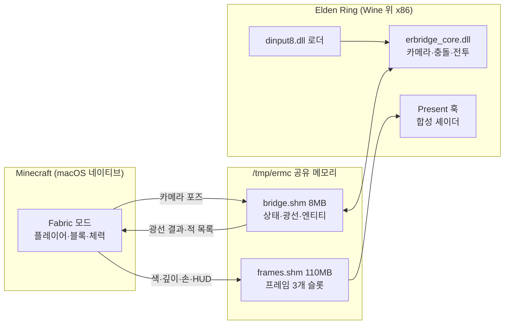
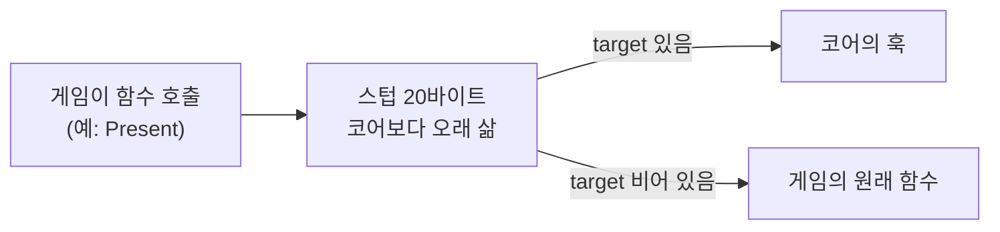
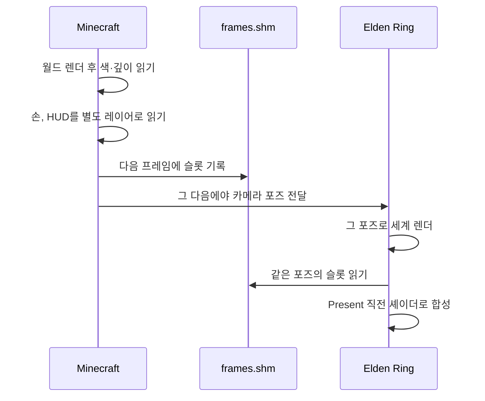

> 작성 일자: 2026-10-07
> 대상 저장소: `justbustin/minecraft-crossover-bridge` (MIT), 커밋 `d1723873ec8f370389cf19f74fac455b9e581321`
> 함께 본 저장소: `siddoff/Minecraft-Ring` 0.3.0(`711015a`), `rehan-remade/universal-modder`, `JASGENIUS/crossover-modder`
> 분석 범위: 코드 정적 분석. Elden Ring을 실제로 띄워서 돌려 보지는 않았습니다.

---

_This article is mostly written by Claude Code_

## 목차

1. [무슨 일이 있었나요?](#1-무슨-일이-있었나요)
2. [한 문장으로 이해하기](#2-한-문장으로-이해하기)
3. [전체 그림](#3-전체-그림)
4. [규모와 스택](#4-규모와-스택)
5. [공유 메모리: Wine의 Z: 드라이브를 통로로 씁니다](#5-공유-메모리-wine의-z-드라이브를-통로로-씁니다)
6. [로더와 코어: 게임을 끄지 않고 DLL을 바꿉니다](#6-로더와-코어-게임을-끄지-않고-dll을-바꿉니다)
7. [패스스루 합성: 창 두 개를 겹치지 않는 이유](#7-패스스루-합성-창-두-개를-겹치지-않는-이유)
8. [지형과 전투: 보이지 않는 블록과 숨은 대역](#8-지형과-전투-보이지-않는-블록과-숨은-대역)
9. [프레임 하나에 37MB: 대역폭 계산](#9-프레임-하나에-37mb-대역폭-계산)
10. [파생 프로젝트들은 무엇을 바꿨나요?](#10-파생-프로젝트들은-무엇을-바꿨나요)
11. [코드 읽는 추천 순서](#11-코드-읽는-추천-순서)
12. [주의해서 볼 지점](#12-주의해서-볼-지점)
13. [결론](#13-결론)
14. [직접 해 보려면](#14-직접-해-보려면)
15. [기존 글과의 관계](#15-기존-글과의-관계)

---

## 1. 무슨 일이 있었나요?

2026년 9월 29일, 종이 공예 작가로 알려진 Tobyn Jacobs가 Elden Ring 안에서 Steve가 칼을 휘두르는 영상을 올렸습니다. 화면 아래에는 Minecraft의 핫바와 허기·방어구 게이지가 그대로 떠 있고, 블록을 쌓고 레드스톤을 돌리고 Elden Ring의 적을 Minecraft 검으로 베는 장면이 이어집니다. 본인 설명은 짧았습니다. "minecraft 전체를 elden ring 모드로 넣었고, Mac에서 돌아간다." 코드는 공개하지 않았습니다.

<YouTube
  id="TmgAK5JjcDM"
  title="Minecraft In Elden Ring Mod"
  channel="Tobyn Jacobs"
  date="2026-09-29"
  lang="ko"
/>

원작자가 직접 올린 2분짜리 영상입니다.

그 뒤 일주일 동안 비슷한 영상이 쏟아졌습니다. GTA V 안의 Minecraft, Skyrim 안의 Escape from Tarkov 메커니즘, Call of Duty Zombies와 Mario Kart의 조합 같은 것들입니다. 해외 커뮤니티에서는 이 흐름을 "passthrough modding"이라고 부르기 시작했습니다. 두 게임을 동시에 실행하고 양쪽에 모드를 붙여 충돌 정보와 화면을 주고받는 방식입니다.

영상이 퍼진 뒤 9월 30일과 10월 1일(UTC)에 두 저장소가 잇따라 공개됐습니다.

- **`justbustin/minecraft-crossover-bridge`**: README 첫 줄이 "og idea from @tobynjacobs. implementation vibecoded on my own"입니다. 원작자의 영상을 보고 에이전트로 처음부터 다시 만든 구현이고 Monster Hunter: World와 Elden Ring 두 게임을 지원합니다. 이 글의 분석 대상입니다.
- **`rehan-remade/universal-modder`**: fal 소속 엔지니어 Rehan Sheikh가 공개한 Claude Code 플러그인입니다. "아무 PC 게임이나 모드를 만들게 하는" 스킬 묶음이고 그 안의 `mashup-mods` 스킬이 이번 유행을 네 가지 패턴으로 정리해 두었습니다(10월 7일에 다섯 번째 패턴이 추가됐습니다). 일주일 만에 스타 4,942개, 포크 452개를 모았습니다(2026-10-07, GitHub API 기준).

이 글에서 읽는 justbustin 저장소의 스타는 같은 날 기준 22개에 불과합니다. 그런데도 10월 2일에 이것을 Windows로 옮긴 `Minecraft-Ring`이 나왔고, universal-modder와 crossover-modder 문서가 모두 이 저장소를 패스스루의 대표 구현으로 링크합니다. 이번 유행의 참조 구현 역할을 하고 있는 셈입니다.

반응이 호의적이기만 한 것은 아닙니다. ResetEra 토론 스레드는 "AI 슬롭", "Garry's Mod처럼 잠깐 웃고 끝날 장난감"이라는 평가와 IP 문제를 걱정하는 글로 채워졌고, 운영자가 스레드를 AI 전용 게시판으로 옮겼습니다. 이 글은 장난감이냐 아니냐보다 **서로 다른 엔진 두 개가 그림 한 장을 어떻게 나눠 그리는지**에 집중합니다.

## 2. 한 문장으로 이해하기

**Minecraft는 플레이어와 카메라를 쥐고, Elden Ring은 그 카메라로 세상을 그린 뒤 자기 프레임 안에 Minecraft의 픽셀을 깊이 테스트로 끼워 넣습니다.**

깊이 테스트는 픽셀마다 "카메라에 누가 더 가까운가"를 비교해 가까운 쪽만 남기는 방법입니다. 플레이어가 W를 한 번 누르면 이런 일이 일어납니다. Minecraft가 Steve를 앞으로 옮기고 새 카메라 위치를 Elden Ring에 알립니다. Elden Ring은 그 카메라로 세상을 그리고, Minecraft가 따로 그려 보낸 블록·손·HUD 픽셀을 그 위에 끼워 넣습니다.

두 게임이 맡는 역할이 명확하게 갈립니다.

- **Minecraft가 소유하는 것**: 플레이어 이동, 입력, 인벤토리, 블록, 체력, 카메라 위치
- **Elden Ring이 소유하는 것**: 세계의 지형과 충돌, 적과 적의 AI, 조명, 최종 화면, 죽음과 부활

서로 상대의 영역은 "보이지 않는 대역"으로만 존재합니다. 같은 대상이 두 게임에서 각각 무엇인지 보면 구조가 한눈에 들어옵니다.

| 대상      | Minecraft에서                | Elden Ring에서                          |
| --------- | ---------------------------- | --------------------------------------- |
| Steve     | 진짜: 조작, 체력, 인벤토리   | 숨긴 Tarnished(주인공)가 대역           |
| 적        | 같은 히트박스의 투명 엔티티  | 진짜: AI, HP, 공격                      |
| 땅과 벽   | 광선으로 물어 만든 투명 블록 | 진짜: 충돌                              |
| 놓은 블록 | 진짜                         | 화면에 합성된 픽셀뿐, 물리적으로는 없음 |

마지막 줄은 이 글 끝에서 다시 다룹니다.

환경도 놀랍습니다. Mac에서 Minecraft는 macOS용 ARM 프로그램이고, Elden Ring은 Wine(Windows 프로그램을 macOS에서 돌려 주는 호환 계층)과 Rosetta 2(x86 프로그램을 ARM Mac에서 돌려 주는 번역기) 위에서 도는 Windows용 x86 프로그램입니다. 운영체제도 CPU 명령어도 다른 두 프로그램이 한 프레임을 같이 그립니다.

## 3. 전체 그림



README에 있는 데이터 흐름을 표로 옮기면 이렇습니다.

| 방향             | 데이터                           | 받는 쪽에서 하는 일                               |
| ---------------- | -------------------------------- | ------------------------------------------------- |
| Minecraft → 게임 | 카메라 포즈, 렌더링된 프레임     | 게임 카메라를 덮어쓰고, 픽셀을 게임 프레임에 합성 |
| 게임 → Minecraft | 지형 레이캐스트 결과             | 맞은 지점마다 투명 블록 생성                      |
| 게임 → Minecraft | 적의 위치·히트박스·HP            | 투명 엔티티로 생성                                |
| Minecraft → 게임 | 적에게 들어간 타격               | 게임 자체 함수로 데미지 적용                      |
| 게임 → Minecraft | 숨은 플레이어 캐릭터가 맞은 타격 | Steve의 데미지로 전환                             |

## 4. 규모와 스택

| 항목                         | 값                                                                                     |
| ---------------------------- | -------------------------------------------------------------------------------------- |
| 라이선스                     | MIT (MinHook은 BSD 2-Clause로 동봉)                                                    |
| 지원 게임                    | Elden Ring App Ver. 1.17.1, Monster Hunter: World 15.23.00 (각 1개 빌드만)             |
| Minecraft 쪽                 | Java Edition 1.21.1 + Fabric 모드, Java 약 4,800줄 (Elden Ring 버전 기준)              |
| 게임 쪽                      | mingw-w64로 크로스 컴파일한 Windows DLL, C++ 약 4,300줄 + 프로토콜 헤더 367줄          |
| 개발 도구                    | Python 디버그 스크립트(`erctl.py` 등), 셸 설치·핫 리로드 스크립트                      |
| 실행 환경                    | Apple Silicon Mac + CrossOver 26. 게임은 Rosetta 2와 Wine 위에서, Minecraft는 네이티브 |
| 그래픽 경로 (Elden Ring)     | Direct3D 12 → Apple D3DMetal → Metal                                                   |
| 그래픽 경로 (Monster Hunter) | Direct3D 11 → DXMT → Metal                                                             |

## 5. 공유 메모리: Wine의 Z: 드라이브를 통로로 씁니다

macOS 프로세스와 Wine 안의 Windows 프로세스끼리 통신해야 한다면 보통 소켓부터 떠올립니다. 하지만 이 브릿지는 프레임 하나에 37MB를 넘깁니다([9장](#9-프레임-하나에-37mb-대역폭-계산)). 소켓으로 보내면 최대 해상도 60fps에서 초당 2GB 넘게 복사해야 합니다. 그래서 파일 하나를 양쪽에서 메모리에 매핑합니다. 소켓이 편지를 주고받는 방식이라면, 이것은 두 프로그램이 같은 화이트보드를 보는 방식입니다. 한쪽이 쓰면 다른 쪽 눈에 바로 보이고 복사는 일어나지 않습니다.

Wine은 macOS의 루트(`/`)를 Windows 쪽에 `Z:` 드라이브로 보여 줍니다. Windows DLL이 `Z:\tmp\ermc\bridge.shm`을 열면 그건 macOS의 `/tmp/ermc/bridge.shm`과 같은 파일입니다. 그리고 Wine은 파일 매핑을 `mmap(MAP_SHARED)`로 구현합니다. Java 쪽도 같은 파일을 `MappedByteBuffer`로 매핑하므로 두 프로세스가 **같은 물리 페이지를 복사 없이** 읽고 씁니다. 헤더 주석에 "CrossOver on Apple Silicon에서 검증했다"는 메모가 있습니다.

매핑은 두 개입니다.

- **`bridge.shm` (8MB)**: 헤더, 게임 상태, Minecraft의 제어 블록, 지형 광선, 엔티티 테이블, 양방향 데미지 큐, 디버그 메일박스
- **`frames.shm` (약 110MB)**: Minecraft가 렌더링한 프레임, 슬롯 3개(트리플 버퍼)

화이트보드를 같이 쓰면 한쪽이 쓰는 도중에 다른 쪽이 읽는 문제가 생깁니다. 그래서 그런 블록은 모두 seqlock으로 보호합니다. 쓰는 쪽은 `seq`를 홀수로 올리고 내용을 쓴 다음 짝수로 올립니다. 문서를 고치기 전에 "수정 중" 팻말을 걸고 다 고치면 내리는 것과 같습니다. 읽는 쪽은 팻말이 걸려 있었거나 읽는 사이에 번호가 바뀌었으면 다시 읽습니다.

이 장치가 없으면 Elden Ring이 카메라 좌표를 반쯤 갱신된 상태로 읽을 수 있습니다. X는 새 값인데 Y는 옛 값인 좌표로 그리면 화면이 한 프레임 튑니다. 락을 잡지 않으므로 게임 스레드가 Minecraft를 기다리며 멈추는 일도 없습니다.

```c
typedef struct ErmcControl {
    volatile uint32_t seq;        /* 0x00 seqlock */
    uint32_t flags;               /* 0x04 ERMC_CTRL_* */
    uint64_t mcFrame;             /* 0x08 */
    float camPos[3];              /* 0x10 desired camera eye, ER units */
    float camTarget[3];           /* 0x1C desired look-at point */
    ...
```

여기에는 CPU 차이도 숨어 있습니다. Elden Ring 쪽 x86 코드는 Rosetta 2가 x86의 엄격한 메모리 순서를 지켜 주며 실행합니다. 반면 Minecraft의 JVM은 ARM에서 네이티브로 돌고, ARM은 메모리 쓰기 순서를 더 느슨하게 보장합니다. "내용을 쓰고 팻말을 내린다"는 순서가 다른 쪽에서는 뒤바뀌어 보일 수 있다는 뜻입니다. Java 쪽 `BridgeShm.java`가 seqlock 블록을 읽고 쓸 때 acquire/release 펜스(앞뒤 순서를 강제하는 명령)를 쓰는 이유입니다. 주석에도 "이 JVM은 ARM에서 네이티브로 돌아 x86 쪽보다 순서 보장이 약하다"는 설명이 있습니다.

레이아웃의 기준 문서는 C 헤더 `bridge_protocol.h` 하나입니다. Java 쪽 `Protocol.java`가 같은 오프셋을 손으로 옮겨 적고, 헤더 주석에는 "두 파일을 함께 맞출 것"이라는 경고가 있습니다. 코드 생성 없이 주석으로만 동기화를 유지하는 방식인데 이 규모에서는 현실적인 선택입니다.

헤더에서 눈에 띄는 줄이 하나 더 있습니다. 매직 값이 `"MHMC"`(Monster Hunter + Minecraft)인데 Elden Ring 버전에서도 그대로입니다. Monster Hunter 브릿지를 먼저 만들고 Elden Ring으로 옮긴 흔적이 프로토콜에 남아 있습니다.

## 6. 로더와 코어: 게임을 끄지 않고 DLL을 바꿉니다

Elden Ring은 실행될 때 자기 폴더의 `dinput8.dll`을 먼저 찾습니다. 브릿지는 이 자리에 작은 프록시 DLL을 넣습니다. 프록시는 진짜 DirectInput 함수들을 Wine의 `dinput8`로 넘겨주고 실제 작업을 하는 `erbridge_core.dll`을 따로 불러옵니다.

- **로더**: 아주 작고 한 번 설치하면 바뀌지 않습니다.
- **코어**: 모든 기능이 들어 있고 `reload_core.sh`로 게임 실행 중에 교체됩니다. 웹 개발의 HMR처럼 실행 중인 프로그램의 코드를 갈아 끼우는 핫 리로드입니다.

핫 리로드에서 까다로운 점은 게임이 쥐고 있는 함수 포인터입니다. 코어를 내렸는데 게임이 그 코어의 함수를 호출하면 바로 크래시입니다. 그래서 훅은 코어를 직접 가리키지 않고 코어보다 오래 사는 별도 메모리 페이지의 스텁을 가리킵니다. 스텁은 x86 명령어 20바이트짜리입니다.

```c
// mov rax,[rip+target]; test rax,rax; jz +2; jmp rax; jmp [rip+orig]
```



`target`이 채워져 있으면 코어의 훅으로 뛰고, 비어 있으면 게임의 원래 함수로 뜁니다. 코어를 교체하는 동안에는 `target`만 비우면 됩니다. 스텁은 전화 교환대 같은 역할입니다. 게임은 늘 교환대로 전화하고, 교환대는 코어가 있으면 코어로, 없으면 원래 함수로 연결합니다. 이 페이지의 주소는 공유 메모리 헤더(`hostTaskPage`, `hostPresentPage`)에 저장해 두므로 새 코어가 올라와도 기존 페이지를 찾아 재사용합니다.

에이전트로 바이브코딩한 프로젝트에서 이 구조가 특히 의미가 있습니다. 핫 리로드가 없으면 에이전트가 코드를 고칠 때마다 Elden Ring을 껐다 켜고 세이브를 다시 불러와야 합니다. 핫 리로드가 있으면 수정·빌드·확인 루프에서 그 재시작이 빠집니다. `erctl.py`로 게임 메모리를 직접 읽고 레이캐스트를 쏴 보는 디버그 메일박스 역시 같은 목적의 장치입니다. universal-modder의 `mashup-mods` 스킬에는 "이런 프로젝트는 코드가 부족해서가 아니라 표류해서 실패한다"며 검증 수단부터 설계하라는 조언이 있습니다.

### Elden Ring은 코드를 고치지 않습니다

Monster Hunter 버전은 MinHook으로 함수 앞부분을 덮어쓰는 인라인 훅을 씁니다. Elden Ring 버전은 그렇게 할 수 없습니다. 이유는 `game.cpp` 첫 주석에 적혀 있습니다. Elden Ring 실행 파일은 Arxan이라는 코드 보호 도구로 감싸여 있어서 코드를 패치해도 보호 루틴이 원래대로 되돌립니다.

그래서 매 프레임 실행할 코드를 **게임 자신의 태스크 스케줄러에 등록**합니다. 게임 엔진은 매 프레임 물리 계산, 카메라 계산, 그리기 같은 할 일을 정해진 순서로 돌립니다. 브릿지는 이 할 일 목록에 자기 작업을 끼워 넣습니다. 웹 서버 코드를 고치지 않고 미들웨어를 등록하는 것과 비슷합니다.

`CSTaskImp::RegisterTask`를 호출해 태스크 두 개를 넣는데, 들어가는 자리가 중요합니다. 카메라 태스크는 게임이 이번 프레임의 카메라를 다 계산한 직후 그룹(카메라 단계 106번 바로 다음인 107번)에 들어갑니다. 더 일찍 돌면 게임 자신의 카메라 코드가 Minecraft가 보낸 포즈를 덮어써 버립니다. 나머지 하나는 물리 갱신 직후에 돌면서 적 목록과 데미지를 처리합니다. 게임은 자기 메인 스레드에서 두 태스크를 성실하게 실행해 줍니다.

화면 합성용 훅도 게임 코드를 건드리지 않습니다. `Present`는 다 그린 프레임을 화면에 내보내는 마지막 호출이고, 스왑체인은 화면에 내보낼 버퍼들을 관리하는 객체입니다. 브릿지는 D3DMetal의 스왑체인 함수 테이블(쓰기 가능한 메모리)에서 `Present` 슬롯을 바꿔 끼웁니다. 두 경로 모두 보호 대상 밖에 있습니다.

## 7. 패스스루 합성: 창 두 개를 겹치지 않는 이유

한 줄로 요약하면, Elden Ring이 자기 화면을 다 그린 뒤 Minecraft 픽셀을 끼워 넣으면서 픽셀마다 세 가지를 따집니다. 누가 더 앞에 있는가, 그 자리는 얼마나 밝은가, 얼마나 먼가입니다.

가장 쉬운 방법은 투명한 Minecraft 창을 Elden Ring 창 위에 올리는 것입니다. 브릿지에도 이 모드가 남아 있습니다(F6). 하지만 기본값이 아닙니다. 문서가 밝히는 이유는 두 가지입니다.

1. 두 창은 각자의 주기로 화면을 갱신하므로 1~2프레임씩 어긋납니다. 고개를 돌리면 블록이 배경 위에서 미끄러집니다.
2. Minecraft 블록이 Elden Ring의 벽 뒤에 숨을 수 없습니다. 기둥 뒤에 놓은 블록이 기둥 앞에 보입니다.

그래서 Elden Ring이 자기 프레임 안에 Minecraft를 직접 그립니다. 순서가 핵심입니다.



Minecraft는 **픽셀을 먼저 올려놓고 나서** 그 픽셀을 찍은 카메라 포즈를 넘깁니다. 슬롯 헤더에 `poseId`가 있고 제어 블록의 `mcFrame`과 맞춰 보기 때문에 Elden Ring은 자기가 지금 그린 시점과 정확히 같은 시점의 Minecraft 픽셀을 꺼내 쓸 수 있습니다. 순서를 반대로 하면 Elden Ring이 아직 도착하지 않은 프레임을 기다리거나 한 프레임 전 픽셀을 쓰게 됩니다.

### 깊이는 어디서 가져오나

깊이 버퍼는 화면의 픽셀마다 "카메라에서 얼마나 먼가"를 적어 둔 흑백 지도입니다. 게임은 매 프레임 이 지도를 만들지만 밖에 내놓지는 않으므로 브릿지가 직접 찾아야 합니다. 엔진은 깊이 뷰를 `DLCG3::CGDepthStencilView`라는 객체로 감싸 둡니다. 브릿지는 이 클래스의 vtable(C++ 객체가 어떤 종류인지 나타내는 표식) 주소를 가진 객체들을 힙에서 찾아 전체 화면 크기의 후보를 고르고, 매 프레임 어느 버퍼가 지워지는지를 보고 장면 깊이를 확정합니다.

### 셰이더가 하는 일

합성 셰이더(`compositor.cpp` 안의 HLSL)는 세 가지를 합니다.

```hlsl
if (useDepth > 0.5 && mc > linHost(hd) + bias + mc * 0.004) world = 0;
if (relight > 0.5) world.rgb *= lightAt(i.uv);
// Distance haze: fade toward the Elden Ring scenery behind the block.
```

- **가림(occlusion)**: 깊이 버퍼의 값은 미터 단위가 아니어서 먼저 미터(선형 거리)로 바꿉니다. Elden Ring은 가까울수록 값이 커지는 reversed-Z 방식이라 셰이더가 그에 맞는 공식을 따로 씁니다. 그런 다음 같은 픽셀에서 Minecraft 쪽이 더 멀면 지웁니다. 기둥 픽셀이 9m이고 같은 자리의 블록이 13m라면 블록 픽셀을 지우는 식입니다. 허용 오차는 기본 3cm에 거리의 0.4%(`mc * 0.004`)를 더해 7m에서 약 6cm, 60m에서 약 27cm입니다. 오차를 두지 않으면 땅에 딱 붙은 블록 밑면이 두 깊이 값의 미세한 차이 때문에 매 프레임 깜빡입니다.
- **재조명(relight)**: Elden Ring 프레임을 크게 흐린 사본에서 그 위치의 밝기를 읽어 Minecraft 픽셀에 곱합니다. 어두운 예배당 안에서는 블록도 어둡고, 횃불 옆에서는 블록이 주황빛을 띱니다.
- **원거리 안개**: 멀리 있는 블록은 그 뒤에 있는 Elden Ring 배경 색으로 서서히 섞입니다.

손(hand) 레이어는 조명은 받지만 절대 가려지지 않습니다. 주석의 설명대로 "Elden Ring의 어떤 것도 그렇게 가깝지 않기" 때문입니다. HUD는 읽기 쉽도록 조명 없이 그대로 위에 얹습니다. Steve가 Elden Ring 세계에 녹아든 것처럼 보이는 효과는 대부분 이 재조명 몇 줄에서 나옵니다. Elden Ring의 실제 광원 데이터를 읽는 게 아니라 **완성된 화면의 밝기를 역으로 추정**하는 근사입니다.

합성 과정을 단계별로 나눠 보면 이렇습니다. Elden Ring 대신 단순한 도형 장면을 쓰고, 셰이더의 계산을 그대로 옮겨 픽셀마다 적용했습니다. 기둥은 9m, 그 뒤 블록 더미는 13m, 횃불 옆 블록은 7m, 오른쪽 위의 블록은 60m 거리에 있습니다.

<PassthroughLayers lang="ko" />

같은 장면을 직접 조작해 볼 수도 있습니다. "오버레이 모드"를 누르면 F6을 눌렀을 때처럼 세 효과가 모두 꺼지고, 항목을 하나씩 켜면 각 단계가 화면을 어떻게 바꾸는지 볼 수 있습니다.

<PassthroughCompositor lang="ko" />

## 8. 지형과 전투: 보이지 않는 블록과 숨은 대역

### 지형

Minecraft는 Elden Ring 세계를 볼 수 없으니 물어봅니다. Fabric 모드가 플레이어 주변으로 아래 방향 광선을 한 묶음(수백 개) 보내면 브릿지가 게임 스레드에서 Elden Ring 자체 충돌 함수(`CSPhysWorld::CastRay`)로 쏴 보고 결과를 돌려줍니다. 맞은 지점마다 Minecraft 쪽에 투명 "지형 블록" 기둥이 생기고, 기둥 꼭대기는 실제 지면에 1/16 블록 단위로 맞춰집니다. Steve는 이 위를 걷고 그 위에 블록을 쌓을 수도 있습니다.

광선은 캐릭터를 무시하도록 필터링됩니다. 그러지 않으면 적이 지형 블록으로 굳어 버립니다. 상자를 부수거나 문을 열면 그 자리를 다시 샘플링합니다.

좌표 변환은 생각보다 손이 갑니다. 우선 축 방향이 달라서 Minecraft의 Z가 Elden Ring의 -Z입니다(Elden Ring은 왼손 좌표계). 더 까다로운 쪽은 원점입니다. Havok은 Elden Ring이 쓰는 물리 엔진인데, 오픈 월드에서는 Havok 물리 공간의 원점이 플레이어를 따라 움직입니다. 넓은 월드에서 좌표 숫자가 커지면 소수점 정밀도가 떨어지기 때문에 흔히 쓰는 기법입니다. 브릿지는 구역(zone)마다 고정된 기준점을 만들고 매 틱 오프셋을 다시 계산해서 Minecraft에 넘기는 좌표가 흔들리지 않게 합니다. 이 기준점이 없으면 원점이 옮겨질 때마다 놓은 블록이 미끄러집니다. 놓은 블록을 구역별로 저장할 수 있는 것도 이 덕분입니다.

### 전투와 목숨

매 틱 브릿지는 게임의 캐릭터 목록을 읽어 근처 적의 위치, 히트박스, HP, 적대 여부를 엔티티 테이블에 올립니다. Minecraft 쪽에서는 각 적이 같은 히트박스의 투명 엔티티가 됩니다. 그래서 검, 화살, 크리티컬, TNT가 Minecraft 규칙 그대로 작동합니다. 맞은 기록은 데미지 큐에 쌓이고 브릿지가 Elden Ring의 HP 함수로 적용합니다. 데미지는 적의 체급에 맞게 환산되어 병사는 몇 번, 보스는 수십 번을 때려야 쓰러집니다.

반대 방향이 더 재미있습니다. Elden Ring의 적 AI는 Tarnished를 노리도록 만들어져 있으므로 브릿지는 Tarnished를 숨긴 채 Steve의 발밑에 계속 세워 둡니다. 적은 평소처럼 Tarnished를 공격하고, 브릿지는 Tarnished가 죽지 않게 HP를 채우면서 맞은 기록을 Minecraft에 "그 적에게 맞은 데미지"로 넘깁니다. 적 AI를 한 줄도 고치지 않고 Steve를 공격 대상으로 만드는 방법입니다.

목숨은 하나를 공유합니다. Minecraft에서 죽으면 Tarnished도 죽고(`ChrIns::Kill`), Elden Ring에서 낙사하면 Steve도 죽습니다. 부활은 Elden Ring의 "YOU DIED" 화면과 마지막 축복 지점을 그대로 쓰고, Tarnished가 다시 움직일 수 있게 되면 Steve를 그 자리로 옮깁니다. 이 핸드셰이크는 `mcDeaths`, `hostDeaths`, `hostLife` 카운터 세 개로 이뤄집니다. 불리언 플래그가 아니라 계속 증가하는 카운터라서 한쪽이 잠깐 놓쳐도 이벤트가 사라지지 않습니다.

### 안전 장치

브릿지가 쓰는 Elden Ring 주소는 모두 상대 주소(RVA, 실행 파일 시작점에서 몇 바이트 떨어졌는지로 적은 주소) 상수로 박혀 있습니다. 게임이 패치되면 함수 위치가 밀리므로 그대로 호출하면 엉뚱한 코드가 실행됩니다. 게임이 크래시하거나, 운이 나쁘면 메모리를 잘못 덮어써 세이브가 망가질 수도 있습니다. 그래서 시작할 때마다 그 주소의 바이트가 예상 시그니처(그 자리에 있어야 할 기계어의 지문)와 맞는지 확인합니다.

```c
{rva::kCastRay, "40 55 56 57 41 54 41 55 41 56 41 57 48 8D AC 24 70 FF FF FF ...",
 "CSPhysWorld::CastRay"},
```

필수 시그니처가 하나라도 다르면 브릿지 전체가 꺼지고, 전투나 상호작용 시그니처만 다르면 그 기능만 꺼집니다. README의 표현으로는 "다른 버전에서 추측하지 않고 꺼진다"입니다. 게임 함수는 게임 스레드에서만 호출하고, 다른 스레드는 공유 메모리로만 데이터를 주고받습니다.

Easy Anti-Cheat는 꼼꼼하게 피해 갑니다. 로더는 전용 런처가 설정한 `ERBRIDGE=1` 표시가 있고 EAC 모듈이 로드되지 않았을 때만 활성화됩니다. 레지스트리 오버라이드를 설치하지 않으므로 Steam에서 평소처럼 실행하면 브릿지는 아예 로드되지 않습니다.

## 9. 프레임 하나에 37MB: 대역폭 계산

`frames.shm`의 크기는 헤더의 상수로 정해집니다.

```c
#define ERMC_FRAME_MAX_W 1920u
#define ERMC_FRAME_MAX_H 1200u
#define ERMC_FRAME_SLOTS 3u
#define ERMC_FRAME_SLOT_SIZE (ERMC_FRAME_HDR + ERMC_FRAME_MAX_W * ERMC_FRAME_MAX_H * 16u)
```

픽셀당 16바이트는 레이어 네 장입니다(월드 색 4바이트, 깊이 float32 4바이트, 손 4바이트, HUD 4바이트). 계산해 보면 다음과 같습니다.

| 항목                          | 값                                    |
| ----------------------------- | ------------------------------------- |
| 슬롯 하나                     | 256 + 1920 × 1200 × 16 = 36,864,256 B |
| 파일 전체 (헤더 + 슬롯 3개)   | 110,596,864 B ≈ 110.6MB               |
| 60fps로 최대 해상도를 보낼 때 | 초당 약 2.2GB                         |

README의 "Elden Ring은 약 110MB"와 정확히 맞습니다. Minecraft는 매 프레임 GPU가 그린 픽셀을 CPU 메모리로 다시 읽어 와(비동기 readback) 공유 메모리에 쓰고, Elden Ring은 그걸 다시 GPU 텍스처로 올립니다. 이 데이터가 매 프레임 GPU → CPU → GPU로 왕복합니다. 보급형 NVMe SSD가 쉬지 않고 순차 읽기를 하는 속도(초당 2~3GB)와 맞먹는 양입니다. Apple Silicon의 통합 메모리 덕분에 버틸 만하지만 부담이 커서 해상도 상한을 1920×1200으로 막아 두었습니다. 창이 이보다 크면 합성을 포기하고 오버레이 모드로 떨어집니다.

다음 절의 Windows 포크가 가장 먼저 손댄 곳이 바로 이 병목입니다.

## 10. 파생 프로젝트들은 무엇을 바꿨나요?

### Minecraft-Ring: Windows로, 그리고 GPU 공유 텍스처로

`siddoff/Minecraft-Ring`은 justbustin 저장소의 Elden Ring 부분을 Windows 네이티브로 옮긴 포크입니다(MIT 고지 유지). 10월 2일에 공개되어 10월 6일에 0.3.0까지 나왔습니다. 바뀐 점은 세 갈래입니다.

- **프레임 전송**: CPU 복사 대신 D3D12 공유 텍스처를 씁니다. `gpu_transport.h` 첫 줄이 "GPU readback이나 CPU 픽셀 복사 없는 전체 해상도 OpenGL → D3D12 교환"입니다. 슬롯 6개 × 레이어 4장의 텍스처를 `CreateSharedHandle`로 열어 두고 공유 펜스(GPU 작업이 끝났음을 알리는 깃발)로 준비 상태를 알립니다. 지원되지 않으면 기존 메모리 전송으로 돌아갑니다. Wine 계층이 없는 Windows에서만 가능한 방식입니다.
- **지형**: 0.2.0에서 움직이는 엘리베이터와 플랫폼에 타고 내리는 처리, 좁은 아치와 비스듬한 벽에 대한 세밀한 충돌, 이동 방향 앞쪽을 미리 샘플링하는 prefetch가 들어갔습니다.
- **검증**: `tools/` 아래에 `test_moving_platform.py`, `test_terrain_passages.py` 같은 테스트 스크립트 20개와 프레임 전송 벤치마크가 있고 크래시 시 미니덤프를 남기는 기록기도 붙었습니다.

### crossover-modder: 겹치지 말고 번역하자

`JASGENIUS/crossover-modder`는 10월 7일에 공개된 스킬 저장소입니다. BeamNG.drive의 자동차를 Minecraft 세계에서 몰게 만든 프로젝트에서 나왔고, README는 패스스루를 정면으로 비판합니다. 패스스루는 데모를 빨리 화면에 띄워 줍니다. 하지만 손님 게임(guest)의 사물은 브릿지가 실어 나르는 만큼(지형 광선, 히트박스, 데미지)만 주인 게임(host)에 존재하고, 그림 한 장을 여전히 렌더러 두 개가 그립니다.

대안으로 내놓은 것이 "번역"입니다. 한 게임이 모든 것을 그리고, 각 게임은 자기가 잘하는 시뮬레이션을 맡고, 상대 쪽 사물은 자기 방식으로 번역해 받습니다. Minecraft 도시를 BeamNG의 지형 높이맵과 상자 충돌체로 다시 만들고, BeamNG 자동차는 BeamNG 자체 glTF 내보내기로 뽑아 Minecraft가 직접 그리는 식입니다. 찌그러진 보닛이 Minecraft 화면에도 보입니다.

이 비판은 minecraft-crossover-bridge의 구조에 그대로 들어맞습니다. Elden Ring의 적은 Minecraft에서 투명 상자일 뿐이고, Minecraft의 블록은 Elden Ring 물리에 존재하지 않습니다.

### universal-modder: 이번 유행을 정리한 지도

앞서 소개한 `mashup-mods` 스킬은 패턴을 가벼운 것부터 늘어놓습니다. 이 글을 쓸 때는 네 가지였고, 10월 7일 커밋에서 다섯 번째가 추가됐습니다.

| 패턴                       | 방식                                                              | 예                                   |
| -------------------------- | ----------------------------------------------------------------- | ------------------------------------ |
| 1. 콘텐츠 이식             | 손님 게임의 적·무기를 주인 게임 모드 API로 재구현                 | Dark Souls에 크리퍼 추가             |
| 2. 패스스루                | 두 게임 동시 실행, 상태·화면·충돌 교환                            | 이 글의 브릿지, GTA V 안의 Minecraft |
| 3. 디컴파일을 라이브러리로 | 디컴파일된 게임을 라이브러리로 감싸 주인 게임에 넣음              | libsm64 + Garry's Mod                |
| 4. 재구현 후 융합          | 두 게임 런타임을 LLM으로 재작성해 한 프로세스에서 합침            | MW2 + Skate 3 Rust 재구현            |
| 5. 규칙만 재구현           | 손님 게임의 규칙을 화면 없이 재구현하고 주인 게임은 화면으로만 씀 | (2026-10-07 추가)                    |

스킬의 권고는 "아이디어를 전달하는 가장 가벼운 패턴을 고르라"입니다. 패스스루는 두 번째로 가볍습니다. 원본 게임을 그대로 쓰니 재구현 비용이 없는 대신 두 프로세스를 동기화하는 비용을 치릅니다. 이 글에서 본 seqlock, 포즈 순서, 대역 캐릭터, 공유 목숨 카운터가 전부 그 동기화 비용입니다.

## 11. 코드 읽는 추천 순서

1. **`docs/how-it-works.md`**: 다른 게임으로 이식할 때 필요한 것을 표로 정리해 둔 문서입니다. 전체 지도로 먼저 읽기 좋습니다.
2. **`elden-ring/er-bridge/include/bridge_protocol.h`**: 공유 메모리 전체 레이아웃입니다. 필드 주석만 읽어도 두 게임이 무엇을 주고받는지 다 보입니다.
3. **`elden-ring/er-bridge/src/proxy.cpp`**: 로더와 핫 리로드, EAC 체크가 들어 있습니다.
4. **`elden-ring/er-bridge/src/compositor.cpp`**: 200~300줄 근처의 HLSL 셰이더부터 읽고 위아래로 넓혀 가세요.
5. **`elden-ring/mc-bridge/.../client/FramePassthrough.java`**: Minecraft 쪽에서 프레임을 읽고 포즈를 넘기는 순서가 보입니다.
6. **`elden-ring/er-bridge/src/game.cpp`**: 2,000줄짜리 역공학의 본체입니다. 첫 주석(태스크 등록, 좌표계, 공유 목숨)을 먼저 읽고 필요한 함수만 찾아 들어가는 편이 낫습니다.

## 12. 주의해서 볼 지점

- **오프라인 전용입니다.** EAC 없이 실행하는 것이 전제이고 README도 "모드한 게임은 절대 온라인으로 가져가지 말라"고 경고합니다. Monster Hunter 버전은 설치하면 매번 로드되므로 솔로 플레이만 해야 합니다.
- **게임 빌드 하나에 묶여 있습니다.** 게임이 패치되면 시그니처 검사에서 기능이 꺼지고 누군가 다시 역공학해야 합니다. 바이브코딩으로 만든 프로젝트가 패치마다 유지보수될지는 지켜볼 일입니다.
- **디버그 메일박스는 보안 구멍이 될 수 있습니다.** `bridge.shm`의 메일박스로 게임 메모리를 읽고 쓸 수 있는데, 파일이 `/tmp`에 있어서 같은 사용자 권한의 어떤 프로그램이든 접근할 수 있습니다. 문서에도 신뢰하지 않는 사람과 공유하는 기기에는 설치하지 말라고 적혀 있습니다.
- **원작자 코드는 없습니다.** 바이럴이 된 Tobyn Jacobs의 영상은 1,600개 아이템과 레드스톤을 주장하지만 코드가 공개되지 않았습니다. 이 저장소는 그 영상을 보고 별도로 만든 구현이므로 영상의 기능이 전부 들어 있다고 보면 안 됩니다. universal-modder 이슈 #28에도 "영상과 똑같이 만드는 방법을 알려 달라"는 질문이 열려 있습니다.
- **IP 문제는 회색 지대입니다.** 이 저장소는 게임 파일이나 에셋을 포함하지 않고 실행 중인 사용자 설치본에 붙는 방식이라고 밝힙니다. 다만 영상 공유와 수익화까지 같은 논리로 괜찮은지는 별개의 질문입니다.

## 13. 결론

화면에서 보이는 것은 "Elden Ring 속 Steve"입니다. Steve가 Elden Ring의 기둥 뒤로 걸어 들어가는 장면 하나에 이 글에서 본 장치가 거의 다 들어 있습니다. Minecraft가 카메라 포즈와 픽셀을 공유 메모리에 올리면, Elden Ring이 그 포즈로 세상을 그린 뒤 깊이를 비교해 기둥에 가린 픽셀을 지우고 흐린 화면에서 빌려 온 밝기로 나머지를 칠합니다. Steve가 딛고 선 땅은 광선으로 물어 만든 투명 블록이고, 적의 공격은 발밑에 숨은 Tarnished가 대신 맞아 Steve에게 전해 줍니다.

반대로 Steve가 쌓은 블록 위에 Elden Ring의 적은 올라설 수 없습니다. Elden Ring의 물리 엔진은 그 블록이 있다는 사실을 모르기 때문입니다. 화면에서는 한 세계처럼 보여도 두 게임은 서로를 투명한 상자와 픽셀로만 압니다. crossover-modder가 겹치지 말고 번역하자고 주장하는 이유도 여기에 있습니다.

## 14. 직접 해 보려면

> 아래 절차는 두 저장소의 README와 설치 문서를 정리한 것입니다. 이 글을 쓰면서 직접 실행해 보지는 않았습니다.

운영체제에 따라 쓰는 저장소가 다릅니다.

| 환경              | 저장소                                                                                 | 비고                                        |
| ----------------- | -------------------------------------------------------------------------------------- | ------------------------------------------- |
| Apple Silicon Mac | [minecraft-crossover-bridge](https://github.com/justbustin/minecraft-crossover-bridge) | 이 글의 분석 대상. CrossOver 위에서 실행    |
| Windows x64       | [Minecraft-Ring](https://github.com/siddoff/Minecraft-Ring)                            | 위 저장소의 Windows 포크, 0.3.0 (실험 단계) |

어느 쪽이든 조건은 같습니다.

- **Elden Ring App Ver. 1.17.1**(`eldenring.exe` 2.7.1.0)만 지원합니다. 다른 빌드에서는 시그니처 검사에 걸려 기능이 꺼집니다.
- **Minecraft: Java Edition 1.21.1**과 Fabric을 씁니다. 첫 실행 때 Minecraft와 Fabric을 수백 MB 내려받습니다.
- **오프라인 싱글 플레이 전용**입니다. 모드한 게임으로는 온라인에 접속하지 마세요.
- 시작 전에 Elden Ring 세이브를 백업해 두세요. Windows 설치 스크립트는 자동으로 백업하지만 Mac 쪽은 그렇지 않습니다.

### Mac (Apple Silicon + CrossOver)

준비할 것:

- CrossOver 26에 **"Elden Ring"이라는 이름의 병(bottle)**을 만들고 Windows용 Steam과 Elden Ring을 설치합니다. 병의 그래픽은 **D3DMetal**로 둡니다. CrossOver 26의 D3DMetal은 macOS 15.4 이상이 필요하고, macOS 14에서는 저장소의 `docs/macos-14-d3dmetal-shim.md`를 먼저 따라야 합니다.
- 키보드의 기능키가 F1–F12로 동작해야 합니다. 시스템 설정 → 키보드에서 "F1, F2 등의 키를 표준 기능 키로 사용"을 켜거나 `fn`을 누른 채 씁니다.

```sh
# 빌드 도구
brew install mingw-w64                       # Windows용 DLL 크로스 컴파일
brew install --cask temurin@21 temurin@25    # Minecraft는 Java 21, Gradle/Fabric Loom은 Java 25
xcode-select --install                       # git, make, clang, Python 3

git clone https://github.com/justbustin/minecraft-crossover-bridge.git
cd minecraft-crossover-bridge

elden-ring/scripts/install_er_bridge.sh      # DLL을 빌드해 게임 폴더에 설치
```

실행 순서는 이렇습니다.

1. CrossOver의 "Elden Ring" 병에서 Steam을 켜고 로그인합니다. 게임 소유 확인에 필요합니다.
2. `elden-ring/Launch Elden Ring + Minecraft bridge.command`를 더블클릭합니다. Elden Ring이 EAC 없이 오프라인으로 뜨고 이번 실행에만 브릿지가 켜집니다. ZIP으로 받았다면 macOS가 막을 수 있으니 터미널에서 `elden-ring/scripts/launch_er.sh`를 실행하세요.
3. 세이브를 불러와 필드에 선 다음 `elden-ring/scripts/run_minecraft.sh`를 실행합니다.
4. Minecraft가 "ER Bridge" 월드를 열고 Elden Ring 창을 덮으면서 키보드와 마우스를 가져갑니다.

병 이름이나 Steam 라이브러리 위치가 다르면 `ER_BOTTLE`, `ER_GAME_DIR` 환경 변수를 지정합니다. 게임 창이 1920×1200보다 크면 합성을 포기하고 오버레이 창 모드로 떨어지므로 창 크기를 그 안으로 맞추는 편이 좋습니다. 지울 때는 `elden-ring/scripts/install_er_bridge.sh --remove`를 실행합니다. 지우지 않아도 Steam에서 평소처럼 띄우면 브릿지는 로드되지 않습니다.

### Windows (Minecraft-Ring)

아직 설치 패키지가 없어서 소스에서 빌드해야 합니다. Python 3를 설치하고 저장소 안 `.tools/` 폴더에 빌드 도구를 풀어 둡니다.

```text
Minecraft-Ring/
  .tools/
    compiler/<llvm-mingw 폴더>/bin/clang++.exe
    java/<JDK 25 폴더>/bin/java.exe
    gradle/<Gradle 9.7.1 폴더>/bin/gradle.bat
```

```powershell
git clone https://github.com/siddoff/Minecraft-Ring.git
cd Minecraft-Ring
python tools/build_native.py   # dist/dinput8.dll, dist/erbridge_core.dll

# Elden Ring을 끈 상태에서, 경로는 본인의 게임 폴더로 바꿉니다
powershell -NoProfile -ExecutionPolicy Bypass -File .\Install.ps1 -GameDir 'D:\SteamLibrary\steamapps\common\ELDEN RING\Game'
```

설치 스크립트는 DLL을 복사하고 `%APPDATA%\EldenRing`의 세이브를 백업하며, 이미 깔려 있던 다른 모드 파일은 `backups/` 폴더로 옮겨 둡니다. 그다음에는 Steam을 켜고 `start.bat`이나 `Play.bat`을 더블클릭한 뒤 Elden Ring에서 **Continue**를 고르면 됩니다. 런처가 Minecraft를 빌드해 띄우고 브릿지 월드에 자동으로 연결합니다. 플레이하는 동안 런처 콘솔 창은 닫지 말아야 합니다. 원래대로 되돌릴 때는 `Restore.ps1`을 실행합니다.

### 처음 들어간 뒤

브릿지 월드는 크리에이티브 모드로 시작하므로 적에게 맞지 않습니다. 전투를 해 보려면 `/gamemode survival`로 바꿉니다. 조작은 Minecraft 그대로이고 브릿지 전용 키가 몇 개 더 있습니다(Mac 버전 기준).

| 키                  | 동작                                                                                 |
| ------------------- | ------------------------------------------------------------------------------------ |
| WASD, 마우스, Space | Minecraft 조작 그대로. Elden Ring 카메라가 따라옵니다                                |
| R                   | Elden Ring 상호작용: 문, 레버, 아이템, 룬, 축복. E는 그대로 Minecraft 인벤토리입니다 |
| F6                  | 패스스루 합성 ⇄ 오버레이 창 (위 시각화의 두 프리셋)                                  |
| F7                  | 카메라: Minecraft가 이끌기 ⇄ Elden Ring 카메라 따라가기                              |
| F8                  | 키보드·마우스를 Tarnished에게 넘깁니다(메뉴, 지도 이동, 레벨업). 다시 누르면 복귀    |
| F9                  | 디버그 표시: 상태 줄, 히트박스 외곽선, HP                                            |
| F10                 | 대역 Tarnished 켜기/끄기                                                             |

Windows 버전은 F5로 1인칭·3인칭 시점을 바꾸고, F6·F7·F9·F10은 개발용 키로 분류합니다. 놓은 블록은 Elden Ring 구역별로 Minecraft 월드(`mc-bridge/run/saves/er-bridge`)에 저장됩니다.

## 15. 기존 글과의 관계

| 글                                                                                    | 이번 글과 겹치는 지점                                                                       |
| ------------------------------------------------------------------------------------- | ------------------------------------------------------------------------------------------- |
| [Claude Code Game Studios 분석](/kb/2026-04-18-claude-code-game-studios-architecture) | 에이전트로 게임을 _만드는_ 구조였다면, 이번에는 에이전트로 이미 있는 게임을 _뜯는_ 쪽입니다 |
| [SkillSpector 분석](/kb/2026-07-03-skillspector-architecture)                         | universal-modder·crossover-modder 모두 스킬 저장소로 배포됩니다                             |
| [패스스루 모딩 저장소 12개 비교](/kb/2026-10-08-passthrough-bridge-spectrum)          | 후속편입니다. 이 글의 픽셀 방식 말고 메시·로직·브릿지 없음 방식을 코드로 비교합니다         |

## 참고

- [justbustin/minecraft-crossover-bridge](https://github.com/justbustin/minecraft-crossover-bridge)
- [siddoff/Minecraft-Ring](https://github.com/siddoff/Minecraft-Ring)
- [rehan-remade/universal-modder](https://github.com/rehan-remade/universal-modder)
- [JASGENIUS/crossover-modder](https://github.com/JASGENIUS/crossover-modder)
- [Dexerto: Modder recreates all of Minecraft inside Elden Ring](https://www.dexerto.com/minecraft/modder-recreates-all-of-minecraft-inside-elden-ring-with-1600-items-and-working-redstone-3413457/)
- [TweakTown: Minecraft runs inside Elden Ring as modders mash up entire games](https://www.tweaktown.com/news/113855/minecraft-runs-inside-elden-ring-as-modders-mash-up-entire-games/index.html)
- [ResetEra: "Passthrough Modding" apparently is taking off right now](https://www.resetera.com/threads/passthrough-modding-apparently-is-taking-off-right-now-merging-two-games-running-them-at-the-same-time-within-eachother.1651015/)
