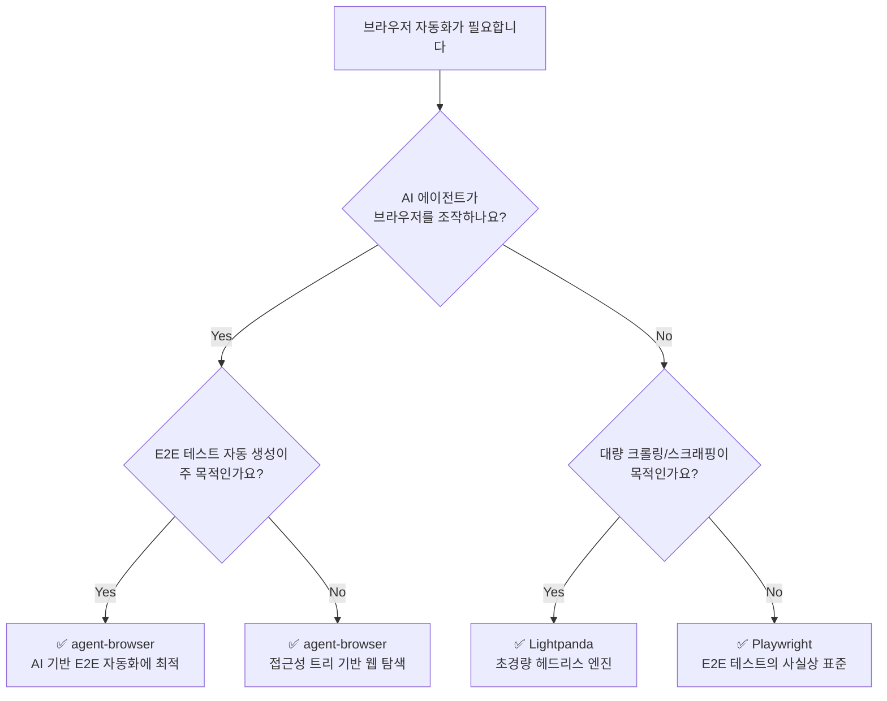

# Browser Automation Comparison Post Implementation Plan

> **For agentic workers:** REQUIRED SUB-SKILL: Use superpowers:subagent-driven-development (recommended) or superpowers:executing-plans to implement this plan task-by-task. Steps use checkbox (`- [ ]`) syntax for tracking.

**Goal:** Playwright, agent-browser, Lightpanda를 비교하는 실용 가이드 블로그 포스트를 작성하고, 기존 아키텍처 분석 글과 wiki-link로 연결하여 KB의 첫 cross-link를 만든다.

**Architecture:** MDX 포스트 파일 하나를 `data/posts/`에 생성. Mermaid 다이어그램(의사결정 트리), 비교 테이블, 코드 블록 3개를 포함. `[[wiki-link]]` 문법으로 기존 글을 참조하면 `generate-kb-data.mjs`가 빌드 시 자동으로 backlink/forwardLink를 생성.

**Tech Stack:** MDX, Mermaid (rehype-mermaid), Contentlayer2, Next.js

**Spec:** `docs/superpowers/specs/2026-04-16-browser-automation-comparison-design.md`

---

## File Structure

- **Create:** `data/posts/2026-04-16-browser-automation-comparison.mdx` — 블로그 포스트 본문
- **No other files to create or modify** — kb-data.json은 빌드 시 `generate-kb-data.mjs`가 자동 재생성

---

### Task 1: MDX 포스트 파일 생성 — frontmatter + 도입부

**Files:**

- Create: `data/posts/2026-04-16-browser-automation-comparison.mdx`

- [ ] **Step 1: 포스트 파일 생성 (frontmatter + 도입부)**

```mdx
---
title: 'Playwright vs agent-browser vs Lightpanda — 브라우저 자동화 도구, 어떤 걸 써야 할까?'
date: 2026-04-16 18:00:00 +0900
tags: ['playwright', 'agent-browser', 'lightpanda', 'browser-automation', 'ai-agent', 'comparison']
summary: 'Playwright, agent-browser, Lightpanda — 세 브라우저 자동화 도구의 포지셔닝과 핵심 차이를 비교하고, 동일한 태스크를 각각 구현하여 실용적인 선택 기준을 제시합니다.'
topic: ai-infrastructure
stage: budding
author: MartianLee
---

_This article is mostly written by Claude Code with [superpowers](https://github.com/anthropics/claude-code-plugins/tree/main/superpowers) skill_

브라우저 자동화 도구를 선택해야 할 때, 선택지가 너무 많아서 혼란스러울 수 있습니다. 이 글에서는 서로 다른 레이어에서 동작하는 세 가지 도구 — **Playwright**, **agent-browser**, **Lightpanda** — 를 비교합니다. 어떤 상황에서 어떤 도구를 선택해야 하는지, 같은 태스크를 각각 어떻게 구현하는지를 직접 보여드리겠습니다.
```

- [ ] **Step 2: 파일이 생성되었는지 확인**

Run: `ls -la data/posts/2026-04-16-browser-automation-comparison.mdx`
Expected: 파일이 존재

- [ ] **Step 3: Commit**

```bash
git add data/posts/2026-04-16-browser-automation-comparison.mdx
git commit -m "feat: add browser automation comparison post - frontmatter and intro"
```

---

### Task 2: 의사결정 트리 (Mermaid flowchart)

**Files:**

- Modify: `data/posts/2026-04-16-browser-automation-comparison.mdx`

- [ ] **Step 1: Mermaid 의사결정 트리 섹션 추가**

포스트 도입부 아래에 다음 내용을 추가합니다:

````mdx
## 어떤 도구를 선택해야 할까?

아래 의사결정 트리를 따라가면 상황에 맞는 도구를 빠르게 찾을 수 있습니다.


````

- [ ] **Step 2: 로컬 빌드로 Mermaid 렌더링 확인**

Run: `cd /Users/dede/workspace/martianlee.github.com && npx contentlayer2 build 2>&1 | tail -5`
Expected: 빌드 성공, 에러 없음

- [ ] **Step 3: Commit**

```bash
git add data/posts/2026-04-16-browser-automation-comparison.mdx
git commit -m "feat: add decision tree flowchart with mermaid"
```

---

### Task 3: 핵심 차이 비교 테이블 + 도구별 포지셔닝

**Files:**

- Modify: `data/posts/2026-04-16-browser-automation-comparison.mdx`

- [ ] **Step 1: 비교 테이블 + 포지셔닝 섹션 추가**

Mermaid 다이어그램 섹션 아래에 다음 내용을 추가합니다:

```mdx
## 핵심 차이 비교

| 비교 항목       | Playwright                       | agent-browser                    | Lightpanda                |
| --------------- | -------------------------------- | -------------------------------- | ------------------------- |
| **레이어**      | 테스트 프레임워크 (High-level)   | AI 에이전트 미들웨어 (Mid-level) | 브라우저 엔진 (Low-level) |
| **주요 목적**   | E2E 테스트 / 범용 자동화         | AI 에이전트 웹 탐색              | 대량 크롤링 / 스크래핑    |
| **언어**        | TypeScript / Python / Java / C#  | Rust                             | Zig                       |
| **브라우저**    | Chromium / Firefox / WebKit 번들 | Chrome / Lightpanda / Cloud      | 자체 엔진 (독립 구현)     |
| **프로토콜**    | CDP + 자체 프로토콜              | CDP                              | CDP / MCP                 |
| **AI 친화성**   | 낮음 (수동 셀렉터)               | 높음 (접근성 트리 Ref)           | 중간 (MCP 지원)           |
| **리소스 사용** | 높음 (실제 브라우저)             | 중간 (데몬 + 브라우저)           | 낮음 (Chrome 대비 9배)    |
| **JS 실행**     | 완전 지원                        | 브라우저 위임                    | V8 내장 (부분 지원)       |

## 도구별 포지셔닝

**Playwright**는 가장 성숙한 브라우저 자동화 프레임워크로, 크로스 브라우저 E2E 테스트의 사실상 표준입니다. Microsoft가 관리하며, 다양한 언어 바인딩과 강력한 디버깅 도구를 제공합니다. (Playwright 아키텍처 분석은 추후 작성 예정입니다.)

**agent-browser**는 AI 에이전트가 웹을 "눈으로 보고 손으로 조작"할 수 있게 해주는 미들웨어입니다. Vercel Labs에서 개발했으며, 접근성 트리 기반의 Ref 시스템으로 LLM이 웹 요소를 자연스럽게 참조할 수 있습니다. 상세 아키텍처는 [[2026-04-09-agent-browser-architecture|agent-browser 아키텍처 분석]]을 참고하세요.

**Lightpanda**는 브라우저 자체를 AI/스크래핑 용도로 처음부터 재설계한 초경량 헤드리스 엔진입니다. Chrome 대비 9배 낮은 메모리, 11배 빠른 속도를 자랑합니다. 상세 아키텍처는 [[2026-03-13-lightpanda-architecture|Lightpanda 아키텍처 분석]]을 참고하세요.
```

- [ ] **Step 2: Commit**

```bash
git add data/posts/2026-04-16-browser-automation-comparison.mdx
git commit -m "feat: add comparison table and tool positioning with wiki-links"
```

---

### Task 4: 동일 태스크 코드 비교

**Files:**

- Modify: `data/posts/2026-04-16-browser-automation-comparison.mdx`

- [ ] **Step 1: 코드 비교 섹션 추가**

포지셔닝 섹션 아래에 다음 내용을 추가합니다:

````mdx
## 같은 태스크, 다른 접근 — Hacker News 상위 5개 글 추출

세 도구의 차이를 체감하기 위해, 동일한 태스크를 각각 구현해 보겠습니다.

**태스크:** Hacker News 첫 페이지에서 상위 5개 글의 제목과 URL을 추출합니다.

### Playwright (TypeScript)

CSS 셀렉터로 DOM 요소를 직접 지정하는 전통적인 방식입니다.

```typescript
import { chromium } from 'playwright'

const browser = await chromium.launch()
const page = await browser.newPage()
await page.goto('https://news.ycombinator.com')

const items = await page.locator('.titleline > a').evaluateAll((links) =>
  links.slice(0, 5).map((a) => ({
    title: a.textContent,
    url: a.href,
  }))
)

console.log(items)
await browser.close()
```

개발자가 페이지 구조를 파악하고 CSS 셀렉터를 직접 작성해야 합니다. 셀렉터가 정확하면 빠르고 안정적입니다.

### agent-browser (CLI)

AI 에이전트가 접근성 트리를 통해 페이지를 "읽고" 데이터를 추출합니다.

```bash
# 브라우저를 열고 페이지 이동
ab navigate https://news.ycombinator.com

# 현재 페이지의 접근성 트리 스냅샷 확인
ab snapshot

# AI가 스냅샷을 해석하여 데이터 추출 (JSON 출력)
ab execute --js "
  const rows = document.querySelectorAll('.titleline > a');
  JSON.stringify([...rows].slice(0, 5).map(a => ({
    title: a.textContent,
    url: a.href
  })));
"
```

CSS 셀렉터를 몰라도 `ab snapshot`으로 페이지 구조를 파악할 수 있습니다. AI 에이전트가 스냅샷을 보고 다음 액션을 결정하는 워크플로우에 최적화되어 있습니다.

### Lightpanda (CDP 직접 호출)

Playwright 호환 모드로도 사용할 수 있지만, 핵심 가치인 경량성을 살리려면 CDP를 직접 호출합니다.

```python
import json
import websocket

# Lightpanda CDP 서버에 연결 (기본 포트 9222)
ws = websocket.create_connection("ws://127.0.0.1:9222")

# 페이지 이동
ws.send(json.dumps({
    "id": 1,
    "method": "Page.navigate",
    "params": {"url": "https://news.ycombinator.com"}
}))
ws.recv()

# JavaScript로 데이터 추출
ws.send(json.dumps({
    "id": 2,
    "method": "Runtime.evaluate",
    "params": {
        "expression": """
            JSON.stringify(
                [...document.querySelectorAll('.titleline > a')]
                    .slice(0, 5)
                    .map(a => ({ title: a.textContent, url: a.href }))
            )
        """
    }
}))
result = json.loads(ws.recv())
print(result["result"]["result"]["value"])
ws.close()
```

CDP를 직접 다루므로 코드가 가장 저수준입니다. 대신 Chrome 없이 동작하며, 대량 병렬 실행 시 리소스 효율이 압도적입니다.
````

- [ ] **Step 2: Commit**

```bash
git add data/posts/2026-04-16-browser-automation-comparison.mdx
git commit -m "feat: add same-task code comparison across three tools"
```

---

### Task 5: 결론 + 관련 글 링크

**Files:**

- Modify: `data/posts/2026-04-16-browser-automation-comparison.mdx`

- [ ] **Step 1: 결론 섹션 추가**

코드 비교 섹션 아래에 다음 내용을 추가합니다:

```mdx
## 결론

세 도구는 경쟁 관계가 아니라, 브라우저 자동화 스택의 서로 다른 레이어에 위치합니다. 정리하면:

- **E2E 테스트 / 범용 자동화** → Playwright
- **AI 에이전트의 웹 탐색** → agent-browser
- **대량 크롤링 / 스크래핑** → Lightpanda

그리고 이들은 조합해서 사용할 수 있습니다. 실제로 agent-browser는 Lightpanda를 브라우저 프로바이더로 지원합니다.

필자의 경우 회사에서 agent-browser를 활용해 E2E 테스트 작성을 자동화하고 있는데, Playwright로 수동 작성하는 것 대비 토큰 소모도 적고 속도도 빨라서 만족하고 있습니다. AI 기반 테스트 자동화를 고려하고 있다면 agent-browser를 추천합니다.

---

### 관련 글

- [[2026-04-09-agent-browser-architecture|agent-browser 아키텍처 분석 보고서]]
- [[2026-03-13-lightpanda-architecture|Lightpanda 브라우저 아키텍처 분석 보고서]]
- Playwright 아키텍처 분석 — 추후 작성 예정
```

- [ ] **Step 2: Commit**

```bash
git add data/posts/2026-04-16-browser-automation-comparison.mdx
git commit -m "feat: add conclusion and related post wiki-links"
```

---

### Task 6: 빌드 검증 + KB 데이터 확인

**Files:**

- 검증 대상: `app/kb-data.json` (빌드 시 자동 생성)

- [ ] **Step 1: Contentlayer 빌드 실행**

Run: `cd /Users/dede/workspace/martianlee.github.com && npx contentlayer2 build 2>&1 | tail -10`
Expected: 빌드 성공, "KB data generated: N notes" 메시지 출력

- [ ] **Step 2: KB 데이터에서 wiki-link 파싱 확인**

Run: `cat app/kb-data.json | python3 -c "import sys,json; d=json.load(sys.stdin); print('forwardLinks:', d['forwardLinks'].get('2026-04-16-browser-automation-comparison', [])); print('backlinks for lightpanda:', d['backlinks'].get('2026-03-13-lightpanda-architecture', [])); print('backlinks for agent-browser:', d['backlinks'].get('2026-04-09-agent-browser-architecture', []))"`

Expected:

- `forwardLinks`에 `2026-04-09-agent-browser-architecture`, `2026-03-13-lightpanda-architecture` 포함
- 두 기존 글의 `backlinks`에 이 포스트가 등록됨

- [ ] **Step 3: Next.js dev 서버에서 포스트 확인**

Run: `cd /Users/dede/workspace/martianlee.github.com && npm run dev &`

브라우저에서 확인할 항목:

1. `http://localhost:3000/kb/2026-04-16-browser-automation-comparison` — 포스트가 정상 렌더링되는지
2. Mermaid 다이어그램이 SVG로 렌더링되는지
3. 비교 테이블이 올바르게 표시되는지
4. 코드 블록 3개가 syntax highlighting과 함께 렌더링되는지
5. `http://localhost:3000/kb/2026-04-09-agent-browser-architecture` — Context Panel에 backlink 표시되는지
6. `http://localhost:3000/kb/2026-03-13-lightpanda-architecture` — Context Panel에 backlink 표시되는지

- [ ] **Step 4: Final commit**

```bash
git add -A
git commit -m "feat: verify browser automation comparison post build and KB links"
```
